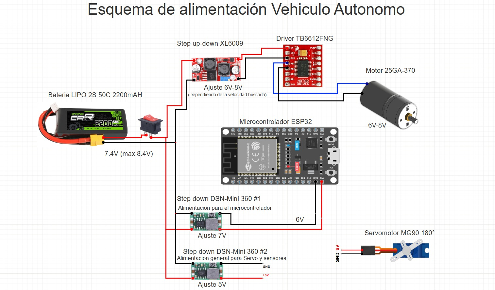
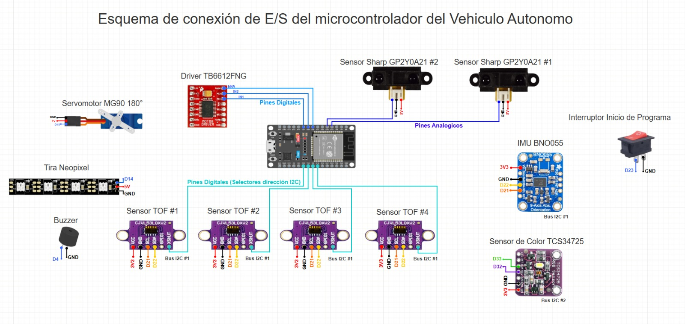
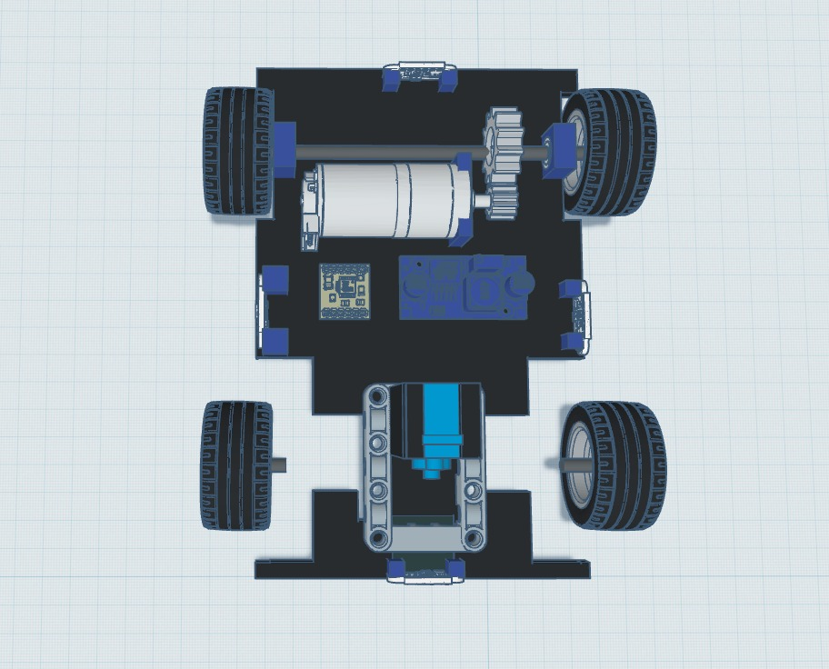
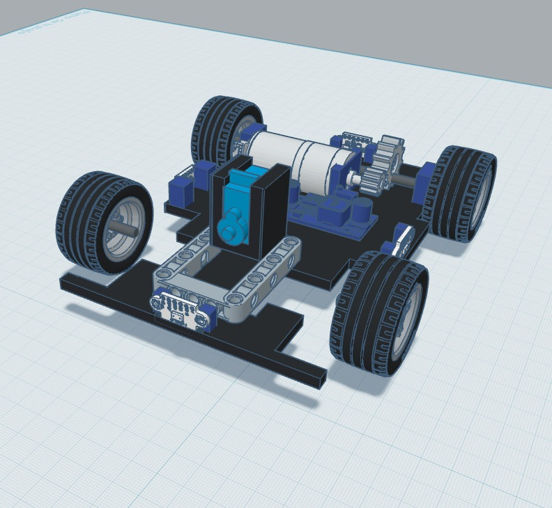
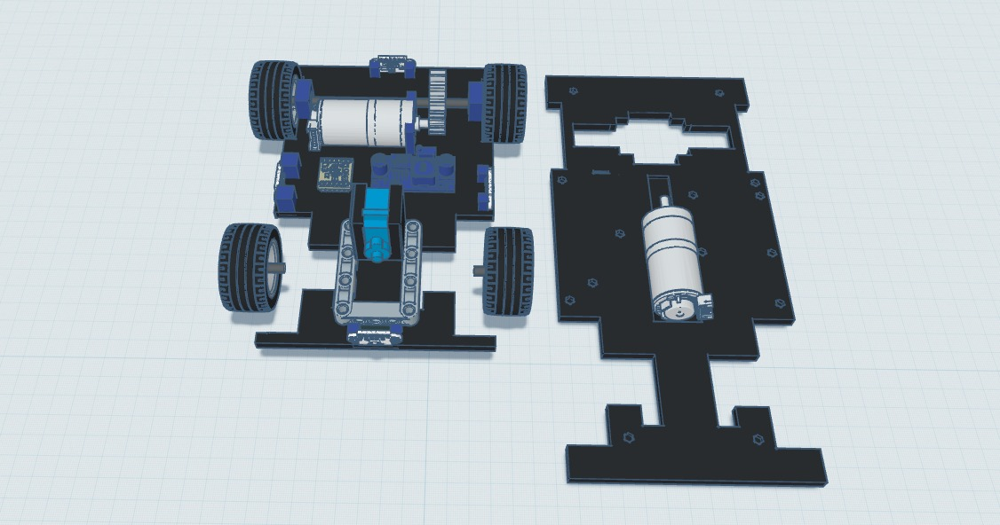

# Prometheus Team - Temporada 2026
Somos un equipo venezolano representando con orgullo a la **Universidad Politécnica Territorial José Félix Ribas (UPTJFR)**. Nuestro compromiso es la innovación y el aprendizaje continuo en el campo de la robótica autónoma. Queremos continuar lo que empezamos el año pasado y superar nuestros limites esta temporada.

##  Fotos de equipo
|   |  | 
| :----: | :---------- |

---
##  Fotos del vehiculo 
|   |    |   |
| :----: | :------------------- | :---------- |
|   |    |   |

---

### Componentes de Control, Detección e Interfaz

| Imagen | Nombre de Componente | Descripción |
| :----: | :------------------- | :---------- |
|  | **Microcontrolador ESP32** | Cerebro central del vehículo autónomo. Cuenta con un procesador de doble núcleo, conectividad Wi-Fi/Bluetooth, y múltiples pines GPIO para gestionar la lectura de sensores (I2C y Analógicos) y el control de actuadores en tiempo real. |
|  | **Sensor Infrarrojo Sharp GP2Y0A21** | Sensores analógicos de medición de distancia por triangulación infrarroja. Colocados estratégicamente en el chasis para detectar obstáculos en las diagonales delanteras del vehículo y evitar colisiones de rango medio (10 a 80 cm). |
|  | **Sensores de Distancia Láser TOF VL53L0X** | Sensores basados en tecnología Time-of-Flight (Tiempo de Vuelo) que miden distancias precisas mediante luz láser invisible. Conectados en paralelo al Bus I2C #1, utilizan pines digitales individuales como selectores de dirección (XSHUT) para evitar conflictos de direccionamiento. |
|  | **IMU BNO055 (9-Axis Absolute Orientation)** | Unidad de medición inercial avanzada que integra acelerómetro, giroscopio y magnetómetro en 3 ejes, junto con un procesador interno que calcula la orientación absoluta (ángulos de Euler/Cuaterniones) de forma directa a través del Bus I2C #1. |
|  | **Sensor de Color TCS34725** | Sensor de luz de color RGB con filtro infrarrojo. Conectado de forma independiente al Bus I2C #2 para evitar saturación de datos, está ubicado en la parte inferior del vehículo para identificar líneas, marcas y colores específicos en la pista. |
|  | **Tira de LEDs Neopixel** | Sistema de iluminación e indicadores visuales RGB direccionables de forma serial a través del pin digital D14. Se utiliza para mostrar estados del software, alertas del sistema o modos de conducción de forma dinámica. |
|  | **Zumbador (Buzzer)** | Transductor piezoeléctrico conectado al pin digital D4. Emite señales acústicas y alarmas sonoras para retroalimentar las diferentes etapas del programa, fallos de lectura o alertas críticas del vehículo. |
|  | **Interruptor de Inicio de Programa** | Pulsador/interruptor conectado al pin digital D23 con resistencia pull-up/GND. Actúa como gatillo lógico para iniciar la marcha autónoma del software una vez el vehículo ha sido calibrado y posicionado. |

### Componentes de Alimentación y Actuación

| Imagen | Nombre de Componente | Descripción |
| :----: | :------------------- | :---------- |
|  | **Batería LiPo 2S 50C 2200mAh** | Fuente de energía principal del vehículo. Suministra un voltaje nominal de 7.4V (máximo de 8.4V en carga completa) con una alta tasa de descarga (50C) para soportar los picos de corriente de los motores. |
|  | **Interruptor de Encendido General** | Interruptor basculante (ON/OFF) conectado directamente al terminal positivo de la batería para cortar o permitir el paso de corriente a todo el sistema eléctrico de forma segura. |
|  | **Regulador Elevador/Reductor XL6009** | Módulo de regulación de voltaje ajustado entre 6V y 8V (según la velocidad buscada). Estabiliza la alimentación que va dirigida al driver de los motores, independientemente de las fluctuaciones de la batería. |
|  | **Driver de Motores TB6612FNG** | Controlador de puente en H dual de alta eficiencia. Recibe las señales lógicas de control del ESP32 (dirección y PWM) y maneja la potencia hacia los motores DC de tracción de manera mucho más eficiente que el clásico L298N. |
|  | **Motor DC 25GA-370 (6V-8V)** | Motorreductor metálico encargado de la tracción mecánica del vehículo autónomo. Funciona en un rango de voltaje de 6V a 8V regulado por el XL6009 y operado a través del driver. |
|  | **Step Down DSN-Mini 360** | Regulador reductor de voltaje de tipo conmutado, ajustado a una salida fija de 7V para alimentar de forma estable el pin VIN del microcontrolador ESP32. |
|  | **Servomotor MG90 180°** | Servo con piñonería metálica de alta resistencia. Utilizado para controlar el ángulo de dirección de las ruedas delanteras del vehículo mediante señales PWM del microcontrolador. Alimentado a 6V desde el regulador correspondiente. |

## Esquemas de Alimentación y Cableado

[*Consultar el historial de versiones de alimentación aquí*](#sistema-de-alimentación)

### Versión 4 (Actual)

### Arquitectura de Energía, Control y Gestión de Potencia

La **batería LiPo 2S de 2200mAh** (7.4V nominales, 8.4V en máxima carga) constituye la fuente central de energía del sistema, gestionada mediante un **interruptor general físico de palanca** que garantiza un enclavamiento mecánico seguro y mitiga fallos por desconexión accidental ante vibraciones en la pista. 

A partir de este nodo central, la alimentación se ramifica de forma completamente independiente en tres sub-buses regulados para aislar el ruido electromagnético y evitar caídas de tensión (*brownouts*) en la lógica de control:

* **Línea de Tracción Potenciada:** Una rama se dirige a un regulador **step-up/down XL6009**, ajustado dinámicamente entre 6V y 8V en función de la velocidad requerida. Este módulo alimenta el **puente H TB6612FNG**, el cual entrega el voltaje íntegro al **Motor 25GA-370**.
* **Línea de Control Confiable:** De forma paralela, un módulo **step-down DSN-Mini 360** configurado a 6V proporciona energía limpia al pin Vin del único **ESP32** del sistema, garantizando el diferencial necesario para el correcto funcionamiento de su regulador interno LDO sin riesgo de reinicios.
* **Línea de Actuadores y Sensores:** Un segundo módulo **DSN-Mini 360**, calibrado estrictamente a 5V, se encarga de la alimentación general para el **Servomotor SG90 180°** y el resto de la red de sensores, ofreciendo una línea de voltaje estable y adecuada para las comunicaciones de datos.

> [!IMPORTANT]
> **Iteración Crítica de Hardware (L298N vs. TB6612FNG)**
> 
> La transición al puente H TB6612FNG resolvió dos fallos arquitectónicos graves de nuestro prototipo inicial. En primer lugar, eliminó la severa caída de voltaje interna característica del L298N, optimizando la eficiencia del par motor. En segundo lugar, el módulo L298N generaba una interferencia que inhabilitaba los puertos I2C de cualquier microcontrolador conectado. Este fallo nos había obligado temporalmente a utilizar una arquitectura ineficiente con dos placas ESP32 (una dedicada exclusivamente al control del motor). El cambio al TB6612FNG solucionó este conflicto de comunicaciones, permitiéndonos unificar todo el procesamiento en un único ESP32. Esto redujo drásticamente el peso, la complejidad del cableado, el consumo general de energía y los posibles puntos de fallo del vehículo.

> [!NOTE]
> **Compensación de diseño (*Trade-off*)**
> 
> Esta configuración ampliada, apoyada en tres reguladores de voltaje independientes, exige una gestión del espacio interno más rigurosa dentro del chasis impreso en 3D. Sin embargo, se asumió esta compensación espacial porque mitiga por completo el acoplamiento de ruido inductivo provocado por los motores hacia la electrónica sensible, blindando la estabilidad del vehículo y asegurando lecturas limpias en el bus I2C durante la navegación autónoma.

## Esquema de Sensores:
   [Para ver versiones anteriores aqui.](#sistema-de-detección-de-objetos)
###  Versión 4:

  #### Mejoras en el Sistema de Sensores y Hardware

En esta versión del proyecto, hemos optimizado la configuración del hardware para mejorar la precisión, el tiempo de respuesta y la estabilidad del robot en la pista de competencia ($3 \times 3$ metros).

#### Sensores de Distancia y Navegación

* **Transición a Sensores ToF (Time-of-Flight):** Reemplazamos los sensores ultrasónicos tradicionales por sensores ToF. Esta actualización resuelve los problemas de lectura en distancias cortas (zonas muertas) y ofrece una velocidad de respuesta significativamente mayor. Además, al operar mediante **comunicación I2C**, logramos una reducción crítica en el uso de pines del microcontrolador, haciendo el circuito más limpio y práctico.
* **Giroscopio BNO055:** Implementamos el sensor BNO055 con el objetivo de **eliminar por completo la deriva (drift)** acumulada que presentaba el sensor anterior tras dar múltiples vueltas en la pista. Esto garantiza una orientación y posicionamiento mucho más fiables a largo plazo.

### Sensores Mantenidos

Para asegurar las funciones que ya operaban de manera óptima, mantenemos en la estructura:
* **Sensores Sharp diagonales:** Para la detección táctil/proximidad en ángulos críticos.
* **Sensor de color:** Dedicado exclusivamente a la lectura y confirmación de líneas en la superficie de la pista.

---

### Resumen de Cambios en Hardware

| Componente Anterior | Componente Actual | Ventaja Principal |
| :--- | :--- | :--- |
| Sensor Ultrasónico | **Sensor ToF (I2C)** | Mayor precisión a corta distancia, respuesta rápida y ahorro de pines. |
| Giroscopio Anterior | **BNO055** | Eliminación de la deriva (drift) en la pista de $3\times3$ m. |
| Sharp Diagonales / Color | **Mismos Sensores** | Estabilidad en la lectura de líneas y detección diagonal. |

---
##  Diseño Estructural y Sistema de Transmisión (V2)

# PROMETHEUS TEAM — VEHÍCULO AUTÓNOMO WRO
## Guía de Estructura Mecánica, Prototipado y Manufactura para Competencia
---

### 1. Filosofía de Rediseño y Prototipado Conceptual (Tinkercad)

El punto de partida de esta iteración consistió en un riguroso análisis de fallos del desempeño en los desafíos anteriores, identificando las penalizaciones mecánicas que restaron puntos críticos. El principal diagnóstico determinó que el antiguo chasis poseía una longitud excesiva, lo que degradaba la cinemática de giro del robot y le confería la poca agilidad de un camión comercial en lugar de un vehículo de carreras compacto. 

Para mitigar este problema y acortar la plataforma al mínimo sin comprometer el espacio de los componentes, se fijó un objetivo de diseño estricto: lograr una **relación geométrica de proporción 1:1**. Esto significa igualar la distancia entre el eje delantero y trasero (*wheelbase*) con el ancho total del vehículo, maximizando la agilidad de la dirección.

Antes de pasar al software de manufactura industrial, se validaron estas ideas espaciales construyendo un boceto conceptual rápido en Tinkercad. Este entorno ágil permitió evaluar formas para el tren motriz trasero. Inicialmente se consideró una transmisión por correa dentada, pero las limitaciones de suministro para conseguir longitudes a la medida obligaron a descartarla. En su lugar, Tinkercad sirvió para consolidar la arquitectura de engranajes en paralelo, permitiendo rotar la posición del motor y comprobar que la reducción longitudinal del chasis era viable.

---

### 2. Transición a CAD Profesional y Arquitectura de Monochasis (Onshape)

Una vez demostrada la viabilidad del concepto de tren motriz, el diseño se trasladó a **Onshape** para desarrollar los modelos mecánicos de precisión listos para impresión 3D. La innovación central radica en la concepción de un **Monochasis** en el primer piso: una sola pieza estructural robusta que integra de forma nativa los soportes, canales y alojamientos, sustituyendo los ensambles múltiples y las fijaciones caseras del pasado.

La plataforma final resultante posee unas dimensiones de **179 mm de largo por 115 mm de ancho**, integrando una distancia entre ejes de **~112 mm**, consolidando en el modelo físico la relación de proporción 1:1 buscada para una maniobrabilidad excepcional.

#### Desglose Técnico del Tren Motriz y Primer Piso:
* **Motor de Tracción:** Modelo JGA25 de 220 RPM con caja reductora metálica integrada para un torque óptimo en aceleraciones cortas. El monochasis incorpora una "cama" elevada calculada a la altura exacta para alinear los engranajes.
* **Sistema Piñón-Corona:** Un piñón de 15 dientes acoplado directamente al eje del motor transmite la potencia a una corona de 25 dientes, generando una relación de torque extra que alivia el esfuerzo del motor.
* **Eje Trasero e Ingenio de Taller:** Se implementó una varilla lisa de acero. Al no disponer de varillas de 4 mm comerciales, se adaptaron varillas de electrodos de soldadura de ~2.4 mm, incrementando su diámetro de manera uniforme en las zonas de contacto mediante tubo termocontraíble (espagueti térmico) para lograr un ajuste a presión (*press-fit*) sin holguras.
* **Soportes Estructurales del Eje:** El eje gira sobre dos rodamientos de precisión 604 ZZ ZSG (4x12x4 mm) encajados en portarolineras integrados en las paredes laterales del monochasis. Las ruedas y la corona se fijan firmemente a la varilla mediante mordazas integradas tipo "C".
* **Integración de Sensores:** La base del primer piso incluye alojamientos a medida para 4 sensores de tiempo de vuelo (ToF), 2 sensores analógicos Sharp y una cavidad inferior blindada para el sensor de color que evita la interferencia de la luz ambiental de la pista.

---

### 3. Validación de Tolerancias y Ensamble Virtual

La mayor ventaja de utilizar Onshape fue la capacidad de realizar un **Ensamble Virtual completo** de todas las piezas mecánicas e impresas antes de iniciar la fabricación física en PETG. Este paso de control de calidad permitió simular el movimiento de los componentes y corregir interferencias críticas en las piezas de sujeción por mordaza.

> ###  Engranaje del Motor
> 
> *Vista detallada del piñón diseñado para acoplarse directamente al eje del motor.*

***

> ###  Engranaje de la Varilla
> 
> *Modelado del engranaje conducido que interactúa con la varilla de transmisión.*

***

> ###  Subensamble del Motor con Engranajes
> 
> *Acoplamiento del motor junto al tren de engranajes reductor/transmisor.*

***

> ### . Motor con Engranajes (Vista Completa / Ensamble)
> 
> *Perspectiva final del bloque de propulsión listo para su integración en el chasis.*

Durante la validación virtual, se optimizaron las uniones roscadas y los acoples de la mordaza para evitar fallos por fatiga. Un ejemplo clave de esta etapa de ingeniería fue el rediseño del sistema de apriete: al detectar virtualmente que el tornillo del soporte podía escapar hacia arriba por la fuerza de reacción, se transformó el sistema en una **Prensa en "C" estructural**. Se modificó la barra superior para contener una rosca interior ensanchada con tolerancia M11 y paso 3, mientras que la mordaza móvil recibió un bolsillo cilíndrico liso. Esto garantizó que el tornillo empujara el bloque móvil de forma lineal y confinada, impidiendo desajustes físicos bajo torsión.

---

### 4. Segundo Piso y Soporte del Teléfono para la Visión Computacional

El segundo piso del chasis mantiene un perfil simétrico con respecto al primero pero cumple funciones de distribución de masa y sujeción del sistema de visión artificial (smartphone). En el diseño anterior, la batería se sujetaba de forma precaria con bridas plásticas (tirras) en la parte superior trasera. En el nuevo diseño, se integró un **compartimento ventilado dedicado justo debajo del primer piso**, bajando el centro de gravedad del vehículo y dejando la plataforma del segundo piso totalmente libre y limpia.

Para el soporte del teléfono, se diseñaron dos **torres aerodinámicas tipo aleta de tiburón (*Shark Fin*)**. Su geometría se eleva suavemente desde la zona media-trasera del chasis y traza una curva hacia el eje delantero. Esta trayectoria no es solo estética: permite transferir y distribuir el peso del smartphone de manera uniforme sobre las cuatro ruedas del vehículo, evitando sobrecargar el eje delantero y manteniendo una tracción constante. 

Las torres cuentan con un sistema de movimiento que permite ajustar el ángulo de inclinación de la pantalla según las necesidades de la cámara. La mordaza móvil se desplaza por el canal de la mordaza fija guiada por el tornillo M10 superior. Además, para facilitar el transporte y mantenimiento, las torres incorporan 3 alojamientos en su base para **insertos roscados M3**, permitiendo desmontar todo el conjunto del soporte retirando los tornillos desde la parte inferior del segundo piso.

> ### Mecanismo de Encaje del Soporte
> 
> *Vista del sistema de acoplamiento.*

***

> ### Soporte
> 
> *soporte.*

***

> ### Componente Lateral
> 
> *Modelado de la sección lateral que asegura el agarre y la estabilidad del dispositivo.*

***

> ### Componente Lateral
> 
>  *Modelado de la sección lateral que asegura el agarre y la estabilidad del dispositivo.*

***

> ### Tornillo de Ajuste y Bloqueo
> 
> *Diseño de la pieza roscada para el sistema de sujeción mecánica y calibración manual.*

### Ensamble General del Chasis Completo

Vistas globales del prototipo final con la integración total de la matriz, transmisión, soportes y periféricos nativos incorporados:

> ### Vista Diagonal del Chasis Completo
> 
> *Perspectiva distinta.*

***

> ### Vista Frontal del Chasis Completo
> 
> *Proyección frontal que evidencia la simetría del chasis y los espacios designados para la distribución.*

***

> ### Vista Diagonal Alternativa (Perspectiva Posterior)
> 
> *Ángulo secundario.*
---

### 5. Ingeniería de Manufactura Aditiva y Parámetros en PETG

La traslación del modelo digital al mundo físico se realizó utilizando filamento **PETG** (un material de alta resistencia), procesado en una impresora 3D y laminado a través de Orca Slicer. Debido a que el PETG requiere una fusión térmica impecable para evitar la delaminación estructural ante las vibraciones de la pista, se diseñó un perfil de manufactura avanzado personalizado para nuestras necesidades:

| Parámetro de Laminación | Valor Configurado | Justificación Técnica de Ingeniería |
| :--- | :--- | :--- |
| **Temperatura de Boquilla** | 260 °C | Maximiza la fluidez del PETG y la fuerza de unión intermolecular entre capas. |
| **Flujo Volumétrico Máximo** | 11 - 12 mm³/s | Actúa como gobernador automático para que la extrusora no sufra sobrepresión. |
| **Velocidad de Relleno** | 150 mm/s | Evita atascos por trituración de filamento en secciones de alta velocidad. |
| **Perímetros Exteriores** | 5 Paredes | Crea una corteza estructural sólida que resiste el torque mecánico de las mordazas. |
| **Ventilador de Capa** | 0% (Capas 1-3) / 40%-50% Máx | Previene el pandeo (*warping*) inicial y asegura una fusión sólida sin delaminar. |
| **Estado de Cabina** | Abierta (Sin tapa superior) | Evita la fluencia térmica (*heat creep*) provocada por el sobrecalentamiento del motor de la extrusora. |

#### Estrategias Avanzadas de Fabricación Aplicadas:

1.  **Diseño para Manufactura Aditiva (DfAM) - División de Modelos:** Para piezas con geometrías complejas y voladizos de 90 grados, se utilizó la herramienta de corte en el laminador para dividirlas y orientarlas de forma 100% plana sobre la cama. La unión estructural se garantizó mediante la inserción de **clavijas guía independientes (*dowels*) de 2.5 mm**, configuradas con una tolerancia de tamaño de 0.15 mm para permitir un ajuste deslizante preciso (*slip-fit*). Las caras planas fueron sometidas a un proceso de lijado abrasivo manual antes de ser unidas de forma permanente con adhesivo de cianocrilato.
2.  **Gestión de Componentes Microscópicos:** Las pequeñas clavijas mecánicas se distribuyeron en la misma bandeja de las piezas de gran tamaño. Esto permitió aprovechar el tiempo de traslación del cabezal como una ventana de **enfriamiento pasivo**, evitando que el filamento se derritiera por calor acumulado. Adicionalmente, se les aplicó un borde de adherencia exclusivo (*Brim* exterior de 5 mm) mediante el Modo Objeto de Orca Slicer para contrarrestar cualquier tirón o apalancamiento del filamento durante los viajes largos de la boquilla.
3.  **Estandarización de Separadores:** Los separadores del chasis de 60 mm fueron fabricados a la medida exacta e integran insertos roscados M3 instalados por calor en sus extremos, superando las limitaciones intrínsecas de la impresión 3D para reproducir micro-roscas funcionales y garantizando un ensamblaje robusto y modular.

## Dimensiones Finales e Integración de Componentes

Gracias a la compactación de la transmisión trasera, las dimensiones del nuevo chasis se redujeron drásticamente, cumpliendo con las metas geométricas de estabilidad establecidas:

### Especificaciones Geométricas

| Parámetro | Dimensión |
| :--- | :--- |
| **Largo Total del Chasis** | 179 mm |
| **Ancho Total del Chasis** | 115 mm |
| **Distancia entre Ejes (Aprox.)** | 112 mm |
| **Relación de Aspecto** | ~1:1 (Cumplida) |

### Integración de Periféricos y Sensores

La matriz del chasis incorpora de forma nativa anclajes optimizados para la distribución periférica del hardware de navegación:

* **Sensores de Distancia:** Soportes dedicados para **4 sensores ToF** y **2 sensores analógicos Sharp**.
* **Cromatismo:** Alojamiento inferior diseñado específicamente para el **sensor de color**.
* **Electrónica:** Barrenos de sujeción integrados para los separadores y el montaje de las placas electrónicas.

---
### Soportes Mecánicos y Ajustes de Componentes

Componentes dedicados al posicionamiento preciso de la sensórica de distancia y la rigidez estructural de la transmisión:

> ### Soporte para Sensor ToF
> 
> *Diseño del anclaje optimizado para la fijación y alineación de los sensores de tiempo de vuelo (Time-of-Flight).*

***

> ### Soporte de la parte superior
> 
> *Pieza de sujeción encargada de mantener la parte superior.*

***

---

### RESUMEN DE LOGROS DE OPTIMIZACIÓN MECÁNICA (2025 VS 2026)

* **✓ Maniobrabilidad:** Reducción del largo total del chasis logrando una relación perfecta de giro 1:1.
* **✓ Robustez:** Transición de fijaciones externas de plástico a un Monochasis integrado de PETG con 5 perímetros de fuerza.
* **✓ Visión Estable:** Reemplazo del trípode genérico inestable por un soporte de torres "Shark Fin" con distribución de carga uniforme e insertos roscados M3 metálicos desmontables.

#### Continuidad en el Desarrollo de Software y Control:
Es importante destacar que la arquitectura del firmware y la lógica de codificación del vehículo se mantienen exactamente idénticas a las implementadas con éxito en el diseño del año anterior. Debido a la fiabilidad demostrada en el procesamiento de datos y control cinemático, no se realizaron modificaciones de logica en el código base. 

El código fuente optimizado y los scripts de control se encuentran totalmente accesibles a través de los siguientes hipervínculos oficiales:

 * [Desarrollo de la Lógica de Vueltas a la Pista](#desarrollo-de-la-logica-de-vueltas-a-la-pista)
 * [Desarrollo de la Lógica de Evasión de Objetos](#desarrollo-de-la-logica-de-evasion-de-objetos)

## Prueba de vueltas a la pista 

Haz clic en la imagen para ver el vídeo:

# Prometheus Team - Temporada 2025

Somos un equipo venezolano que representa con orgullo a la **Universidad Politécnica Territorial José Félix Ribas (UPTJFR)**. Nuestro compromiso es la innovación y el aprendizaje continuo en el campo de la robótica autónoma.

---

##  Índice

* [Contenido del Repositorio](#contenido-del-repositorio)
* [Introducción al Proyecto](#introducción-al-proyecto)
* [Fotos de Equipo](#fotos-de-equipo)
* [Fotos del Vehículo](#fotos-del-vehiculo)
* [Diseño de Hardware](#diseño-de-hardware)
   * [Componentes de Detección](#componentes-de-detección)
   * [Componentes de Procesamiento de Información](#componentes-de-procesamiento-de-información)
   * [Componentes de Alimentación](#componentes-de-alimentación)
* [Desarrollo de la Aplicación para la Detección de Objetos](#Desarrollo-de-la-Aplicación-para-la-Detección-de-Objetos)
* [Cálculo de Torque y Velocidad](#cálculo-de-torque-y-velocidad)
* [Sistema de Alimentación](#sistema-de-alimentación)
   * [Cálculo del Consumo Energético Total](#cálculo-del-consumo-energético-total)
   * [Autonomía Estimada](#autonomía-estimada)
* [Sistema de Detección de Objetos](#sistema-de-detección-de-objetos)
* [Paso a Paso de la Construcción](#paso-a-paso-de-la-construcción)
   * [Etapa de Diseño y Ensamblaje del Vehículo](#etapa-de-diseño-y-ensamblaje-del-vehículo)
   * [Montaje del Vehículo](#montaje-del-vehículo)
   * [Diseño de Base 3D](#diseño-de-base-3d)
   * [Cambio de Base](#cambio-de-base)
   * [Problemas Encontrados](#problemas-encontrados)
* [Pruebas Realizadas](#pruebas-realizadas)
   * [Prueba del Sensor de Color](#prueba-del-sensor-de-color)
   * [Fabricación de Pista a Escala](#fabricacion-de-pista-a-escala)
   * [Desarrollo de la Lógica de Vueltas a la Pista](#desarrollo-de-la-logica-de-vueltas-a-la-pista)
   * [Desarrollo de la Lógica de Evasión de Objetos](#desarrollo-de-la-logica-de-evasion-de-objetos)
   * [Desarrollo de Códigos Combinados](#desarrollo-de-códigos-combinados)
   * [Video Resumen de las Pruebas](#video-resumen-de-las-pruebas-de-vuelta-a-la-pista-y-esquive-de-objetos)
   * [Prueba de Vueltas a la Pista](#prueba-de-vueltas-a-la-pista)
   * [Prueba de Evasión de Obstáculos](#prueba-de-evacion-de-obstaculos)
---

##  Contenido del Repositorio

Este repositorio contiene los siguientes directorios para organizar nuestro proyecto:

* `t-photos`: Incluye 2 fotos del equipo (una oficial y una divertida con todos los miembros).
* `v-photos`: Contiene 6 fotos del vehículo (desde todos los ángulos, superior e inferior).
* `video`: Archivo `video.md` con el enlace a un video de demostración de conducción.
* `schemes`: Diagramas esquemáticos (JPEG, PNG o PDF) de los componentes electromecánicos, ilustrando la conexión de elementos electrónicos y motores.
* `src`: Código del software de control para todos los componentes programados para la competición.
* `models`: Archivos para modelos usados por impresoras 3D, cortadoras láser y máquinas CNC para producir elementos del vehículo.
* `other`: Archivos adicionales para entender cómo preparar el vehículo para la competición (documentación de conexión SBC/SBM, carga de archivos, especificaciones de hardware, etc.).

---

##  Introducción al Proyecto

Para esta competición, hemos desarrollado un diseño de vehículo **cómodo, fácil de modificar y sencillo**, donde todos los elementos interactúan a la perfección. Nos enorgullece presentar nuestro primer prototipo de vehículo autónomo con reconocimiento de objetos y colores.

El diseño y la construcción de nuestro vehículo son íntegramente propios. Su **estructura de dos niveles** permite que todos los componentes encajen armoniosamente. Incorpora **vigas de soporte extraíbles** para facilitar el desmontaje, un **sistema de transmisión** tipo LEGO que transfiere la potencia del motor a las ruedas traseras, y un **sistema de dirección** también con piezas LEGO, controlado por un servomotor para mayor precisión en los giros.

Este proyecto ha sido el resultado del esfuerzo y la dedicación de todo nuestro equipo. Cada cable, cada sensor, y cada línea de código es un testimonio de nuestro **esfuerzo técnico y financiero**. No solo construimos un vehículo; demostramos que con pasión y ganas de aprender, se pueden superar los límites.

---
##  Fotos de equipo
|   |  | 
| :----: | :---------- |

---
##  Fotos del vehiculo 
|   |    |   |
| :----: | :------------------- | :---------- |
|   |    |   |

---

##  Diseño de Hardware

| Imagen | Nombre de Componente | Descripción |
| :----: | :------------------- | :---------- |
|  | **Base del Vehículo** | Con medidas de 11.5 cm x 2.5 cm, imita un coche de Fórmula 1, optimizando la distribución de espacio y la movilidad. La parte frontal permite alojar tres sensores (1 ultrasónico central y 2 infrarrojos diagonales). Aunque el cartón inicial presentó debilidades en la dirección, el uso de acrílico o un material más rígido es la solución ideal. |
|  | **Sistema de Transmisión de Legos** | Distribuye la potencia del motor entre ambas ruedas traseras, permitiendo el giro continuo del motor incluso si una rueda se bloquea y evitando daños. Elegido por su facilidad de uso y tamaño adecuado, permite también la reversa. |
|  | **25GA370 Motor DC con Encoder** | Motor común en estos vehículos por su potencia y velocidad. El codificador integrado mide velocidad y dirección (aún no utilizado). **Especificaciones**: Potencia nominal: 4 W, Tensión nominal: 6V, Velocidad nominal: 220 RPM, Peso: 400g, Caja reductora: 21.3:1, Torque nominal: 0.35 kg·cm. |
|  | **Sistema de Dirección** | Construido con piezas LEGO, su tamaño es ideal y permite adaptar un servomotor de 180 grados para controlar el movimiento. El servomotor se centra a 90 grados, gira a la izquierda a 180 grados y a la derecha a 0 grados. |
|  | **Separadores de Acrílico** | Facilitan un montaje cómodo y modular. Girar los pilares permite desatornillar y desmontar el vehículo rápidamente. |

### Componentes de Detección

| Imagen | Nombre de Componente | Descripción |
| :----: | :------------------- | :---------- |
|  | **Sensor Ultrasónico HC-SR04** | Mide la distancia a obstáculos mediante ondas ultrasónicas. Lo utilizamos en la parte frontral, lateral izquierda, lateral derecha y en la parte trasera del vehiculo para detectar proximidad. |
|  | **Sharp GP2Y0A21YK0F Sensor Infrarrojo** | Garantiza una detección de objetos rápida y precisa. Se ubican en las diagonales delanteras del vehículo. |
|  | **TCS34725 Sensor de Colores** | Permite una detección precisa del color a corta distancia, ubicado en la parte inferior para identificar los colores de las franjas de la pista. Alta sensibilidad y amplio rango dinámico (3.800.000:1), funcionando incluso tras cristales oscuros. |
|  | **MPU6050 Sensor Giroscopio y Acelerómetro** | Unidad de medición inercial (IMU) de 6 grados de libertad (DoF) que combina un acelerómetro y un giroscopio de 3 ejes. Ampliamente utilizado en navegación, radiogoniometría y estabilización. |
|  | **Magnetómetro GY-273 HMC5883L** | Funciona como una brújula digital, midiendo la intensidad y la dirección del campo magnético de la Tierra en sus tres ejes (X, Y, Z). Al detectar este campo, puede determinar su orientación con respecto al norte magnético. |
|  | **Cámara del Teléfono Celular** | Utilizando una app desarrollada en android studio usando las librerias de OpenCV, el celular en general se usa como procesador de imagenes y la cámara del celular se usa como sensor para identificar el color y los objetos. |

### Componentes de Procesamiento de Información

| Imagen | Nombre de Componente | Descripción |
| :----: | :------------------- | :---------- |
|  | **Microcontrolador ESP32** | Actúa como el cerebro del vehículo, conectando y controlando todos los sensores y motores. |

### Componentes de Alimentación

| Imagen | Nombre de Componente | Descripción |
| :----: | :------------------- | :---------- |
|  | **Batería LiPo 2200mAh 7.4V** | Fuente de alimentación recargable que alimenta todo el sistema, proporcionando movilidad y autonomía. Seleccionada por su capacidad para suministrar suficiente energía a los motores y componentes internos. |
|  | **LM2596 Regulador de Voltaje** | Reduce el voltaje de manera eficiente. Voltaje de entrada: 4.5 V a 40 V CC. Voltaje de salida: 1.23 V a 37 V CC. Corriente de salida: Máx. 3 A, se recomiendan 2.5 A. |

---

# Desarrollo de la Aplicación para la Detección de Objetos

Para la detección de obstáculos, hemos desarrollado una aplicación móvil usando **Android Studio** e implementando la biblioteca **OpenCV**, la app es el cerebro de nuestro vehículo autónomo en cuanto a resolución de obstáculos se refiere. Permite que nuestro vehiculo identifique y reaccione de forma inteligente a los obstáculos en su entorno. El sistema procesa imágenes en tiempo real capturadas por la cámara del teléfono y, mediante una comunicación serial confiable, envía comandos específicos a una placa **Arduino/ESP32** para controlar el comportamiento del vehiculo en el campo de competición.

|  |  |
| :-------------------------------: | :---------------------------------------------: |

---
A continuación, detallaremos algunas de las versiones más importantes de nuestra aplicación, mostrando la evolución del sistema de detección a lo largo del desarrollo y cómo cada etapa nos ayudó a superar los desafíos del proyecto.

## Versión 1: Detección Básica de Colores

Esta es la primera versión del sistema, enfocada en la detección simple de colores. Su objetivo principal era identificar objetos de color **rojo** y **verde** para enviar un comando básico (`R` para rojo, `G` para verde) a través de una conexión USB a la placa Arduino.

El mayor reto en esta etapa fue lograr la comunicación efectiva entre un dispositivo móvil Android y un microcontrolador como el Arduino. Después de numerosos intentos y ajustes, se consiguió establecer una conexión estable y que el Arduino recibiera comandos, al menos de forma básica. Además, fue un desafío significativo lograr aprovechar al máximo la librería **OpenCV** en un entorno móvil, dadas las complejidades de su instalación y configuración en dispositivos Android, pero este obstáculo también fue superado con éxito.

**Imágenes de la Versión 1:**

|  |  |
| :-------------------------------: | :---------------------------------------------: |

---

---

---

## Versión 2: Mejora en Detección y Comunicación

Se introdujeron mejoras significativas para hacer el sistema más robusto y preciso. Uno de los principales retos fue **optimizar la aplicación** para que los comandos se enviaran y fueran recibidos por el Arduino lo más rápido posible, al mismo tiempo que se lograba reconocer con precisión la **distancia** y **orientación** del objeto.

Con respecto a la orientación, una complicación particular surgió debido a la **posición horizontal de la cámara** en el teléfono. Al dividir la pantalla en tres sectores para determinar la ubicación del objeto, la perspectiva de la cámara causaba distorsiones, haciendo que un objeto pareciera estar más hacia un lado del vehículo de lo que realmente estaba.

### Cálculo de Distancia por Área

Para estimar la distancia al objeto, se implementó un método basado en la relación inversa entre la distancia y el área aparente del objeto en la imagen. El principio es simple: **cuanto más lejos está un objeto, más pequeño se ve**. Este enfoque requiere una calibración inicial para funcionar.

La fórmula utilizada es la siguiente:

$$ \text{Distancia} = \text{DistanciaConocida} \times \sqrt{\frac{\text{AreaConocida}}{\text{AreaMedida}}} $$

Donde:
* **DistanciaConocida**: Es una distancia fija y conocida a la que se calibra el sistema (por ejemplo, 30 cm).
* **AreaConocida**: Es el área en píxeles que ocupa el objeto en la imagen cuando se encuentra a la `DistanciaConocida`. Este valor se guarda una vez durante la calibración.
* **AreaMedida**: Es el área actual en píxeles que el objeto ocupa en la imagen durante la detección en tiempo real.

Este método permite que, tras una única calibración, el sistema pueda estimar la distancia de forma continua simplemente midiendo el tamaño del objeto detectado.

A pesar de los desafíos, se implementaron las siguientes mejoras:

* **Filtrado de Formas:** La aplicación ahora filtra las imágenes para reconocer específicamente **formas rectangulares**, lo que reduce los falsos positivos y mejora la precisión.
* **Comunicación Detallada:** Se mejoró la comunicación con Arduino para transmitir información más completa. Ahora se envían la **distancia** y la **orientación** del objeto, además de su color.
* **Mejoras en la UI:** Se optimizó el comportamiento general de la aplicación y se realizaron cambios sutiles en la interfaz de usuario para una mejor experiencia.

**Imágenes de la Versión 2:**

|  |  |
| :-------------------------------: | :---------------------------------------------: |

---

## Versión 3: Sistema de Detección Avanzado y Profesional

Esta versión representa una **reestructuración completa** y un salto cualitativo en el sistema, adaptándose a las nuevas necesidades y a un cambio en la plataforma del vehículo. Tras evaluar los resultados obtenidos en los regionales del país, se hizo evidente la necesidad de un sistema más avanzado y robusto capaz de mejorar significativamente el **esquive de obstáculos**.

Para ello, se realizó un cambio en el vehículo para usar un ESP32 como microcontrolador principal, lo que requirió que la aplicación también se adaptara a esta nueva plataforma. La estrategia clave fue desarrollar un sistema capaz de reconocer dos objetos a la vez y establecer rutas de forma anticipada, en lugar de esquivar los obstáculos uno a uno en tiempo real. Esto llevó la automatización de nuestro vehículo a otro nivel.

Sin embargo, la implementación de la detección dual presentó varios desafíos. El más evidente fue que requirió rehacer gran parte del código de envío de comandos. Para resolverlo, decidimos crear un archivo independiente, el CommandManager, que se encarga exclusivamente de la lógica de comandos y de gestionar la información de cada combinación de obstáculos o "caso".

Además, surgió la necesidad de elevar el teléfono para que la cámara pudiera observar ambos objetos cuando uno estuviera detrás del otro. Esto nos obligó a realizar una modificación en la base del vehículo, un cambio que se detalla más a fondo en la sección correspondiente de nuestro repositorio. Finalmente, una vez resueltos estos retos, se llevaron a cabo una gran cantidad de pruebas para asegurar que el sistema fuera robusto y pudiera enfrentar de manera fiable las distintas combinaciones de obstáculos en la competición.
Se lograron importantes avances:

* **Solución al Problema de Orientación:** Se corrigió el problema anterior con la división de la pantalla y la orientación. En esta versión, no usamos una división en tres sectores; simplemente dividimos la pantalla en **izquierda y derecha** para identificar la posición lateral de los objetos.
* **Cálculo de Distancia Avanzado:** El cálculo de distancia se encarga de identificar la posición longitudinal de los objetos (adelante, medio o atrás). Mediante algunos "trucos" y algoritmos optimizados, logramos filtrar y reconocer de manera efectiva **cada caso de colisión o esquive**.
* **Interfaz Profesional:** La interfaz de usuario fue completamente **rediseñada** para ser más intuitiva, profesional y pulida, ofreciendo una experiencia de usuario superior.
* **Monitor Serial Integrado:** La incorporación de un **monitor serial** para recibir información directamente del microcontrolador ha sido fundamental para el **debug** y las pruebas en tiempo real, agilizando el desarrollo.
* **Diseño Único:** La nueva interfaz no solo es 100% más práctica, sino que también cuenta con un diseño único que representa la identidad de nuestro equipo: **Prometheus Team**.

**Imágenes de la Versión 3:**
|  |  |
| :-------------------------------: | :---------------------------------------------: |

---

##  Flujo de Proceso de la Aplicación 

El sistema opera como un ciclo continuo de detección y envío de comandos, con tres componentes principales: la interfaz de usuario, el análisis de imágenes y la comunicación serial.

### Flujo Detallado

* **Inicio y Conexión Automática (`MainActivity`):** Al iniciar, la aplicación solicita los permisos de la cámara e inicializa las librerías de OpenCV. La aplicación no requiere que el usuario conecte manualmente el dispositivo, ya que es capaz de detectar automáticamente el microcontrolador (Arduino/ESP32) y establecer la comunicación serial de forma autónoma.
* **Captura y Análisis de la Imagen (`ColorAnalyzer`):** Un hilo de alta prioridad se encarga de capturar continuamente imágenes de la cámara. Cada fotograma se envía al `ColorAnalyzer` para su procesamiento.
* **Preprocesamiento:** El `ColorAnalyzer` convierte el fotograma y aplica técnicas avanzadas como la ecualización de histograma para normalizar la iluminación.
* **Detección de Colores y Formas:** La aplicación crea "máscaras" para aislar los colores de los obstáculos (rojo, verde y magenta) y busca contornos en esas máscaras, aplicando filtros geométricos para detectar pilares rectangulares.
* **Cálculo de Distancia:** Se calcula el área de cada objeto detectado en píxeles para estimar su distancia en centímetros.
* **Generación de Comandos (`CommandManager`):** La información del objeto detectado (color, distancia y posición en la imagen) se envía al `CommandManager`. Este módulo compara los datos del objeto con "casos" predefinidos para la detección de uno o dos objetos y determina el código de comando adecuado.
* **Envío del Comando (`MainActivity`):** El comando generado se añade a una cola de procesamiento. Un hilo dedicado a la comunicación USB lee la cola y envía el comando al microcontrolador a través del puerto serial, con una pausa mínima para evitar la saturación.
* **Monitoreo (`SerialMonitorActivity`):** Una actividad separada permite al usuario monitorear en tiempo real los datos que se envían y reciben, lo cual es útil para la depuración del sistema.

### Puntos Clave

* **Conexión Automática:** La aplicación se conecta automáticamente al microcontrolador al detectarlo, lo que agiliza el proceso de inicio.
* **Visión por Computadora Avanzada:** El uso de OpenCV con ecualización de histograma y filtros geométricos asegura una detección precisa de los pilares.
* **Doble Detección de Objetos:** La capacidad de diferenciar entre un objeto primario y uno secundario es fundamental para la navegación en el campo de la WRO.
* **Arquitectura de Hilos:** El uso de múltiples hilos separa las tareas de alto rendimiento (cámara, USB) del hilo principal, garantizando una operación fluida.
* **Sistema de Comandos Basado en Casos:** La lógica del `CommandManager` es clara y organizada, facilitando su mantenimiento y escalabilidad.
* **Comunicación USB Serial:** La conexión entre el teléfono y el robot se realiza de forma confiable a través de USB.

  
Diagrama de flujo, diseñado en Lucidchart, para una mejor visualización del funcionamiento de la aplicación WRO Prometheus.

----

### Video del Funcionamiento en Vivo de la Aplicación

---

##  Cálculo de Torque y Velocidad

### Cálculo de Torque Necesario para Mover el Vehículo:

El torque necesario ($T_{\text{necesario}}$) se calcula mediante la fórmula:
$T_{\text{necesario}} = m \cdot g \cdot r$

Donde:
* $m$ = masa del vehículo (0.943 kg)
* $g$ = gravedad (9.81 $m/s^2$)
* $r$ = radio de las ruedas (0.04 m)

$T_{\text{necesario}} = 0.943 \cdot 9.81 \cdot 0.04 = 0.370 \text{ N} \cdot \text{m}$

### Cálculo de Torque a la Salida (después de la reducción) según el motor DC 25GA370:

$T_{\text{salida}} = T_{\text{motor}} \cdot \text{Reducción}$
$T_{\text{salida}} = 0.0343 \cdot 21.3 = 0.7306 \text{ N} \cdot \text{m}$

### Cálculo de la Velocidad Lineal del Vehículo:

Convertimos la velocidad del motor a radianes por segundo ($\omega$):
$\omega = \frac{220 \cdot 2\pi}{60} = 23.04 \text{ rad/s}$

Velocidad lineal del vehículo ($v$):
$v = \omega \cdot r = 23.04 \cdot 0.04 \approx 0.92 \text{ m/s}$

El motor empleado tiene una velocidad sin carga de 4690 RPM y un torque nominal de 0.35 kg·cm (0.0343 N·m). Mediante una caja reductora de 21.3:1, la velocidad se reduce a 220.2 RPM en el eje de salida, lo que resulta en una velocidad lineal del vehículo de aproximadamente 0.92 m/s.

Gracias a esta reducción, el torque en las ruedas alcanza 0.7306 N·m, lo cual supera el torque mínimo necesario para mover el vehículo de 943 gramos (0.370 N·m). Por lo tanto, el sistema cumple adecuadamente los requerimientos de tracción y movilidad para condiciones normales.

---

##  Sistema de Alimentación

###  Versión 1:

Este diagrama representa la versión inicial del sistema de alimentación de nuestro proyecto, concebido con una configuración de componentes más simple. 

En esta iteración, el circuito se alimenta por completo a través de una **batería LiPo de 2200 mAh** (7.4V), cuya energía se distribuye a los distintos módulos después de pasar por un interruptor principal de encendido. Un **regulador de voltaje XL6009** eleva el voltaje para alimentar el puente H **L298N**, asegurando que nuestro motor DC reciba la tensión de funcionamiento adecuada. 

De forma paralela, un **módulo DSN-Mini 360** se encarga de reducir el voltaje de la batería para alimentar directamente el pin Vin de la placa **Arduino**, que a su vez controla el servomotor de dirección. Este diseño sienta las bases del sistema, aunque futuras versiones incorporarán más componentes para optimizar su rendimiento.

###  Versión 2:

 #### Cambios agregados a las conexiones en el sistema de alimentacion:
  1. Alimentamos ambos microcontroladores con el mismo reductor de voltaje a 7v.
  2. Agregamos un reductor de voltaje exclusivo para sensores ultrasonicos e infrarrojos y el servomotor de la direccion(que ahora se alimenta del reducctor y no del arduino).

###  Versión 3:

Tras la primera iteración, este diagrama detalla una revisión del sistema de alimentación del vehículo autónomo, ahora con una arquitectura que soporta más componentes y funcionalidades. 

La **batería LiPo 2S de 2200mAh** (7.4V, con un máximo de 8.4V) sigue siendo la fuente principal de energía, conectada a un interruptor general. A partir de este punto, la alimentación se ramifica: una rama se dirige a un **step-up/down XL6009** ajustado a 7.5V, que a su vez alimenta el **puente H L298N**. Este entrega aproximadamente 6V al **Motor 25GA-370** tras su caída de voltaje interna. 

De forma paralela, la batería alimenta dos módulos **step-down DSN-Mini 360**. El primero, configurado a 6V, proporciona energía a ambos microcontroladores **ESP32 #1** y **ESP32 #2**. El segundo módulo DSN-Mini 360, con un ajuste de 5V, se encarga de la alimentación general para el **Servomotor SG90 180°** y otros posibles sensores, ofreciendo una línea de voltaje estable y adecuada para estos componentes. Esta configuración ampliada permite una gestión de energía más distribuida y específica para las necesidades de cada subsistema del vehículo.

### Cálculo del Consumo Energético Total

| Componente | Cantidad | Consumo Estimado (mA) | Total (mA) |
| :------------------------------- | :------: | :--------------------: | :--------: |
| Motor DC | 1 | 500 mA (en carga) | 500 mA |
| Servo 180° | 1 | 150 mA (típico) | 150 mA |
| Sensor ultrasónico HC-SR04 | 4 | 15 mA c/u | 60 mA |
| Sensor infrarrojo Sharp | 2 | 30 mA c/u | 60 mA |
| ESP32 (sin WiFi/BT y sin carga) | 2 | ~70 mA c/u | 140 mA |
| Sensor Magnetómetro GY-273 | 1 | ~0.1 mA | 0.1 mA |
| Sensor Giroscopio/Acelerómetro MPU6050 | 1 | ~3.6 mA | 3.6 mA |
| **TOTAL** | **—** | **—** | **~913.7 mA** |

---

### 🔋 Corriente total aproximada: **~913.7 mA**

---

### ⏱️ Autonomía Estimada

**Fórmula:**
`Autonomía (h) = Capacidad de la batería (mAh) / Consumo total (mA)`

**Ejemplo con batería de 2200 mAh:**
`Autonomía ≈ 2200 mAh / 913.7 mA ≈ 2.40 horas`

> ⚠️ *Nota:* Este valor es teórico y asume un consumo constante. En la práctica, el consumo del motor puede aumentar significativamente si se encuentra con un obstáculo, por lo que la autonomía real podría variar.
---

##  ¿Porque Seleccionamos esta Fuente de Alimentacíon?

Seleccionamos una bateria LiPo (Bateria de Polimero de Litio) por su alta capacidad de almacenamiento de energía y al mismo tiem su bajo peso, en especifico nuestra bateria marca (Ovonic 2S 2200mAh 50c) donde las siglas 2S significa que la bateria es de dos celdas, cada una de ellas tiene un voltaje nominal de 3,7V, en total nuestra bateria tiene 7,4V nominales; cuando se menciona 2200mAh (Miliamperio-hora) nos referimos a la  capacidad de almacenamiento de energía de la bateria, optamos por esa cantidad de miliamperios por su rendimiento en pruebas de larga duración; y para finalizar cuando nos referimos a 50c, hablamos de la tasa de descarga de la bateria, esto nos indica la velocidad a la que la bateria puede descargarse de forma segura, en nuestro caso 50c nos permite descargar la bateria cincuenta veces su capacidad nominal.

# Sistema de Detección de Objetos

## Versión 1:

Cada uno de los sensores instalados desempeña una función crítica para la navegación del vehículo y la prevención de colisiones:

* Los **sensores infrarrojos** se posicionan en las diagonales del vehículo, proporcionando una detección rápida y precisa para evitar obstáculos cercanos.
* Los **sensores ultrasónicos** están ubicados en la parte frontal y en los laterales, midiendo distancias para mantener un margen de seguridad con respecto a las paredes y otros objetos.
* El **sensor giroscopio** ayuda a mantener una trayectoria estable y recta, facilitando giros precisos y la orientación general del vehículo.
* El **sensor de color** se utiliza para identificar las líneas de la pista, permitiendo que el vehículo siga la ruta designada de manera autónoma.

## Versión 2: 

#### Mejoras implementadas en el diagrama:

1.  Se incorporó un segundo microprocesador Arduino para gestionar exclusivamente el módulo de puente H. Esta separación de responsabilidades minimiza las interferencias eléctricas y mejora el rendimiento general del sistema.
2.  Se añadió un botón de inicio para controlar la ejecución del código. Esto permite que el vehículo se encienda y realice las calibraciones iniciales de los sensores, permaneciendo en un estado de espera hasta que se active el recorrido.

## Versión 3: 

Esta versión representa una mejora significativa en la capacidad de procesamiento y la precisión del sistema de navegación y evasión. Los cambios más importantes incluyen:

1.  **Migración de microcontroladores:** Ambos microcontroladores Arduino fueron reemplazados por dos **ESP32**. Este cambio se hizo necesario para obtener mayor potencia de procesamiento y memoria, lo que permite ejecutar algoritmos más complejos y eficientes para la evasión de obstáculos.
2.  **Ajuste de compatibilidad de voltaje:** Se agregaron **cuatro divisores de voltaje** para los sensores ultrasónicos HC-SR04. Los pines de entrada de los ESP32 operan a 3.3V, por lo que era necesario reducir el voltaje de 5V que emiten estos sensores para evitar daños. Este ajuste de compatibilidad se detallará mas adelante.
3.  **Expansión del sistema de sensores:** Se integró un **sensor magnetómetro (HMC5883L)** para mejorar la orientación del vehículo. Los datos de este sensor, combinados con los del IMU y el resto de los sensores, ofrecen una referencia más precisa y robusta para la navegación.
4.  **Detección de obstáculos ampliada:** Se añadió un **sensor ultrasónico trasero** para mejorar la capacidad de detección y maniobrabilidad en situaciones de marcha atrás, proporcionando datos adicionales para un sistema de evasión más completo.
5.  **Sistema de notificaciones:** Se agregaron un **LED** y un **buzzer** para proporcionar indicaciones visuales y sonoras sobre el estado operativo del vehículo, como el inicio del recorrido, la detección de obstáculos o cualquier error del sistema.

Estos cambios consolidan la capacidad del vehículo para operar de manera más autónoma y segura en su entorno, basándose en un flujo de datos más rico y un procesamiento más potente.

---

### Explicación del Divisor de Voltaje para Sensores HC-SR04

Un **divisor de voltaje** es un circuito simple que permite obtener un voltaje de salida (Vout) menor a partir de un voltaje de entrada (Vin), utilizando una configuración de dos resistencias en serie. Esta solución fue esencial para adaptar la salida de 5V del pin `Echo` de los sensores HC-SR04 a la entrada de 3.3V de los pines GPIO del microcontrolador ESP32, protegiéndolo de posibles daños.

La fórmula utilizada para calcular el voltaje de salida es:

$$ V_{out} = V_{in} * (R2 / (R1 + R2)) $$

Para nuestro circuito, utilizamos los siguientes valores de resistencias:

* **R1:** 1 kΩ
* **R2:** 2 kΩ

Al aplicar la fórmula con estos valores y la entrada de 5V de los sensores, obtenemos el siguiente resultado:

$$ V_{out} = 5V * (2kΩ / (1kΩ + 2kΩ)) $$
$$ V_{out} = 5V * (2kΩ / 3kΩ) $$
$$ V_{out} \approx 3.33 V $$

Este voltaje de salida de aproximadamente 3.3V es compatible con las entradas de 3.3V del ESP32, permitiendo la comunicación segura entre el sensor y el microcontrolador.

A continuación, se muestra un esquema de conexion del divisor de voltaje simulado en tinkercad:

---

### Implementación Física del Divisor de Voltaje

**Vista Superior:**

Esta imagen muestra la disposición de los componentes en la parte superior de la baquelita, incluyendo las resistencias de los divisores de voltaje conectadas a los pines del ESP32 y a los cables del sensor ultrasónico.

**Vista Inferior:**

Esta imagen ofrece una perspectiva de las conexiones soldadas en la parte inferior de la baquelita, mostrando cómo se unen las resistencias para formar los divisores de voltaje y cómo se conectan los cables.

### Timelapse de Diseño de Circuitos

Aquí puedes observar un timelapse del proceso de diseño de los diagramas de alimentación y de las conexiones de entrada/salida de nuestros microcontroladores.

Haz clic en la imagen para ver el vídeo:

---

##  Paso a Paso de la Construcción

### Etapa de Diseño y Ensamblaje del Vehículo

El diseño de nuestro vehículo comenzó con un **modelo 3D en Tinkercad** para definir las dimensiones y el tamaño de cada componente. Este modelo se concibió para un vehículo de dos plantas:

* **Planta Baja:** Aloja el sistema de transmisión, sistema de dirección, motor, sistema de potencia y sensores (frontales, laterales y diagonales).
* **Segundo Piso:** Contendrá el Arduino y la cámara (originalmente no se pensó en un teléfono celular, pero se consideró la idea en esta etapa). La imagen muestra cómo un teléfono celular interactuaría con nuestro vehículo.

| Vista Frontal | Vista Base | Vista Lateral |
| :-----------: | :--------: | :-----------: |
|  |  |  |

### Montaje del Vehículo

| Imagen | Descripción |
| :----: | :---------- |
|  | Aquí se muestran algunas medidas ya probadas para las primeras pruebas del coche. Utilizamos cartón como material de prueba para realizar cambios sin incurrir en costos adicionales. La base se cubrió con una doble capa de cartón para mayor rigidez. |
|  | Colocamos la transmisión LEGO en la base y realizamos los cortes necesarios para que el motor, la dirección y la transmisión encajaran correctamente. Luego, instalamos el servomotor en el diferencial y el motor DC en la transmisión. |
|  | Encaje del servomotor con el sistema de direccion. |
|   | Encaje de motor dc con el sistema de transmision. |
|  | Con todos los elementos esenciales ensamblados, conectamos el motor a la alimentación con el regulador para una prueba de funcionamiento rápida, verificando el correcto desempeño del motor y la transmisión. |

### Diseño de base 3d
Teniendo en cuenta el modelo diseñado en carton empezamos con la modelacion en 3d de nuestro vehiculo para construirlo con un material mas resistente que no sufra los defectos de nuestra primera base de carton.

| Imagen | Descripción |
| :----: | :---------- | 
|  | Empezamos realizando el primer piso en base a las medidas que teniamos previamente, en el software de Tinkercad. |
|  | En nuestro primer piso realizamos la base donde encajara nuestro motor, para ello realizamos un agujero con el diametro del motor, y un pequeño espacio para la union de los ejes. |
| | Luego de ya tener fijado nuestro motor empezamos a diseñar y probar el espacio en donde encajaria el soporte para nuestro servomotor. Ademas agregamos el soporte para nuestros soportes hexagonales. |
|  | Por debajo del vehiculo realizamos el espacio para nuestro sensor de color (posteriormente se cambio de posicion para optimizar el rendimiento del vehiculo).  |
|  | Empezamos a probar el segundo piso con las mismas medidas del piso de abajo y la altura que habria entre los dos pisos. |
|  | En el segundo piso realizamos los espacios para los tornilos que fijarian los separadores hexagonales al segundo piso. Ademas se hicieron espacios para el interruptor de encendido y espacio para fijar la bateria y el dispositivo movil mediante precintos de seguridad. |
|  | A nuestro segundo piso le agregamos una pequeña base para nuestro medidor de voltaje. |
|  | Volviendo a nuestro primer piso realizamos medidas con nuestros componentes y terminamos de arreglar algunos detalles. |
|  | Primer y segundo piso ya armados con su respectiva separación. |
|  | Agregamos un aleron al diseño como toque estetico. |
|  | Vista final de como quedo todo el diseño 3d. |
|  | Exportamos nuestro diseño a Fusion 360, para trabajar con mas precision y agregar las tolerancias para realizar la impresion 3d. |
|  | Terminamos de trabajar con las tolerancias respectivas y haber confirmado todas las medidas. | 
|  | Debajo del vehiculo redondeamos el sobresaliente de la base de nuestro motor para darle un toque mas estetico y funcional. |
|  | Luego de terminar todos estos ajustes procedimos a exportar cada parte del diseño de forma independiente en un formato (STL). |
|  | Y aca podemos observar los resultados finales de la impresión 3d. |

---

## Cambio de Base

| Imagen | Descripción |
| :----: | :---------- |
|  | Inicio del proceso de cambio de base del prototipo hecho en carton a nuestra impresion 3d y pequeña modificacion en el primer piso de nuestro vehiculo. |
|  | Aca podemos observar la colocacion del sistema de dirección y tracción trasera. |
|  | Empezamos a realizar todo el cableado de algunos componentes. |
|  | Se continúa con el ensamblaje de la nueva base. |

### Mejoras en el orden de los cables y componentes (Segundo Prototipo - Base 3D)

Tras el cambio a la base impresa en 3D, realizamos una mejora significativa en el cableado y la organización interna de nuestro segundo prototipo para optimizar su rendimiento y estética.

Haz clic en la imagen para ver el vídeo:

### Reubicación, mejoras y modificaciones (Tercer Prototipo)

A continuación, se detallan las modificaciones y mejoras implementadas en la tercera versión del prototipo.

#### 1. Reubicación de sensores y mejoras en el cableado

Para esta nueva versión, se realizó un reajuste estratégico en la posición de varios sensores clave, buscando mayor comodidad y eficiencia. Esto incluyó el reposicionamiento de los sensores de ultrasonido frontales, los sensores Sharp y el sensor de color, que fue desplazado hacia la parte delantera. Adicionalmente, se optimizó el cableado superior para adaptarlo a la nueva configuración de dos microcontroladores ESP32 y la integración de un magnetómetro. Finalmente, se reforzó la base del primer piso mediante el uso de tornillos inferiores para una mayor estabilidad.

#### 2. Modificaciones en la base para el nuevo soporte de teléfono

Inicialmente, para validar el concepto y realizar las primeras pruebas de campo, se diseñó una adaptación provisional utilizando un material de goma espuma plástica. Este prototipo inicial nos permitió evaluar la funcionalidad del soporte de manera rápida y económica. Una vez comprobada su viabilidad, se procedió a diseñar e implementar la solución definitiva, que consistió en la integración de un trípode adaptado a la base del robot.

Como se mencionó anteriormente al mejorar nuestra app y su sistema de detección de objetos ahora debíamos mejorar el soporte de nuestro teléfono, para ello se diseñó e implementó una solución para el posicionamiento elevado del teléfono encargado del análisis de imágenes en tiempo real. La base de esta solución fue un trípode de teléfono convencional, el cual fue sometido a un proceso de modificación estratégica para su integración en el chasis del vehículo.

El procedimiento inicial consistió en un desmontaje selectivo, eliminando componentes innecesarios como las patas extensibles, para conservar únicamente los elementos funcionales: el soporte de sujeción del dispositivo y su vástago o columna central. El objetivo principal era posicionar el teléfono en una orientación horizontal y a una altura estratégica, garantizando así que la cámara tuviera un campo de visión amplio. Esta configuración es crucial, ya que permite al sistema capturar simultáneamente información tanto de los objetos que se encuentran delante como de aquellos que se encuentra por detrás, lo que representa una mejora significativa y un requisito indispensable para la fiabilidad de nuestro nuevo sistema de navegación.

Una vez finalizada la fase de planificación, procedimos con la operación de montaje. Para adaptar e integrar el soporte al vehículo, se realizó una perforación de precisión en la base de la plataforma superior. Dicho orificio fue dimensionado específicamente para alojar el diámetro del vástago del trípode, asegurando un encaje firme. Posteriormente, se fijó sólidamente la estructura y se realizaron diversas pruebas de ajuste y resistencia para validar la solidez del montaje. Se llevaron a cabo ensayos de vibración y estabilidad para comprobar que el soporte permanecería estático durante el desplazamiento del vehículo, garantizando así una navegacion segura y un funcionamiento correcto del sistema de análisis de imagenes que implementa nuestra app.

| Imagen | Descripción |
| :----: | :---------- |
|  | Se modifico el tripode antes de ser instalado en la base del vehículo, de maneras que se descartaron las partes innecesarias para la adaptacion como lo son el mango de agarre y las patas de apoyo. |
|  | Aquí se puede observar la marca en las medidas necesarias para la perforación de la base del vehículo, para así poder adaptar este tripode modificado. |
|  | Se puede observar el resultado luego de que se hiciera la perforación que permitira la instalación del tripode. |
|  | Se busco una posición optima para posicionar el tripode, de manera que pudiera tener un mejor angulo de visión, lo que permitira mejorar la visibilidad de los obstaculos en pista. Luego se procedio a fijar dicho tripode a la base superior del vehículo con una combinación de quimicos que permitira una fijación optima. |

---

## Problemas encontrados. 

### interferencia con el puente H, solución: Un sistema maestro y esclavo.

Al momento de realizar las pruebas de vueltas a la pista nos percatamos que el vehículo no respondía correctamente y al momento de realizar a el giro nunca terminaba de realizarlo o simplemente no detectaba la línea y por esto no lo realizaba. Entre mucha investigación encontramos que la falla era una interferencia con los pines que mandaban las señales al modulo de puente H. Por lo que buscamos aislar estos cables resultando sin éxitos. 
La solución probada fue conectado un segundo microcontrolador Arduino esclavo, encargado exclusivamente de enviar los comandos de avanzar, retroceder, detenerse y algún cambio de velocidad al módulo puente H, mientras que el Arduino principal en este caso el maestro, llevara todos los sensores y cables conectados al esclavo para indicarle que acción debe ejecutar el puente H. 
De esta manera logramos distanciar esta interferencia y el código fluía continuamente sin problemas

#### Diagrama del codigo del microcontrolador arduino esclavo.

---

## Pruebas Realizadas

### Prueba del Sensor de Color

Haz clic en la imagen para ver el vídeo:

### Fabricacion de pista a escala

Para las pruebas, creamos una imitación de la pista de competición utilizando láminas recicladas, pegadas para cumplir con los estándares de 3x3 metros. Nuestra pista tiene un ligero error de aproximadamente 10 cm. Las esquinas de la pista deben tener dos líneas, una azul y otra naranja, separadas por 30 grados cada una, tomando el mismo origen que la esquina interior del cuadrado.

## Desarrollo de la Logica del codigo Maestro

### Funcion actualizarGiro():

  Para hacer que el vehiculo estuviera siempre guiado usamos la funcion actualizarGiro(), con ella simulamos un brujula digitar.

Esta función es un sistema de fusión de sensores que combina dos fuentes de datos para obtener el ángulo final del vehículo: el MPU6050 (giroscopio) y el magnetómetro (a través de obtenerAngulo()).

  El giroscopio mide la velocidad de rotación del vehículo (qué tan rápido está girando). La función toma esta velocidad y la suma a un ángulo acumulado (anguloZ) en cada ciclo de lectura. Piensa en esto como un cálculo continuo del ángulo de giro. Es muy preciso a corto plazo, pero tiene un problema: la deriva (pequeños errores que se acumulan con el tiempo).

 Para solucionar la deriva del giroscopio, la función llama a obtenerAngulo(), Esta función es el corazón del sistema, actúa como un compás digital usando el sensor QMC5883L (magnetómetro).

### Funcion obtenerAngulo():

 Se conecta con el magnetómetro y lee los valores magnéticos en los ejes X, Y y Z. Estos valores representan la intensidad del campo magnético de la Tierra. Utiliza los valores X e Y para calcular el ángulo en un plano 2D, de forma similar a cómo lo haría una brújula. Este ángulo es la dirección del vehículo con respecto al Norte magnético. Se aplican correcciones (xOffset, yOffset, declinacionMagnetica) para mejorar la precisión y compensar la ubicación geográfica.

  En la primera lectura válida, la función toma el ángulo absoluto actual y lo define como el punto de referencia (0°). Esto significa que la dirección en la que mira el vehículo al encenderse se considera su punto de partida.

 Todas las lecturas subsiguientes se comparan con ese ángulo de referencia inicial. El resultado es el ángulo relativo del vehículo con respecto a su dirección inicial, que es el valor que finalmente devuelve la función.

 El ángulo del magnetómetro es absoluto y no tiene deriva, pero es más susceptible a interferencias externas (como metales o campos magnéticos).

### Fusión de los datos

Aquí es donde ocurre la magia. La función compara el ángulo calculado por el giroscopio con el ángulo de referencia del magnetómetro. La diferencia entre ambos valores se usa para corregir suavemente el ángulo del giroscopio, ajustándolo hacia el valor más confiable del magnetómetro. El ajuste es gradual (* 0.1) para evitar saltos bruscos en la lectura.

Esta combinación aprovecha lo mejor de ambos mundos: la velocidad del giroscopio para detectar movimientos instantáneos y la precisión del magnetómetro para mantener el ángulo sin errores a largo plazo.
## Logica de vueltas a la pista

Para este momento ya teníamos idea de la lógica de nuestro primer código del primer desafío que seria la vuelta libre a la pista. En esta lógica usaremos las líneas de la pista para marca el momento exacto para cruzar y el conteo de vueltas siendo 4 líneas igual a una vuelta y así cumplir las 3 vueltas que serían 12 líneas, con el sensor giroscopio(mpu6050) mediremos los grados que va girando el vehículo para calcular exactamente los 90grados del cruce de la esquina. Un planteamiento básico que nos sirvió como comienzo. A partir de aquí presentamos los siguientes problemas. 
•	Falta de detección de líneas: Con el sistema de detección de color tuvimos problemas para detectar las líneas ya que había veces que no la detectaba por la velocidad del vehículo por lo que aumentamos la tasa de refresco a :
Adafruit_TCS34725 tcs = Adafruit_TCS34725(TCS34725_INTEGRATIONTIME_2_4MS, TCS34725_GAIN_1X);
INTEGRATIONTIME _2_4MS es el tiempo de integración, que es el tiempo que la carama recoge luz para hacer una lectura y el Gain_1X es la ganancia que es un factor de amplificación que se aplica a la señal de los fotodiodos antes de la conversión analógica a digital.

•	Sobre detección y detección errónea: Detectaba la línea más de una vez y en algunas zonas por la diferencia de luz podía tomar un color distinto como azul o naranja, por lo que desarrollamos una lógica que saca el promedio de las ultimas 3 mediciones para garantizarnos que si era la línea azul y que no tomara el comando mas de una vez.

•	Desviación: Luego se utilizó un sistema de centrado con 2 sensores ultrasónicos laterales para corregir el problema de que el vehículo no quedaba exactamente con 90 grados al momento después de terminar el cruce. Este sistema compara ambas distancias e intenta mover el servomotor para que cruce en dirección al lado con mayor distancia. Esto luego fue robustecido con un sistema PID que hace correcciones diferentes según el nivel de desviación para una corrección leve si la desviación es poca o fuerte si es grande. 
El ángulo de cruce que el mpu suma al ángulo actual fue modificado de 90 a 70 ya que el sensor giroscopio cuando llegaba su medición a 90 grados el vehículo cruzaba de más por lo que fuimos calibrando manualmente este valor hasta 70 grados con el que el vehículo se logró desempeñar mejor en las pruebas. Este valor puede ser distinto dependiendo de la calibración o posición de montaje del sensor por eso es mejor calibrarlo cada quien en sus montajes mediante las pruebas.

Para culminar con este código realzamos la lógica necesaria para cumplir con la condición de que el vehículo girara en ambos independientemente (horario y antihorario). Por lo que pensamos en una lógica para que el vehículo dependiendo de la línea que se encontrase primero sería el sentido de la vuelta si es azul es horario y si es naranja es antihorario. Para la lógica de antihorario seria restar 70 grados al ángulo actual y girar a la izquierda en lugar de la derecha como en la lógica pasada. 

### Diagrama de logica de vueltas a la pista.
 

### Diagrama de logica PID del centrado y giro.
 

## Desarrollo de la logica de evasion de objetos.

### Primer esquive:
Ya con app lista desarrollamos una lógica para el microcontrolador Arduino y de esta manera recibir los comandos de color del objeto y su distancia. Realizando una prueba controlada tuvimos unos errores con la iluminación que nos afectaba el reconocimiento de los colores por que tuvimos que ajustar los valores de los colores para mejorar la detección del objeto que termino siendo mejor pero todavía le faltan mejoras, pero cumplió con el objetivo de identificar el objeto y darnos su distancia aproximada, que a 30 cm el Arduino deberá realizar el giro a la derecha si es rojo(R) y a la izquierda si es verde(G), con un retorno al lado contrario luego de realizar el giro para reincorporarse al centro del carril de la pista. 

   ### Orientacion hacia el objeto para posterior esquive.
Problema: El vehículo cuando no está perfectamente en dirección al objeto este ejecutara el esquive pero lo derribara o simplemente perderá de vista el objeto ya que su dirección no va hacia el, por tal razón pensamos en una lógica para que dependiendo de la posición del objeto en la cámara de la del teléfono mandara comandos como C(centro), D(derecha) y I(izquierda), de esta manera ir moviendo de forma controlada la dirección según el comando recibido apenas se capte el objeto en la visión de la cámara. Con este cambio realizado el vehículo se posiciona de manera adecuada frente al objeto a esquivar y realiza su movimiento preciso para esquivar durante 1 segundo y al retornar al centro durante 1 segundos.

Problema: al momento de retornar al centro puede que haya un objeto fuera de ranga de la cámara por que al momento de esquivar si se veía pero este modo no es capaz de comenzar el seguimiento así que se le agregó que si detecta otro objeto mientras este en modo de retorno cambie a modo de seguimiento nuevamente. Ademas se le aumento el modo de retorno para que haga un mapeo al area por si no llega a identificar un objeto.

Aquí dejo el paso a paso de la realización de la app:

### Diagrama de logica de evasion de objetos
 

# Desarrollo de Códigos Combinados

---

## Para este momento necesitamos una lógica que nos permita:

1.  **Un botón de inicio:** Un botón que energice el vehículo y programe el inicio del código al enviar una señal.

2.  **Detección y conteo de líneas:** Girar en la dirección correcta al detectar una línea y llevar el conteo de las mismas para saber las vueltas.

3.  **Recepción de comandos de la app:** Recibir comandos de la aplicación cuando se detecta un objeto en la pista, incluyendo su color y posición.
    * **Orientación:** Orientarse para quedar al frente del objeto.
    * **Esquive:** Esquivarlo dependiendo de su color (Rojo por derecha, Verde por izquierda).

4.  **Centrado del vehículo:** Centrar el vehículo según las paredes exteriores cuando no esté recibiendo comandos de objetos detectados.

5.  **Estacionamiento:** Estacionarse en paralelo en el área indicada al final del recorrido.

---

## Con nuestros objetivos claros, desarrollamos una máquina de estados capaz de abarcar todo lo requerido y cambiando de estado según las condiciones impuestas:

### ESTADO_NORMAL $\leftrightarrow$ SIGUIENDO_OBJETO $\leftrightarrow$ ESQUIVANDO

---

### ESTADO_NORMAL:

En este modo abarcamos todos los objetivos del código 1 de vueltas a la pista, donde detectamos las líneas que nos indican el cruce. Mientras no estemos evadiendo objetos, estamos centrando el vehículo dependiendo de la distancia con las paredes laterales. Además, añadimos la recepción de comandos de la aplicación para indicarnos que hay un objeto, lo cual nos hace cambiar al estado "SIGUIENDO_OBJETO".

* **Navegación básica siguiendo líneas:**
    * Detección de líneas de colores (azul/naranja).
    * Centrado automático en el pasillo usando sensores ultrasónicos.
* Recepción de comandos de la aplicación.

#### Transiciones:

* **A SIGUIENDO_OBJETO:** Cuando recibe el comando 'R' o 'G' por la aplicación.
* Permanece en estado hasta nueva detección.

---

### SIGUIENDO_OBJETO:

En este estado, orientamos la dirección del vehículo con el servomotor en función de los comandos recibidos por la aplicación, ya sea a su orientación izquierda (I), derecha (D) o centro (C). Cuando se detecta que el comando de distancia del objeto es menor o igual a 30 cm, se realizará el cambio al estado "ESQUIVANDO". Si el objeto se pierde de vista por alguna razón, volveremos al estado "NORMAL".

* Orienta el servo según la posición del objeto detectado.
* Mantiene el motor activo para seguir el objetivo.
* Procesa la orientación del objeto (Izquierda/Derecha/Centro).

#### Transiciones:

* **A ESQUIVANDO:** Cuando el objeto está muy cerca ($\le 30 \text{cm}$).
* **A ESTADO_NORMAL:** Cuando pierde el objeto (comando 'N').

---

### ESQUIVANDO:

* Ejecuta la secuencia de esquive en 6 etapas:
    * **Case 0: Orientación inicial (300ms):** Servo hacia el lado de esquive.
    * **Case 1: Preparación (tiempo variable):** Activación del motor.
    * **Case 2: Esquive activo (1200ms):** Avance lateral evitando el obstáculo.
    * **Case 3: Reorientación interrumpible (300ms):** Giro hacia el lado contrario para retorno.
    * **Case 4: Retorno interrumpible (3000ms):** Avance de vuelta al curso original.
    * **Case 5: Finalización (100ms):** Centrado y retorno al estado normal.
* Los "Case 3" y "Case 4" son interrumpibles si se detecta un objeto mientras se está retornando para cambiar al estado "SIGUIENDO_OBJETO".

#### Transiciones:

* **A SIGUIENDO_OBJETO:** Durante las etapas 3-4 si detecta un nuevo objeto.
* **A ESTADO_NORMAL:** Al completar la secuencia de esquive.

## Cambio de logica de esquive version 2.0 sistema de carriles.

  ### Funcion realizarGiro():
  Para este momento nos imaginamos un caso mejor donde el esquive fuera mas preciso, anteriormente esabamos implementardo un sistema para girar que consistia en que el vehiculo dependiendo de la distancia lateral giraba mas o menos para luego aplicar un retroceso post giro a ciegas. Esto era ineficiente por que a ciencia cierta nunca sabremos donde terminara el vehiculo por lo que ahora ese retroceso post giro sera controlado por el angulo llegando a un angulo recto dependiendo del conteo de lineas que lleve y el sentido del vehiculo todo gracias a la funcion actualizarGiro que nos proporciona el angulo, un ejemplo de ello con fragmento del codigo:

Ahora que nos posicionamos siempre en un angulo correcto el vehiculo puede retroceder y con el sensor ultrasonico trasero determinar una distancia suficiente para proceder con los esquives.

### Explicacion de la nueva logica:
Ahora en lugar de hacer un mismo metodo de esquive para cualquier objeto que identifiquemos haremos un nuevo metodo, gracias a la mejora de la aplicacion podemos identificar 2 objetos a la vez y sus posiciones por lo que dependiendo se como sea la configuracion de los mismos podremos hacer un esquive programado indepediente y unico, de esta manera nos aseguramos de tomar cada caso por separado y con mayor eficacia. 

### Máquina de Estados para Navegación por Carriles
La lógica del vehículo se gestiona mediante una máquina de estados que transita entre diferentes modos operativos. Este sistema reemplaza el antiguo modelo de "Seguir/Esquivar" por uno más adecuado para la navegación en pista.

ESTADO_NORMAL ↔ ESPERANDO_COMANDO_CARRIL → EVALUANDO_POSICION → GIRANDO_HACIA_CARRIL → MANTENIENDO_CARRIL

#### ESTADO_NORMAL:
Este es el estado inicial y el modo por defecto después de completar un giro en una intersección.

Avanza en línea recta mientras utiliza la función centrarVehiculo() para mantenerse estable en el pasillo con una vigilancia activa, su objetivo principal es buscar la siguiente línea de color con la función detectarColor(). Al encontrar una, inicia la secuencia de giro (realizarGiro) y el ciclo de navegación se repite.

##### Transición: Si no detecta una línea, puede pasar a ESPERANDO_COMANDO_CARRIL después de la maniobra post-giro.

### ESPERANDO_COMANDO_CARRIL:
En este estado, el vehículo se detiene y espera instrucciones externas.

El motor se apaga y el sistema monitorea activamente el puerto serie para recibir un comando de carril.

#### Transición: Al recibir un comando válido, cambia a EVALUANDO_POSICION.

### EVALUANDO_POSICION:
Estado de transición muy breve para planificar el cambio de carril.

Lee los sensores ultrasónicos laterales para determinar su posición actual en relación con el carril objetivo. Decide la dirección del giro necesario para alcanzar el nuevo carril.

#### Transición: Inmediatamente cambia a GIRANDO_HACIA_CARRIL.

### GIRANDO_HACIA_CARRIL:

 Aqui aplicaremos una nueva logica donde dependiendo de las distancias laterales nos dameremos cuenta en que parte de la pista nos encontramos, dividiendo la pista en 2 carriles principales y 2 secundarios. Los principales son:
 1. Carril 1: A la derecha del vehiculo. Usado para los objetos rojos.
 2. Carril 2: A la izquierda del vehiculo. Usado para los objetos verdes.
 3. Carril 1 pero a mas distancia de la pared
 4. Carril 2 a mas distancia de la pared.
Dependiendo de que objeto tengamos al frente tomaremos un carril. Hay doble objeto se ejecuta un cambio de carril apenas se consiga entrar en el estado donde mantiene el carril, esto se hace de la misma manera que se dirige al carril en un inicio solo que un poco mas de tiempo. este tiempo depende del comando en especifico.

#### Posicionamiento en un carril:
Dependiendo de a que carril deseemos dirigirnos usaremos diferentes sensores:
  Carril 1: Sensores derechos Ultrasonico e infrarrojo.
  Carril 2: Sensores izquierdos Ultrasonico e infrarrojo.
  
Para realizar el posicionamiento recurrimos al estado GIRANDO_HACIA_CARRIL, donde mediantes algunas funciones tendremos un giro hacia el carril correspondiendo con cierta inclinacion de la direccion y un tiempo establecido que dependen de la distancia lateral que alla con la pared externa de la pista. Al finalizar pasaremos a un giro de retorno en sentido contrario que terminara cuando el angulo sea recto. 

Durante el primer giro estaremos esperando de igual manera una retroalimentacion del sensor sharp correspondiente para que nos confirme si estamos a una buena distancia de la pared lateral, si estamos muy cerca interrumpira el primer giro dara un breve retroceso y procedera con el giro de retorno. 

#### Transición: Una vez que el vehículo está orientado en el nuevo carril, cambia a MANTENIENDO_CARRIL.

### MANTENIENDO_CARRIL:
Este es el estado de navegación principal entre intersecciones.

Utiliza un controlador PID para mantener de forma activa y precisa la distancia con la pared lateral (izquierda o derecha, según el carril). Esto le permite seguir el contorno de la pista con gran exactitud.

Control Fino: El sistema prioriza mantener el ángulo correcto; si el vehículo se desvía demasiado, corrige primero su orientación y luego ajusta la distancia a la pared.

#### Transición: Permanece en este estado hasta que detectarColor() encuentra una línea, lo que interrumpe el mantenimiento del carril e inicia un giro de intersección, devolviendo el sistema al ESTADO_NORMAL.

### ESTADO_DETENCION_FINAL:
El estado final del recorrido. Se activa después de que se cuenta la última línea y se completa el último giro. El vehículo avanza en línea recta durante un tiempo predefinido (1.5 segundos) para posicionarse en la zona de estacionamiento.

#### Transición: Al finalizar el avance, llama a detenerRobot() para apagar todos los motores y finalizar la operación.
 
 ### Diagrama logica de esquive 2.0 sistema de carriles
 
## Video resumen de las pruebas de vuelta a la pista y esquive de objetos.

Haz clic en la imagen para ver el vídeo:

## Prueba de vueltas a la pista

Haz clic en la imagen para ver el vídeo:

## Prueba de evacion de obstaculos

Haz clic en la imagen para ver el vídeo:

