<div align="center">
  

# 🚘Prometheus Team - Temporada 2026
</div>
¡Bienvenidos al repositorio oficial de nuestro equipo para la World Robot Olympiad (WRO) - Categoría: Futuros Ingenieros! Este espacio no solo almacena líneas de código, algoritmos de visión artificial y diseños en 3D; aquí se guarda la evolución, la pasión y la ingeniería de un equipo que no se rinde ante  los desafíos. Somos un equipo venezolano representando con orgullo a la **Universidad Politécnica Territorial José Félix Ribas (UPTJFR)**. Nuestro compromiso es la innovación y el aprendizaje continuo en el campo de la robótica autónoma. Queremos continuar lo que empezamos el año pasado y superar nuestros limites esta temporada.

## Equipo Prometheus <a id="equipo-prometheus"></a>
Prometheus Team está conformados por estudiantes universitarios de la **Universidad Politécnica Territorial "José Félix Ribas"**, destancandonos por nuestra anterior participación en la WRO 2025 y nuestro sistema de detección innovador:

### 👤 Samuel Pérez <a id="samuel-perez"></a>
**Diseñador de Entornos 3D, Desarrollador Móvil y Modelado CAD**
<div align="center">
  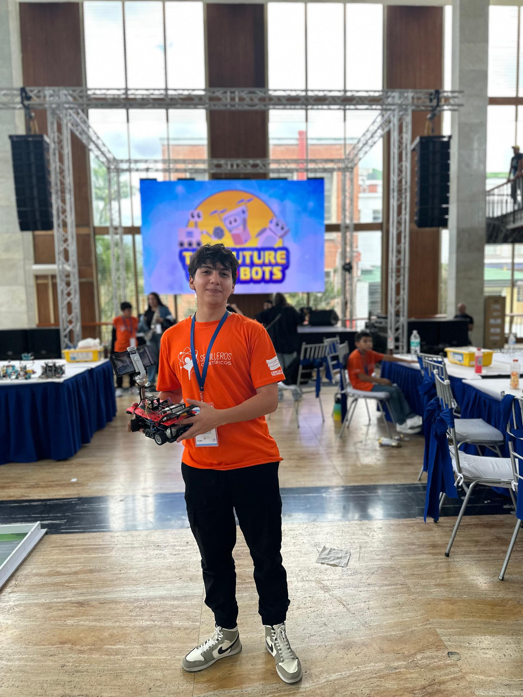
</div>

* **Trayectoria Académica:** Estudiante de Ingeniería Electrónica – **Universidad Politécnica Territorial José Félix Ribas (UPTJFR)**.
* **Competencias y Funciones Técnicas:**
  * **Diseño Estructural y Modelado 3D:** Creación paramétrica y desarrollo de componentes mecánicos optimizados para alta resistencia.
  * **Desarrollo de Software Móvil:** Creación de aplicaciones interactivas en **Android Studio** orientadas a la gestión y monitoreo de sistemas.
  * **Gestión de Proyectos:** Caracterizado por su alto nivel de responsabilidad, perseverancia y atención al detalle en entregables técnicos.
  * **Logros Destacados:** Finalista en la fase nacional de la **WRO Venezuela (Temporada 2025)** por su integración entre hardware y software.
---
### 👤 Trino Carrisales <a id="trino-carrizales"></a>
**Especialista en Programación Embebida, Algoritmos y Control**
<div align="center">
  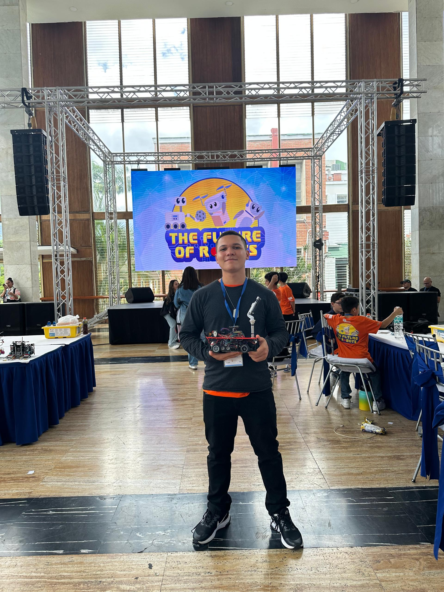
</div>

* **Perfil Académico:** 
  * Estudiante de Ingeniería Electrónica – **Universidad Politécnica Territorial José Félix Ribas (UPTJFR)**.
  * Estudiante de Ingeniería en Sistemas – **Universidad Nacional Experimental de los Llanos Occidentales Ezequiel Zamora (UNELLEZ)**.
* **Dominio Técnico y Desempeño:**
  * **Desarrollo de Firmware:** Programación y optimización de código para microcontroladores **Arduino** y **ESP32**.
  * **Depuración de Software:** Diagnóstico y resolución ágil de errores lógicos e imprevistos en código fuente bajo presión.
  * **Trayectoria Competitiva:** Finalista nacional en la **WRO Venezuela (Temporada 2025)**, demostrando adaptabilidad y estabilidad en sistemas de control.
---
### 👤 Leandro Padrón <a id="leandro-padron"></a>
**Coordinador de Logística, Mecánica Aplicada y Diagnóstico Físico**
<div align="center">
  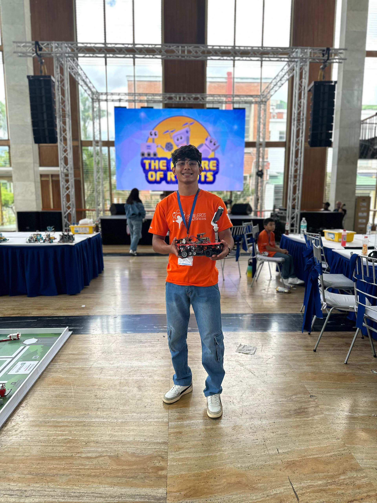
</div>

* **Estudios Universitarios:** Estudiante de Ingeniería Electrónica – **Universidad Politécnica Territorial José Félix Ribas (UPTJFR)**.
* **Aportes y Responsabilidades del Rol:**
  * **Análisis Físico-Mecánico:** Resolución eficaz de contingencias dinámicas y ensamblajes mecánicos en prototipos.
  * **Gestión Operativa:** Coordinación de recursos técnicos, planeación logística y soporte directo en las actividades de campo.
  * **Liderazgo Operativo:** Habilidad para resolver fallas de manera expedita mientras impulsa la cohesión y el trabajo en equipo.
---
### 👤 Ing. Dayana Pérez <a id="ing-dayana-perez"></a>
**Mentora Principal y Asesora de Investigación Tecnológica**
<div align="center">
  
</div>

* **Acreditación y Grados Académicos:**
  * **Ingeniera Electrónica:** Universidad Politécnica Territorial Experimental Antonio José de Sucre (**UNEXPO** VR Barquisimeto).
  * **Magíster en Educación Superior:** Universidad Fermín Toro (**UFT**).
  * **Doctorante en Tecnologías de la Información y Comunicación:** Universidad Nacional Experimental de los Llanos Occidentales Ezequiel Zamora (**UNELLEZ** Barinas).
* **Orientación y Tutoría:** Asesoría metodológica en proyectos de ingeniería, supervisión académica e integración estratégica de TIC y sistemas electrónicos.


##  Fotos de equipo
|   |  | 
| :----: | :---------- |

# 🥈 La Hazaña de 2025: Subcampeones Nacionales
El año 2025 quedó marcado en nuestra historia. Tras meses de arduo trabajo, diseño iterativo, depuración de sensores y perfeccionamiento de la lógica de navegación autónoma, logramos alzarnos con el 2do Lugar en la Competencia Nacional de Venezuela.

Fue una jornada intensa donde pusimos a prueba nuestras capacidades técnicas bajo presión, enfrentándonos a los mejores equipos del país. Superamos obstáculos en la pista, calibramos componentes en tiempo récord y demostramos que la ingeniería venezolana tiene un nivel excepcional. Estuvimos a solo un paso de la gloria máxima, y esa experiencia nos transformó por completo como desarrolladores y pensadores críticos.

# 🥇 2026: Con la Mira en el Primer Lugar
Dicen que el segundo lugar es el primer perdedor, pero para nosotros fue el combustible perfecto. Este año regresamos a la pista con más experiencia, una mentalidad más madura y un hambre voraz de victoria.

Hemos analizado cada fallo del año pasado, rediseñado nuestra arquitectura de hardware y optimizado los algoritmos de control para que el robot sea más rápido, preciso e inteligente. No venimos a ver qué pasa; venimos a buscar ese 1er Lugar nacional y ganarnos el derecho de representar a Venezuela en el escenario mundial. La meta es clara y el equipo está listo.

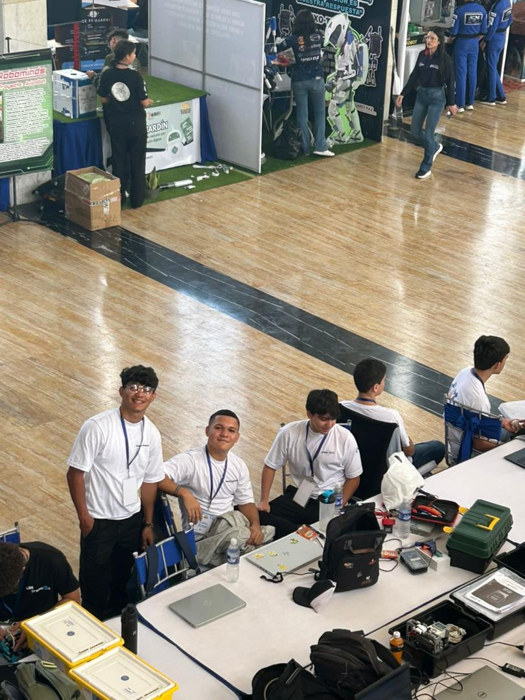 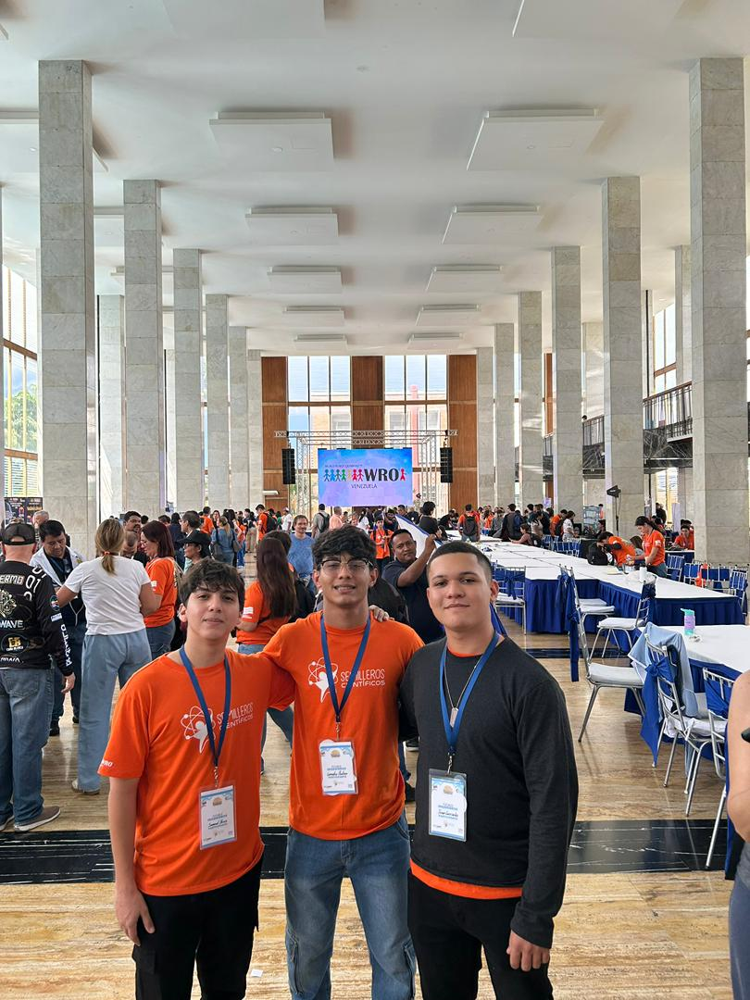 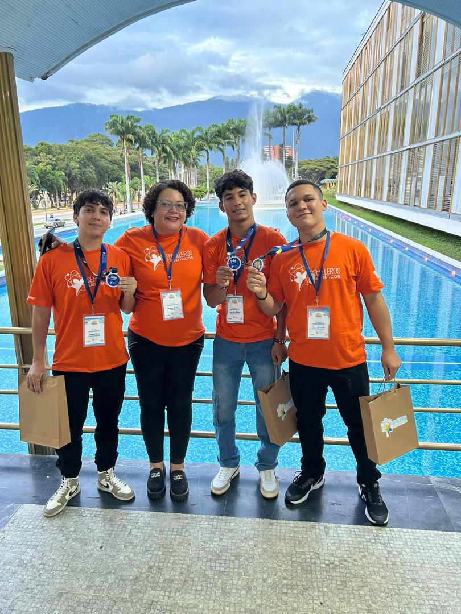

---
##  Fotos del vehiculo 
|   |    |   |
| :----: | :------------------- | :---------- |
|   |    |   |

---

### Componentes de Control, Detección e Interfaz

| Imagen | Nombre de Componente | Descripción |
| :----: | :------------------- | :---------- |
|  | **Microcontrolador ESP32** | Cerebro central del vehículo autónomo. Cuenta con un procesador de doble núcleo, conectividad Wi-Fi/Bluetooth, y múltiples pines GPIO para gestionar la lectura de sensores (I2C y Analógicos) y el control de actuadores en tiempo real. |
|  | **Sensor Infrarrojo Sharp GP2Y0A21** | Sensores analógicos de medición de distancia por triangulación infrarroja. Colocados estratégicamente en el chasis para detectar obstáculos en las diagonales delanteras del vehículo y evitar colisiones de rango medio (10 a 80 cm). |
|  | **Sensores de Distancia Láser TOF VL53L0X** | Sensores basados en tecnología Time-of-Flight (Tiempo de Vuelo) que miden distancias precisas mediante luz láser invisible. Conectados en paralelo al Bus I2C #1, utilizan pines digitales individuales como selectores de dirección (XSHUT) para evitar conflictos de direccionamiento. |
|  | **IMU BNO055 (9-Axis Absolute Orientation)** | Unidad de medición inercial avanzada que integra acelerómetro, giroscopio y magnetómetro en 3 ejes, junto con un procesador interno que calcula la orientación absoluta (ángulos de Euler/Cuaterniones) de forma directa a través del Bus I2C #1. |
|  | **Sensor de Color TCS34725** | Sensor de luz de color RGB con filtro infrarrojo. Conectado de forma independiente al Bus I2C #2 para evitar saturación de datos, está ubicado en la parte inferior del vehículo para identificar líneas, marcas y colores específicos en la pista. |
|  | **Tira de LEDs Neopixel** | Sistema de iluminación e indicadores visuales RGB direccionables de forma serial a través del pin digital D14. Se utiliza para mostrar estados del software, alertas del sistema o modos de conducción de forma dinámica. |
|  | **Zumbador (Buzzer)** | Transductor piezoeléctrico conectado al pin digital D4. Emite señales acústicas y alarmas sonoras para retroalimentar las diferentes etapas del programa, fallos de lectura o alertas críticas del vehículo. |
|  | **Interruptor de Inicio de Programa** | Pulsador/interruptor conectado al pin digital D23 con resistencia pull-up/GND. Actúa como gatillo lógico para iniciar la marcha autónoma del software una vez el vehículo ha sido calibrado y posicionado. |

### Componentes de Alimentación y Actuación

| Imagen | Nombre de Componente | Descripción |
| :----: | :------------------- | :---------- |
|  | **Batería LiPo 2S 50C 2200mAh** | Fuente de energía principal del vehículo. Suministra un voltaje nominal de 7.4V (máximo de 8.4V en carga completa) con una alta tasa de descarga (50C) para soportar los picos de corriente de los motores. |
|  | **Interruptor de Encendido General** | Interruptor basculante (ON/OFF) conectado directamente al terminal positivo de la batería para cortar o permitir el paso de corriente a todo el sistema eléctrico de forma segura. |
|  | **Regulador Elevador/Reductor XL6009** | Módulo de regulación de voltaje ajustado entre 6V y 8V (según la velocidad buscada). Estabiliza la alimentación que va dirigida al driver de los motores, independientemente de las fluctuaciones de la batería. |
|  | **Driver de Motores TB6612FNG** | Controlador de puente en H dual de alta eficiencia. Recibe las señales lógicas de control del ESP32 (dirección y PWM) y maneja la potencia hacia los motores DC de tracción de manera mucho más eficiente que el clásico L298N. |
|  | **Motor DC 25GA-370 (6V-8V)** | Motorreductor metálico encargado de la tracción mecánica del vehículo autónomo. Funciona en un rango de voltaje de 6V a 8V regulado por el XL6009 y operado a través del driver. |
|  | **Step Down DSN-Mini 360** | Regulador reductor de voltaje de tipo conmutado, ajustado a una salida fija de 7V para alimentar de forma estable el pin VIN del microcontrolador ESP32. |
|  | **Servomotor MG90 180°** | Servo con piñonería metálica de alta resistencia. Utilizado para controlar el ángulo de dirección de las ruedas delanteras del vehículo mediante señales PWM del microcontrolador. Alimentado a 6V desde el regulador correspondiente. |

## Esquemas de Alimentación y Cableado

[*Consultar el historial de versiones de alimentación aquí*](#sistema-de-alimentación)

### Versión 4 (Actual)

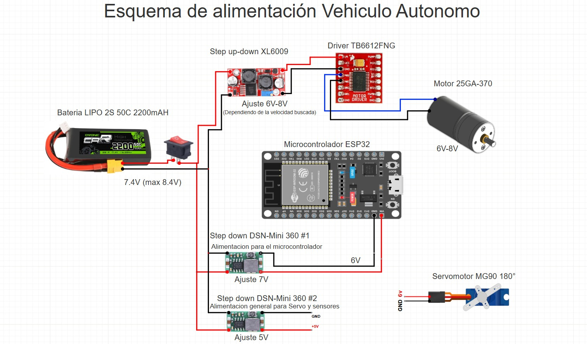

### Arquitectura de Energía, Control y Gestión de Potencia

La **batería LiPo 2S de 2200mAh** (7.4V nominales, 8.4V en máxima carga) constituye la fuente central de energía del sistema, gestionada mediante un **interruptor general físico de palanca** que garantiza un enclavamiento mecánico seguro y mitiga fallos por desconexión accidental ante vibraciones en la pista. 

A partir de este nodo central, la alimentación se ramifica de forma completamente independiente en tres sub-buses regulados para aislar el ruido electromagnético y evitar caídas de tensión (*brownouts*) en la lógica de control:

* **Línea de Tracción Potenciada:** Una rama se dirige a un regulador **step-up/down XL6009**, ajustado dinámicamente entre 6V y 8V en función de la velocidad requerida. Este módulo alimenta el **puente H TB6612FNG**, el cual entrega el voltaje íntegro al **Motor 25GA-370**.
* **Línea de Control Confiable:** De forma paralela, un módulo **step-down DSN-Mini 360** configurado a 6V proporciona energía limpia al pin Vin del único **ESP32** del sistema, garantizando el diferencial necesario para el correcto funcionamiento de su regulador interno LDO sin riesgo de reinicios.
* **Línea de Actuadores y Sensores:** Un segundo módulo **DSN-Mini 360**, calibrado estrictamente a 5V, se encarga de la alimentación general para el **Servomotor SG90 180°** y el resto de la red de sensores, ofreciendo una línea de voltaje estable y adecuada para las comunicaciones de datos.

> [!IMPORTANT]
> **Iteración Crítica de Hardware (L298N vs. TB6612FNG)**
> 
> La transición al puente H TB6612FNG resolvió dos fallos arquitectónicos graves de nuestro prototipo inicial. En primer lugar, eliminó la severa caída de voltaje interna característica del L298N, optimizando la eficiencia del par motor. En segundo lugar, el módulo L298N generaba una interferencia que inhabilitaba los puertos I2C de cualquier microcontrolador conectado. Este fallo nos había obligado temporalmente a utilizar una arquitectura ineficiente con dos placas ESP32 (una dedicada exclusivamente al control del motor). El cambio al TB6612FNG solucionó este conflicto de comunicaciones, permitiéndonos unificar todo el procesamiento en un único ESP32. Esto redujo drásticamente el peso, la complejidad del cableado, el consumo general de energía y los posibles puntos de fallo del vehículo.

> [!NOTE]
> **Compensación de diseño (*Trade-off*)**
> 
> Esta configuración ampliada, apoyada en tres reguladores de voltaje independientes, exige una gestión del espacio interno más rigurosa dentro del chasis impreso en 3D. Sin embargo, se asumió esta compensación espacial porque mitiga por completo el acoplamiento de ruido inductivo provocado por los motores hacia la electrónica sensible, blindando la estabilidad del vehículo y asegurando lecturas limpias en el bus I2C durante la navegación autónoma.


## Esquemas de Sensores y Adquisición de Datos

[*Consultar el historial de versiones de detección aquí*](#sistema-de-detección-de-objetos)

### Versión 4 (Actual)

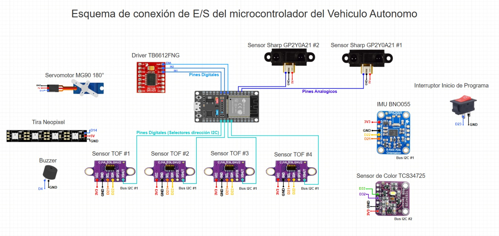

### Optimización del Sistema de Sensores y Hardware

En esta cuarta iteración, se ha reconfigurado la matriz de sensores del vehículo aprovechando la capacidad de múltiples buses del ESP32. El objetivo principal es maximizar la precisión espacial, evitar cuellos de botella en el procesamiento de datos y blindar la estabilidad del algoritmo de navegación autónoma dentro de la pista de $3 \times 3$ metros.

#### Subsistema de Navegación Cinemática (Bus I2C #1 - Pines D21/D22)

* **Sensores de Distancia por Tiempo de Vuelo (ToF):** El reemplazo de los transductores ultrasónicos por módulos ToF elimina las zonas muertas en lecturas de corto alcance. Para conectar los cuatro sensores en el mismo bus I2C, se implementó una estrategia de asignación de direcciones dinámicas controlando los pines **XSHUT** a través de pines digitales del ESP32, lo que permite un encendido secuencial. Además, al operar nativamente a 3.3V, esta actualización eliminó la necesidad de utilizar divisores de tensión, simplificando drásticamente el hardware.
* **Unidad de Medición Inercial (IMU) BNO055:** Comparte el Bus I2C #1. La inclusión de este sensor con procesamiento de fusión de datos a bordo está orientada a **eliminar por completo la deriva (*drift*)** acumulativa. Para garantizar la fidelidad del posicionamiento, el algoritmo calibra el cero relativo y establece el eje Y del sensor como el vector de referencia principal para el equilibrio y dirección del chasis.

#### Subsistema de Navegación Cinemática (Bus I2C #1 - Pines D21/D22)

* **Unidad de Medición Inercial (IMU) BNO055:** Comparte el Bus I2C #1. La inclusión de este sensor con procesamiento de fusión de datos a bordo está orientada a **eliminar por completo la deriva (*drift*)** acumulativa. Para garantizar la fidelidad del posicionamiento, el algoritmo calibra el cero relativo y establece el eje Y del sensor como el vector de referencia principal para el equilibrio y dirección del chasis.

* **Sensores de Distancia por Tiempo de Vuelo (ToF):** El reemplazo de los transductores ultrasónicos por módulos ToF elimina las zonas muertas en lecturas de corto alcance. Para conectar los cuatro sensores en el mismo bus I2C, se implementó una estrategia de asignación de direcciones dinámicas controlando los pines **XSHUT** a través de pines digitales del ESP32, lo que permite un encendido secuencial. Además, al operar nativamente a 3.3V, esta actualización eliminó la necesidad de utilizar divisores de tensión, simplificando drásticamente el hardware.

#### Calibración y Direccionamiento de los 4 Sensores ToF (XSHUT)

Los cuatro sensores VL53L0X comparten el mismo bus físico I2C #1 (pines D21/D22), pero de fábrica todos responden a la misma dirección por defecto (`0x29`), lo que provocaría colisión de direcciones si se energizaran simultáneamente. Para resolverlo, cada sensor tiene su pin **XSHUT** conectado a un GPIO independiente del ESP32, usado como interruptor de encendido/apagado por software:

```cpp
#define XSHUT_FRONTAL 17
#define XSHUT_TRASERO 16
#define XSHUT_IZQ     5
#define XSHUT_DER     18

#define ADDR_FRONTAL 0x30
#define ADDR_TRASERO 0x31
#define ADDR_IZQ     0x32
#define ADDR_DER     0x33
```

**Secuencia de inicialización (encendido escalonado):**

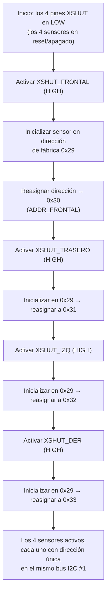
```mermaid
flowchart TD
    A["Inicio: los 4 pines XSHUT en LOW<br/>(los 4 sensores en reset/apagado)"] --> B["Activar XSHUT_FRONTAL (HIGH)"]
    B --> C["Inicializar sensor en dirección<br/>de fábrica 0x29"]
    C --> D["Reasignar dirección → 0x30<br/>(ADDR_FRONTAL)"]
    D --> E["Activar XSHUT_TRASERO (HIGH)"]
    E --> F["Inicializar en 0x29 → reasignar a 0x31"]
    F --> G["Activar XSHUT_IZQ (HIGH)"]
    G --> H["Inicializar en 0x29 → reasignar a 0x32"]
    H --> I["Activar XSHUT_DER (HIGH)"]
    I --> J["Inicializar en 0x29 → reasignar a 0x33"]
    J --> K["Los 4 sensores activos,<br/>cada uno con dirección única<br/>en el mismo bus I2C #1"]
```

En cada paso, solo **un sensor a la vez** queda activo en la dirección por defecto `0x29` mientras los demás permanecen en reset (XSHUT en LOW), evitando cualquier colisión. Una vez reasignada su dirección definitiva, el sensor permanece encendido (XSHUT en HIGH) y se pasa al siguiente.

> [!NOTE]
> **Calibración: los 4 sensores usan el mismo criterio (sin offsets individuales)**
>
> Los cuatro VL53L0X se calibran de forma idéntica, sin aplicar offsets particulares por unidad. Esto es posible porque el VL53L0X trae calibración de fábrica consistente entre unidades del mismo lote, y el direccionamiento único vía XSHUT es lo único que realmente necesita configurarse por sensor — no la calibración de medición en sí.

#### Subsistema de Lectura de Superficie (Bus I2C #2 - Pines D32/D33)

* **Sensor de Color TCS34725:** Dedicado a la detección y confirmación de líneas. Para evitar saturar el bus principal de navegación, este sensor se ha aislado en un **segundo bus I2C independiente (Hardware I2C #2)**. Esto garantiza que las lecturas constantes del suelo no interfieran ni retrasen las respuestas críticas de evasión de obstáculos de los sensores ToF.

#### Subsistema de Proximidad Redundante e Interfaz (E/S Estándar)

* **Sensores Sharp GP2Y0A21 Diagonales:** Mantienen su conexión analógica tradicional para ofrecer detección de proximidad redundante en los ángulos ciegos frontales.
* **Interfaz de Usuario y Control:** Se integró una tira Neopixel y un Buzzer para proporcionar telemetría visual y auditiva del estado del robot (códigos de error, calibración exitosa, detección de línea). El inicio de ejecución se controla mediante un **interruptor físico de palanca** (Pin D23), descartando el uso de pulsadores para evitar rebotes o activaciones accidentales por vibración.

---

> [!IMPORTANT]
> **Iteración de Hardware: Simplificación y Mantenibilidad**
> 
> La transición de los sensores ultrasónicos (HC-SR04) a los módulos ToF no solo mejoró la velocidad de muestreo, sino que resolvió un problema crítico de diseño físico. En versiones anteriores, la incompatibilidad lógica (5V del HC-SR04 vs. 3.3V de los pines del ESP32) nos obligó a fabricar divisores de voltaje manuales con arreglos de resistencias debido a la falta de convertidores lógicos comerciales en ese momento. Aunque la solución era funcional, resultaba en un circuito sumamente tosco, voluminoso y propenso a falsos contactos. Migrar a una topología de sensores I2C nativos a 3.3V eliminó por completo esta red pasiva, logrando un ensamblaje mucho más limpio y facilitando enormemente las labores de mantenimiento y reparación en los pits durante la competencia.

> [!NOTE]
> **Compensación de Diseño (*Trade-off*) y Gestión de Tráfico I2C**
> 
> Integrar múltiples sensores I2C presentaba el riesgo de colisiones de datos y retrasos en el ciclo principal (*loop*). Este riesgo se mitigó mediante dos decisiones arquitectónicas: a nivel de software, implementando rutinas de muestreo secuencial (*polling*) estrictamente temporizadas mediante los pines XSHUT; y a nivel de hardware, segregando la carga de datos en dos buses I2C independientes (Navegación vs. Superficie). Adicionalmente, para optimizar el espacio y peso, se decidió prescindir de bancos de resistencias *pull-up* externas, confiando exitosamente en las resistencias *pull-up* integradas por defecto en las placas comerciales de los sensores.

---

### Resumen de Cambios y Evolución de Hardware

| Componente Anterior | Componente Actual | Justificación Técnica y Ventaja Principal |
| :--- | :--- | :--- |
| Sensor Ultrasónico (HC-SR04 con divisores de tensión) | **4x Sensores ToF (I2C #1)** | Eliminación de zonas muertas y de redes de resistencias; hardware limpio a 3.3V. Direcciones gestionadas vía pines XSHUT. |
| Giroscopio básico | **IMU BNO055 (I2C #1)** | Supresión del *drift* inercial en el área de $3 \times 3$ m (Alineación orientada al eje Y). |
| Sensor de Color (Bus único) | **TCS34725 (I2C #2 aislado)** | Independencia de bus para evitar cuellos de botella con la telemetría de evasión. |
| Pulsador de inicio | **Interruptor físico (Pin D23)** | Enclavamiento seguro contra vibraciones mecánicas de la pista. |


---

# Gestión Energética y Autonomía del Sistema


Este apartado detalla el análisis del consumo eléctrico y la justificación técnica de la fuente de alimentación seleccionada para el hardware del proyecto.

## Cálculo del Consumo Energético Total

El consumo eléctrico del sistema se estimó para tres escenarios de operación por componente, siguiendo valores típicos de hoja de datos: **standby** (componente energizado pero inactivo o en reposo), **nominal** (operación típica durante una vuelta normal) y **pico** (consumo máximo instantáneo, por ejemplo arranque de motor o brillo máximo de LEDs).

| Componente | Cantidad | Standby (mA) | Nominal (mA) | Pico (mA) |
| :--- | :---: | :---: | :---: | :---: |
| **ESP32** (doble núcleo, WiFi/BT off) | 1 | ~20 mA (idle) | ~80 mA | ~80 mA (procesamiento intensivo) |
| **Sensor Infrarrojo Sharp GP2Y0A21** | 2 | 10 mA c/u | 30 mA c/u | 33 mA c/u |
| **Sensor ToF VL53L0X** | 4 | 5 mA c/u | 15 mA c/u | 20 mA c/u (ranging activo) |
| **IMU BNO055** | 1 | ~1 mA | 12.3 mA | ~16 mA |
| **Sensor de Color TCS34725** | 1 | ~0 mA (sleep, µA) | 3 mA | 3.6 mA |
| **Tira Neopixel** (10 LEDs) | 10 | 0 mA (apagada) | 300 mA (mix medio) | 600 mA (blanco 100%) |
| **Zumbador (Buzzer)** | 1 | 0 mA | 30 mA | 30 mA |
| **Regulador XL6009** | 1 | 15 mA (quiescent) | 15 mA | 15 mA |
| **Driver TB6612FNG** (lógica) | 1 | 1 mA | 2 mA | 6 mA |
| **Motor DC 25GA-370** | 1 | 0 mA (detenido) | 500 mA | ~1800 mA (corriente de rotor bloqueado / arranque) |
| **Step Down DSN-Mini 360** | 2 | 5 mA c/u | 5 mA c/u | 5 mA c/u |
| **Servomotor MG90** | 1 | 10 mA (sosteniendo posición) | 200 mA (en movimiento) | ~700 mA (esfuerzo/stall) |
| **TOTAL ESTIMADO** | | **~97 mA** | **~1272.3 mA** | **~3406.6 mA** |

🔋 **Demanda de Corriente Nominal:** ~1.27 A · **Pico teórico simultáneo:** ~3.41 A

> [!NOTE]
> **Sobre el escenario de pico**
>
> El pico de ~3.41 A representa el caso extremo en que *todos* los componentes alcanzan su consumo máximo al mismo tiempo (arranque del motor + servo en esfuerzo + LEDs en blanco pleno). Es un escenario estadísticamente improbable en un ciclo de control real, pero es el valor de referencia usado para dimensionar la tasa de descarga (C) mínima requerida de la batería — ver sección de justificación de la LiPo 2S 50C.

---

## Estimación de la Autonomía

Para calcular el tiempo estimado de funcionamiento continuo, se utiliza la relación entre la capacidad nominal de la batería y la demanda de corriente calculada.

### Fórmula General
$$\text{Autonomía (horas)} = \frac{\text{Capacidad de la Batería (mAh)}}{\text{Consumo Total del Sistema (mA)}}$$

### Aplicación al Caso de Estudio
$$\text{Autonomía} \approx \frac{2200 \text{ mAh}}{1272.3 \text{ mA}} \approx 1.73 \text{ horas}$$

* **Tiempo estimado:** Aproximadamente **1 hora y 44 minutos** de operación continua en condiciones normales.
* **Nota Práctica:** Este modelo es de naturaleza teórica. En un entorno dinámico, los motores variarán su consumo constantemente (aumentando cerca del punto de bloqueo o *stall*) y los sensores se activarán por ráfagas, haciendo que la autonomía real oscile en función de las rutinas algorítmicas del firmware.

---

### Eficiencia de los Conversores DC-DC y Autonomía Real

El cálculo de autonomía anterior asume una relación 1:1 entre la corriente consumida por cada componente y la corriente extraída de la batería, sin considerar que los reguladores XL6009 y DSN-Mini 360 operan a voltajes de salida distintos al de la batería (7V, 6V y 5V vs. 7.4V nominal) y que ninguna conversión es 100% eficiente.

**Eficiencias de referencia (según hoja de datos del fabricante):**

| Convertidor | Rol en el sistema | Eficiencia típica | Rango según fabricante |
| :--- | :--- | :---: | :---: |
| **XL6009** (step-up/down) | Línea de Tracción (motor + TB6612FNG) | ~88% | Hasta 94% en condiciones ideales; en nuestra aplicación (relación de conversión cercana a 1:1, ~500 mA de carga) el valor real práctico es menor |
| **DSN-Mini 360** ×2 (step-down, MP2307) | Línea de Control (ESP32) y Línea de Sensores/Actuadores | ~90% | 90–96% típico a carga moderada según el fabricante |

**Recálculo de la corriente real extraída de la batería (balance de potencia por línea):**

$$P_{\text{entrada}} = \frac{P_{\text{salida}}}{\eta} \qquad I_{\text{batería}} = \frac{P_{\text{entrada}}}{V_{\text{batería}}}$$

| Línea de alimentación | V salida | I salida (nominal) | P salida | η | P entrada | I extraída de batería (7.4V) |
| :--- | :---: | :---: | :---: | :---: | :---: | :---: |
| Tracción (XL6009 → Motor + TB6612) | 7 V | 502 mA | 3.51 W | 88% | 3.99 W | **≈ 540 mA** |
| Control (Mini 360 → ESP32) | 6 V | 80 mA | 0.48 W | 90% | 0.53 W | **≈ 72 mA** |
| Sensores/Actuadores (Mini 360 → Sharp+ToF+BNO+TCS+Neopixel+Buzzer+Servo) | 5 V | 665.3 mA | 3.33 W | 90% | 3.70 W | **≈ 500 mA** |
| **TOTAL REAL EXTRAÍDO DE LA BATERÍA** | | | | | | **≈ 1112 mA** |

$$\text{Autonomía real} \approx \frac{2200 \text{ mAh}}{1112 \text{ mA}} \approx 1.98 \text{ horas} \; (\approx 1\text{h}\,59\text{min})$$

> [!IMPORTANT]
> **Por qué la autonomía real es mayor que la estimación teórica inicial, no menor**
>
> A primera vista se esperaría que las pérdidas por eficiencia *reduzcan* la autonomía, y en efecto lo hacen frente al caso ideal (100% eficiencia). Pero el modelo original (~1.73 h) tenía un sesgo en sentido contrario: sumaba directamente los mA de cada componente como si todos operaran al voltaje de la batería (7.4V), cuando en realidad la mayoría opera a 5V o 6V. Al bajar el voltaje, la corriente equivalente en el lado de la batería es menor — y esa reducción por conversión de voltaje pesa más que la pérdida introducida por la eficiencia de los reguladores. El resultado neto es una autonomía real estimada (~1h 59min) **mayor** a la calculada originalmente sin este ajuste, lo cual es consistente con la observación empírica: en pruebas de una tarde y noche completas no se llegó al límite inferior de carga de la batería.

---

##  Justificación de la Fuente de Alimentación Seleccionada
## 🔋 Elección del Sistema de Alimentación: ¿Por qué LiPo?

La elección de una batería de **Polímero de Litio (LiPo)** frente a otras tecnologías del mercado se debe principalmente a su excelente **relación peso-potencia** y a su **capacidad de entrega de corriente instantánea (tasa de descarga)**, factores críticos para el rendimiento dinámico del robot.

---

### 📊 Análisis Comparativo de Tecnologías

| Tecnología | Densidad Energética | Tasa de Descarga (C) | Peso / Volumen | Comportamiento con Motores/Servos |
| :--- | :---: | :---: | :---: | :--- |
| **LiPo (2S 50C)** | **Alta** | **Muy Alta (~50C)** | **Muy Ligero** | **Excelente.** Entrega corriente instantánea sin caídas de voltaje. |
| **Li-ion (18650)** | Muy Alta | Baja (1C - 2C) | Ligero | **Deficiente.** Los picos de corriente provocan *voltage sag* y reinician la ESP32. |
| **NiMH (6 celdas)**| Media | Media | Muy Pesado | **Aceptable, pero inviable.** El exceso de peso penaliza la agilidad del robot. |
| **Power Bank (USB)**| Alta | Limitada (2A-3A) | Medio | **Incompatible.** Los circuitos de protección se apagan por sobrecorriente. |

---

###  Justificación Técnica frente a Alternativas

#### 1. Frente a Celdas Li-ion (ej. 18650)
Aunque las celdas 18650 tienen una excelente densidad energética, su tasa de descarga típica es muy baja. Si se intentan alimentar motores DC y servomotores —que generan altos picos de corriente al arrancar o atascarse— una batería Li-ion común sufrirá una caída de voltaje severa (*voltage sag*). Esto provocaría el **reinicio constante de la ESP32** o la activación del circuito de protección (BMS). La LiPo con su alta tasa de descarga entrega esa corriente al instante sin caídas de tensión.

#### 2. Frente a Baterías de NiMH (Níquel-Metal Hidruro)
Las NiMH son seguras y duraderas, pero extremadamente pesadas y voluminosas. Para igualar los **7.4V** nominales de una LiPo 2S, se requerirían **6 celdas de NiMH en serie** (1.2V c/u). Este incremento de peso duplicaría o triplicaría la masa del robot, penalizando el consumo eléctrico de los motores y reduciendo drásticamente la agilidad y aceleración del sistema en pista.

#### 3. Frente a Power Banks comerciales (USB 5V)
Los Power Banks elevan internamente el voltaje de sus celdas a 5V mediante reguladores con un límite estricto de corriente (usualmente 2A o 3A máximo). El consumo concurrente del sistema satura este límite con facilidad:
* **10 LEDs Neopixel** en blanco brillante: `~600 mA`
* **Servomotor MG90** (esfuerzo de torsión): `~500 mA`
* **Motor principal 25GA-370** (arranque/carga): `> 1A`

Superar este límite provoca un apagado inmediato del Power Bank por sobrecorriente. Además, los motores **25GA-370** rinden de manera óptima entre **6V y 8V**; alimentarlos a 5V limitaría severamente su torque y velocidad final.


#### ¿Por qué 2200 mAh y no 2600 mAh o 3000 mAh?

La elección de la capacidad específica de 2200 mAh (y no una mayor) respondió a tres criterios evaluados en conjunto: peso, espacio y margen de autonomía real ya validado.

- **Peso:** la LiPo 2S 2200mAh 50C seleccionada pesa **115 g**. Una celda de 2600 o 3000 mAh de la misma tecnología y tasa de descarga añade masa adicional proporcional a la capacidad extra — peso que impacta directamente la relación torque/masa calculada en la sección de tracción, sin ofrecer una ventaja competitiva relevante dado que la autonomía ya cubre con holgura la duración de una prueba de competencia.
- **Tasa de descarga (50C):** con 2200 mAh y 50C, la batería puede entregar hasta 110 A de corriente instantánea — muy por encima de cualquier pico real del sistema (~3.6 A, ver tabla de consumo). Esto garantiza arranque del motor sin caídas de tensión (*voltage sag*) ni fluctuaciones que afecten a la lógica de control, sin necesitar más capacidad para lograrlo.
- **Autonomía suficiente y validada empíricamente:** según el recálculo con pérdidas de conversión (sección anterior), la autonomía real estimada es de ~1h 59min. En la práctica, el equipo utilizó el vehículo durante una tarde y noche completas de pruebas sin llegar al límite inferior de carga, confirmando que 2200 mAh ofrece margen de sobra para entrenamiento y competencia sin necesidad de cargar más peso muerto en el chasis.

> [!NOTE]
> **Compensación de Diseño (*Trade-off*)**
>
> Subir a 2600–3000 mAh habría añadido entre 20–35 g adicionales aproximadamente (estimado proporcional a la línea de productos de la misma marca/tecnología) a cambio de una autonomía que ya no es el factor limitante del sistema — el "cuello de botella" real está en el tiempo de procesamiento del algoritmo de evasión (ver comparación de tiempos de vuelta), no en la energía disponible. Se priorizó mantener el chasis lo más liviano posible.

> ⚠️ **Nota de Diseño:** La combinación de una LiPo 2S junto a una tasa de descarga de hasta 50C garantiza que la electrónica de control (ESP32) y la etapa de potencia (motores/servos) coexistan de manera estable sin interferencias por caídas de tensión.
---

## Diseño Estructural, Transmisión y Manufactura Aditiva

[*Consultar el historial de versiones de diseño estructural, transmisión y manufactura aditiva aquí*](#paso-a-paso-de-la-construcción)

### Versión 2 (Actual)

---

### 1. Filosofía de Rediseño y Prototipado Conceptual

El punto de partida de esta iteración consistió en un riguroso análisis de fallos del desempeño en los desafíos anteriores. El diagnóstico principal determinó que el chasis heredado poseía una longitud excesiva, lo que degradaba la cinemática de giro del robot y aumentaba su radio de giro, restando agilidad en las evasiones. 

Para mitigar este problema sin comprometer el espacio de la electrónica, se fijó un objetivo de diseño geométrico estricto: lograr una **relación de aspecto 1:1**. Esto significa igualar la distancia entre el eje delantero y trasero (*wheelbase*) con el ancho total del vehículo (vía), maximizando la respuesta de la dirección.

> [!IMPORTANT]
> **Iteración del Tren Motriz: De Correas a Engranajes**
> 
> Antes del modelado final, se validaron conceptos espaciales mediante prototipado rápido. Inicialmente, se consideró una transmisión por correa dentada, pero las limitaciones para conseguir bandas a la medida y el riesgo de deslizamiento (*slipping*) obligaron a descartarla. La iteración conceptual consolidó una arquitectura de engranajes cilíndricos de dientes rectos en paralelo. Esto permitió rotar el montaje del motor, empaquetar la transmisión de forma más compacta y confirmar que la reducción longitudinal del chasis era viable.

#### Prototipos Conceptuales Tempranos
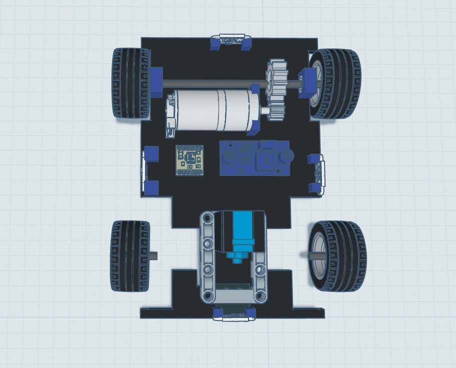
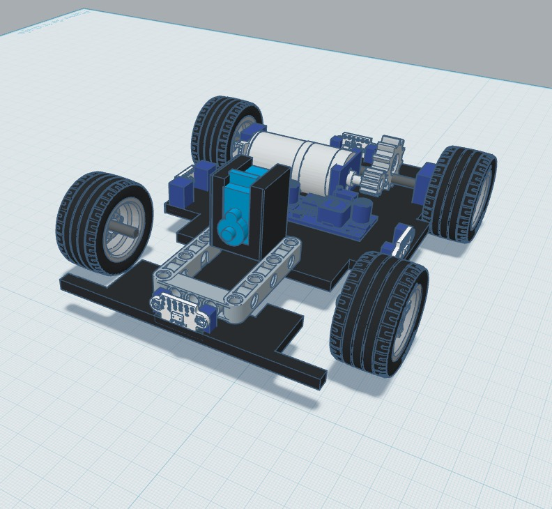
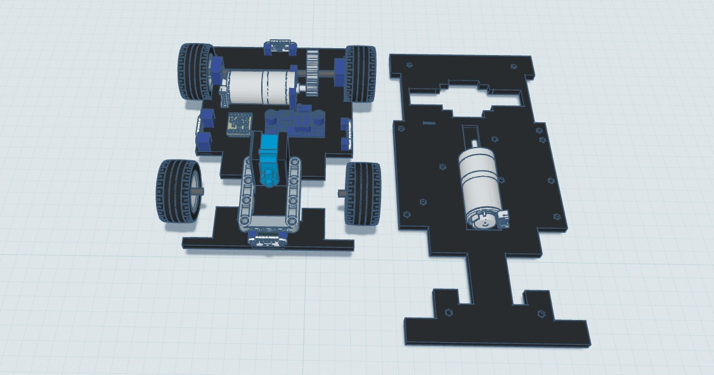

---

### 2. Transición a CAD Profesional y Arquitectura "Monochasis"

Demostrada la viabilidad geométrica, el desarrollo se trasladó al entorno paramétrico de **Onshape**. La innovación estructural radica en la concepción de un **Monochasis** para el nivel inferior: una sola pieza que integra de forma nativa los soportes, canales de cableado y alojamientos mediante operaciones booleanas exactas, erradicando los ensambles múltiples y fijaciones caseras propensas a la vibración.

La plataforma resultante mide **179 mm de largo por 115 mm de ancho**, con una distancia entre ejes de **~112 mm**, cristalizando la relación geométrica 1:1 buscada.


#### Desglose Técnico del Tren Motriz (Razonamiento Par/Velocidad)
* **Motor de Tracción:** Modelo JGA25 de 220 RPM con caja reductora metálica. El monochasis incorpora una cama hundida específica para nuestro motor, alineando el eje de salida con la transmisión.
* **Sistema Piñón-Corona:** Un piñón de 15 dientes acoplado al motor transmite la potencia a una corona de 25 dientes. Esta **relación de transmisión de 1.66:1** representa una decisión de ingeniería calculada: sacrifica una fracción de la velocidad final máxima para multiplicar el torque (par motor) entregado a las ruedas, garantizando aceleraciones explosivas y controladas desde el reposo absoluto sin estresar mecánicamente el motor.
* **Eje Trasero (Solución de Taller):** Ante la escasez de varillas calibradas de 4 mm, se adaptaron núcleos de electrodos de soldadura (~2.4 mm). El diámetro se incrementó uniformemente en las zonas de rodadura mediante fundas termocontraíbles, logrando tolerancias de ajuste a presión (*press-fit*) sin holguras.
* **Apoyos y Rodamientos:** El eje descansa sobre rodamientos 604 ZZ ZSG (4x12x4 mm) encajados en portarolineras nativos del chasis.

---

### 3. Validación de Tolerancias y Ensamble Virtual

Antes de realizar la integración completa, el entorno de Onshape nos permitió modelar y auditar cada componente mecánico de forma individual, asegurando que las tolerancias geométricas fueran perfectas.

#### Modelado de Componentes Clave y Sistemas de Anclaje
El diseño del tren motriz requirió la creación de engranajes personalizados, implementando soluciones de fijación específicas para cada tipo de eje:

* **Piñón Motriz (Eje tipo "D"):** Para acoplar el engranaje de 15 dientes al motor JGA25, se aprovechó el corte plano de fábrica del eje metálico. Se modeló un agujero con perfil en "D" calculando tolerancias estrictas para impresión 3D, logrando un ensamble a presión (*press-fit*) perfecto. Esto garantiza la transferencia total de torque sin desgaste y evita que el piñón se desplace o escape por vibración.
* **Corona Conducida (Varilla Lisa):** Para fijar el engranaje de 25 dientes a nuestra varilla trasera adaptada, se implementó un collarín con **sistema de apriete por mordaza tipo "C"**. Al ajustar un tornillo transversal pasante, el collarín se comprime estrangulando la varilla lisa, bloqueando el engranaje mediante fricción radial sin requerir pegamentos ni dañar el metal.

> 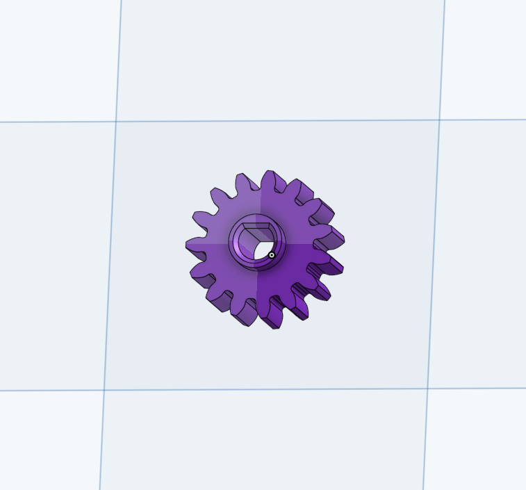
> *Piñón motriz (15T) con acoplamiento tipo D.*

> 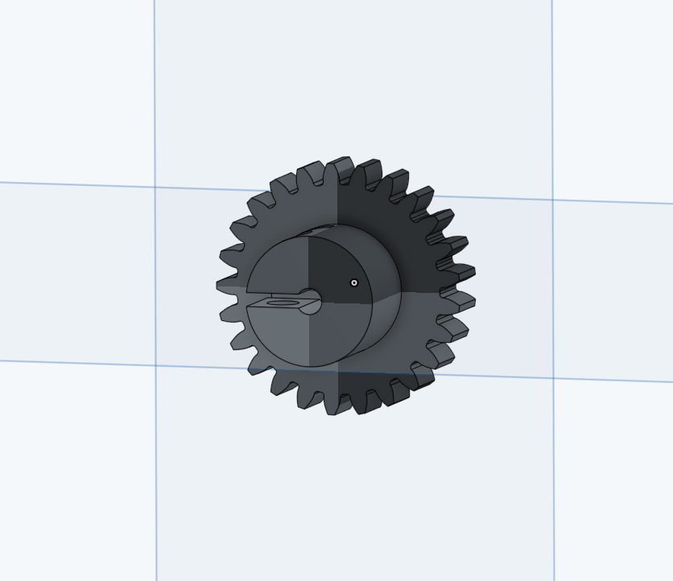
> *Corona conducida (25T) con sistema de apriete tipo C.*

#### Acoplamiento de Tracción: Adaptador para Ruedas Lego
Para mantener la excelente adherencia a la pista de las **ruedas Lego** heredadas de la iteración pasada y acoplarlas a nuestra nueva varilla de transmisión lisa, se diseñó una interfaz mecánica a medida. 
Este componente de transición cuenta con el perfil transversal clásico en cruz de Lego en un extremo, mientras que la base cilíndrica replica el mismo **sistema de apriete por mordaza tipo "C"** utilizado en la corona. Esto permite fijar la rueda sólidamente a la varilla y facilita enormemente el cambio rápido de neumáticos o mantenimientos en los pits.

> 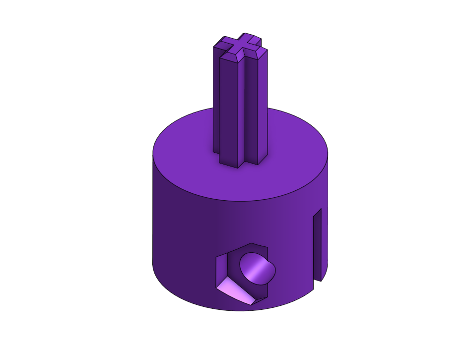
> *Perfil del adaptador de transición.*

> 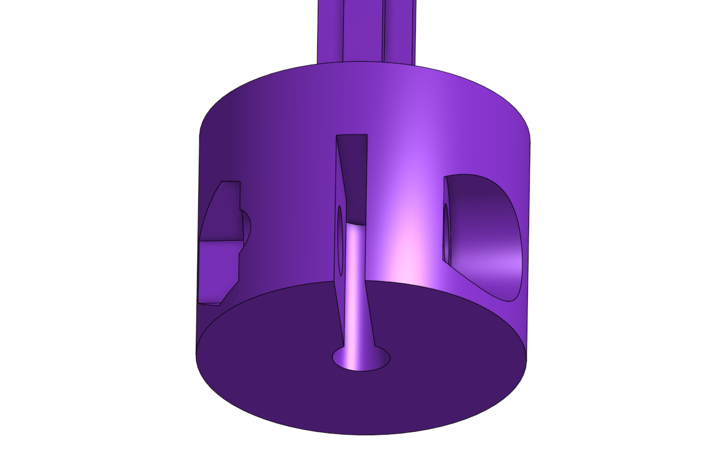
> *Detalle del sistema de apriete por mordaza transversal.*

#### Ensamble Virtual y Mitigación de Fallos
Una vez validados los componentes individuales, el ensamble virtual completo fue vital para analizar interferencias mecánicas y optimizar el diseño antes de la manufactura. 

> [!TIP]
> **Mitigación de Fallos: Rediseño al soporte de motor**
> 
> Durante la simulación, se detectó que el soporte del motor tenía los tornillos que anclan al motor ubicados en un punto donde serían cubiertos por la corona del eje trasero. Esto obligaría a desmontar la varilla y casi todo el sistema de tracción para sacar el motor, ocasionando pérdidas de tiempo críticas durante mantenimientos en los pits. Para solucionarlo, se reubicaron los agujeros de anclaje hacia las esquinas expuestas del soporte, permitiendo la extracción rápida del motor con solo retirar el piñón. 

> 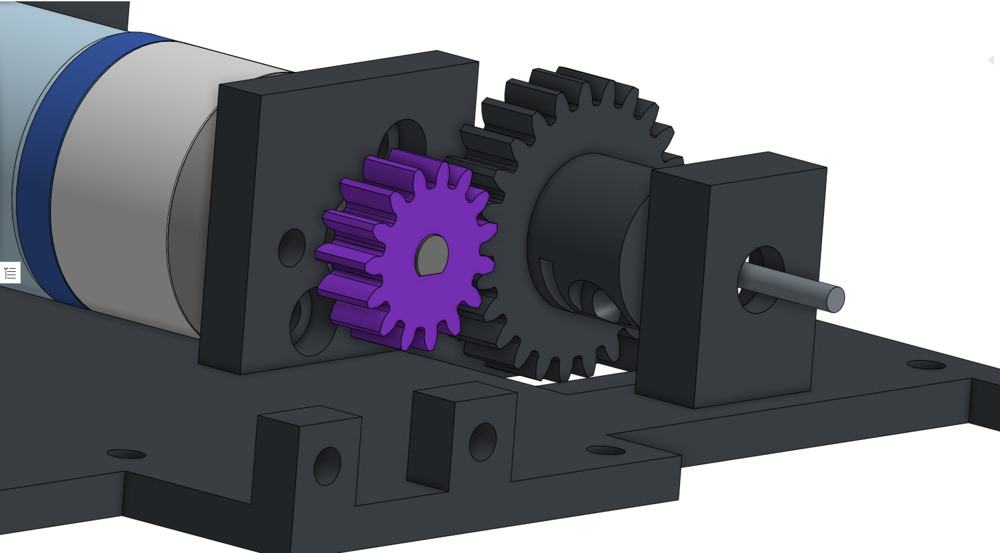
> *Análisis de interferencia del tren de engranajes.*

> 
> *Bloque motriz empaquetado y listo para integración.*

---

### 4. Segundo Piso, Separadores y Sistema de Visión "Shark Fin"

El segundo nivel de la plataforma tiene como objetivo distribuir la masa, proteger la electrónica y alojar el robusto sistema de visión computacional.

> [!NOTE]
> **Compensación de Diseño (*Trade-off*) del Centro de Gravedad**
> 
> En versiones anteriores, la batería se ubicaba precariamente en la zona superior. El nuevo diseño integró un compartimento ventilado **debajo del primer piso**. Aunque reduce ligeramente la altura libre al suelo (*ground clearance*), esta compensación baja drásticamente el centro de gravedad (CoG), evitando el balanceo o vuelco en curvas a alta velocidad.

> 

#### Separadores Estructurales e Insertos Roscados
Para mantener la distancia entre el primer y segundo piso, se modelaron **separadores a medida de 60 mm**. Conscientes de las limitaciones físicas de las impresoras 3D convencionales (que no pueden imprimir micro-roscas funcionales que resistan tracción repetitiva), descartamos roscar el plástico. En su lugar, se insertaron por calor **insertos roscados de latón M3** en cada extremo del separador, logrando pilares de altísima resistencia estructural.

#### Sistema de Sujeción del Teléfono (Mordaza Ajustable)
Para soportar el teléfono celular, se modelaron dos torres aerodinámicas laterales tipo **aleta de tiburón (*Shark Fin*)**. Para garantizar que estas torres no cedieran ante la vibración, se aplicó un método de anclaje de grado industrial:
* **Fijación a la base:** Cada torre aloja en su base inferior **3 insertos roscados de latón**. Los tornillos atraviesan el segundo piso de abajo hacia arriba, traccionando la torre fuertemente contra la plataforma.
* *Nota de Diseño (DfAM):* Para que la termofijación de estos insertos fuera perfecta, se modelaron agujeros ciegos con dimensiones precisas de **4.1 mm de diámetro por 9 mm de profundidad**. Estas tolerancias permiten que el inserto entre, y que el plástico derretido fluya por su moleteado exterior sin rebasar hacia el interior de la rosca.

> [!IMPORTANT]
> **Iteración del Sistema Shark Fin: De Ángulo Fijo a Ángulo Ajustable**
>
> El sistema Shark Fin **no fue diseño directo**: pasó por una primera versión funcional pero limitada antes de llegar al mecanismo actual.
>
> - **Versión 1 (soporte fijo):** Las dos torres laterales sostenían la mordaza fija mediante un soporte rígido, sin posibilidad de variar el ángulo de inclinación del teléfono una vez montado. Cualquier ajuste de encuadre de cámara requería desmontar y modificar físicamente la pieza.
> - **Versión 2 (soporte ajustable, actual):** Se eliminó el soporte fijo y se reemplazó por un tornillo que atraviesa cada torre desde el exterior y aprieta contra la base de la mordaza fija. Al aflojar el tornillo, la base pivota libremente permitiendo recalibrar el ángulo de la cámara en campo; al apretarlo, la inclinación queda bloqueada con fricción mecánica.
>
> Fue un cambio sencillo — un tornillo pasante en lugar de un soporte rígido — pero con alto impacto: permite recalibrar el encuadre de la cámara en segundos durante los pits, sin herramientas adicionales ni reimpresión de piezas.

El mecanismo de retención en sí no es una ranura estática, sino una **Prensa/Mordaza ajustable**:
1. **Calibración de Ángulo:** Las dos torres sostienen una **mordaza fija** central. Esta mordaza está sujeta por tornillos laterales (que encajan en dos insertos roscados propios). Al aflojarlos, la base completa pivota permitiendo ajustar el ángulo de la cámara; al apretarlos, la inclinación queda bloqueada.
2. **Apriete de Seguridad:** La mordaza fija actúa como guía para una **mordaza móvil** interior. En la parte superior de la base fija se modeló una rosca ensanchada a **M10.5** (dejando 0.5 mm de holgura calculada para compensar la contracción térmica del PETG). Por allí desciende un robusto **tornillo M10 impreso en 3D**. Al girarlo, empuja la mordaza móvil hacia abajo de forma perfectamente lineal y confinada, comprimiendo y asegurando el teléfono inteligente con fuerza mecánica sin riesgo de escape.

> 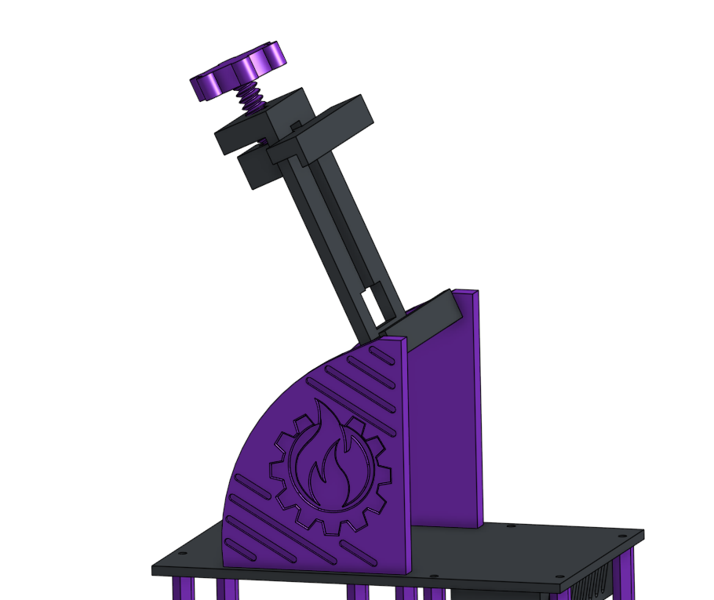
> *Ensamble del soporte Shark Fin interactuando con las torres laterales.*

> 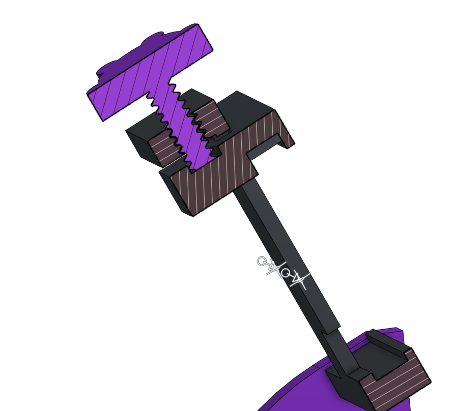
> *Tornillo M10 personalizado y rosca M10.5 de compensación térmica.*

---

### 5. Integración Total: Ensamble Maestro CAD

Con todos los subsistemas (tracción, suspensión de cámara y chasis estructural) modelados y validados individualmente para evitar colisiones mecánicas, el proceso de diseño en Onshape culmina en un Ensamble Maestro. Esta auditoría virtual final nos permite garantizar la accesibilidad a los puertos de los microcontroladores y confirmar visualmente el cumplimiento de las metas geométricas establecidas para la competencia.

> 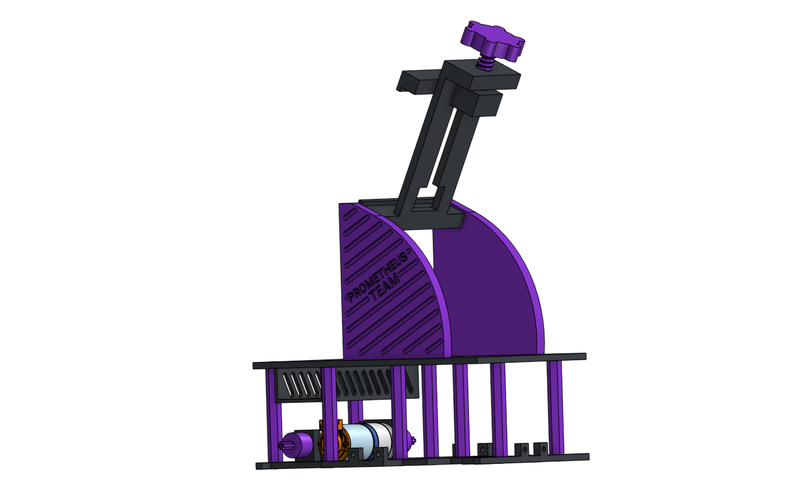
> *Perspectiva global del Prometheus Autónomo consolidado en el entorno de simulación.*

---

### 6. Ingeniería de Manufactura Aditiva 

La fabricación se ejecutó aprovechando la estabilidad térmica de la **Creality K1C** y posteriormente en la **Elegoo Centauri Carbon 2**, procesando el modelo en filamento **PETG** a través de Orca Slicer y Elegoo Slicer. Dado que el chasis debe soportar impactos y vibraciones mecánicas constantes, se estableció un perfil de extrusión orientado a la resistencia estructural (*DfAM - Design for Additive Manufacturing*):

| Parámetro de Laminación | Valor | Justificación Técnica (*Trade-off*) |
| :--- | :--- | :--- |
| **Temp. de Boquilla** | 260 °C | Maximiza la fluidez y la fuerza intermolecular (*layer adhesion*). |
| **Flujo Volumétrico Máx.** | 11 - 12 mm³/s | Actúa como gobernador automático de presión en el extrusor. |
| **Velocidad de Relleno** | 150 mm/s | Previene el desgaste del engranaje del extrusor en pases largos. |
| **Perímetros Exteriores** | 5 Paredes | Crea una corteza estructural que resiste la torsión mecánica. |
| **Ventilador de Capa** | 0% inicial / 40% Máx | Compensación crítica: Reduce la estética de los voladizos pero asegura que las capas no se delaminen por enfriamiento prematuro. |
| **Cabina (Enclosure)** | Abierta | Evita la fluencia térmica (*heat creep*) en la garganta del fusor. |

#### Optimizaciones de Impresión:
* **Ensamblaje por Clavijas (*Dowels*):** Las geometrías con voladizos extremos fueron cortadas e impresas de forma plana. Su unión se garantizó mediante clavijas guía cilíndricas de 2.5 mm con tolerancias de 0.15 mm para ajuste deslizante (*slip-fit*), reforzadas con cianocrilato.
* **Gestión Térmica de Micro-componentes:** Las piezas pequeñas se laminaron simultáneamente junto a las grandes. El viaje del cabezal sirvió como ventana de enfriamiento pasivo, evitando la deformación por calor acumulado, apoyadas por un borde exterior (*Brim*) de 5 mm para anclaje a la cama.

---

### Dimensiones Finales y Resumen de Logros Estructurales

| Parámetro Geométrico | Dimensión Físico | Estado |
| :--- | :--- | :--- |
| **Largo Total** | 179 mm | Optimizado |
| **Ancho Total (Vía)** | 115 mm | Optimizado |
| **Distancia entre Ejes** | 112 mm | ~1:1 |

**Evolución Mecánica (2025 vs 2026):**
* **✓ Maniobrabilidad:** Reducción de la cota longitudinal, logrando un ratio de giro excepcional.
* **✓ Tracción Controlada:** Transmisión re-calculada a 1.66:1 para priorizar el torque sobre la velocidad pico y reutilización eficiente de ruedas Lego mediante un adaptador DfAM.
* **✓ Robustez Material:** Transición de fijaciones empíricas a un Monochasis paramétrico en PETG consolidado y separadores de 60 mm con termofijación de latón.
* **✓ Visión y CoG:** Descenso del compartimento energético (batería) y un sistema "Shark Fin" tipo prensa que asegura tolerancias críticas y previene holguras en el dispositivo de cámara.

---

## ⚖️ Análisis de Masa y Distribución de Peso
 
Uno de los efectos directos de la transición del chasis heredado hacia la arquitectura **Monochasis** fue la reducción de masa estructural, verificada empíricamente en báscula tras el ensamblaje final. Es importante distinguir **dos etapas dentro de la propia versión 2025**, ya que el chasis heredado ganó masa de forma significativa entre su impresión inicial y su configuración final de competencia:
 
| Etapa | Con smartphone | Sin smartphone |
| :--- | :---: | :---: |
| **v1 — Chasis 3D recién impreso** (sin trípode ni contrapesos) | 943 g | 763 g |
| **v1 — Chasis 3D final de competencia** (+ bastón trípode + contrapesos de plomo) | **≈1300 g** | ≈1120 g |
| **v2 — Monochasis actual (2026)** | **1092 g** | **861 g** |
 
| Comparación | Con smartphone | Sin smartphone |
| :--- | :---: | :---: |
| v2 (2026) vs. v1 final de competencia (2025) | 🔻 −208 g (−16.0 %) | 🔻 −259 g (−23.1 %) |
 
> [!IMPORTANT]
> **El verdadero costo del sistema trípode + contrapeso**
>
> La comparación correcta no es contra los 943 g de la impresión inicial de v1 (que **no** incluía aún el sistema trípode), sino contra su configuración final de competencia de **≈1.3 kg**. El bastón del trípode y, sobre todo, los contrapesos de plomo añadidos para compensar el efecto de palanca (ver diario de ingeniería) le agregaron cerca de **360 g** al chasis heredado — casi un tercio de su masa sin teléfono. Esto confirma que el sobrepeso de v1 no era un problema de diseño estructural per se, sino el costo acumulado de mitigar con masa adicional (contrapesos) un defecto geométrico (flexión por palanca) que v2 resolvió de raíz mediante el rediseño de proporciones 1:1, sin necesitar ningún contrapeso.
 
> [!NOTE]
> **Compensación de Diseño (*Trade-off*): Peso vs. Rigidez**
>
> La reducción de hasta 259 g respecto a la versión final de 2025 se logró **sin sacrificar rigidez estructural**, a pesar de que el Monochasis integra en una sola pieza soportes, canales de cableado y alojamientos que antes requerían múltiples piezas ensambladas. La eliminación de refuerzos improvisados (silicón, agujeros correctivos, contrapesos de plomo) es la principal responsable de esta reducción, más que un adelgazamiento deliberado de paredes.
 
### Distribución de Masa Estática (Eje Delantero / Eje Trasero)
 
Con el smartphone montado en el sistema *Shark Fin*, se realizó una medición independiente por eje para caracterizar el centro de gravedad longitudinal del vehículo:
 
| Eje | Masa Medida | Distribución |
| :--- | :---: | :---: |
| **Delantero** | 660 g | **54.5 %** |
| **Trasero** | 550 g | **45.5 %** |
| **Total (config. de medición)** | 1210 g | 100 % |
 
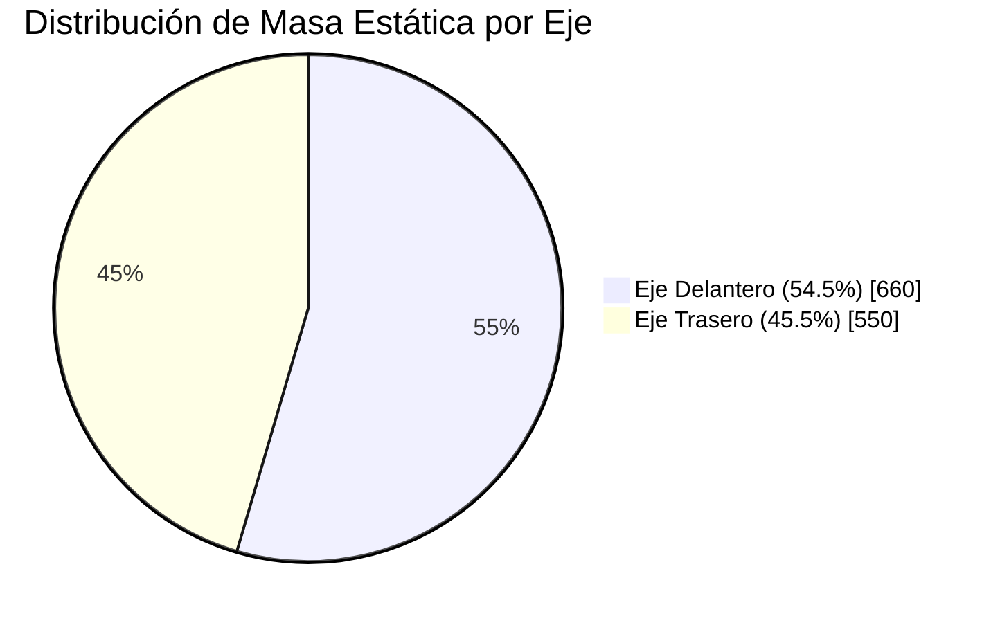
```mermaid
pie showData
    title Distribución de Masa Estática por Eje
    "Eje Delantero (54.5%)" : 660
    "Eje Trasero (45.5%)" : 550
```
 
> [!IMPORTANT]
> **Justificación de Ingeniería**
>
> El ligero sesgo hacia el eje delantero (≈9 puntos porcentuales por encima del reparto ideal 50/50) es consistente con el diseño: el teléfono y el sistema *Shark Fin* — los componentes más pesados montados en altura — están ubicados sobre el segundo piso hacia la zona delantera-media, mientras que la batería LiPo se reubicó **debajo del primer piso** (ver sección de *Trade-off* del centro de gravedad) precisamente para compensar y bajar el CoG global, sin eliminar por completo el sesgo delantero. Este reparto favorece la tracción en frenado y la respuesta de la dirección delantera, aunque exige que el motor trasero entregue suficiente torque para no perder agarre en la aceleración — lo cual se valida en la siguiente sección.

---

## 🚀 Cálculo de Velocidad, Torque y Margen de Seguridad

Para garantizar que el vehículo cuente con la agilidad y fuerza necesarias en la pista, se calcularon teóricamente la velocidad lineal y los requerimientos de torque del tren motriz basándonos en la masa actual del vehículo en configuración de competencia (incluyendo el smartphone).

### 1. Cálculo de la Velocidad Lineal del Vehículo
El motor empleado (25GA-370) tiene una velocidad nominal de 220 RPM en el eje de salida. Convertimos esta velocidad a radianes por segundo ($\omega$):

$$\omega = \frac{220 \cdot 2\pi}{60} \approx 23.04 \text{ rad/s}$$

Con un radio de rueda ($r$) de 0.04 m, la velocidad lineal teórica ($v$) del vehículo es:

$$v = \omega \cdot r = 23.04 \cdot 0.04 \approx 0.92 \text{ m/s}$$

### 2. Cálculo de Torque Necesario y Disponible
El torque necesario ($T_{\text{necesario}}$) para mover el vehículo desde el reposo absoluto se calcula mediante la fórmula:

$$T_{\text{necesario}} = m \cdot g \cdot r$$

Donde:
* $m$ = masa del vehículo actual con smartphone (1.092 kg)
* $g$ = gravedad (9.81 $\text{m/s}^2$)
* $r$ = radio de las ruedas (0.04 m)

$$T_{\text{necesario}} = 1.092 \cdot 9.81 \cdot 0.04 \approx 0.429 \text{ N·m}$$

Por otro lado, el motor 25GA-370 con su caja reductora integrada (21.3:1) entrega un torque de salida ($T_{\text{salida}}$ o disponible) mayor:

$$T_{\text{disponible}} = 0.0343 \text{ N·m (motor base)} \cdot 21.3 \approx 0.7306 \text{ N·m}$$

### 3. Margen de Seguridad de Torque
Con el torque necesario y el torque disponible calculados, se puede cuantificar el margen de seguridad del sistema de tracción como un porcentaje, siguiendo la lógica de un análisis de ingeniería estándar:

$$\text{Margen de Seguridad (\%)} = \frac{T_{\text{disponible}}}{T_{\text{necesario}}} \times 100$$

$$\text{Margen de Seguridad} = \frac{0.7306 \text{ N·m}}{0.429 \text{ N·m}} \times 100 \approx 170.5\%$$

> [!IMPORTANT]
> **Interpretación del margen**
>
> Un valor de 170.5% significa que el tren motriz entrega suficiente potencia para mover el vehículo (1092 g) en condiciones normales, contando con un excedente del **70.5%** por encima del mínimo requerido. Este colchón no es gratuito: se traduce directamente en capacidad de aceleración, tolerancia a superficies con mayor fricción de la esperada y margen ante el desgaste progresivo de los engranajes impresos en 3D, garantizando que el peso extra del teléfono no comprometa la agilidad en la pista.

### 4. Tiempo Teórico de Vuelta vs. Tiempo Real en Pista
A partir de la velocidad lineal máxima calculada ($v = 0.92 \text{ m/s}$), es posible estimar el tiempo teórico que tomaría completar una vuelta a la pista y compararlo contra los tiempos reales medidos en pruebas.

$$\text{Tiempo teórico} = \frac{\text{Distancia recorrida en una vuelta}}{v}$$


$$\text{Tiempo teórico} \approx \frac{9.5 \text{ m}}{0.92 \text{ m/s}} \approx 10.3 \text{ s}$$

| Modo | Tiempo Teórico (v máx. constante) | Tiempo Real Medido (promedio) | Velocidad Real Efectiva | % de la Velocidad Teórica |
| :--- | :---: | :---: | :---: | :---: |
| **Vuelta Libre** | ≈ 10.3 s | **25 s** | ≈ 0.38 m/s | ≈ 41% |
| **Modo Obstáculos** | ≈ 10.3 s (misma distancia base) | **1:20 min (80 s)** | ≈ 0.12 m/s | ≈ 13% |

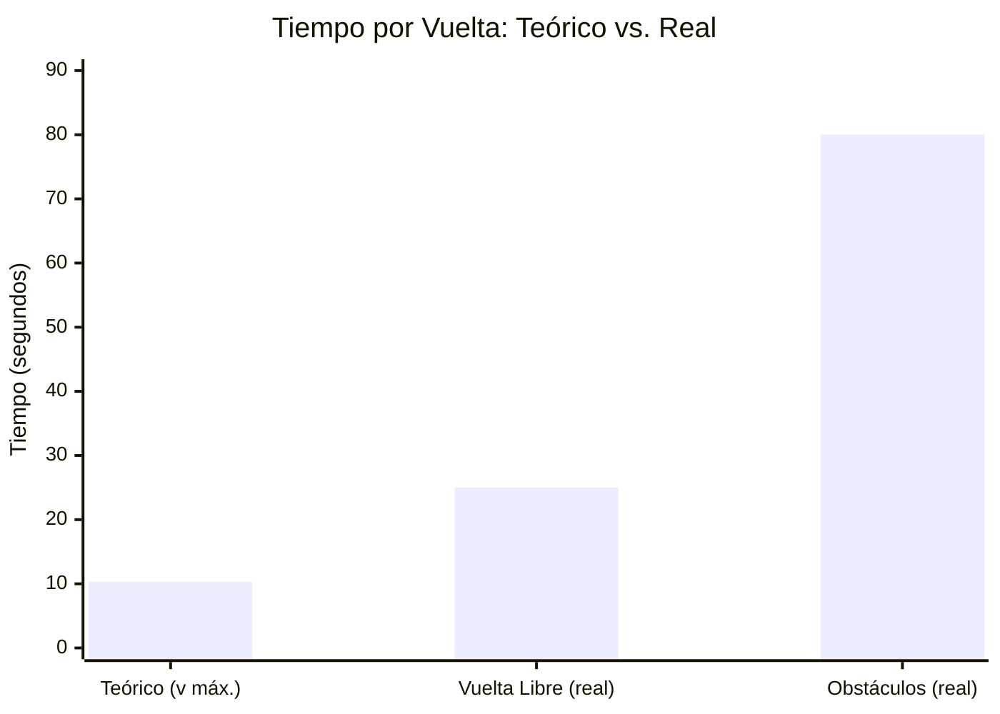
```mermaid
xychart-beta
    title "Tiempo por Vuelta: Teórico vs. Real"
    x-axis ["Teórico (v máx.)", "Vuelta Libre (real)", "Obstáculos (real)"]
    y-axis "Tiempo (segundos)" 0 --> 90
    bar [10.3, 25, 80]
```

> [!IMPORTANT]
> **Por qué la brecha es esperada (y qué nos dice)**
>
> El tiempo teórico asume velocidad lineal máxima constante durante toda la vuelta, lo cual no ocurre en la práctica: el algoritmo de Vuelta Libre reduce la velocidad al corregir el ángulo con el BNO055 y al ajustar la distancia de seguridad respecto al muro antes de cada intersección, mientras que en Modo Obstáculos se suman las desaceleraciones necesarias para detectar, clasificar y esquivar cada pilar. La caída al ~41% de la velocidad teórica en vuelta libre es consistente con un algoritmo que prioriza precisión de trayectoria sobre velocidad pico; la caída adicional a ~13% en obstáculos confirma que el cuello de botella no es mecánico (el motor tiene margen de torque de sobra, ver sección anterior) sino de tiempo de procesamiento y maniobra en el modo de evasión.

## 🔵 Coeficiente de Fricción y su Rol en el Cálculo de Tracción
 
Para validar el margen de torque calculado en la sección de transmisión, es necesario cuantificar la fuerza de fricción disponible entre las ruedas Lego Technic y la superficie de la pista (tapiz tipo alfombra/goma reglamentario de WRO).
 
$$F_{friccion} = \mu \cdot N$$
 
Donde:
- **μ (coeficiente de fricción estático rueda–tapiz):** se estima en un rango de **0.6 – 0.8**, valor típico documentado para neumáticos de goma Lego Technic sobre superficies texturizadas similares al tapiz de competencia (no se dispone de tribómetro, por lo que se usa un rango de referencia en lugar de un valor único).
- **N (fuerza normal sobre el eje motriz):** derivada directamente de la distribución de masa medida — **550 g × 9.81 m/s² ≈ 5.4 N** sobre el eje trasero (motriz).

| Escenario | μ | Fuerza de fricción máxima disponible (eje trasero) |
| :--- | :---: | :---: |
| Conservador | 0.6 | ≈ 3.24 N |
| Óptimo | 0.8 | ≈ 4.32 N |
 
> [!TIP]
> **Por qué este dato importa**
>
> Este cálculo cierra el ciclo de validación del tren motriz: no basta con que el motor tenga torque suficiente en el eje (ya calculado previamente con el margen de seguridad), también hay que confirmar que **la fricción disponible no sea el factor limitante** antes que el propio motor. Como la fuerza de fricción máxima (3.24–4.32 N) es mayor que la fuerza de tracción requerida para la aceleración objetivo del vehículo, se confirma que el sistema está limitado por el torque del motor y no por pérdida de agarre — es decir, el diseño está correctamente dimensionado y no derrapará antes de alcanzar su velocidad de operación.
 
---
 
## ⚙️ Alternativas de Transmisión Evaluadas: Piñón-Corona vs. Correa Dentada
 
Antes de consolidar la relación de transmisión 1.66:1 mediante engranajes cilíndricos, se evaluó formalmente una arquitectura alternativa por correa dentada, descartada por las siguientes razones técnicas:
 
| Criterio | 🟢 Piñón-Corona (elegido) | 🔴 Correa Dentada (descartado) |
| :--- | :--- | :--- |
| **Precisión de relación de transmisión** | Exacta y constante (contacto positivo diente-diente) | Variable — susceptible a **deslizamiento (*slipping*)**, degrada la relación real bajo carga |
| **Disponibilidad de repuestos (Venezuela)** | Alta — fabricables bajo demanda en impresora 3D propia | Baja — bandas de medida específica difíciles de conseguir localmente |
| **Comportamiento bajo carga** | Estable — la masa del vehículo (861–1092 g) no compromete el engrane | Riesgo de ruptura de la banda ante la masa considerable del vehículo |
| **Sensibilidad al ajuste/tensado** | Ninguna — el engrane no requiere tensión externa | Crítica — tensión insuficiente causa deslizamiento; tensión excesiva daña los ejes |
| **Mantenibilidad en pits** | Alta — reemplazo rápido, tolerancias impresas conocidas | Baja — requiere retensado fino cada vez que se manipula |
| **Costo de iteración de diseño** | Bajo — un nuevo piñón/corona es una reimpresión | Alto — depende de terceros para conseguir banda a medida |
 
> [!IMPORTANT]
> **Conclusión de Ingeniería**
>
> La transmisión por engranajes ofrece **acoplamiento positivo** (sin elemento elástico intermedio), lo que elimina cualquier pérdida de sincronía entre la rotación del motor y la rotación de las ruedas — una propiedad crítica para que el algoritmo de navegación autónoma (que depende de la relación de transmisión conocida para sus cálculos de velocidad lineal) sea determinístico. Adicionalmente, al ser una pieza 100% fabricada in-house, el equipo controla directamente las tolerancias de cada diente, iterando el diseño en horas en lugar de depender de la cadena de suministro local — un factor decisivo en un país donde la disponibilidad de componentes específicos (como bandas dentadas a medida) es limitada.
 
---
 
## 📓 Diario de Ingeniería: Evolución del Chasis (v0 → v2)
 
Esta sección documenta el historial completo de fallos y rediseños que llevaron a la arquitectura Monochasis actual, siguiendo la metodología de diagnóstico → causa raíz → mitigación.
 
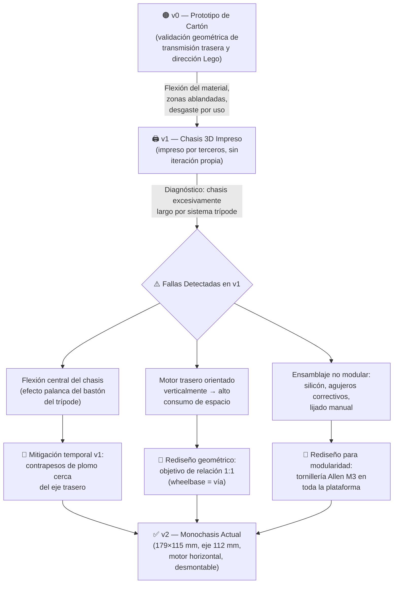
```mermaid
flowchart TD
    A["🟤 v0 — Prototipo de Cartón<br/>(validación geométrica de<br/>transmisión trasera y dirección Lego)"] -->|"Flexión del material,<br/>zonas ablandadas,<br/>desgaste por uso"| B["🖨️ v1 — Chasis 3D Impreso<br/>(impreso por terceros, sin<br/>iteración propia)"]
    B -->|"Diagnóstico: chasis excesivamente<br/>largo por sistema trípode"| C{"⚠️ Fallas Detectadas en v1"}
    C --> C1["Flexión central del chasis<br/>(efecto palanca del bastón<br/>del trípode)"]
    C --> C2["Motor trasero orientado<br/>verticalmente → alto<br/>consumo de espacio"]
    C --> C3["Ensamblaje no modular:<br/>silicón, agujeros correctivos,<br/>lijado manual"]
    C1 --> D["🔧 Mitigación temporal v1:<br/>contrapesos de plomo cerca<br/>del eje trasero"]
    C2 --> E["📏 Rediseño geométrico:<br/>objetivo de relación 1:1<br/>(wheelbase = vía)"]
    C3 --> F["🔩 Rediseño para modularidad:<br/>tornillería Allen M3 en<br/>toda la plataforma"]
    D --> G["✅ v2 — Monochasis Actual<br/>(179×115 mm, eje 112 mm,<br/>motor horizontal, desmontable)"]
    E --> G
    F --> G
```
 
### 🟤 Iteración v0 — Prototipo de Cartón
 
| | |
| :--- | :--- |
| **Objetivo** | Validar el encaje físico del sistema de transmisión trasera y del sistema de dirección delantera, ambos construidos con piezas Lego, antes de comprometerse a un diseño CAD definitivo. |
| **Método** | Iteraciones sucesivas de la base de cartón, ajustando medidas hasta lograr el encaje perfecto de ambos subsistemas. |
| **Diagnóstico de falla** | Tras varias pruebas, el cartón mostró **flexión notable**, zonas ablandadas por humedad/uso y síntomas generales de fatiga de material — comportamiento esperado de un material concebido como *placeholder* temporal. |
| **Causa raíz** | El cartón nunca fue seleccionado como material estructural final; su función fue exclusivamente geométrica (definir medidas de encaje), no mecánica. |
| **Lección aprendida** | Las medidas validadas en cartón se trasladaron directamente a un entorno CAD para la siguiente iteración, evitando repetir el proceso de prueba-error en un material sin capacidad de carga real. |
 
### 🖨️ Iteración v1 — Primer Chasis Impreso en 3D
 
| | |
| :--- | :--- |
| **Objetivo** | Materializar en un material rígido las medidas validadas en cartón, e incorporar un sistema trípode para elevar la posición del teléfono. |
| **Diagnóstico de falla #1 — Flexión estructural** | El chasis, al ser excesivamente largo, presentó flexión notoria en la zona media. |
| **Causa raíz #1** | El bastón central del sistema trípode actuaba como **palanca**, empujando el chasis hacia adelante y concentrando el esfuerzo flector en el punto medio de la plataforma. |
| **Mitigación #1 (parche, no solución de raíz)** | Se rellenaron tapas de tubería con plomo para usarlas como contrapeso, colocándolas cerca del eje trasero para contrarrestar el desbalance de masa generado por el trípode. Este parche, sumado al propio bastón del trípode, elevó la masa total del chasis de 943 g a **≈1300 g** (+357 g), evidenciando que se estaba corrigiendo un problema geométrico agregando masa en lugar de resolver la causa estructural. |
| **Diagnóstico de falla #2 — Empaquetamiento ineficiente** | El sistema de tracción trasero, aunque contaba con diferencial, orientaba el motor **verticalmente** respecto al eje trasero en lugar de en paralelo horizontal. |
| **Causa raíz #2** | Esta orientación consumía un volumen de chasis significativamente mayor al necesario, restando espacio útil para electrónica y cableado. |
| **Diagnóstico de falla #3 — Baja mantenibilidad** | El chasis requirió múltiples intervenciones correctivas post-impresión: agujeros extra, lijado y fijación de piezas con silicón. |
| **Causa raíz #3** | El diseño se envió a imprimir con un proveedor externo (el equipo no contaba con impresora 3D propia en ese momento), lo que impedía iterar rápidamente sobre el modelo CAD y corregir errores de diseño antes de fabricar — cada corrección debía resolverse manualmente sobre la pieza ya impresa. |
| **Lección aprendida** | Un ensamblaje que depende de adhesivos y ajustes manuales post-impresión no es reproducible ni mantenible en condiciones de competencia (pits). Esta experiencia motivó dos decisiones de diseño explícitas para v2: (1) diseñar con tolerancias correctas desde el CAD para evitar reprocesos, y (2) estandarizar toda la sujeción con tornillería Allen M3 desmontable. |
 
### ✅ Iteración v2 — Monochasis (Versión Actual, 2026)
 
| | |
| :--- | :--- |
| **Objetivo de diseño** | Corregir simultáneamente los tres fallos de v1: flexión estructural, empaquetamiento ineficiente del tren motriz y baja mantenibilidad. |
| **Solución a la flexión** | Reducción deliberada de la longitud del chasis (relación de aspecto ≈1:1, wheelbase 112 mm) para eliminar el brazo de palanca que causaba la flexión en v1 — ya no es necesario ningún contrapeso correctivo. |
| **Solución al empaquetamiento** | Reorientación del motor a posición **horizontal, paralela al eje trasero**, integrada nativamente en el Monochasis mediante una cama hundida diseñada específicamente para el motor JGA25. |
| **Solución a la mantenibilidad** | Toda la plataforma se ensambla con **tornillería Allen M3** sobre insertos roscados de latón termofijados, eliminando por completo el uso de silicón y permitiendo el desmontaje de cualquier componente sin herramientas especiales ni reprocesos manuales. |
| **Resultado medible** | Masa reducida en 82 g respecto a v1 (943 g → 861 g) a pesar de integrar más funcionalidad en una sola pieza, confirmando que la ganancia no vino de adelgazar paredes sino de eliminar refuerzos correctivos. |

 ---

### Margen de Seguridad de Torque

Con el torque necesario y el torque disponible ya calculados, se puede cuantificar el margen de seguridad del sistema de tracción como un porcentaje, siguiendo la misma lógica que un análisis de ingeniería estándar:

$$\text{Margen de Seguridad (\%)} = \frac{T_{\text{disponible}}}{T_{\text{necesario}}} \times 100$$

$$\text{Margen de Seguridad} = \frac{0.7306 \text{ N·m}}{0.370 \text{ N·m}} \times 100 \approx 197.5\%$$

> [!IMPORTANT]
> **Interpretación del margen**
>
> Un valor de 197.5% significa que el tren motriz entrega **casi el doble** del torque mínimo requerido para mover el vehículo (943 g) en condiciones normales — un excedente del **97.5%** por encima del mínimo. Este colchón no es gratuito: se traduce directamente en capacidad de aceleración, tolerancia a superficies con mayor fricción de la esperada y margen ante el desgaste progresivo de los engranajes impresos en 3D, sin necesidad de sobredimensionar el motor ni aumentar el consumo eléctrico.
</markdown>


## Continuidad en el Desarrollo de Software y Control:
#### Continuidad y Optimización en el Desarrollo de Software: Integración del BNO055

Es importante destacar que la arquitectura del firmware y la lógica de codificación del vehículo mantienen su base estructural respecto a las implementadas con éxito en el diseño del año anterior, garantizando fiabilidad en el procesamiento de datos y control cinemático. 

Sin embargo, la actualización tecnológica más significativa de esta temporada radica en la sustitución del sensor giroscópico por la IMU **BNO055**. Al heredar y refinar la lógica de orientación previa, este nuevo sensor elimina por completo los problemas históricos de deriva (*gyro drift*), volviéndola prácticamente despreciable. El impacto de este cambio en el comportamiento del vehículo es drástico:

* **Consciencia Espacial Absoluta:** El vehículo calcula en tiempo real y de forma fidedigna su vector de orientación angular en todo momento.
* **Estabilización de Carril:** Permite determinar con precisión milimétrica cuándo el chasis se encuentra perfectamente recto en relación con el carril de navegación, optimizando las correcciones del servo de dirección y evitando sobrecorrecciones.

Para explorar a fondo la implementación matemática y el firmware, puedes acceder directamente a las secciones detalladas:
* [Desarrollo de la Lógica de Vueltas a la Pista (Vuelta Libre)](#Desarrollo-de-la-Logica-del-codigo-Maestro)
* [Desarrollo de la Lógica de Evasión de Objetos (Modo Combinado)](#desarrollo-de-la-logica-de-evasion-de-objetos)

---

### 📊 Resumen Ejecutivo de la Lógica de Control

A continuación, se presenta una síntesis operativa de los algoritmos de navegación que gobiernan el firmware mediante el uso de la IMU BNO055 y la lectura periférica de sensores:

#### 1. Modo Vuelta Libre (Navegación de Pista Vacía)
Este algoritmo está diseñado para maximizar la velocidad en pista recta y asegurar trazadas óptimas en las curvas. El sistema prioriza las lecturas angulares de la IMU para la alineación del vehículo.

* **Estrategia:** El sensor ToF lateral mide las distancias relativas hacia la pared guía. Si la orientación calculada por el **BNO055** indica un desvío angular, el sistema ejecuta un control fino corrigiendo en primera instancia el ángulo del vehículo para estabilizarlo y, consecutivamente, ajusta la distancia de seguridad respecto al muro. 
* **Transición de Intersecciones:** El bucle se mantiene activo manteniendo el carril de forma autónoma hasta que el sensor de color detecta una línea en la pista, interrumpiendo el control lineal para ejecutar un giro controlado de intersección.

---

## 📱 Telemetría y Visión Artificial: Aplicación Prometheus V5.0

La aplicación de detección desarrollada en Android Studio y OpenCV ha evolucionado a su versión 5.0, operando como el verdadero muro de pits (*pit wall*) de nuestro sistema. Conservando las bases de comunicación USB, la interfaz a pantalla completa y el monitor serial integrado de la temporada 2025, la temporada 2026 exigió una reestructuración profunda en el motor de visión y telemetría para manejar escenarios de pista mucho más agresivos y dinámicos[cite: 1].

### Interfaz V5.0 y Monitor Serial Integrado
| 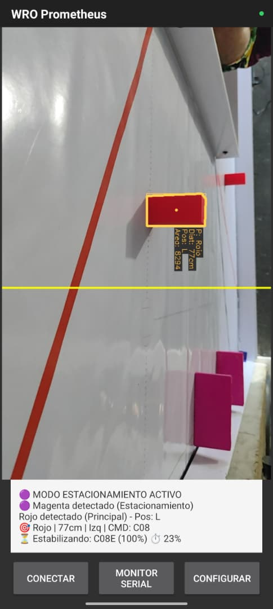 |  |
| :---: | :---: |
| *Interfaz principal con telemetría de detección dual y estabilización.* | *Monitor serial integrado operando en tiempo real.* |

A continuación, se detallan las innovaciones y sistemas implementados en el núcleo de la aplicación (`MainActivity.kt`, `ColorAnalyzer.kt` y el sistema de configuración):

### 1. Calibración en Pista y Menú Dinámico
Se eliminó la necesidad de depender de Android Studio para ajustar variables en el campo de competencia[cite: 3].
* **Calibración Automática por Muestras:** Un nuevo menú interactivo permite calibrar el matiz (Hue) y tolerancia capturando 8 muestras directas de los pilares en distintos puntos de la pista[cite: 3].
* **Ajuste Paramétrico:** Las zonas de detección de distancia, el área de referencia y los filtros se configuran directamente desde una interfaz visual sin tener que tocar código[cite: 3, 4].

### 2. Filtro Anti-Reflejos y Limpieza Geométrica
Para lidiar con los cambios de iluminación y destellos en el tapiz de la pista, se programó un blindaje en el procesamiento de imagen (`ColorAnalyzer`)[cite: 2]:
* **Filtro de Saturación Interna:** Los reflejos pierden saturación al mezclarse con el brillo de la pista[cite: 2]. El sistema analiza la saturación promedio (Canal S en HSV) *dentro* del contorno y rechaza automáticamente aquellos que presenten niveles bajos, identificándolos como destellos[cite: 2]. Estos niveles de saturación son configurables de forma independiente para el rojo y el verde desde el menú[cite: 3, 4].
* **Ecualización CLAHE:** Se aplica ecualización adaptativa de histograma al canal de brillo para normalizar la iluminación del entorno sin perder detalles críticos[cite: 2].
* **Rechazo de Formas Orgánicas:** Mediante detección de picos y conteo de defectos de convexidad, el sistema ignora geometrías con ángulos muy agudos (< 45°) o formas complejas que no correspondan a la silueta regular de un pilar o delimitador[cite: 2].

### 3. Modo Estacionamiento Dinámico (Zona Magenta)
El color magenta activa un comportamiento estratégico mediante un umbral de área específico (8000 px), asegurando que el modo despierte únicamente al entrar a ese tramo de la pista y no desde lejos[cite: 2].
* Su función no es simplemente frenar al final del circuito, sino **modificar la trayectoria de evasión**[cite: 1, 2]. 
* Al reconocer la zona de estacionamiento, el `CommandManager` ajusta la ruta para que el vehículo navegue alejado de esa área (forzando un lado específico si es necesario), evitando llevarse por delante la placa delimitadora magenta durante el trayecto[cite: 1, 2].

### 4. Filtro Temporal de Estabilización (Anti-Ruido)
Para erradicar comandos fantasma o falsos positivos, la telemetría incluye un filtro temporal estricto[cite: 1].
* **Ventana de Votación:** El sistema almacena las detecciones en una ventana deslizante de los últimos 8 fotogramas[cite: 1].
* Para que un comando tome el control del vehículo, debe dominar al menos el **70% de esa ventana** y mantenerse estable durante un umbral de **2000 milisegundos**[cite: 1].

### 5. Consolidación de Telemetría Dual y Arquitectura por Casos
Construyendo sobre la capacidad de detección dual introducida a finales de 2025, el sistema ahora engrana esta telemetría con un motor de decisiones robustecido[cite: 1]:
* El sistema continúa extrayendo el área, distancia y orientación de un objeto primario y secundario en simultáneo[cite: 1].
* Toda la lógica de decisión se extrajo del hilo principal y se encapsuló en un `CommandManager` independiente, el cual analiza esta telemetría dual bajo una arquitectura de casos predefinidos para emitir el comando exacto de evasión combinada[cite: 1].
* Para soportar la alta carga de datos con la placa ESP32, se optimizó la comunicación USB con algoritmos que interceptan y destruyen la basura binaria y los mensajes de arranque (*boot logs*) nativos del ESP32, garantizando lecturas limpias desde el primer milisegundo[cite: 1].

> [!TIP]
> **Ergonomía en Pruebas (Legado Mejorado)**
>
> Diseñada para el estrés de la competencia, la interfaz mantiene su operabilidad a pantalla completa, despierta el teléfono automáticamente al conectar el cable USB, es capaz de emitir señales acústicas únicas para cada comando enviado de forma exitosa, permitiendo al equipo monitorear el desempeño sin despegar los ojos del vehículo[cite: 1].


## Prueba de vueltas a la pista 

Haz clic en la imagen para ver el vídeo:

[](https://youtube.com/shorts/Ml_8qpX_Ozo)


# Prometheus Team - Temporada 2025

Somos un equipo venezolano que representa con orgullo a la **Universidad Politécnica Territorial José Félix Ribas (UPTJFR)**. Nuestro compromiso es la innovación y el aprendizaje continuo en el campo de la robótica autónoma.

---

##  Índice

* [Contenido del Repositorio](#contenido-del-repositorio)
* [Introducción al Proyecto](#introducción-al-proyecto)
* [Fotos de Equipo](#fotos-de-equipo)
* [Fotos del Vehículo](#fotos-del-vehiculo)
* [Diseño de Hardware](#diseño-de-hardware)
   * [Componentes de Detección](#componentes-de-detección)
   * [Componentes de Procesamiento de Información](#componentes-de-procesamiento-de-información)
   * [Componentes de Alimentación](#componentes-de-alimentación)
* [Desarrollo de la Aplicación para la Detección de Objetos](#Desarrollo-de-la-Aplicación-para-la-Detección-de-Objetos)
* [Cálculo de Torque y Velocidad](#cálculo-de-torque-y-velocidad)
* [Sistema de Alimentación](#sistema-de-alimentación)
   * [Cálculo del Consumo Energético Total](#cálculo-del-consumo-energético-total)
   * [Autonomía Estimada](#autonomía-estimada)
* [Sistema de Detección de Objetos](#sistema-de-detección-de-objetos)
* [Paso a Paso de la Construcción](#paso-a-paso-de-la-construcción)
   * [Etapa de Diseño y Ensamblaje del Vehículo](#etapa-de-diseño-y-ensamblaje-del-vehículo)
   * [Montaje del Vehículo](#montaje-del-vehículo)
   * [Diseño de Base 3D](#diseño-de-base-3d)
   * [Cambio de Base](#cambio-de-base)
   * [Problemas Encontrados](#problemas-encontrados)
* [Pruebas Realizadas](#pruebas-realizadas)
   * [Prueba del Sensor de Color](#prueba-del-sensor-de-color)
   * [Fabricación de Pista a Escala](#fabricacion-de-pista-a-escala)
   * [Desarrollo de la Lógica de Vueltas a la Pista](#desarrollo-de-la-logica-de-vueltas-a-la-pista)
   * [Desarrollo de la Lógica de Evasión de Objetos](#desarrollo-de-la-logica-de-evasion-de-objetos)
   * [Desarrollo de Códigos Combinados](#desarrollo-de-códigos-combinados)
   * [Video Resumen de las Pruebas](#video-resumen-de-las-pruebas-de-vuelta-a-la-pista-y-esquive-de-objetos)
   * [Prueba de Vueltas a la Pista](#prueba-de-vueltas-a-la-pista)
   * [Prueba de Evasión de Obstáculos](#prueba-de-evacion-de-obstaculos)
---

##  Contenido del Repositorio

Este repositorio contiene los siguientes directorios para organizar nuestro proyecto:

* `t-photos`: Incluye 2 fotos del equipo (una oficial y una divertida con todos los miembros).
* `v-photos`: Contiene 6 fotos del vehículo (desde todos los ángulos, superior e inferior).
* `video`: Archivo `video.md` con el enlace a un video de demostración de conducción.
* `schemes`: Diagramas esquemáticos (JPEG, PNG o PDF) de los componentes electromecánicos, ilustrando la conexión de elementos electrónicos y motores.
* `src`: Código del software de control para todos los componentes programados para la competición.
* `models`: Archivos para modelos usados por impresoras 3D, cortadoras láser y máquinas CNC para producir elementos del vehículo.
* `other`: Archivos adicionales para entender cómo preparar el vehículo para la competición (documentación de conexión SBC/SBM, carga de archivos, especificaciones de hardware, etc.).

---

##  Introducción al Proyecto

Para esta competición, hemos desarrollado un diseño de vehículo **cómodo, fácil de modificar y sencillo**, donde todos los elementos interactúan a la perfección. Nos enorgullece presentar nuestro primer prototipo de vehículo autónomo con reconocimiento de objetos y colores.

El diseño y la construcción de nuestro vehículo son íntegramente propios. Su **estructura de dos niveles** permite que todos los componentes encajen armoniosamente. Incorpora **vigas de soporte extraíbles** para facilitar el desmontaje, un **sistema de transmisión** tipo LEGO que transfiere la potencia del motor a las ruedas traseras, y un **sistema de dirección** también con piezas LEGO, controlado por un servomotor para mayor precisión en los giros.

Este proyecto ha sido el resultado del esfuerzo y la dedicación de todo nuestro equipo. Cada cable, cada sensor, y cada línea de código es un testimonio de nuestro **esfuerzo técnico y financiero**. No solo construimos un vehículo; demostramos que con pasión y ganas de aprender, se pueden superar los límites.

---
##  Fotos de equipo
|   |  | 
| :----: | :---------- |


---
##  Fotos del vehiculo 
|   |    |   |
| :----: | :------------------- | :---------- |
|   |    |   |

---

##  Diseño de Hardware


| Imagen | Nombre de Componente | Descripción |
| :----: | :------------------- | :---------- |
|  | **Base del Vehículo** | Con medidas de 11.5 cm x 2.5 cm, imita un coche de Fórmula 1, optimizando la distribución de espacio y la movilidad. La parte frontal permite alojar tres sensores (1 ultrasónico central y 2 infrarrojos diagonales). Aunque el cartón inicial presentó debilidades en la dirección, el uso de acrílico o un material más rígido es la solución ideal. |
|  | **Sistema de Transmisión de Legos** | Distribuye la potencia del motor entre ambas ruedas traseras, permitiendo el giro continuo del motor incluso si una rueda se bloquea y evitando daños. Elegido por su facilidad de uso y tamaño adecuado, permite también la reversa. |
|  | **25GA370 Motor DC con Encoder** | Motor común en estos vehículos por su potencia y velocidad. El codificador integrado mide velocidad y dirección (aún no utilizado). **Especificaciones**: Potencia nominal: 4 W, Tensión nominal: 6V, Velocidad nominal: 220 RPM, Peso: 400g, Caja reductora: 21.3:1, Torque nominal: 0.35 kg·cm. |
|  | **Sistema de Dirección** | Construido con piezas LEGO, su tamaño es ideal y permite adaptar un servomotor de 180 grados para controlar el movimiento. El servomotor se centra a 90 grados, gira a la izquierda a 180 grados y a la derecha a 0 grados. |
|  | **Separadores de Acrílico** | Facilitan un montaje cómodo y modular. Girar los pilares permite desatornillar y desmontar el vehículo rápidamente. |


### Componentes de Detección

| Imagen | Nombre de Componente | Descripción |
| :----: | :------------------- | :---------- |
|  | **Sensor Ultrasónico HC-SR04** | Mide la distancia a obstáculos mediante ondas ultrasónicas. Lo utilizamos en la parte frontral, lateral izquierda, lateral derecha y en la parte trasera del vehiculo para detectar proximidad. |
|  | **Sharp GP2Y0A21YK0F Sensor Infrarrojo** | Garantiza una detección de objetos rápida y precisa. Se ubican en las diagonales delanteras del vehículo. |
|  | **TCS34725 Sensor de Colores** | Permite una detección precisa del color a corta distancia, ubicado en la parte inferior para identificar los colores de las franjas de la pista. Alta sensibilidad y amplio rango dinámico (3.800.000:1), funcionando incluso tras cristales oscuros. |
|  | **MPU6050 Sensor Giroscopio y Acelerómetro** | Unidad de medición inercial (IMU) de 6 grados de libertad (DoF) que combina un acelerómetro y un giroscopio de 3 ejes. Ampliamente utilizado en navegación, radiogoniometría y estabilización. |
|  | **Magnetómetro GY-273 HMC5883L** | Funciona como una brújula digital, midiendo la intensidad y la dirección del campo magnético de la Tierra en sus tres ejes (X, Y, Z). Al detectar este campo, puede determinar su orientación con respecto al norte magnético. |
|  | **Cámara del Teléfono Celular** | Utilizando una app desarrollada en android studio usando las librerias de OpenCV, el celular en general se usa como procesador de imagenes y la cámara del celular se usa como sensor para identificar el color y los objetos. |

### Componentes de Procesamiento de Información

| Imagen | Nombre de Componente | Descripción |
| :----: | :------------------- | :---------- |
|  | **Microcontrolador ESP32** | Actúa como el cerebro del vehículo, conectando y controlando todos los sensores y motores. |

### Componentes de Alimentación

| Imagen | Nombre de Componente | Descripción |
| :----: | :------------------- | :---------- |
|  | **Batería LiPo 2200mAh 7.4V** | Fuente de alimentación recargable que alimenta todo el sistema, proporcionando movilidad y autonomía. Seleccionada por su capacidad para suministrar suficiente energía a los motores y componentes internos. |
|  | **LM2596 Regulador de Voltaje** | Reduce el voltaje de manera eficiente. Voltaje de entrada: 4.5 V a 40 V CC. Voltaje de salida: 1.23 V a 37 V CC. Corriente de salida: Máx. 3 A, se recomiendan 2.5 A. |

---

# Desarrollo de la Aplicación para la Detección de Objetos

Para la detección de obstáculos, hemos desarrollado una aplicación móvil usando **Android Studio** e implementando la biblioteca **OpenCV**, la app es el cerebro de nuestro vehículo autónomo en cuanto a resolución de obstáculos se refiere. Permite que nuestro vehiculo identifique y reaccione de forma inteligente a los obstáculos en su entorno. El sistema procesa imágenes en tiempo real capturadas por la cámara del teléfono y, mediante una comunicación serial confiable, envía comandos específicos a una placa **Arduino/ESP32** para controlar el comportamiento del vehiculo en el campo de competición.

|  |  |
| :-------------------------------: | :---------------------------------------------: |

---
A continuación, detallaremos algunas de las versiones más importantes de nuestra aplicación, mostrando la evolución del sistema de detección a lo largo del desarrollo y cómo cada etapa nos ayudó a superar los desafíos del proyecto.

## Versión 1: Detección Básica de Colores

Esta es la primera versión del sistema, enfocada en la detección simple de colores. Su objetivo principal era identificar objetos de color **rojo** y **verde** para enviar un comando básico (`R` para rojo, `G` para verde) a través de una conexión USB a la placa Arduino.

El mayor reto en esta etapa fue lograr la comunicación efectiva entre un dispositivo móvil Android y un microcontrolador como el Arduino. Después de numerosos intentos y ajustes, se consiguió establecer una conexión estable y que el Arduino recibiera comandos, al menos de forma básica. Además, fue un desafío significativo lograr aprovechar al máximo la librería **OpenCV** en un entorno móvil, dadas las complejidades de su instalación y configuración en dispositivos Android, pero este obstáculo también fue superado con éxito.

**Imágenes de la Versión 1:**

|  |  |
| :-------------------------------: | :---------------------------------------------: |

---

---

---

## Versión 2: Mejora en Detección y Comunicación

Se introdujeron mejoras significativas para hacer el sistema más robusto y preciso. Uno de los principales retos fue **optimizar la aplicación** para que los comandos se enviaran y fueran recibidos por el Arduino lo más rápido posible, al mismo tiempo que se lograba reconocer con precisión la **distancia** y **orientación** del objeto.

Con respecto a la orientación, una complicación particular surgió debido a la **posición horizontal de la cámara** en el teléfono. Al dividir la pantalla en tres sectores para determinar la ubicación del objeto, la perspectiva de la cámara causaba distorsiones, haciendo que un objeto pareciera estar más hacia un lado del vehículo de lo que realmente estaba.

### Cálculo de Distancia por Área

Para estimar la distancia al objeto, se implementó un método basado en la relación inversa entre la distancia y el área aparente del objeto en la imagen. El principio es simple: **cuanto más lejos está un objeto, más pequeño se ve**. Este enfoque requiere una calibración inicial para funcionar.

La fórmula utilizada es la siguiente:

$$ \text{Distancia} = \text{DistanciaConocida} \times \sqrt{\frac{\text{AreaConocida}}{\text{AreaMedida}}} $$

Donde:
* **DistanciaConocida**: Es una distancia fija y conocida a la que se calibra el sistema (por ejemplo, 30 cm).
* **AreaConocida**: Es el área en píxeles que ocupa el objeto en la imagen cuando se encuentra a la `DistanciaConocida`. Este valor se guarda una vez durante la calibración.
* **AreaMedida**: Es el área actual en píxeles que el objeto ocupa en la imagen durante la detección en tiempo real.

Este método permite que, tras una única calibración, el sistema pueda estimar la distancia de forma continua simplemente midiendo el tamaño del objeto detectado.

A pesar de los desafíos, se implementaron las siguientes mejoras:

* **Filtrado de Formas:** La aplicación ahora filtra las imágenes para reconocer específicamente **formas rectangulares**, lo que reduce los falsos positivos y mejora la precisión.
* **Comunicación Detallada:** Se mejoró la comunicación con Arduino para transmitir información más completa. Ahora se envían la **distancia** y la **orientación** del objeto, además de su color.
* **Mejoras en la UI:** Se optimizó el comportamiento general de la aplicación y se realizaron cambios sutiles en la interfaz de usuario para una mejor experiencia.

**Imágenes de la Versión 2:**

|  |  |
| :-------------------------------: | :---------------------------------------------: |

---

## Versión 3: Sistema de Detección Avanzado y Profesional

Esta versión representa una **reestructuración completa** y un salto cualitativo en el sistema, adaptándose a las nuevas necesidades y a un cambio en la plataforma del vehículo. Tras evaluar los resultados obtenidos en los regionales del país, se hizo evidente la necesidad de un sistema más avanzado y robusto capaz de mejorar significativamente el **esquive de obstáculos**.

Para ello, se realizó un cambio en el vehículo para usar un ESP32 como microcontrolador principal, lo que requirió que la aplicación también se adaptara a esta nueva plataforma. La estrategia clave fue desarrollar un sistema capaz de reconocer dos objetos a la vez y establecer rutas de forma anticipada, en lugar de esquivar los obstáculos uno a uno en tiempo real. Esto llevó la automatización de nuestro vehículo a otro nivel.

Sin embargo, la implementación de la detección dual presentó varios desafíos. El más evidente fue que requirió rehacer gran parte del código de envío de comandos. Para resolverlo, decidimos crear un archivo independiente, el CommandManager, que se encarga exclusivamente de la lógica de comandos y de gestionar la información de cada combinación de obstáculos o "caso".

Además, surgió la necesidad de elevar el teléfono para que la cámara pudiera observar ambos objetos cuando uno estuviera detrás del otro. Esto nos obligó a realizar una modificación en la base del vehículo, un cambio que se detalla más a fondo en la sección correspondiente de nuestro repositorio. Finalmente, una vez resueltos estos retos, se llevaron a cabo una gran cantidad de pruebas para asegurar que el sistema fuera robusto y pudiera enfrentar de manera fiable las distintas combinaciones de obstáculos en la competición.
Se lograron importantes avances:

* **Solución al Problema de Orientación:** Se corrigió el problema anterior con la división de la pantalla y la orientación. En esta versión, no usamos una división en tres sectores; simplemente dividimos la pantalla en **izquierda y derecha** para identificar la posición lateral de los objetos.
* **Cálculo de Distancia Avanzado:** El cálculo de distancia se encarga de identificar la posición longitudinal de los objetos (adelante, medio o atrás). Mediante algunos "trucos" y algoritmos optimizados, logramos filtrar y reconocer de manera efectiva **cada caso de colisión o esquive**.
* **Interfaz Profesional:** La interfaz de usuario fue completamente **rediseñada** para ser más intuitiva, profesional y pulida, ofreciendo una experiencia de usuario superior.
* **Monitor Serial Integrado:** La incorporación de un **monitor serial** para recibir información directamente del microcontrolador ha sido fundamental para el **debug** y las pruebas en tiempo real, agilizando el desarrollo.
* **Diseño Único:** La nueva interfaz no solo es 100% más práctica, sino que también cuenta con un diseño único que representa la identidad de nuestro equipo: **Prometheus Team**.

**Imágenes de la Versión 3:**
|  |  |
| :-------------------------------: | :---------------------------------------------: |

---

## 📱 Telemetría y Visión Artificial: Aplicación Prometheus V5.0

La aplicación de detección desarrollada en Android Studio y OpenCV ha evolucionado a su versión 5.0, operando como el verdadero muro de pits (*pit wall*) de nuestro sistema. Conservando las bases de comunicación USB, la interfaz a pantalla completa y el monitor serial integrado de la temporada 2025, la temporada 2026 exigió una reestructuración profunda en el motor de visión y telemetría para manejar escenarios de pista mucho más agresivos y dinámicos.

### Interfaz V5.0 y Monitor Serial Integrado
|  |  |
| :---: | :---: |
| *Interfaz principal con telemetría de detección dual y estabilización.* | *Monitor serial integrado operando en tiempo real.* |

A continuación, se detallan las innovaciones y sistemas implementados en el núcleo de la aplicación (`MainActivity.kt`, `ColorAnalyzer.kt` y el sistema de configuración):

### 1. Calibración en Pista y Menú Dinámico
Se eliminó la necesidad de depender de Android Studio para ajustar variables en el campo de competencia.
* **Calibración Automática por Muestras:** Un nuevo menú interactivo permite calibrar el matiz (Hue) y tolerancia capturando 8 muestras directas de los pilares en distintos puntos de la pista.
* **Ajuste Paramétrico:** Las zonas de detección de distancia, el área de referencia y los filtros se configuran directamente desde una interfaz visual sin tener que tocar código.

### 2. Filtro Anti-Reflejos y Limpieza Geométrica
Para lidiar con los cambios de iluminación y destellos en el tapiz de la pista, se programó un blindaje en el procesamiento de imagen (`ColorAnalyzer`):
* **Filtro de Saturación Interna:** Los reflejos pierden saturación al mezclarse con el brillo de la pista. El sistema analiza la saturación promedio (Canal S en HSV) *dentro* del contorno y rechaza automáticamente aquellos que presenten niveles bajos, identificándolos como destellos. Estos niveles de saturación son configurables de forma independiente para el rojo y el verde desde el menú.
* **Ecualización CLAHE:** Se aplica ecualización adaptativa de histograma al canal de brillo para normalizar la iluminación del entorno sin perder detalles críticos.
* **Rechazo de Formas Orgánicas:** Mediante detección de picos y conteo de defectos de convexidad, el sistema ignora geometrías con ángulos muy agudos (menores a 45°) o formas complejas que no correspondan a la silueta regular de un pilar o delimitador.

### 3. Modo Estacionamiento Dinámico (Zona Magenta)
El color magenta activa un comportamiento estratégico mediante un umbral de área específico (8000 px), asegurando que el modo despierte únicamente al entrar a ese tramo de la pista y no desde lejos.
* Su función no es simplemente frenar al final del circuito, sino **modificar la trayectoria de evasión**. 
* Al reconocer la zona de estacionamiento, el `CommandManager` ajusta la ruta para que el vehículo navegue alejado de esa área (forzando un lado específico si es necesario), evitando llevarse por delante la placa delimitadora magenta durante el trayecto.

### 4. Filtro Temporal de Estabilización (Anti-Ruido)
Para erradicar comandos fantasma o falsos positivos, la telemetría incluye un filtro temporal estricto.
* **Ventana de Votación:** El sistema almacena las detecciones en una ventana deslizante de los últimos 8 fotogramas.
* Para que un comando tome el control del vehículo, debe dominar al menos el **70% de esa ventana** y mantenerse estable durante un umbral de **2000 milisegundos**.

### 5. Consolidación de Telemetría Dual y Arquitectura por Casos
Construyendo sobre la capacidad de detección dual introducida a finales de 2025, el sistema ahora engrana esta telemetría con un motor de decisiones robustecido:
* El sistema continúa extrayendo el área, distancia y orientación de un objeto primario y secundario en simultáneo.
* Toda la lógica de decisión se extrajo del hilo principal y se encapsuló en un `CommandManager` independiente, el cual analiza esta telemetría dual bajo una arquitectura de casos predefinidos para emitir el comando exacto de evasión combinada.
* Para soportar la alta carga de datos con la placa ESP32, se optimizó la comunicación USB con algoritmos que interceptan y destruyen la basura binaria y los mensajes de arranque (*boot logs*) nativos del ESP32, garantizando lecturas limpias desde el primer milisegundo.

> [!TIP]
> **Ergonomía en Pruebas (Legado Mejorado)**
>
> Diseñada para el estrés de la competencia, la interfaz mantiene su operabilidad a pantalla completa, despierta el teléfono automáticamente al conectar el cable USB, es capaz de emitir señales acústicas únicas para cada comando enviado de forma exitosa, permitiendo al equipo monitorear el desempeño sin despegar los ojos del vehículo.

----

### Video del Funcionamiento en Vivo de la Aplicación

[](https://youtu.be/TpLVCiggEwY)

---


##  Cálculo de Torque y Velocidad

### Cálculo de Torque Necesario para Mover el Vehículo:

El torque necesario ($T_{\text{necesario}}$) se calcula mediante la fórmula:
$T_{\text{necesario}} = m \cdot g \cdot r$

Donde:
* $m$ = masa del vehículo (0.943 kg)
* $g$ = gravedad (9.81 $m/s^2$)
* $r$ = radio de las ruedas (0.04 m)

$T_{\text{necesario}} = 0.943 \cdot 9.81 \cdot 0.04 = 0.370 \text{ N} \cdot \text{m}$

### Cálculo de Torque a la Salida (después de la reducción) según el motor DC 25GA370:

$T_{\text{salida}} = T_{\text{motor}} \cdot \text{Reducción}$
$T_{\text{salida}} = 0.0343 \cdot 21.3 = 0.7306 \text{ N} \cdot \text{m}$

### Cálculo de la Velocidad Lineal del Vehículo:

Convertimos la velocidad del motor a radianes por segundo ($\omega$):
$\omega = \frac{220 \cdot 2\pi}{60} = 23.04 \text{ rad/s}$

Velocidad lineal del vehículo ($v$):
$v = \omega \cdot r = 23.04 \cdot 0.04 \approx 0.92 \text{ m/s}$

El motor empleado tiene una velocidad sin carga de 4690 RPM y un torque nominal de 0.35 kg·cm (0.0343 N·m). Mediante una caja reductora de 21.3:1, la velocidad se reduce a 220.2 RPM en el eje de salida, lo que resulta en una velocidad lineal del vehículo de aproximadamente 0.92 m/s.

Gracias a esta reducción, el torque en las ruedas alcanza 0.7306 N·m, lo cual supera el torque mínimo necesario para mover el vehículo de 943 gramos (0.370 N·m). Por lo tanto, el sistema cumple adecuadamente los requerimientos de tracción y movilidad para condiciones normales.

---

##  Sistema de Alimentación

###  Versión 1:


Este diagrama representa la versión inicial del sistema de alimentación de nuestro proyecto, concebido con una configuración de componentes más simple. 

En esta iteración, el circuito se alimenta por completo a través de una **batería LiPo de 2200 mAh** (7.4V), cuya energía se distribuye a los distintos módulos después de pasar por un interruptor principal de encendido. Un **regulador de voltaje XL6009** eleva el voltaje para alimentar el puente H **L298N**, asegurando que nuestro motor DC reciba la tensión de funcionamiento adecuada. 

De forma paralela, un **módulo DSN-Mini 360** se encarga de reducir el voltaje de la batería para alimentar directamente el pin Vin de la placa **Arduino**, que a su vez controla el servomotor de dirección. Este diseño sienta las bases del sistema, aunque futuras versiones incorporarán más componentes para optimizar su rendimiento.

###  Versión 2:


 #### Cambios agregados a las conexiones en el sistema de alimentacion:
  1. Alimentamos ambos microcontroladores con el mismo reductor de voltaje a 7v.
  2. Agregamos un reductor de voltaje exclusivo para sensores ultrasonicos e infrarrojos y el servomotor de la direccion(que ahora se alimenta del reducctor y no del arduino).

###  Versión 3:


Tras la primera iteración, este diagrama detalla una revisión del sistema de alimentación del vehículo autónomo, ahora con una arquitectura que soporta más componentes y funcionalidades. 

La **batería LiPo 2S de 2200mAh** (7.4V, con un máximo de 8.4V) sigue siendo la fuente principal de energía, conectada a un interruptor general. A partir de este punto, la alimentación se ramifica: una rama se dirige a un **step-up/down XL6009** ajustado a 7.5V, que a su vez alimenta el **puente H L298N**. Este entrega aproximadamente 6V al **Motor 25GA-370** tras su caída de voltaje interna. 

De forma paralela, la batería alimenta dos módulos **step-down DSN-Mini 360**. El primero, configurado a 6V, proporciona energía a ambos microcontroladores **ESP32 #1** y **ESP32 #2**. El segundo módulo DSN-Mini 360, con un ajuste de 5V, se encarga de la alimentación general para el **Servomotor SG90 180°** y otros posibles sensores, ofreciendo una línea de voltaje estable y adecuada para estos componentes. Esta configuración ampliada permite una gestión de energía más distribuida y específica para las necesidades de cada subsistema del vehículo.

### Cálculo del Consumo Energético Total

| Componente | Cantidad | Consumo Estimado (mA) | Total (mA) |
| :------------------------------- | :------: | :--------------------: | :--------: |
| Motor DC | 1 | 500 mA (en carga) | 500 mA |
| Servo 180° | 1 | 150 mA (típico) | 150 mA |
| Sensor ultrasónico HC-SR04 | 4 | 15 mA c/u | 60 mA |
| Sensor infrarrojo Sharp | 2 | 30 mA c/u | 60 mA |
| ESP32 (sin WiFi/BT y sin carga) | 2 | ~70 mA c/u | 140 mA |
| Sensor Magnetómetro GY-273 | 1 | ~0.1 mA | 0.1 mA |
| Sensor Giroscopio/Acelerómetro MPU6050 | 1 | ~3.6 mA | 3.6 mA |
| **TOTAL** | **—** | **—** | **~913.7 mA** |

---

### 🔋 Corriente total aproximada: **~913.7 mA**

---

### ⏱️ Autonomía Estimada

**Fórmula:**
`Autonomía (h) = Capacidad de la batería (mAh) / Consumo total (mA)`

**Ejemplo con batería de 2200 mAh:**
`Autonomía ≈ 2200 mAh / 913.7 mA ≈ 2.40 horas`

> ⚠️ *Nota:* Este valor es teórico y asume un consumo constante. En la práctica, el consumo del motor puede aumentar significativamente si se encuentra con un obstáculo, por lo que la autonomía real podría variar.
---

##  ¿Porque Seleccionamos esta Fuente de Alimentacíon?

Seleccionamos una bateria LiPo (Bateria de Polimero de Litio) por su alta capacidad de almacenamiento de energía y al mismo tiem su bajo peso, en especifico nuestra bateria marca (Ovonic 2S 2200mAh 50c) donde las siglas 2S significa que la bateria es de dos celdas, cada una de ellas tiene un voltaje nominal de 3,7V, en total nuestra bateria tiene 7,4V nominales; cuando se menciona 2200mAh (Miliamperio-hora) nos referimos a la  capacidad de almacenamiento de energía de la bateria, optamos por esa cantidad de miliamperios por su rendimiento en pruebas de larga duración; y para finalizar cuando nos referimos a 50c, hablamos de la tasa de descarga de la bateria, esto nos indica la velocidad a la que la bateria puede descargarse de forma segura, en nuestro caso 50c nos permite descargar la bateria cincuenta veces su capacidad nominal.

# Sistema de Detección de Objetos

## Versión 1:


Cada uno de los sensores instalados desempeña una función crítica para la navegación del vehículo y la prevención de colisiones:

* Los **sensores infrarrojos** se posicionan en las diagonales del vehículo, proporcionando una detección rápida y precisa para evitar obstáculos cercanos.
* Los **sensores ultrasónicos** están ubicados en la parte frontal y en los laterales, midiendo distancias para mantener un margen de seguridad con respecto a las paredes y otros objetos.
* El **sensor giroscopio** ayuda a mantener una trayectoria estable y recta, facilitando giros precisos y la orientación general del vehículo.
* El **sensor de color** se utiliza para identificar las líneas de la pista, permitiendo que el vehículo siga la ruta designada de manera autónoma.

## Versión 2: 


#### Mejoras implementadas en el diagrama:

1.  Se incorporó un segundo microprocesador Arduino para gestionar exclusivamente el módulo de puente H. Esta separación de responsabilidades minimiza las interferencias eléctricas y mejora el rendimiento general del sistema.
2.  Se añadió un botón de inicio para controlar la ejecución del código. Esto permite que el vehículo se encienda y realice las calibraciones iniciales de los sensores, permaneciendo en un estado de espera hasta que se active el recorrido.

## Versión 3: 


Esta versión representa una mejora significativa en la capacidad de procesamiento y la precisión del sistema de navegación y evasión. Los cambios más importantes incluyen:

1.  **Migración de microcontroladores:** Ambos microcontroladores Arduino fueron reemplazados por dos **ESP32**. Este cambio se hizo necesario para obtener mayor potencia de procesamiento y memoria, lo que permite ejecutar algoritmos más complejos y eficientes para la evasión de obstáculos.
2.  **Ajuste de compatibilidad de voltaje:** Se agregaron **cuatro divisores de voltaje** para los sensores ultrasónicos HC-SR04. Los pines de entrada de los ESP32 operan a 3.3V, por lo que era necesario reducir el voltaje de 5V que emiten estos sensores para evitar daños. Este ajuste de compatibilidad se detallará mas adelante.
3.  **Expansión del sistema de sensores:** Se integró un **sensor magnetómetro (HMC5883L)** para mejorar la orientación del vehículo. Los datos de este sensor, combinados con los del IMU y el resto de los sensores, ofrecen una referencia más precisa y robusta para la navegación.
4.  **Detección de obstáculos ampliada:** Se añadió un **sensor ultrasónico trasero** para mejorar la capacidad de detección y maniobrabilidad en situaciones de marcha atrás, proporcionando datos adicionales para un sistema de evasión más completo.
5.  **Sistema de notificaciones:** Se agregaron un **LED** y un **buzzer** para proporcionar indicaciones visuales y sonoras sobre el estado operativo del vehículo, como el inicio del recorrido, la detección de obstáculos o cualquier error del sistema.

Estos cambios consolidan la capacidad del vehículo para operar de manera más autónoma y segura en su entorno, basándose en un flujo de datos más rico y un procesamiento más potente.

---

### Explicación del Divisor de Voltaje para Sensores HC-SR04

Un **divisor de voltaje** es un circuito simple que permite obtener un voltaje de salida (Vout) menor a partir de un voltaje de entrada (Vin), utilizando una configuración de dos resistencias en serie. Esta solución fue esencial para adaptar la salida de 5V del pin `Echo` de los sensores HC-SR04 a la entrada de 3.3V de los pines GPIO del microcontrolador ESP32, protegiéndolo de posibles daños.

La fórmula utilizada para calcular el voltaje de salida es:

$$ V_{out} = V_{in} * (R2 / (R1 + R2)) $$

Para nuestro circuito, utilizamos los siguientes valores de resistencias:

* **R1:** 1 kΩ
* **R2:** 2 kΩ

Al aplicar la fórmula con estos valores y la entrada de 5V de los sensores, obtenemos el siguiente resultado:

$$ V_{out} = 5V * (2kΩ / (1kΩ + 2kΩ)) $$
$$ V_{out} = 5V * (2kΩ / 3kΩ) $$
$$ V_{out} \approx 3.33 V $$

Este voltaje de salida de aproximadamente 3.3V es compatible con las entradas de 3.3V del ESP32, permitiendo la comunicación segura entre el sensor y el microcontrolador.

A continuación, se muestra un esquema de conexion del divisor de voltaje simulado en tinkercad:


---

### Implementación Física del Divisor de Voltaje

**Vista Superior:**

Esta imagen muestra la disposición de los componentes en la parte superior de la baquelita, incluyendo las resistencias de los divisores de voltaje conectadas a los pines del ESP32 y a los cables del sensor ultrasónico.


**Vista Inferior:**

Esta imagen ofrece una perspectiva de las conexiones soldadas en la parte inferior de la baquelita, mostrando cómo se unen las resistencias para formar los divisores de voltaje y cómo se conectan los cables.


### Timelapse de Diseño de Circuitos

Aquí puedes observar un timelapse del proceso de diseño de los diagramas de alimentación y de las conexiones de entrada/salida de nuestros microcontroladores.

Haz clic en la imagen para ver el vídeo:

<a href="https://youtube.com/shorts/UtEvRMK07D0?si=VvvrS2JtITUjtCgx" target="_blank">
  
</a>

---

##  Paso a Paso de la Construcción

### Etapa de Diseño y Ensamblaje del Vehículo

El diseño de nuestro vehículo comenzó con un **modelo 3D en Tinkercad** para definir las dimensiones y el tamaño de cada componente. Este modelo se concibió para un vehículo de dos plantas:

* **Planta Baja:** Aloja el sistema de transmisión, sistema de dirección, motor, sistema de potencia y sensores (frontales, laterales y diagonales).
* **Segundo Piso:** Contendrá el Arduino y la cámara (originalmente no se pensó en un teléfono celular, pero se consideró la idea en esta etapa). La imagen muestra cómo un teléfono celular interactuaría con nuestro vehículo.

| Vista Frontal | Vista Base | Vista Lateral |
| :-----------: | :--------: | :-----------: |
|  |  |  |

### Montaje del Vehículo

| Imagen | Descripción |
| :----: | :---------- |
|  | Aquí se muestran algunas medidas ya probadas para las primeras pruebas del coche. Utilizamos cartón como material de prueba para realizar cambios sin incurrir en costos adicionales. La base se cubrió con una doble capa de cartón para mayor rigidez. |
|  | Colocamos la transmisión LEGO en la base y realizamos los cortes necesarios para que el motor, la dirección y la transmisión encajaran correctamente. Luego, instalamos el servomotor en el diferencial y el motor DC en la transmisión. |
|  | Encaje del servomotor con el sistema de direccion. |
|   | Encaje de motor dc con el sistema de transmision. |
|  | Con todos los elementos esenciales ensamblados, conectamos el motor a la alimentación con el regulador para una prueba de funcionamiento rápida, verificando el correcto desempeño del motor y la transmisión. |

### Diseño de base 3d
Teniendo en cuenta el modelo diseñado en carton empezamos con la modelacion en 3d de nuestro vehiculo para construirlo con un material mas resistente que no sufra los defectos de nuestra primera base de carton.

| Imagen | Descripción |
| :----: | :---------- | 
|  | Empezamos realizando el primer piso en base a las medidas que teniamos previamente, en el software de Tinkercad. |
|  | En nuestro primer piso realizamos la base donde encajara nuestro motor, para ello realizamos un agujero con el diametro del motor, y un pequeño espacio para la union de los ejes. |
| | Luego de ya tener fijado nuestro motor empezamos a diseñar y probar el espacio en donde encajaria el soporte para nuestro servomotor. Ademas agregamos el soporte para nuestros soportes hexagonales. |
|  | Por debajo del vehiculo realizamos el espacio para nuestro sensor de color (posteriormente se cambio de posicion para optimizar el rendimiento del vehiculo).  |
|  | Empezamos a probar el segundo piso con las mismas medidas del piso de abajo y la altura que habria entre los dos pisos. |
|  | En el segundo piso realizamos los espacios para los tornilos que fijarian los separadores hexagonales al segundo piso. Ademas se hicieron espacios para el interruptor de encendido y espacio para fijar la bateria y el dispositivo movil mediante precintos de seguridad. |
|  | A nuestro segundo piso le agregamos una pequeña base para nuestro medidor de voltaje. |
|  | Volviendo a nuestro primer piso realizamos medidas con nuestros componentes y terminamos de arreglar algunos detalles. |
|  | Primer y segundo piso ya armados con su respectiva separación. |
|  | Agregamos un aleron al diseño como toque estetico. |
|  | Vista final de como quedo todo el diseño 3d. |
|  | Exportamos nuestro diseño a Fusion 360, para trabajar con mas precision y agregar las tolerancias para realizar la impresion 3d. |
|  | Terminamos de trabajar con las tolerancias respectivas y haber confirmado todas las medidas. | 
|  | Debajo del vehiculo redondeamos el sobresaliente de la base de nuestro motor para darle un toque mas estetico y funcional. |
|  | Luego de terminar todos estos ajustes procedimos a exportar cada parte del diseño de forma independiente en un formato (STL). |
|  | Y aca podemos observar los resultados finales de la impresión 3d. |


---

## Cambio de Base

| Imagen | Descripción |
| :----: | :---------- |
|  | Inicio del proceso de cambio de base del prototipo hecho en carton a nuestra impresion 3d y pequeña modificacion en el primer piso de nuestro vehiculo. |
|  | Aca podemos observar la colocacion del sistema de dirección y tracción trasera. |
|  | Empezamos a realizar todo el cableado de algunos componentes. |
|  | Se continúa con el ensamblaje de la nueva base. |

### Mejoras en el orden de los cables y componentes (Segundo Prototipo - Base 3D)

Tras el cambio a la base impresa en 3D, realizamos una mejora significativa en el cableado y la organización interna de nuestro segundo prototipo para optimizar su rendimiento y estética.

Haz clic en la imagen para ver el vídeo:

<a href="https://www.youtube.com/shorts/rl1eokkc18E" target="_blank">
  
</a>

### Reubicación, mejoras y modificaciones (Tercer Prototipo)

A continuación, se detallan las modificaciones y mejoras implementadas en la tercera versión del prototipo.

#### 1. Reubicación de sensores y mejoras en el cableado

Para esta nueva versión, se realizó un reajuste estratégico en la posición de varios sensores clave, buscando mayor comodidad y eficiencia. Esto incluyó el reposicionamiento de los sensores de ultrasonido frontales, los sensores Sharp y el sensor de color, que fue desplazado hacia la parte delantera. Adicionalmente, se optimizó el cableado superior para adaptarlo a la nueva configuración de dos microcontroladores ESP32 y la integración de un magnetómetro. Finalmente, se reforzó la base del primer piso mediante el uso de tornillos inferiores para una mayor estabilidad.


#### 2. Modificaciones en la base para el nuevo soporte de teléfono

Inicialmente, para validar el concepto y realizar las primeras pruebas de campo, se diseñó una adaptación provisional utilizando un material de goma espuma plástica. Este prototipo inicial nos permitió evaluar la funcionalidad del soporte de manera rápida y económica. Una vez comprobada su viabilidad, se procedió a diseñar e implementar la solución definitiva, que consistió en la integración de un trípode adaptado a la base del robot.

Como se mencionó anteriormente al mejorar nuestra app y su sistema de detección de objetos ahora debíamos mejorar el soporte de nuestro teléfono, para ello se diseñó e implementó una solución para el posicionamiento elevado del teléfono encargado del análisis de imágenes en tiempo real. La base de esta solución fue un trípode de teléfono convencional, el cual fue sometido a un proceso de modificación estratégica para su integración en el chasis del vehículo.

El procedimiento inicial consistió en un desmontaje selectivo, eliminando componentes innecesarios como las patas extensibles, para conservar únicamente los elementos funcionales: el soporte de sujeción del dispositivo y su vástago o columna central. El objetivo principal era posicionar el teléfono en una orientación horizontal y a una altura estratégica, garantizando así que la cámara tuviera un campo de visión amplio. Esta configuración es crucial, ya que permite al sistema capturar simultáneamente información tanto de los objetos que se encuentran delante como de aquellos que se encuentra por detrás, lo que representa una mejora significativa y un requisito indispensable para la fiabilidad de nuestro nuevo sistema de navegación.

Una vez finalizada la fase de planificación, procedimos con la operación de montaje. Para adaptar e integrar el soporte al vehículo, se realizó una perforación de precisión en la base de la plataforma superior. Dicho orificio fue dimensionado específicamente para alojar el diámetro del vástago del trípode, asegurando un encaje firme. Posteriormente, se fijó sólidamente la estructura y se realizaron diversas pruebas de ajuste y resistencia para validar la solidez del montaje. Se llevaron a cabo ensayos de vibración y estabilidad para comprobar que el soporte permanecería estático durante el desplazamiento del vehículo, garantizando así una navegacion segura y un funcionamiento correcto del sistema de análisis de imagenes que implementa nuestra app.

| Imagen | Descripción |
| :----: | :---------- |
|  | Se modifico el tripode antes de ser instalado en la base del vehículo, de maneras que se descartaron las partes innecesarias para la adaptacion como lo son el mango de agarre y las patas de apoyo. |
|  | Aquí se puede observar la marca en las medidas necesarias para la perforación de la base del vehículo, para así poder adaptar este tripode modificado. |
|  | Se puede observar el resultado luego de que se hiciera la perforación que permitira la instalación del tripode. |
|  | Se busco una posición optima para posicionar el tripode, de manera que pudiera tener un mejor angulo de visión, lo que permitira mejorar la visibilidad de los obstaculos en pista. Luego se procedio a fijar dicho tripode a la base superior del vehículo con una combinación de quimicos que permitira una fijación optima. |

---

## Problemas encontrados. 

### interferencia con el puente H, solución: Un sistema maestro y esclavo.

Al momento de realizar las pruebas de vueltas a la pista nos percatamos que el vehículo no respondía correctamente y al momento de realizar a el giro nunca terminaba de realizarlo o simplemente no detectaba la línea y por esto no lo realizaba. Entre mucha investigación encontramos que la falla era una interferencia con los pines que mandaban las señales al modulo de puente H. Por lo que buscamos aislar estos cables resultando sin éxitos. 
La solución probada fue conectado un segundo microcontrolador Arduino esclavo, encargado exclusivamente de enviar los comandos de avanzar, retroceder, detenerse y algún cambio de velocidad al módulo puente H, mientras que el Arduino principal en este caso el maestro, llevara todos los sensores y cables conectados al esclavo para indicarle que acción debe ejecutar el puente H. 
De esta manera logramos distanciar esta interferencia y el código fluía continuamente sin problemas

#### Diagrama del codigo del microcontrolador arduino esclavo.


---

## Pruebas Realizadas

### Prueba del Sensor de Color

Haz clic en la imagen para ver el vídeo:

[](https://youtu.be/7GS6mCXmGks)

### Fabricacion de pista a escala

Para las pruebas, creamos una imitación de la pista de competición utilizando láminas recicladas, pegadas para cumplir con los estándares de 3x3 metros. Nuestra pista tiene un ligero error de aproximadamente 10 cm. Las esquinas de la pista deben tener dos líneas, una azul y otra naranja, separadas por 30 grados cada una, tomando el mismo origen que la esquina interior del cuadrado.


## Desarrollo de la Logica del codigo Maestro

### Funcion actualizarGiro():

  Para hacer que el vehiculo estuviera siempre guiado usamos la funcion actualizarGiro(), con ella simulamos un brujula digitar.

Esta función es un sistema de fusión de sensores que combina dos fuentes de datos para obtener el ángulo final del vehículo: el MPU6050 (giroscopio) y el magnetómetro (a través de obtenerAngulo()).

  El giroscopio mide la velocidad de rotación del vehículo (qué tan rápido está girando). La función toma esta velocidad y la suma a un ángulo acumulado (anguloZ) en cada ciclo de lectura. Piensa en esto como un cálculo continuo del ángulo de giro. Es muy preciso a corto plazo, pero tiene un problema: la deriva (pequeños errores que se acumulan con el tiempo).

 Para solucionar la deriva del giroscopio, la función llama a obtenerAngulo(), Esta función es el corazón del sistema, actúa como un compás digital usando el sensor QMC5883L (magnetómetro).

### Funcion obtenerAngulo():

 Se conecta con el magnetómetro y lee los valores magnéticos en los ejes X, Y y Z. Estos valores representan la intensidad del campo magnético de la Tierra. Utiliza los valores X e Y para calcular el ángulo en un plano 2D, de forma similar a cómo lo haría una brújula. Este ángulo es la dirección del vehículo con respecto al Norte magnético. Se aplican correcciones (xOffset, yOffset, declinacionMagnetica) para mejorar la precisión y compensar la ubicación geográfica.

  En la primera lectura válida, la función toma el ángulo absoluto actual y lo define como el punto de referencia (0°). Esto significa que la dirección en la que mira el vehículo al encenderse se considera su punto de partida.

 Todas las lecturas subsiguientes se comparan con ese ángulo de referencia inicial. El resultado es el ángulo relativo del vehículo con respecto a su dirección inicial, que es el valor que finalmente devuelve la función.

 El ángulo del magnetómetro es absoluto y no tiene deriva, pero es más susceptible a interferencias externas (como metales o campos magnéticos).

### Fusión de los datos

Aquí es donde ocurre la magia. La función compara el ángulo calculado por el giroscopio con el ángulo de referencia del magnetómetro. La diferencia entre ambos valores se usa para corregir suavemente el ángulo del giroscopio, ajustándolo hacia el valor más confiable del magnetómetro. El ajuste es gradual (* 0.1) para evitar saltos bruscos en la lectura.

Esta combinación aprovecha lo mejor de ambos mundos: la velocidad del giroscopio para detectar movimientos instantáneos y la precisión del magnetómetro para mantener el ángulo sin errores a largo plazo.
## Logica de vueltas a la pista

Para este momento ya teníamos idea de la lógica de nuestro primer código del primer desafío que seria la vuelta libre a la pista. En esta lógica usaremos las líneas de la pista para marca el momento exacto para cruzar y el conteo de vueltas siendo 4 líneas igual a una vuelta y así cumplir las 3 vueltas que serían 12 líneas, con el sensor giroscopio(mpu6050) mediremos los grados que va girando el vehículo para calcular exactamente los 90grados del cruce de la esquina. Un planteamiento básico que nos sirvió como comienzo. A partir de aquí presentamos los siguientes problemas. 
•	Falta de detección de líneas: Con el sistema de detección de color tuvimos problemas para detectar las líneas ya que había veces que no la detectaba por la velocidad del vehículo por lo que aumentamos la tasa de refresco a :
Adafruit_TCS34725 tcs = Adafruit_TCS34725(TCS34725_INTEGRATIONTIME_2_4MS, TCS34725_GAIN_1X);
INTEGRATIONTIME _2_4MS es el tiempo de integración, que es el tiempo que la carama recoge luz para hacer una lectura y el Gain_1X es la ganancia que es un factor de amplificación que se aplica a la señal de los fotodiodos antes de la conversión analógica a digital.

•	Sobre detección y detección errónea: Detectaba la línea más de una vez y en algunas zonas por la diferencia de luz podía tomar un color distinto como azul o naranja, por lo que desarrollamos una lógica que saca el promedio de las ultimas 3 mediciones para garantizarnos que si era la línea azul y que no tomara el comando mas de una vez.

•	Desviación: Luego se utilizó un sistema de centrado con 2 sensores ultrasónicos laterales para corregir el problema de que el vehículo no quedaba exactamente con 90 grados al momento después de terminar el cruce. Este sistema compara ambas distancias e intenta mover el servomotor para que cruce en dirección al lado con mayor distancia. Esto luego fue robustecido con un sistema PID que hace correcciones diferentes según el nivel de desviación para una corrección leve si la desviación es poca o fuerte si es grande. 
El ángulo de cruce que el mpu suma al ángulo actual fue modificado de 90 a 70 ya que el sensor giroscopio cuando llegaba su medición a 90 grados el vehículo cruzaba de más por lo que fuimos calibrando manualmente este valor hasta 70 grados con el que el vehículo se logró desempeñar mejor en las pruebas. Este valor puede ser distinto dependiendo de la calibración o posición de montaje del sensor por eso es mejor calibrarlo cada quien en sus montajes mediante las pruebas.

Para culminar con este código realzamos la lógica necesaria para cumplir con la condición de que el vehículo girara en ambos independientemente (horario y antihorario). Por lo que pensamos en una lógica para que el vehículo dependiendo de la línea que se encontrase primero sería el sentido de la vuelta si es azul es horario y si es naranja es antihorario. Para la lógica de antihorario seria restar 70 grados al ángulo actual y girar a la izquierda en lugar de la derecha como en la lógica pasada. 

### Diagrama de logica de vueltas a la pista.
 

### Diagrama de logica PID del centrado y giro.
 

## Desarrollo de la logica de evasion de objetos.

### Primer esquive:
Ya con app lista desarrollamos una lógica para el microcontrolador Arduino y de esta manera recibir los comandos de color del objeto y su distancia. Realizando una prueba controlada tuvimos unos errores con la iluminación que nos afectaba el reconocimiento de los colores por que tuvimos que ajustar los valores de los colores para mejorar la detección del objeto que termino siendo mejor pero todavía le faltan mejoras, pero cumplió con el objetivo de identificar el objeto y darnos su distancia aproximada, que a 30 cm el Arduino deberá realizar el giro a la derecha si es rojo(R) y a la izquierda si es verde(G), con un retorno al lado contrario luego de realizar el giro para reincorporarse al centro del carril de la pista. 

   ### Orientacion hacia el objeto para posterior esquive.
Problema: El vehículo cuando no está perfectamente en dirección al objeto este ejecutara el esquive pero lo derribara o simplemente perderá de vista el objeto ya que su dirección no va hacia el, por tal razón pensamos en una lógica para que dependiendo de la posición del objeto en la cámara de la del teléfono mandara comandos como C(centro), D(derecha) y I(izquierda), de esta manera ir moviendo de forma controlada la dirección según el comando recibido apenas se capte el objeto en la visión de la cámara. Con este cambio realizado el vehículo se posiciona de manera adecuada frente al objeto a esquivar y realiza su movimiento preciso para esquivar durante 1 segundo y al retornar al centro durante 1 segundos.

Problema: al momento de retornar al centro puede que haya un objeto fuera de ranga de la cámara por que al momento de esquivar si se veía pero este modo no es capaz de comenzar el seguimiento así que se le agregó que si detecta otro objeto mientras este en modo de retorno cambie a modo de seguimiento nuevamente. Ademas se le aumento el modo de retorno para que haga un mapeo al area por si no llega a identificar un objeto.

Aquí dejo el paso a paso de la realización de la app:

### Diagrama de logica de evasion de objetos
 

# Desarrollo de Códigos Combinados

---

## Para este momento necesitamos una lógica que nos permita:

1.  **Un botón de inicio:** Un botón que energice el vehículo y programe el inicio del código al enviar una señal.

2.  **Detección y conteo de líneas:** Girar en la dirección correcta al detectar una línea y llevar el conteo de las mismas para saber las vueltas.

3.  **Recepción de comandos de la app:** Recibir comandos de la aplicación cuando se detecta un objeto en la pista, incluyendo su color y posición.
    * **Orientación:** Orientarse para quedar al frente del objeto.
    * **Esquive:** Esquivarlo dependiendo de su color (Rojo por derecha, Verde por izquierda).

4.  **Centrado del vehículo:** Centrar el vehículo según las paredes exteriores cuando no esté recibiendo comandos de objetos detectados.

5.  **Estacionamiento:** Estacionarse en paralelo en el área indicada al final del recorrido.

---

## Con nuestros objetivos claros, desarrollamos una máquina de estados capaz de abarcar todo lo requerido y cambiando de estado según las condiciones impuestas:

### ESTADO_NORMAL $\leftrightarrow$ SIGUIENDO_OBJETO $\leftrightarrow$ ESQUIVANDO

---

### ESTADO_NORMAL:

En este modo abarcamos todos los objetivos del código 1 de vueltas a la pista, donde detectamos las líneas que nos indican el cruce. Mientras no estemos evadiendo objetos, estamos centrando el vehículo dependiendo de la distancia con las paredes laterales. Además, añadimos la recepción de comandos de la aplicación para indicarnos que hay un objeto, lo cual nos hace cambiar al estado "SIGUIENDO_OBJETO".

* **Navegación básica siguiendo líneas:**
    * Detección de líneas de colores (azul/naranja).
    * Centrado automático en el pasillo usando sensores ultrasónicos.
* Recepción de comandos de la aplicación.

#### Transiciones:

* **A SIGUIENDO_OBJETO:** Cuando recibe el comando 'R' o 'G' por la aplicación.
* Permanece en estado hasta nueva detección.

---

### SIGUIENDO_OBJETO:

En este estado, orientamos la dirección del vehículo con el servomotor en función de los comandos recibidos por la aplicación, ya sea a su orientación izquierda (I), derecha (D) o centro (C). Cuando se detecta que el comando de distancia del objeto es menor o igual a 30 cm, se realizará el cambio al estado "ESQUIVANDO". Si el objeto se pierde de vista por alguna razón, volveremos al estado "NORMAL".

* Orienta el servo según la posición del objeto detectado.
* Mantiene el motor activo para seguir el objetivo.
* Procesa la orientación del objeto (Izquierda/Derecha/Centro).

#### Transiciones:

* **A ESQUIVANDO:** Cuando el objeto está muy cerca ($\le 30 \text{cm}$).
* **A ESTADO_NORMAL:** Cuando pierde el objeto (comando 'N').

---

### ESQUIVANDO:

* Ejecuta la secuencia de esquive en 6 etapas:
    * **Case 0: Orientación inicial (300ms):** Servo hacia el lado de esquive.
    * **Case 1: Preparación (tiempo variable):** Activación del motor.
    * **Case 2: Esquive activo (1200ms):** Avance lateral evitando el obstáculo.
    * **Case 3: Reorientación interrumpible (300ms):** Giro hacia el lado contrario para retorno.
    * **Case 4: Retorno interrumpible (3000ms):** Avance de vuelta al curso original.
    * **Case 5: Finalización (100ms):** Centrado y retorno al estado normal.
* Los "Case 3" y "Case 4" son interrumpibles si se detecta un objeto mientras se está retornando para cambiar al estado "SIGUIENDO_OBJETO".

#### Transiciones:

* **A SIGUIENDO_OBJETO:** Durante las etapas 3-4 si detecta un nuevo objeto.
* **A ESTADO_NORMAL:** Al completar la secuencia de esquive.


## Cambio de logica de esquive version 2.0 sistema de carriles.

  ### Funcion realizarGiro():
  Para este momento nos imaginamos un caso mejor donde el esquive fuera mas preciso, anteriormente esabamos implementardo un sistema para girar que consistia en que el vehiculo dependiendo de la distancia lateral giraba mas o menos para luego aplicar un retroceso post giro a ciegas. Esto era ineficiente por que a ciencia cierta nunca sabremos donde terminara el vehiculo por lo que ahora ese retroceso post giro sera controlado por el angulo llegando a un angulo recto dependiendo del conteo de lineas que lleve y el sentido del vehiculo todo gracias a la funcion actualizarGiro que nos proporciona el angulo, un ejemplo de ello con fragmento del codigo:


Ahora que nos posicionamos siempre en un angulo correcto el vehiculo puede retroceder y con el sensor ultrasonico trasero determinar una distancia suficiente para proceder con los esquives.

### Explicacion de la nueva logica:
Ahora en lugar de hacer un mismo metodo de esquive para cualquier objeto que identifiquemos haremos un nuevo metodo, gracias a la mejora de la aplicacion podemos identificar 2 objetos a la vez y sus posiciones por lo que dependiendo se como sea la configuracion de los mismos podremos hacer un esquive programado indepediente y unico, de esta manera nos aseguramos de tomar cada caso por separado y con mayor eficacia. 

### Máquina de Estados para Navegación por Carriles
La lógica del vehículo se gestiona mediante una máquina de estados que transita entre diferentes modos operativos. Este sistema reemplaza el antiguo modelo de "Seguir/Esquivar" por uno más adecuado para la navegación en pista.

ESTADO_NORMAL ↔ ESPERANDO_COMANDO_CARRIL → EVALUANDO_POSICION → GIRANDO_HACIA_CARRIL → MANTENIENDO_CARRIL


#### ESTADO_NORMAL:
Este es el estado inicial y el modo por defecto después de completar un giro en una intersección.

Avanza en línea recta mientras utiliza la función centrarVehiculo() para mantenerse estable en el pasillo con una vigilancia activa, su objetivo principal es buscar la siguiente línea de color con la función detectarColor(). Al encontrar una, inicia la secuencia de giro (realizarGiro) y el ciclo de navegación se repite.

##### Transición: Si no detecta una línea, puede pasar a ESPERANDO_COMANDO_CARRIL después de la maniobra post-giro.

### ESPERANDO_COMANDO_CARRIL:
En este estado, el vehículo se detiene y espera instrucciones externas.

El motor se apaga y el sistema monitorea activamente el puerto serie para recibir un comando de carril.

#### Transición: Al recibir un comando válido, cambia a EVALUANDO_POSICION.

### EVALUANDO_POSICION:
Estado de transición muy breve para planificar el cambio de carril.

Lee los sensores ultrasónicos laterales para determinar su posición actual en relación con el carril objetivo. Decide la dirección del giro necesario para alcanzar el nuevo carril.

#### Transición: Inmediatamente cambia a GIRANDO_HACIA_CARRIL.

### GIRANDO_HACIA_CARRIL:

 Aqui aplicaremos una nueva logica donde dependiendo de las distancias laterales nos dameremos cuenta en que parte de la pista nos encontramos, dividiendo la pista en 2 carriles principales y 2 secundarios. Los principales son:
 1. Carril 1: A la derecha del vehiculo. Usado para los objetos rojos.
 2. Carril 2: A la izquierda del vehiculo. Usado para los objetos verdes.
 3. Carril 1 pero a mas distancia de la pared
 4. Carril 2 a mas distancia de la pared.
Dependiendo de que objeto tengamos al frente tomaremos un carril. Hay doble objeto se ejecuta un cambio de carril apenas se consiga entrar en el estado donde mantiene el carril, esto se hace de la misma manera que se dirige al carril en un inicio solo que un poco mas de tiempo. este tiempo depende del comando en especifico.

#### Posicionamiento en un carril:
Dependiendo de a que carril deseemos dirigirnos usaremos diferentes sensores:
  Carril 1: Sensores derechos Ultrasonico e infrarrojo.
  Carril 2: Sensores izquierdos Ultrasonico e infrarrojo.
  
Para realizar el posicionamiento recurrimos al estado GIRANDO_HACIA_CARRIL, donde mediantes algunas funciones tendremos un giro hacia el carril correspondiendo con cierta inclinacion de la direccion y un tiempo establecido que dependen de la distancia lateral que alla con la pared externa de la pista. Al finalizar pasaremos a un giro de retorno en sentido contrario que terminara cuando el angulo sea recto. 

Durante el primer giro estaremos esperando de igual manera una retroalimentacion del sensor sharp correspondiente para que nos confirme si estamos a una buena distancia de la pared lateral, si estamos muy cerca interrumpira el primer giro dara un breve retroceso y procedera con el giro de retorno. 

#### Transición: Una vez que el vehículo está orientado en el nuevo carril, cambia a MANTENIENDO_CARRIL.

### MANTENIENDO_CARRIL:
Este es el estado de navegación principal entre intersecciones.

Utiliza un controlador PID para mantener de forma activa y precisa la distancia con la pared lateral (izquierda o derecha, según el carril). Esto le permite seguir el contorno de la pista con gran exactitud.

Control Fino: El sistema prioriza mantener el ángulo correcto; si el vehículo se desvía demasiado, corrige primero su orientación y luego ajusta la distancia a la pared.

#### Transición: Permanece en este estado hasta que detectarColor() encuentra una línea, lo que interrumpe el mantenimiento del carril e inicia un giro de intersección, devolviendo el sistema al ESTADO_NORMAL.

### ESTADO_DETENCION_FINAL:
El estado final del recorrido. Se activa después de que se cuenta la última línea y se completa el último giro. El vehículo avanza en línea recta durante un tiempo predefinido (1.5 segundos) para posicionarse en la zona de estacionamiento.

#### Transición: Al finalizar el avance, llama a detenerRobot() para apagar todos los motores y finalizar la operación.
 
 ### Diagrama logica de esquive 2.0 sistema de carriles
 
## Video resumen de las pruebas de vuelta a la pista y esquive de objetos.

Haz clic en la imagen para ver el vídeo:

[](https://youtu.be/E-xsGcDSaJY?si=9i87w-iJ8TijE_ca)


## Prueba de vueltas a la pista

Haz clic en la imagen para ver el vídeo:

[](https://youtube.com/shorts/wI_OLS1nWhc?si=868zlHss_CnnXe10)

## Prueba de evacion de obstaculos

Haz clic en la imagen para ver el vídeo:

[](https://www.youtube.com/watch?v=WQM6CjVKSwE)

