<div align="center">
  

# 🔥 Prometheus Team · WRO 2026 Future Engineers

**Universidad Politécnica Territorial José Félix Ribas (UPTJFR) · Barinas, Venezuela**


</div>

---

## 🥈 Subcampeones nacionales 2025 · rumbo al primer lugar en 2026

Bienvenidos al repositorio oficial de **Prometheus Team**, equipo venezolano que compite en la **World Robot Olympiad (WRO), categoría Futuros Ingenieros**, en representación de la **Universidad Politécnica Territorial José Félix Ribas (UPTJFR)**. Aquí está todo lo necesario para entender y replicar nuestro vehículo autónomo: el código del ESP32, la aplicación de visión artificial, las piezas en 3D, los esquemas eléctricos y el registro de cómo fuimos resolviendo cada problema.

En 2025 quedamos **subcampeones nacionales**. Para 2026 rediseñamos casi todo el vehículo a partir de lo que falló en esa final: chasis nuevo con proporción 1:1, dirección Ackermann, un solo ESP32, sensores ToF y una IMU BNO055.

<div align="center">

| 📏 Dimensiones | ⚖️ Masa | 🛞 Radio de giro | 🔋 Autonomía | ⏱️ Vuelta libre | 🚧 Vuelta con obstáculos |
| :---: | :---: | :---: | :---: | :---: | :---: |
| 179 × 143 mm | 1092 g (con teléfono) | 176 mm | ≈ 1 h 57 min | 25 s | 80 s |

<sub>Tiempos promedio por vuelta medidos en nuestra pista de pruebas de 3 × 3 m.</sub>

</div>

---

## 📑 Índice

<table>
<tr><td valign="top" width="50%">

**👥 Equipo y proyecto**

- [1. 👥 Equipo Prometheus](#1--equipo-prometheus)
  - [1.1. 👤 Samuel Pérez](#11--samuel-pérez)
  - [1.2. 👤 Trino Carrizales](#12--trino-carrizales)
  - [1.3. 👤 Leandro Padrón](#13--leandro-padrón)
  - [1.4. 🎓 Ing. Dayana Pérez](#14--ing-dayana-pérez)
  - [1.5. 🏆 De subcampeones 2025 al primer lugar en 2026](#15--de-subcampeones-2025-al-primer-lugar-en-2026)
  - [1.6. 📸 Nuestro paso por la competencia nacional](#16--nuestro-paso-por-la-competencia-nacional)
- [2. 📂 Estructura del repositorio](#2--estructura-del-repositorio)
- [3. 🎯 Desafíos de la WRO y criterios de evaluación](#3--desafíos-de-la-wro-y-criterios-de-evaluación)
  - [3.1. 🏁 Desafío abierto](#31--desafío-abierto)
  - [3.2. 🚧 Desafío con obstáculos](#32--desafío-con-obstáculos)
  - [3.3. 📊 Criterios de evaluación de la documentación](#33--criterios-de-evaluación-de-la-documentación)
- [4. 🤖 Nuestro vehículo](#4--nuestro-vehículo)
  - [4.1. 📋 Especificaciones generales](#41--especificaciones-generales)
  - [4.2. 🧩 Arquitectura del sistema](#42--arquitectura-del-sistema)
  - [4.3. 🔄 Galería de inspección técnica 360°](#43--galería-de-inspección-técnica-360)

**🔌 Electrónica y energía**

- [5. 🧠 Componentes de control, detección e interfaz](#5--componentes-de-control-detección-e-interfaz)
- [6. 🔌 Componentes de alimentación y actuación](#6--componentes-de-alimentación-y-actuación)
- [7. ⚡ Esquemas de alimentación y cableado](#7--esquemas-de-alimentación-y-cableado)
  - [7.1. 🧾 Versión 4 (actual)](#71--versión-4-actual)
  - [7.2. 🔋 Arquitectura de energía, control y gestión de potencia](#72--arquitectura-de-energía-control-y-gestión-de-potencia)
- [8. 📡 Esquemas de sensores y adquisición de datos](#8--esquemas-de-sensores-y-adquisición-de-datos)
  - [8.1. 🧾 Versión 4 (actual)](#81--versión-4-actual)
  - [8.2. 🔧 Optimización del sistema de sensores y hardware](#82--optimización-del-sistema-de-sensores-y-hardware)
  - [8.3. 📋 Resumen de cambios y evolución del hardware](#83--resumen-de-cambios-y-evolución-del-hardware)
- [9. 🔋 Gestión energética y autonomía del sistema](#9--gestión-energética-y-autonomía-del-sistema)
  - [9.1. 📊 Cálculo del consumo energético total](#91--cálculo-del-consumo-energético-total)
  - [9.2. ⏳ Estimación de la autonomía](#92--estimación-de-la-autonomía)
  - [9.3. 🔁 Eficiencia de los conversores DC-DC y autonomía real](#93--eficiencia-de-los-conversores-dc-dc-y-autonomía-real)
  - [9.4. ✅ Justificación de la fuente de alimentación](#94--justificación-de-la-fuente-de-alimentación)

**⚙️ Diseño mecánico**

- [10. 🧱 Diseño estructural, transmisión y manufactura aditiva](#10--diseño-estructural-transmisión-y-manufactura-aditiva)
  - [10.1. 📝 Filosofía de rediseño y prototipado conceptual](#101--filosofía-de-rediseño-y-prototipado-conceptual)
  - [10.2. 🚙 Transición a CAD profesional y arquitectura Monochasis](#102--transición-a-cad-profesional-y-arquitectura-monochasis)
  - [10.3. 📏 Validación de tolerancias y ensamble virtual](#103--validación-de-tolerancias-y-ensamble-virtual)
  - [10.4. 🛞 Sistema de dirección Ackermann](#104--sistema-de-dirección-ackermann)
  - [10.5. 🦈 Segundo piso, separadores y sistema de visión Shark Fin](#105--segundo-piso-separadores-y-sistema-de-visión-shark-fin)
  - [10.6. 🧩 Integración total: ensamble maestro CAD](#106--integración-total-ensamble-maestro-cad)
  - [10.7. 🏭 Manufactura aditiva](#107--manufactura-aditiva)
  - [10.8. 📐 Dimensiones finales y resumen de logros estructurales](#108--dimensiones-finales-y-resumen-de-logros-estructurales)

</td><td valign="top" width="50%">

**🧮 Cálculos, evolución y ensamble**

- [11. 🧮 Análisis de masa y distribución de peso](#11--análisis-de-masa-y-distribución-de-peso)
  - [11.1. 📦 Masa del vehículo: 2025 frente a 2026](#111--masa-del-vehículo-2025-frente-a-2026)
  - [11.2. 📊 Distribución de masa estática (eje delantero / eje trasero)](#112--distribución-de-masa-estática-eje-delantero--eje-trasero)
- [12. 🚀 Velocidad, torque y tracción](#12--velocidad-torque-y-tracción)
  - [12.1. 💨 Velocidad lineal del vehículo](#121--velocidad-lineal-del-vehículo)
  - [12.2. 🔩 Torque necesario y torque disponible](#122--torque-necesario-y-torque-disponible)
  - [12.3. 🔒 Margen de seguridad de torque](#123--margen-de-seguridad-de-torque)
  - [12.4. ⏳ Tiempo teórico de vuelta frente al tiempo real](#124--tiempo-teórico-de-vuelta-frente-al-tiempo-real)
  - [12.5. 🛞 Coeficiente de fricción y agarre](#125--coeficiente-de-fricción-y-agarre)
  - [12.6. 🔗 Alternativas de transmisión evaluadas: piñón-corona frente a correa dentada](#126--alternativas-de-transmisión-evaluadas-piñón-corona-frente-a-correa-dentada)
- [13. 📓 Diario de ingeniería: evolución del chasis (v0 → v2)](#13--diario-de-ingeniería-evolución-del-chasis-v0--v2)
  - [13.1. 🟤 Iteración v0: prototipo de cartón](#131--iteración-v0-prototipo-de-cartón)
  - [13.2. 🧪 Iteración v1: primer chasis impreso en 3D](#132--iteración-v1-primer-chasis-impreso-en-3d)
  - [13.3. ✅ Iteración v2: Monochasis (versión actual, 2026)](#133--iteración-v2-monochasis-versión-actual-2026)
- [14. 🔧 Guía de ensamble paso a paso](#14--guía-de-ensamble-paso-a-paso)
  - [14.1. 🔹 Paso 1: impresión 3D](#141--paso-1-impresión-3d)
  - [14.2. 🔹 Paso 2: motor y piñón en el Monochasis](#142--paso-2-motor-y-piñón-en-el-monochasis)
  - [14.3. 🔹 Paso 3: eje trasero, corona y adaptadores de rueda](#143--paso-3-eje-trasero-corona-y-adaptadores-de-rueda)
  - [14.4. 🔹 Paso 4: dirección Ackermann](#144--paso-4-dirección-ackermann)
  - [14.5. 🔹 Paso 5: sensores ToF](#145--paso-5-sensores-tof)
  - [14.6. 🔹 Paso 6: separadores](#146--paso-6-separadores)
  - [14.7. 🔹 Paso 7: sistema Shark Fin (soporte del teléfono)](#147--paso-7-sistema-shark-fin-soporte-del-teléfono)
  - [14.8. 🔹 Paso 8: integración final](#148--paso-8-integración-final)

**💻 Software y pruebas**

- [15. 💻 Software y control](#15--software-y-control)
  - [15.1. 🧭 Continuidad del software e integración del BNO055](#151--continuidad-del-software-e-integración-del-bno055)
  - [15.2. 📁 Archivos del firmware y librerías](#152--archivos-del-firmware-y-librerías)
  - [15.3. 🔄 Lógica común de navegación](#153--lógica-común-de-navegación)
  - [15.4. 🏁 Modo vuelta libre (pista sin obstáculos)](#154--modo-vuelta-libre-pista-sin-obstáculos)
  - [15.5. 🚧 Modo obstáculos: sistema de carriles](#155--modo-obstáculos-sistema-de-carriles)
  - [15.6. 🧠 Arquitectura de control y máquina de estados](#156--arquitectura-de-control-y-máquina-de-estados)
- [16. 📱 Telemetría y visión artificial: aplicación Prometheus V5.0](#16--telemetría-y-visión-artificial-aplicación-prometheus-v50)
  - [16.1. 📺 Interfaz V5.0 y monitor serial integrado](#161--interfaz-v50-y-monitor-serial-integrado)
  - [16.2. 🎯 Calibración en pista y menú dinámico](#162--calibración-en-pista-y-menú-dinámico)
  - [16.3. ✨ Filtro antirreflejos y limpieza geométrica](#163--filtro-antirreflejos-y-limpieza-geométrica)
  - [16.4. 🟣 Modo estacionamiento (zona magenta)](#164--modo-estacionamiento-zona-magenta)
  - [16.5. ⏳ Filtro temporal de estabilización](#165--filtro-temporal-de-estabilización)
  - [16.6. 👀 Detección dual y arquitectura por casos](#166--detección-dual-y-arquitectura-por-casos)
- [17. 🎬 Pruebas en pista y videos](#17--pruebas-en-pista-y-videos)

**📚 Anexos**

- [18. 🌐 Uso de GitHub, inteligencia artificial y replicación](#18--uso-de-github-inteligencia-artificial-y-replicación)
  - [18.1. 🌿 Flujo de trabajo](#181--flujo-de-trabajo)
  - [18.2. 🤖 Uso de inteligencia artificial](#182--uso-de-inteligencia-artificial)
  - [18.3. 🔁 Cómo replicar el proyecto](#183--cómo-replicar-el-proyecto)
- [19. 📁 Archive: 2025 Season](#19--archive-2025-season)
  - [19.1. 🚗 2025 Vehicle Overview](#191--2025-vehicle-overview)
  - [19.2. 🔌 Electronics Evolution](#192--electronics-evolution)
  - [19.3. 🔧 Chassis Construction](#193--chassis-construction)
  - [19.4. 📱 Vision App Evolution (V1–V3)](#194--vision-app-evolution-v1v3)
  - [19.5. 🧩 Key Problems and Solutions](#195--key-problems-and-solutions)
  - [19.6. 🎬 Videos and Source Code](#196--videos-and-source-code)

</td></tr>
</table>

---

## 1. 👥 Equipo Prometheus

Prometheus Team está conformado por estudiantes de Ingeniería Electrónica de la **Universidad Politécnica Territorial "José Félix Ribas"** y su tutora. Ya participamos juntos en la WRO 2025, donde llamó la atención nuestro sistema de detección de obstáculos con el teléfono.

<div align="center">
<table>
<tr>
<td align="center" width="25%">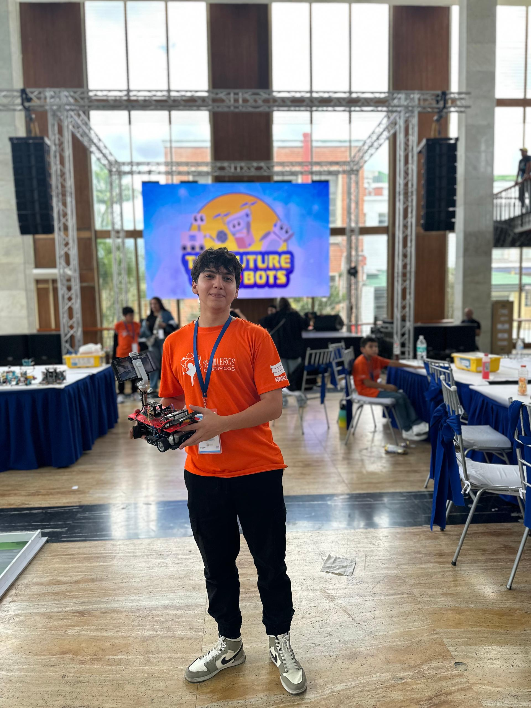<br><b>Samuel Pérez</b><br><sub>Diseño 3D, CAD y app Android</sub></td>
<td align="center" width="25%">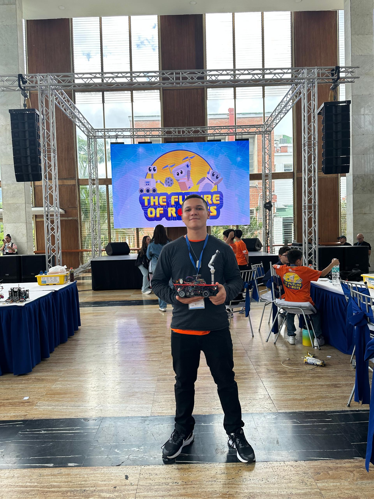<br><b>Trino Carrizales</b><br><sub>Firmware, algoritmos y control</sub></td>
<td align="center" width="25%">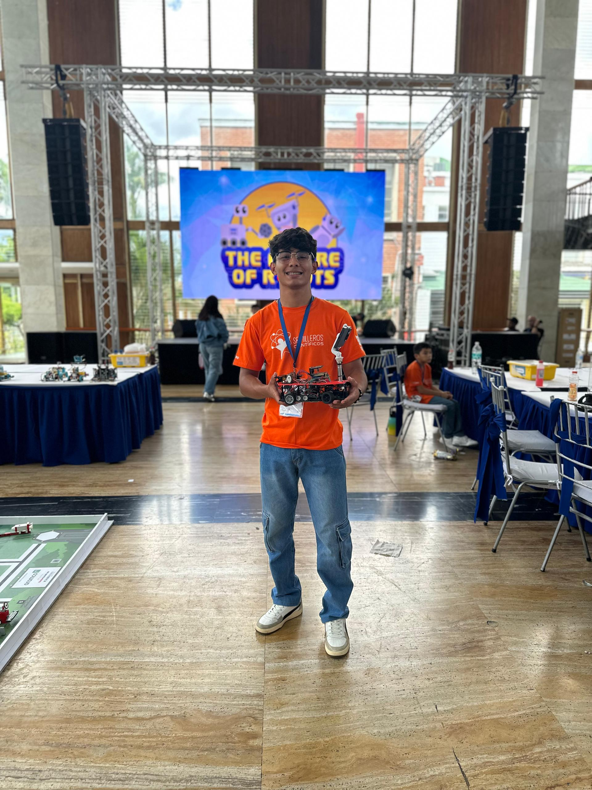<br><b>Leandro Padrón</b><br><sub>Mecánica, montaje y logística</sub></td>
<td align="center" width="25%"><br><b>Ing. Dayana Pérez</b><br><sub>Mentora del equipo</sub></td>
</tr>
</table>
</div>

### 1.1. 👤 Samuel Pérez
**Diseño 3D, modelado CAD y desarrollo móvil**

* **Formación:** estudiante de Ingeniería Electrónica en la **UPTJFR**.
* **En el equipo:**
  * **Diseño estructural y modelado 3D:** diseño paramétrico de las piezas mecánicas del vehículo en Onshape.
  * **Desarrollo móvil:** creó la aplicación de detección en **Android Studio** con OpenCV.
  * **Organización:** se encarga de que los entregables técnicos estén completos y a tiempo.
  * **Logros:** finalista en la fase nacional de la **WRO Venezuela 2025**.

### 1.2. 👤 Trino Carrizales
**Programación embebida, algoritmos y control**

* **Formación:**
  * Estudiante de Ingeniería Electrónica en la **UPTJFR**.
  * Estudiante de Ingeniería en Sistemas en la **Universidad Nacional Experimental de los Llanos Occidentales Ezequiel Zamora (UNELLEZ)**.
* **En el equipo:**
  * **Firmware:** programa y optimiza el código de los microcontroladores **Arduino** y **ESP32**.
  * **Depuración:** encuentra y corrige errores de lógica durante las pruebas, incluso en plena competencia.
  * **Logros:** finalista en la fase nacional de la **WRO Venezuela 2025**.

### 1.3. 👤 Leandro Padrón
**Logística, mecánica aplicada y diagnóstico físico**

* **Formación:** estudiante de Ingeniería Electrónica en la **UPTJFR**.
* **En el equipo:**
  * **Mecánica:** armado de los prototipos y solución de las fallas mecánicas que aparecen en las pruebas.
  * **Logística:** coordina materiales, herramientas y la planificación de las salidas a competencia.
  * **Trabajo en pista:** diagnostica y repara fallas rápido para que el equipo pueda seguir probando.

### 1.4. 🎓 Ing. Dayana Pérez
**Mentora principal y asesora de investigación**

* **Formación:**
  * **Ingeniera Electrónica:** Universidad Nacional Experimental Politécnica Antonio José de Sucre (**UNEXPO**, VR Barquisimeto).
  * **Magíster en Educación Superior:** Universidad Fermín Toro (**UFT**).
  * **Doctorante en Tecnologías de la Información y Comunicación:** **UNELLEZ** Barinas.
* **En el equipo:** asesoría metodológica, supervisión académica del proyecto y orientación en la integración de TIC y sistemas electrónicos.

### 1.5. 🏆 De subcampeones 2025 al primer lugar en 2026

En 2025 obtuvimos el **2.º lugar en la competencia nacional de Venezuela**. Llegamos después de meses de diseño, depuración de sensores y ajustes a la lógica de navegación, y en la final tuvimos que recalibrar componentes contra reloj y resolver imprevistos en la pista frente a los mejores equipos del país.

Este año volvemos con una lista clara de lo que falló: rediseñamos el chasis, cambiamos buena parte del hardware y mejoramos los algoritmos de control para que el vehículo sea más rápido y preciso. La meta es el **1.er lugar nacional** y la clasificación a la final internacional. El vehículo de 2025 está documentado en el [archivo de la temporada 2025](#19--archive-2025-season).

### 1.6. 📸 Nuestro paso por la competencia nacional

<p align="center">
  
  
  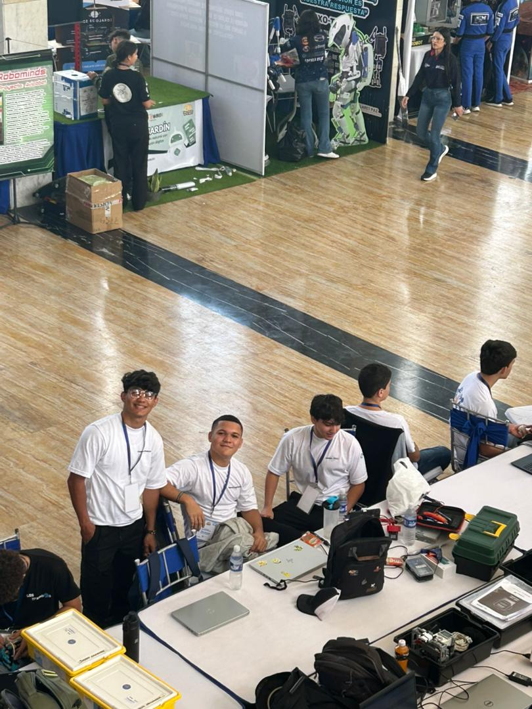
</p>

<details>
  <summary>🔍 <b>Ver más momentos de la WRO 2025</b></summary>
  <br>
  <p align="center">
    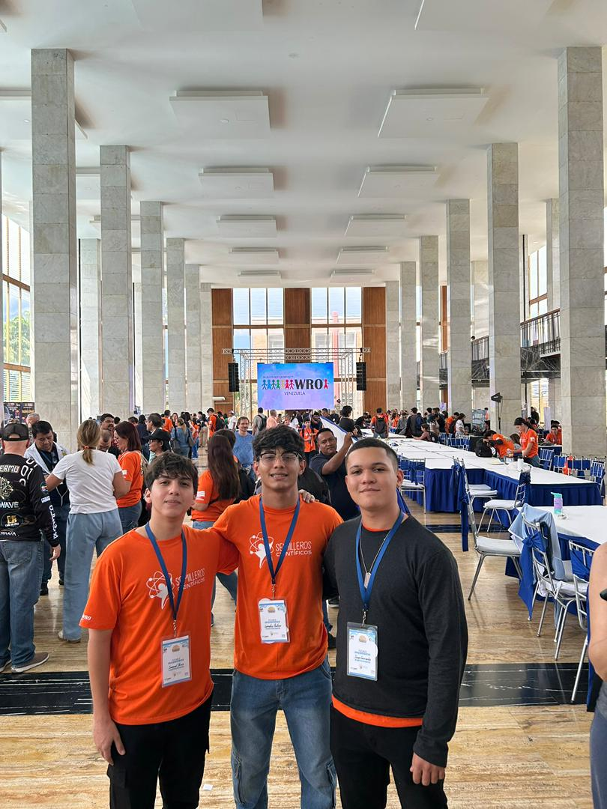
    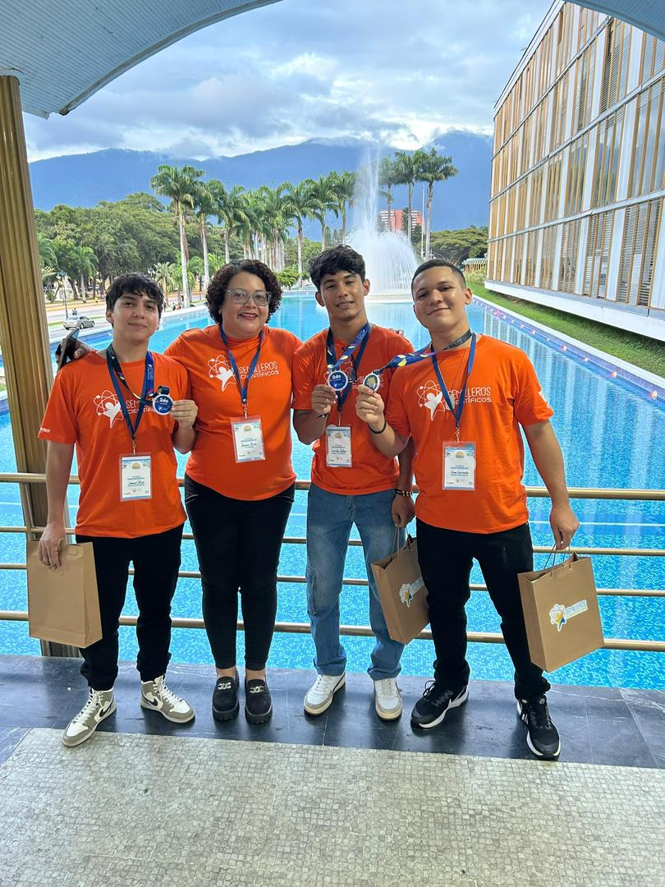
    
  </p>
</details>

---

## 2. 📂 Estructura del repositorio

Cada carpeta tiene su propio README con el detalle de lo que contiene.

<div align="center">

| 📁 Carpeta | 🎯 Contenido | 📖 Documentación |
| :--- | :--- | :--- |
| **💾 [`src/`](src/)** | **Código del vehículo**<br>• Firmware del ESP32 (vuelta libre y obstáculos)<br>• Librerías y cómo cargar el código<br>• Enlace al código de la app Android | [🔗 Ver documentación del código](src/README.md) |
| **⚙️ [`models/`](models/)** | **Piezas mecánicas**<br>• Archivos STL de todas las piezas impresas<br>• Qué es cada pieza y dónde va | [🔗 Ver documentación de los modelos](models/README.md) |
| **🔌 [`schemes/`](schemes/)** | **Electrónica**<br>• Esquemas de alimentación y de sensores<br>• Versión actual e históricas | [🔗 Ver documentación de los esquemas](schemes/README.md) |
| **🚗 [`v-photos/`](v-photos/)** | **Fotos del vehículo**<br>• Seis vistas del vehículo 2026 y del 2025 | [🔗 Ver fotos del vehículo](v-photos/README.md) |
| **👥 [`t-photos/`](t-photos/)** | **Fotos del equipo**<br>• Foto oficial, foto divertida e integrantes | [🔗 Ver fotos del equipo](t-photos/README.md) |
| **🎥 [`video/`](video/)** | **Videos de desempeño**<br>• Vuelta libre y desafío con obstáculos | [🔗 Ver videos](video/README.md) |
| **📚 [`other/`](other/)** | **Recursos adicionales**<br>• Imágenes de componentes, CAD, construcción y diagramas | [🔗 Ver recursos adicionales](other/README.md) |

</div>

---

## 3. 🎯 Desafíos de la WRO y criterios de evaluación

La categoría Futuros Ingenieros tiene dos rondas sobre una pista de 3 × 3 m, más la evaluación de la documentación técnica.

### 3.1. 🏁 Desafío abierto

**Objetivo:** completar tres vueltas de forma autónoma en una pista cuyas paredes internas y sentido de giro cambian en cada ronda.

| Aspecto | Reto | Nuestra solución |
| :--- | :--- | :--- |
| **Sentido de la vuelta** | Puede ser horario o antihorario | La primera línea que detecta el sensor de color define el sentido: azul → izquierda, naranja → derecha ([15.3](#153--lógica-común-de-navegación)). |
| **Ancho variable del pasillo** | Las paredes internas cambian de posición | Seguimiento de pared con un PID sobre la distancia del ToF lateral ([15.4](#154--modo-vuelta-libre-pista-sin-obstáculos)). |
| **Esquinas** | Girar 90° sin chocar | Giro con PID sobre el ángulo del BNO055, con tolerancia de 5°. |
| **Conteo de vueltas** | Detenerse al terminar la tercera | Conteo de líneas: 12 líneas son 3 vueltas. |

### 3.2. 🚧 Desafío con obstáculos

**Objetivo:** dar tres vueltas respetando los pilares de tráfico, salir de la zona de estacionamiento al inicio y volver a ella al final.

| Elemento | Requisito | Nuestra solución |
| :--- | :--- | :--- |
| **Pilares rojos y verdes** | Rojo: pasar por la derecha. Verde: pasar por la izquierda. | App de visión en el teléfono que detecta hasta dos pilares a la vez ([16](#16--telemetría-y-visión-artificial-aplicación-prometheus-v50)). |
| **Planificación** | Varias combinaciones de pilares por tramo | Sistema de carriles: la app envía un comando por combinación y el ESP32 elige el carril ([15.5](#155--modo-obstáculos-sistema-de-carriles)). |
| **Zona de estacionamiento** | Salir al inicio y no chocar el delimitador magenta | Salida hacia el lado con más espacio y modo magenta en la app ([16.4](#164--modo-estacionamiento-zona-magenta)). |
| **Fin del recorrido** | Terminar las tres vueltas y estacionar | Detención final después de la línea 12. |

### 3.3. 📊 Criterios de evaluación de la documentación

Según el Anexo C de las [reglas generales de Future Engineers 2026](https://wro-association.org/wp-content/uploads/WRO-2026-Future-Engineers-Self-Driving-Cars-General-Rules.pdf), los jueces evalúan la documentación con cinco criterios de 0, 2, 4 o 6 puntos cada uno (máximo 30), valorando la claridad y profundidad del razonamiento de ingeniería. Esta tabla indica dónde se encuentra cada uno en este repositorio:

| Criterio | Qué se evalúa | Dónde está |
| :--- | :--- | :--- |
| **1. Movilidad y diseño mecánico**<br><sub>*Mobility and Mechanical Design*</sub> | Chasis, tracción, dirección, cálculos y armado | [10. Diseño estructural](#10--diseño-estructural-transmisión-y-manufactura-aditiva) · [11. Masa](#11--análisis-de-masa-y-distribución-de-peso) · [12. Velocidad y torque](#12--velocidad-torque-y-tracción) · [14. Guía de ensamble](#14--guía-de-ensamble-paso-a-paso) |
| **2. Arquitectura de energía y sensores**<br><sub>*Power and Sensor Architecture*</sub> | Alimentación, sensores, cableado y consumo | [5](#5--componentes-de-control-detección-e-interfaz) · [6](#6--componentes-de-alimentación-y-actuación) · [7](#7--esquemas-de-alimentación-y-cableado) · [8](#8--esquemas-de-sensores-y-adquisición-de-datos) · [9. Gestión energética](#9--gestión-energética-y-autonomía-del-sistema) |
| **3. Arquitectura de software y estrategia ante obstáculos**<br><sub>*Software Architecture and Obstacle Strategy*</sub> | Estrategia de navegación, evasión de obstáculos y videos | [15. Software y control](#15--software-y-control) · [16. App de visión](#16--telemetría-y-visión-artificial-aplicación-prometheus-v50) · [17. Pruebas y videos](#17--pruebas-en-pista-y-videos) |
| **4. Visión de sistema y decisiones de ingeniería**<br><sub>*Systems Thinking and Engineering Decisions*</sub> | Fotos del vehículo, arquitectura y justificación de decisiones | [4. Nuestro vehículo](#4--nuestro-vehículo) · [13. Diario de ingeniería](#13--diario-de-ingeniería-evolución-del-chasis-v0--v2) · [19. Archivo 2025](#19--archive-2025-season) |
| **5. Reproducibilidad y calidad en GitHub**<br><sub>*Reproducibility and GitHub Quality*</sub> | Orden, claridad, uso de GitHub y posibilidad de replicar | [2. Estructura](#2--estructura-del-repositorio) · [14. Guía de ensamble](#14--guía-de-ensamble-paso-a-paso) · [18. GitHub, IA y replicación](#18--uso-de-github-inteligencia-artificial-y-replicación) |

---

## 4. 🤖 Nuestro vehículo

<div align="center">
  
</div>

### 4.1. 📋 Especificaciones generales

| Subsistema | Solución 2026 |
| :--- | :--- |
| **Procesamiento** | Un ESP32 para control y sensores, y un teléfono Android para la visión artificial |
| **Chasis** | Monochasis de dos pisos diseñado en Onshape e impreso en PETG (179 mm de largo, 115 mm de ancho de chasis) |
| **Tracción** | Motor 25GA-370 de 220 RPM con engranajes impresos 15T → 25T (1.67:1) sobre el eje trasero |
| **Dirección** | Ackermann impresa en PETG-CF, movida por un servo MG90; 40° en la rueda interior y radio de giro de 176 mm |
| **Sensores** | 4 × ToF VL53L0X, IMU BNO055, sensor de color TCS34725 y 2 × Sharp GP2Y0A21 |
| **Visión** | App propia con OpenCV que detecta pilares rojos, verdes y la zona magenta |
| **Energía** | LiPo 2S 2200 mAh 50C con tres líneas reguladas (motor, control, servo y sensores) |
| **Interfaz** | Interruptor de inicio, tira Neopixel y buzzer para indicar el estado |

### 4.2. 🧩 Arquitectura del sistema

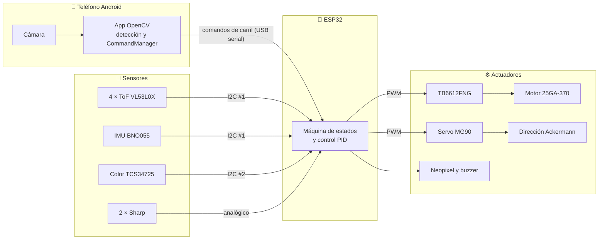
```mermaid
flowchart LR
    subgraph VISION["📱 Teléfono Android"]
        CAM["Cámara"] --> APP["App OpenCV<br/>detección y CommandManager"]
    end

    subgraph SENSORES["📡 Sensores"]
        TOF["4 × ToF VL53L0X"]
        IMU["IMU BNO055"]
        COL["Color TCS34725"]
        SHARP["2 × Sharp"]
    end

    subgraph CONTROL["🧠 ESP32"]
        FSM["Máquina de estados<br/>y control PID"]
    end

    subgraph ACTUADORES["⚙️ Actuadores"]
        DRV["TB6612FNG"] --> MOT["Motor 25GA-370"]
        SERVO["Servo MG90"] --> ACK["Dirección Ackermann"]
        UI["Neopixel y buzzer"]
    end

    APP -- "comandos de carril (USB serial)" --> FSM
    TOF -- "I2C #1" --> FSM
    IMU -- "I2C #1" --> FSM
    COL -- "I2C #2" --> FSM
    SHARP -- "analógico" --> FSM
    FSM -- "PWM" --> DRV
    FSM -- "PWM" --> SERVO
    FSM --> UI
```

El teléfono decide **qué** hacer con los pilares y el ESP32 decide **cómo** hacerlo: mantiene el ángulo, la distancia a la pared, cuenta las líneas y mueve el motor y la dirección.

### 4.3. 🔄 Galería de inspección técnica 360°

Estas son las seis vistas reglamentarias del vehículo. Con ellas se puede verificar la simetría, la distribución del centro de masa (*CoG*), el estado del chasis impreso y la altura libre al suelo (*ground clearance*).

| 📸 Vista | 🖼️ Foto | 🔍 Qué se verifica |
| :--- | :---: | :--- |
| **Frontal**<br>*(Front)* |  | • Sensores frontales y diagonales.<br>• Alineación del mecanismo de dirección.<br>• Altura del frente y centrado de la estructura. |
| **Trasera**<br>*(Rear)* |  | • Acople del motor y de la transmisión trasera.<br>• Rigidez de los soportes del eje motriz.<br>• Orden del cableado de potencia. |
| **Superior**<br>*(Top)* | 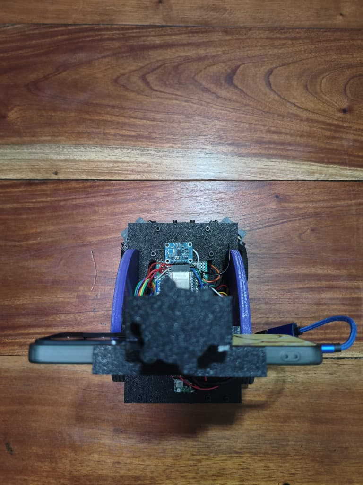 | • Balance transversal de peso.<br>• Posición del ESP32 y de la IMU.<br>• Recorrido del cableado entre pisos. |
| **Inferior**<br>*(Bottom)* |  | • Base lisa y plana, sin piezas que rocen.<br>• Altura libre al suelo.<br>• Fijación de tornillos y tuercas. |
| **Lateral derecha**<br>*(Right)* |  | • Acceso a interruptores y controles.<br>• Separación entre pisos (tracción, lógica y potencia).<br>• Alineación de los sensores del lado derecho y de las ruedas. |
| **Lateral izquierda**<br>*(Left)* |  | • Sensores del lado izquierdo.<br>• Ventilación de los módulos de potencia. |

---

## 5. 🧠 Componentes de control, detección e interfaz

| Imagen | Componente | Descripción | 🔗 Documentación |
| :----: | :--- | :--- | :--- |
|  | **Microcontrolador ESP32** | Cerebro del vehículo. Procesador de doble núcleo con Wi-Fi/Bluetooth y suficientes GPIO para leer todos los sensores (I2C y analógicos) y controlar los actuadores en tiempo real. | • [Datasheet ESP32](https://www.espressif.com/sites/default/files/documentation/esp32_datasheet_en.pdf)<br>• [Arduino-ESP32](https://docs.espressif.com/projects/arduino-esp32/en/latest/) |
|  | **Sensor infrarrojo Sharp GP2Y0A21** | Mide distancia por triangulación infrarroja (10 a 80 cm). Van en las diagonales delanteras para detectar paredes y obstáculos cercanos. | • [Datasheet Sharp](https://global.sharp/products/device/lineup/data/pdf/datasheet/gp2y0a21yk_e.pdf)<br>• [Guía Pololu](https://www.pololu.com/product/136) |
|  | **Sensores ToF VL53L0X** | Miden distancia con un láser infrarrojo por tiempo de vuelo. Los cuatro van en paralelo en el bus I2C #1 y cada uno tiene un pin XSHUT propio para asignarle una dirección distinta. | • [Datasheet ST](https://www.st.com/resource/en/datasheet/vl53l0x.pdf)<br>• [Librería Adafruit](https://github.com/adafruit/Adafruit_VL53L0X) |
|  | **IMU BNO055 (9 ejes)** | Integra acelerómetro, giroscopio y magnetómetro con un procesador que calcula la orientación absoluta (ángulos de Euler o cuaterniones). Va en el bus I2C #1. | • [Datasheet Bosch](https://www.bosch-sensortec.com/media/boschsensortec/downloads/datasheets/bst-bno055-ds000.pdf)<br>• [Librería Adafruit](https://github.com/adafruit/Adafruit_BNO055) |
|  | **Sensor de color TCS34725** | Sensor RGB con filtro infrarrojo. Va debajo del vehículo para detectar las líneas de la pista, solo en el bus I2C #2 para no cargar el bus de navegación. | • [Datasheet AMS](https://ams.com/documents/20143/36005/TCS34725_DS000390_3-00.pdf)<br>• [Librería Adafruit](https://github.com/adafruit/Adafruit_TCS34725) |
|  | **Tira de LEDs Neopixel** | LEDs RGB direccionables conectados al pin D14. Muestran el estado del programa, alertas y el modo de conducción. | • [Datasheet WS2812B](https://cdn-shop.adafruit.com/datasheets/WS2812B.pdf)<br>• [Librería Adafruit](https://github.com/adafruit/Adafruit_NeoPixel) |
|  | **Buzzer** | Piezoeléctrico en el pin D4. Emite avisos sonoros en cada etapa del programa, en fallos de lectura y en alertas. | • [tone() en Arduino](https://www.arduino.cc/reference/en/language/functions/advanced-io/tone/)<br>• [Zumbadores piezoeléctricos](https://www.sparkfun.com/products/7950) |
|  | **Interruptor de inicio** | Interruptor de palanca en el pin D23 con la resistencia pull-up interna del ESP32. Al pasarlo a LOW arranca el recorrido autónomo, una vez el vehículo está calibrado y en posición. | • [GPIO y pull-up en ESP32](https://docs.espressif.com/projects/esp-idf/en/latest/esp32/api-reference/peripherals/gpio.html) |
|  | **Teléfono Android** | Su cámara, con nuestra app de OpenCV, detecta los pilares rojos y verdes y la zona de estacionamiento, y envía comandos al ESP32 por USB. | • [Código de la app](https://github.com/SamFlips/APP-WRO-PROMETHEUS-TEAM/tree/master) |

## 6. 🔌 Componentes de alimentación y actuación

| Imagen | Componente | Descripción | 🔗 Documentación |
| :----: | :--- | :--- | :--- |
|  | **Batería LiPo 2S 50C 2200 mAh** | Fuente de energía principal. 7.4 V nominales (8.4 V con carga completa) y una tasa de descarga de 50C para soportar los picos de corriente del motor. | • [Baterías LiPo 2S](https://www.hobbywing.com/) |
|  | **Interruptor general** | Interruptor basculante ON/OFF en el positivo de la batería. Corta o habilita la corriente a todo el sistema. | • [Interruptor KCD1](https://www.sparkfun.com/products/11138) |
|  | **Regulador XL6009 (step-up/down)** | Ajustado entre 6 y 8 V según la velocidad buscada. Mantiene estable la alimentación del driver del motor aunque baje la batería. | • [Datasheet XL6009](https://www.xlsemi.com/datasheet/XL6009%20datasheet.pdf) |
|  | **Driver de motores TB6612FNG** | Puente H dual. Recibe dirección y PWM del ESP32 y entrega la potencia al motor con mucha menos pérdida que el L298N que usábamos antes. | • [Datasheet TB6612FNG](https://www.sparkfun.com/datasheets/Robotics/TB6612FNG.pdf) |
|  | **Motor DC 25GA-370 (6 V a 8 V)** | Motorreductor metálico de 220 RPM (caja 21.3:1) para la tracción. También se vende como JGA25-370. Lo alimenta el XL6009 a través del driver. | • [Motorreductores](https://www.pololu.com/category/60/micro-metal-gearmotors) |
|  | **2 × Step-down DSN-Mini 360** | Reguladores conmutados. El #1 está ajustado a 7 V para el pin VIN del ESP32 y el #2 a 5 V para el servo y los sensores. | • [Datasheet MP2307](https://www.monolithicpower.com/en/documentview/productdocument/index/doc_url/M/P/MP2307_r1.9.pdf) |
|  | **Servomotor MG90 180°** | Servo con engranajes metálicos que mueve la [dirección Ackermann](#104--sistema-de-dirección-ackermann) por PWM (pin D13), con un recorrido de −50° a +48°. Se alimenta a 5 V desde el Mini 360 #2. El servo previsto para la versión final es un EMAX ES08MA II. | • [Datasheet MG90S](https://www.electronicoscaldas.com/datasheet/MG90S_Tower-Pro.pdf) |

---

## 7. ⚡ Esquemas de alimentación y cableado

*Las versiones anteriores del sistema de alimentación están en el [archivo de 2025](#192--electronics-evolution).*

### 7.1. 🧾 Versión 4 (actual)

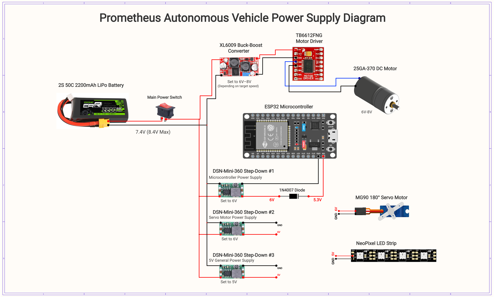

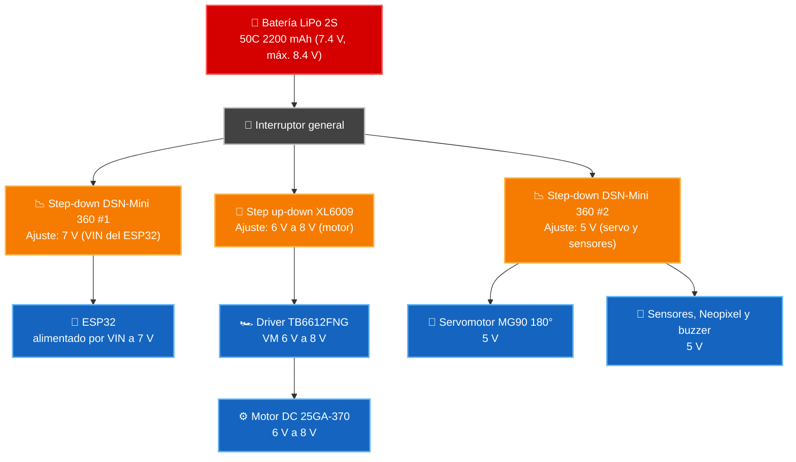
```mermaid
graph TD
    classDef bat fill:#d50000,stroke:#ff5252,stroke-width:2px,color:#fff;
    classDef sw fill:#424242,stroke:#bdbdbd,stroke-width:2px,color:#fff;
    classDef reg fill:#f57c00,stroke:#ffb74d,stroke-width:2px,color:#fff;
    classDef load fill:#1565c0,stroke:#64b5f6,stroke-width:2px,color:#fff;

    BAT["🔋 Batería LiPo 2S<br>50C 2200 mAh (7.4 V, máx. 8.4 V)"]:::bat
    SW["🔘 Interruptor general"]:::sw

    XL["🚀 Step up-down XL6009<br>Ajuste: 6 V a 8 V (motor)"]:::reg
    SD1["📉 Step-down DSN-Mini 360 #1<br>Ajuste: 7 V (VIN del ESP32)"]:::reg
    SD2["📉 Step-down DSN-Mini 360 #2<br>Ajuste: 5 V (servo y sensores)"]:::reg

    ESP32["🧠 ESP32<br>alimentado por VIN a 7 V"]:::load
    DRIVER["🏎️ Driver TB6612FNG<br>VM 6 V a 8 V"]:::load
    MOTOR["⚙️ Motor DC 25GA-370<br>6 V a 8 V"]:::load
    SERVO["📐 Servomotor MG90 180°<br>5 V"]:::load
    SENS["📡 Sensores, Neopixel y buzzer<br>5 V"]:::load

    BAT --> SW

    SW --> XL
    SW --> SD1
    SW --> SD2

    XL --> DRIVER
    DRIVER --> MOTOR

    SD1 --> ESP32
    SD2 --> SERVO
    SD2 --> SENS
```

### 7.2. 🔋 Arquitectura de energía, control y gestión de potencia

La **batería LiPo 2S de 2200 mAh** (7.4 V nominales, 8.4 V con carga completa) es la única fuente de energía. Pasa por un **interruptor general de palanca**, que elegimos porque no se desconecta solo con las vibraciones de la pista.

Desde ese punto la alimentación se divide en tres líneas reguladas e independientes. Así el ruido del motor no llega a la lógica de control y evitamos caídas de tensión (*brownouts*):

* **Línea de tracción:** un regulador **XL6009** ajustado entre 6 y 8 V, según la velocidad que busquemos, alimenta el **puente H TB6612FNG**, que a su vez mueve el **motor 25GA-370**.
* **Línea de control:** un **DSN-Mini 360** ajustado a 7 V alimenta el pin VIN del **ESP32** (el único microcontrolador del sistema). Con ese voltaje su regulador interno de 3.3 V tiene margen suficiente y la placa no se reinicia cuando arranca el motor.
* **Línea de actuadores y sensores:** un segundo **DSN-Mini 360**, ajustado a 5 V, alimenta el **servomotor MG90** y el resto de los sensores con una tensión estable.

> [!IMPORTANT]
> **Cambio clave de hardware: L298N → TB6612FNG**
>
> El cambio al TB6612FNG resolvió dos problemas graves del prototipo de 2025. Primero, eliminó la caída de voltaje interna del L298N, que le quitaba fuerza al motor. Segundo, el L298N generaba una interferencia que dejaba inutilizado el bus I2C del microcontrolador. Para esquivarlo tuvimos que usar dos placas ESP32, una solo para el motor. Con el TB6612FNG ese conflicto desapareció y volvimos a un único ESP32, lo que redujo el peso, el cableado, el consumo y los puntos de falla.

> [!NOTE]
> **Compromiso de diseño**
>
> Tres reguladores independientes ocupan más espacio dentro del chasis impreso. Aceptamos ese costo porque separar la potencia de la electrónica sensible eliminó el ruido inductivo del motor y nos dio lecturas I2C limpias durante toda la navegación.

---

## 8. 📡 Esquemas de sensores y adquisición de datos

*Las versiones anteriores del sistema de detección están en el [archivo de 2025](#192--electronics-evolution).*

### 8.1. 🧾 Versión 4 (actual)

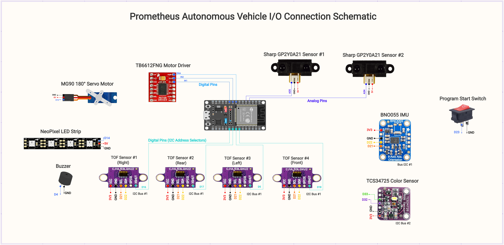

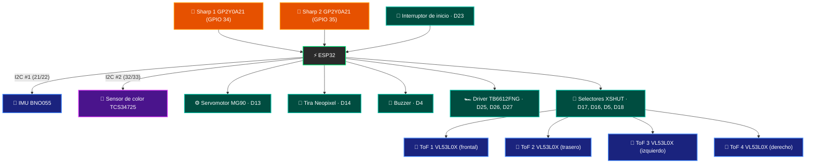
```mermaid
graph TD
    classDef mcu fill:#2b2b2b,stroke:#00e676,stroke-width:2px,color:#fff;
    classDef i2c1 fill:#1a237e,stroke:#448aff,stroke-width:2px,color:#fff;
    classDef i2c2 fill:#4a148c,stroke:#e040fb,stroke-width:2px,color:#fff;
    classDef adc fill:#e65100,stroke:#ff9100,stroke-width:2px,color:#fff;
    classDef gpio fill:#004d40,stroke:#00bfa5,stroke-width:2px,color:#fff;

    MCU["⚡ ESP32"]:::mcu

    IMU["🧭 IMU BNO055"]:::i2c1
    TOF1["🎯 ToF 1 VL53L0X (frontal)"]:::i2c1
    TOF2["🎯 ToF 2 VL53L0X (trasero)"]:::i2c1
    TOF3["🎯 ToF 3 VL53L0X (izquierdo)"]:::i2c1
    TOF4["🎯 ToF 4 VL53L0X (derecho)"]:::i2c1

    COLOR["🎨 Sensor de color TCS34725"]:::i2c2

    SHARP1["📡 Sharp 1 GP2Y0A21 (GPIO 34)"]:::adc
    SHARP2["📡 Sharp 2 GP2Y0A21 (GPIO 35)"]:::adc

    SERVO["⚙️ Servomotor MG90 · D13"]:::gpio
    NEO["🌈 Tira Neopixel · D14"]:::gpio
    BUZZER["🔔 Buzzer · D4"]:::gpio
    SW["🔘 Interruptor de inicio · D23"]:::gpio
    DRIVER["🏎️ Driver TB6612FNG · D25, D26, D27"]:::gpio
    XSHUT["🔀 Selectores XSHUT · D17, D16, D5, D18"]:::gpio

    MCU -- "I2C #1 (21/22)" --> IMU
    MCU -- "I2C #2 (32/33)" --> COLOR

    MCU --> XSHUT
    XSHUT --> TOF1
    XSHUT --> TOF2
    XSHUT --> TOF3
    XSHUT --> TOF4

    SHARP1 --> MCU
    SHARP2 --> MCU

    MCU --> SERVO
    MCU --> NEO
    MCU --> BUZZER
    SW --> MCU
    MCU --> DRIVER
```

**Asignación de pines del ESP32**

| Señal | Pin | Señal | Pin |
| :--- | :---: | :--- | :---: |
| I2C #1 SDA / SCL | 21 / 22 | XSHUT frontal / trasero | 17 / 16 |
| I2C #2 SDA / SCL | 32 / 33 | XSHUT izquierdo / derecho | 5 / 18 |
| Motor IN1 / IN2 / PWM | 27 / 26 / 25 | Sharp derecho / izquierdo | 34 / 35 |
| Servo de dirección | 13 | Tira Neopixel | 14 |
| Interruptor de inicio | 23 | Buzzer | 4 |

### 8.2. 🔧 Optimización del sistema de sensores y hardware

En esta cuarta versión reorganizamos los sensores aprovechando que el ESP32 tiene dos buses I2C por hardware. El objetivo era ganar precisión, que ningún sensor retrasara a los demás y que la navegación fuera estable dentro de la pista de $3 \times 3$ metros.

#### 8.2.1. Subsistema de navegación (bus I2C #1, pines D21/D22)

* **Sensores de distancia ToF:** reemplazaron a los ultrasónicos y eliminaron las zonas muertas a corta distancia. Para conectar los cuatro al mismo bus controlamos sus pines **XSHUT** desde el ESP32 y los encendemos uno por uno para darles direcciones distintas (ver 7.2.2). Además trabajan a 3.3 V, así que ya no hacen falta divisores de tensión.
* **IMU BNO055:** comparte el bus I2C #1. Su procesador interno fusiona los datos y prácticamente **elimina la deriva (*drift*)** acumulada que teníamos con el giroscopio anterior. Al arrancar, el programa toma la orientación actual como cero y todos los giros se calculan respecto a ella.

#### 8.2.2. Calibración y direccionamiento de los 4 sensores ToF (XSHUT)

Los cuatro VL53L0X comparten el bus I2C #1 (pines D21/D22), pero de fábrica todos responden a la misma dirección (`0x29`). Si se encendieran a la vez habría colisión. Para resolverlo, el pin **XSHUT** de cada sensor va a un GPIO distinto del ESP32 y funciona como interruptor de encendido por software:

```cpp
#define XSHUT_FRONTAL 17
#define XSHUT_TRASERO 16
#define XSHUT_IZQ     5
#define XSHUT_DER     18

#define ADDR_FRONTAL 0x30
#define ADDR_TRASERO 0x31
#define ADDR_IZQ     0x32
#define ADDR_DER     0x33
```

**Secuencia de inicialización (encendido escalonado):**

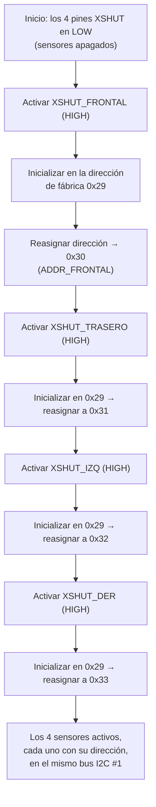
```mermaid
flowchart TD
    A["Inicio: los 4 pines XSHUT en LOW<br/>(sensores apagados)"] --> B["Activar XSHUT_FRONTAL (HIGH)"]
    B --> C["Inicializar en la dirección<br/>de fábrica 0x29"]
    C --> D["Reasignar dirección → 0x30<br/>(ADDR_FRONTAL)"]
    D --> E["Activar XSHUT_TRASERO (HIGH)"]
    E --> F["Inicializar en 0x29 → reasignar a 0x31"]
    F --> G["Activar XSHUT_IZQ (HIGH)"]
    G --> H["Inicializar en 0x29 → reasignar a 0x32"]
    H --> I["Activar XSHUT_DER (HIGH)"]
    I --> J["Inicializar en 0x29 → reasignar a 0x33"]
    J --> K["Los 4 sensores activos,<br/>cada uno con su dirección,<br/>en el mismo bus I2C #1"]
```

En cada paso solo **un sensor** está encendido en la dirección `0x29`; los demás siguen en reset (XSHUT en LOW). Cuando ya tiene su dirección definitiva, ese sensor queda encendido (XSHUT en HIGH) y se pasa al siguiente.

> [!NOTE]
> **Los 4 sensores usan la misma calibración**
>
> No aplicamos offsets individuales. Los VL53L0X del mismo lote vienen con una calibración de fábrica consistente entre sí; lo único que hay que configurar por sensor es su dirección.

#### 8.2.3. Subsistema de lectura de superficie (bus I2C #2, pines D32/D33)

* **Sensor de color TCS34725:** detecta y confirma las líneas de la pista. Lo pusimos en un **segundo bus I2C independiente** para que sus lecturas constantes del suelo no retrasen las de los ToF, que son las que usa el carro para no chocar. En el firmware se lee cada 30 ms en una tarea propia de FreeRTOS.

#### 8.2.4. Subsistema de proximidad redundante e interfaz

* **Sensores Sharp GP2Y0A21 diagonales:** siguen conectados a entradas analógicas y dan una segunda medida de proximidad en los ángulos ciegos del frente.
* **Interfaz de usuario:** la tira Neopixel y el buzzer muestran el estado del robot (errores, calibración correcta, línea detectada). El arranque se hace con un **interruptor de palanca** (pin D23); descartamos el pulsador porque los rebotes y la vibración lo activaban por accidente.

---

> [!IMPORTANT]
> **Simplificación y mantenimiento**
>
> Pasar de los ultrasónicos HC-SR04 a los ToF no solo mejoró la frecuencia de muestreo, también resolvió un problema físico. El HC-SR04 trabaja con 5 V y los pines del ESP32 con 3.3 V, así que en 2025 tuvimos que armar divisores de voltaje a mano con resistencias (no conseguimos convertidores de nivel comerciales). Funcionaban, pero el circuito era voluminoso y daba falsos contactos. Con sensores I2C nativos de 3.3 V esa red desapareció y el montaje quedó más limpio y fácil de reparar en los pits.

> [!NOTE]
> **Compromiso de diseño: tráfico en el bus I2C**
>
> Tener varios sensores I2C traía el riesgo de colisiones y de retrasos en el `loop` principal. Lo resolvimos de dos formas: en software, con lecturas secuenciales (*polling*) y direcciones asignadas con XSHUT; en hardware, separando la carga en dos buses (navegación y superficie). Para ahorrar espacio no pusimos resistencias *pull-up* externas: las que traen las placas de los sensores fueron suficientes.

---

### 8.3. 📋 Resumen de cambios y evolución del hardware

| Componente anterior | Componente actual | Justificación y ventaja principal |
| :--- | :--- | :--- |
| Sensor ultrasónico HC-SR04 con divisores de tensión | **4 × sensores ToF (I2C #1)** | Sin zonas muertas ni redes de resistencias; todo a 3.3 V. Direcciones asignadas con XSHUT. |
| MPU6050 + magnetómetro HMC5883L | **IMU BNO055 (I2C #1)** | Deriva prácticamente eliminada en la pista de $3 \times 3$ m. |
| Sensor de color en el bus compartido | **TCS34725 (I2C #2 aislado)** | Bus propio, sin cuellos de botella con los sensores de distancia. |
| Pulsador de inicio | **Interruptor de palanca (D23)** | No se activa solo con la vibración de la pista. |
| L298N + segundo microcontrolador | **TB6612FNG + un solo ESP32** | Sin caída de voltaje ni interferencia en el I2C. |

---

## 9. 🔋 Gestión energética y autonomía del sistema

En esta sección calculamos el consumo eléctrico del vehículo y justificamos la batería que elegimos.

### 9.1. 📊 Cálculo del consumo energético total

Estimamos el consumo de cada componente en tres escenarios, con valores típicos de sus hojas de datos: **reposo** (energizado pero sin trabajar), **nominal** (operación normal durante una vuelta) y **pico** (consumo máximo instantáneo, como el arranque del motor o los LEDs al máximo).

| Componente | Cantidad | Reposo (mA) | Nominal (mA) | Pico (mA) |
| :--- | :---: | :---: | :---: | :---: |
| **ESP32** (doble núcleo, WiFi/BT apagados) | 1 | ~20 | ~80 | ~80 (procesamiento intensivo) |
| **Sensor infrarrojo Sharp GP2Y0A21** | 2 | 10 c/u | 30 c/u | 33 c/u |
| **Sensor ToF VL53L0X** | 4 | 5 c/u | 15 c/u | 20 c/u (midiendo) |
| **IMU BNO055** | 1 | ~1 | 12.3 | ~16 |
| **Sensor de color TCS34725** | 1 | ~0 (en reposo, µA) | 3 | 3.6 |
| **Tira Neopixel** (10 LEDs) | 10 | 0 (apagada) | 300 (colores mixtos) | 600 (blanco al 100 %) |
| **Buzzer** | 1 | 0 | 30 | 30 |
| **Regulador XL6009** (consumo propio) | 1 | 15 | 15 | 15 |
| **Driver TB6612FNG** (lógica) | 1 | 1 | 2 | 6 |
| **Motor DC 25GA-370** | 1 | 0 (detenido) | 500 | ~1800 (arranque / rotor bloqueado) |
| **Step-down DSN-Mini 360** (consumo propio) | 2 | 5 c/u | 5 c/u | 5 c/u |
| **Servomotor MG90** | 1 | 10 (sosteniendo posición) | 200 (en movimiento) | ~700 (forzado) |
| **TOTAL ESTIMADO** | | **~97 mA** | **~1272.3 mA** | **~3406.6 mA** |

🔋 **Corriente nominal:** ~1.27 A · **Pico teórico simultáneo:** ~3.41 A

> [!NOTE]
> **Sobre el escenario de pico**
>
> Los ~3.41 A corresponden al caso extremo en que *todos* los componentes llegan a su máximo a la vez (arranque del motor, servo forzado y LEDs en blanco). En una vuelta real es muy poco probable, pero es el valor que usamos para comprobar la tasa de descarga (C) mínima de la batería (ver [9.4](#94--justificación-de-la-fuente-de-alimentación)).

---

### 9.2. ⏳ Estimación de la autonomía

Para estimar el tiempo de funcionamiento continuo usamos la relación entre la capacidad de la batería y el consumo calculado.

#### 9.2.1. Fórmula general

$$\text{Autonomía (horas)} = \frac{\text{Capacidad de la batería (mAh)}}{\text{Consumo total del sistema (mA)}}$$

#### 9.2.2. Aplicación a nuestro vehículo

$$\text{Autonomía} \approx \frac{2200 \text{ mAh}}{1272.3 \text{ mA}} \approx 1.73 \text{ horas}$$

* **Tiempo estimado:** aproximadamente **1 hora y 44 minutos** de operación continua en condiciones normales.
* **Nota práctica:** es un modelo teórico. En la pista el consumo del motor varía todo el tiempo (sube cerca del bloqueo o *stall*) y los sensores trabajan por ráfagas, así que la autonomía real depende de lo que esté haciendo el firmware.

---

### 9.3. 🔁 Eficiencia de los conversores DC-DC y autonomía real

El cálculo anterior supone que la corriente de cada componente es la misma que sale de la batería. No es así: los reguladores XL6009 y DSN-Mini 360 entregan voltajes distintos a los de la batería (7 V y 5 V frente a 7.4 V nominales) y ninguna conversión es 100 % eficiente.

**Eficiencias de referencia (hoja de datos del fabricante):**

| Conversor | Función en el sistema | Eficiencia usada | Rango del fabricante |
| :--- | :--- | :---: | :---: |
| **XL6009** (step-up/down) | Línea de tracción (motor + TB6612FNG) | ~88 % | Hasta 94 % en condiciones ideales; con una relación cercana a 1:1 y ~500 mA de carga el valor real es menor |
| **DSN-Mini 360** ×2 (step-down, MP2307) | Línea de control (ESP32) y línea de servo y sensores | ~90 % | 90–96 % típico con carga moderada |

**Corriente real extraída de la batería (balance de potencia por línea):**

$$P_{\text{entrada}} = \frac{P_{\text{salida}}}{\eta} \qquad I_{\text{batería}} = \frac{P_{\text{entrada}}}{V_{\text{batería}}}$$

| Línea de alimentación | V salida | I salida (nominal) | P salida | η | P entrada | I de la batería (7.4 V) |
| :--- | :---: | :---: | :---: | :---: | :---: | :---: |
| Tracción (XL6009 → motor + TB6612FNG) | 7 V | 502 mA | 3.51 W | 88 % | 3.99 W | **≈ 540 mA** |
| Control (Mini 360 #1 → ESP32) | 7 V | 80 mA | 0.56 W | 90 % | 0.62 W | **≈ 84 mA** |
| Servo y sensores (Mini 360 #2 → Sharp, ToF, BNO055, TCS34725, Neopixel, buzzer y servo) | 5 V | 665.3 mA | 3.33 W | 90 % | 3.70 W | **≈ 500 mA** |
| **TOTAL REAL EXTRAÍDO DE LA BATERÍA** | | | | | | **≈ 1124 mA** |

$$\text{Autonomía real} \approx \frac{2200 \text{ mAh}}{1124 \text{ mA}} \approx 1.96 \text{ horas} \; (\approx 1\text{ h }57\text{ min})$$

> [!IMPORTANT]
> **Por qué la autonomía real sale mayor que la estimación inicial**
>
> Se esperaría que las pérdidas de los reguladores *redujeran* la autonomía, y frente a un caso ideal (100 % de eficiencia) lo hacen. Pero el primer modelo (~1.73 h) tenía un error en sentido contrario: sumaba los mA de cada componente como si todos trabajaran al voltaje de la batería (7.4 V), cuando la mayoría trabaja a 5 V o 7 V. Al bajar el voltaje, la corriente equivalente del lado de la batería es menor, y ese efecto pesa más que la pérdida en los reguladores. El resultado (~1 h 57 min) coincide con lo que observamos: en una tarde y noche completas de pruebas la batería no llegó a su límite inferior de carga.

---

### 9.4. ✅ Justificación de la fuente de alimentación

#### 9.4.1. 🔋 ¿Por qué LiPo?

Elegimos una batería de **polímero de litio (LiPo)** por su **relación peso-potencia** y por su **capacidad de entregar mucha corriente al instante** (tasa de descarga). Las dos cosas son importantes para el rendimiento dinámico del robot.

#### 9.4.2. 📊 Comparación de tecnologías

| Tecnología | Densidad energética | Tasa de descarga (C) | Peso / volumen | Con motores y servos |
| :--- | :---: | :---: | :---: | :--- |
| **LiPo (2S 50C)** | **Alta** | **Muy alta (~50C)** | **Muy ligera** | **Excelente.** Entrega corriente al instante sin caídas de voltaje. |
| **Li-ion (18650)** | Muy alta | Baja (1C a 2C) | Ligera | **Deficiente.** Los picos de corriente bajan el voltaje (*voltage sag*) y reinician el ESP32. |
| **NiMH (6 celdas)** | Media | Media | Muy pesada | **Aceptable pero inviable.** El peso extra le quita agilidad al robot. |
| **Power bank (USB)** | Alta | Limitada (2 A a 3 A) | Media | **Incompatible.** Su protección se apaga por sobrecorriente. |

#### 9.4.3. Justificación frente a las alternativas

**a) Frente a Li-ion (18650).** Las 18650 tienen muy buena densidad de energía, pero su tasa de descarga típica es baja. El motor y el servo generan picos de corriente al arrancar o al forzarse, y una Li-ion común sufriría una caída de voltaje fuerte (*voltage sag*). Eso provocaría **reinicios del ESP32** o activaría la protección de la batería (BMS). La LiPo entrega esa corriente al instante sin bajar el voltaje.

**b) Frente a NiMH.** Las NiMH son seguras y duraderas, pero muy pesadas y voluminosas. Para igualar los **7.4 V** de una LiPo 2S harían falta **6 celdas en serie** (1.2 V cada una). Ese peso duplicaría o triplicaría la masa del robot, aumentaría el consumo del motor y le quitaría aceleración en la pista.

**c) Frente a power banks comerciales.** Un power bank eleva el voltaje de sus celdas a 5 V con un regulador que tiene un límite estricto de corriente (normalmente 2 A o 3 A). Nuestro consumo simultáneo supera ese límite con facilidad:

* **10 LEDs Neopixel** en blanco: `~600 mA`
* **Servo MG90** forzado: `~700 mA`
* **Motor 25GA-370** al arrancar o con carga: `> 1 A`

Al pasar ese límite el power bank se apaga. Además, el motor **25GA-370** rinde mejor entre **6 V y 8 V**; a 5 V perdería torque y velocidad.

#### 9.4.4. ¿Por qué 2200 mAh y no más capacidad?

La capacidad de 2200 mAh la decidimos por tres criterios: peso, tasa de descarga y una autonomía que ya comprobamos en la práctica.

- **Peso:** la LiPo 2S 2200 mAh 50C que usamos pesa **115 g**. Una de 2600 o 3000 mAh de la misma tecnología pesa proporcionalmente más, y ese peso afecta la relación torque/masa (ver [sección 12](#12--velocidad-torque-y-tracción)) sin darnos ninguna ventaja, porque la autonomía actual ya cubre de sobra una ronda de competencia.
- **Tasa de descarga (50C):** con 2200 mAh y 50C la batería puede entregar hasta 110 A instantáneos, muy por encima del pico real del sistema (~3.4 A, ver [9.1](#91--cálculo-del-consumo-energético-total)). El motor arranca sin que baje el voltaje y sin afectar a la lógica de control.
- **Autonomía comprobada:** según el recálculo con pérdidas (8.3), la autonomía real es de ~1 h 57 min. En una tarde y noche completas de pruebas no llegamos al límite de carga, así que 2200 mAh deja margen de sobra para entrenar y competir sin cargar peso muerto.

> [!NOTE]
> **Compromiso de diseño**
>
> Subir a 2600–3000 mAh habría añadido unos 20–35 g (estimado de forma proporcional dentro de la misma línea de productos) a cambio de una autonomía que no es lo que nos limita. El cuello de botella real es el tiempo que tarda el algoritmo de evasión (ver los tiempos de vuelta en [12.4](#124--tiempo-teórico-de-vuelta-frente-al-tiempo-real)), no la energía disponible. Preferimos mantener el chasis lo más liviano posible.

---

## 10. 🧱 Diseño estructural, transmisión y manufactura aditiva

*El diseño y la construcción del chasis de 2025 están en el [archivo de 2025](#193--chassis-construction).*

### 10.1. 📝 Filosofía de rediseño y prototipado conceptual

Empezamos analizando qué falló en las rondas del año pasado. La conclusión principal fue que el chasis heredado era demasiado largo: eso empeoraba el giro, aumentaba el radio de giro y le quitaba agilidad en las evasiones.

Para corregirlo sin quitarle espacio a la electrónica nos pusimos un objetivo geométrico: una **relación de aspecto 1:1**, es decir, que la distancia entre el eje delantero y el trasero (*wheelbase*) fuera igual al ancho del vehículo (vía). Así la dirección responde mejor.

> [!IMPORTANT]
> **Tren motriz: de correas a engranajes**
>
> Antes del modelado final probamos la idea con prototipos rápidos. Primero pensamos en una transmisión por correa dentada, pero no conseguíamos correas a medida y existía el riesgo de que patinaran (*slipping*), así que la descartamos. Nos quedamos con engranajes rectos en paralelo, que nos permitieron girar el montaje del motor, compactar la transmisión y confirmar que el chasis se podía acortar.

#### 10.1.1. Prototipos conceptuales tempranos

<p align="center">
  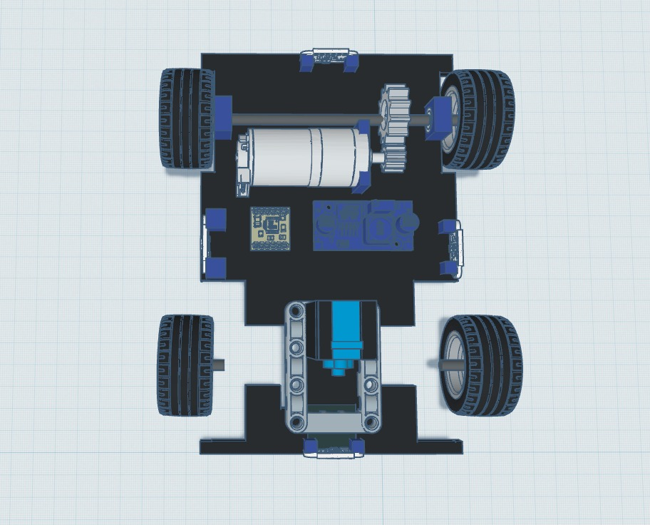
  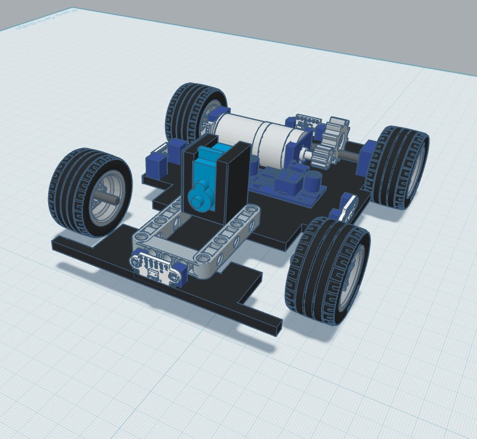
  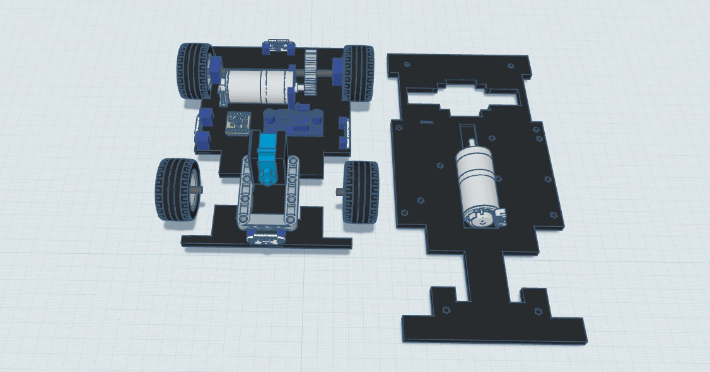
</p>

---

### 10.2. 🚙 Transición a CAD profesional y arquitectura Monochasis

Con la geometría validada pasamos a **Onshape**, un entorno paramétrico. La principal novedad es el **Monochasis** del nivel inferior: una sola pieza que integra los soportes, los canales de cableado y los alojamientos de los componentes. Así eliminamos los ensambles de varias piezas y las fijaciones improvisadas que se aflojaban con la vibración.

La plataforma mide **179 mm de largo por 115 mm de ancho**, con una distancia entre ejes de **~112 mm**, lo que cumple la relación 1:1 que buscábamos.

<p align="center">
  <br>
  <sub>Vista de planta del Monochasis en Onshape.</sub>
</p>

#### 10.2.1. Tren motriz (torque frente a velocidad)

* **Motor de tracción:** 25GA-370 (JGA25) de 220 RPM con caja reductora metálica. El Monochasis tiene una cama hundida hecha a la medida del motor, que deja su eje alineado con la transmisión.
* **Piñón y corona:** un piñón de 15 dientes en el motor mueve una corona de 25 dientes en el eje trasero. Esta **relación de 1.67:1** sacrifica algo de velocidad máxima para aumentar el torque en las ruedas, así el carro acelera de forma controlada desde parado sin forzar el motor.
* **Eje trasero (solución de taller):** no conseguimos varilla calibrada de 4 mm, así que usamos el núcleo de electrodos de soldadura (~2.4 mm). En las zonas de los rodamientos aumentamos el diámetro con termorretráctil hasta lograr un ajuste a presión (*press-fit*) sin holgura.
* **Rodamientos:** el eje gira sobre rodamientos 604ZZ (4 × 12 × 4 mm) encajados en alojamientos del propio chasis.

---

### 10.3. 📏 Validación de tolerancias y ensamble virtual

Antes de integrar todo, en Onshape modelamos y revisamos cada pieza mecánica por separado para asegurarnos de que las tolerancias fueran correctas.

#### 10.3.1. Componentes clave y sistemas de anclaje

Diseñamos engranajes propios, cada uno con un sistema de fijación según el tipo de eje:

* **Piñón motriz (eje en "D"):** para acoplar el engranaje de 15 dientes al motor aprovechamos el corte plano que trae su eje. El agujero tiene perfil en "D" con tolerancias pensadas para impresión 3D, de modo que entra a presión (*press-fit*). Transmite todo el torque sin desgastarse y no se sale con la vibración.
* **Corona (varilla lisa):** el engranaje de 25 dientes se fija a la varilla trasera con un collarín de **abrazadera tipo "C"**. Al apretar un tornillo transversal, el collarín se cierra sobre la varilla y bloquea el engranaje por fricción, sin pegamento y sin dañar el metal.

<table>
<tr>
<td align="center" width="50%">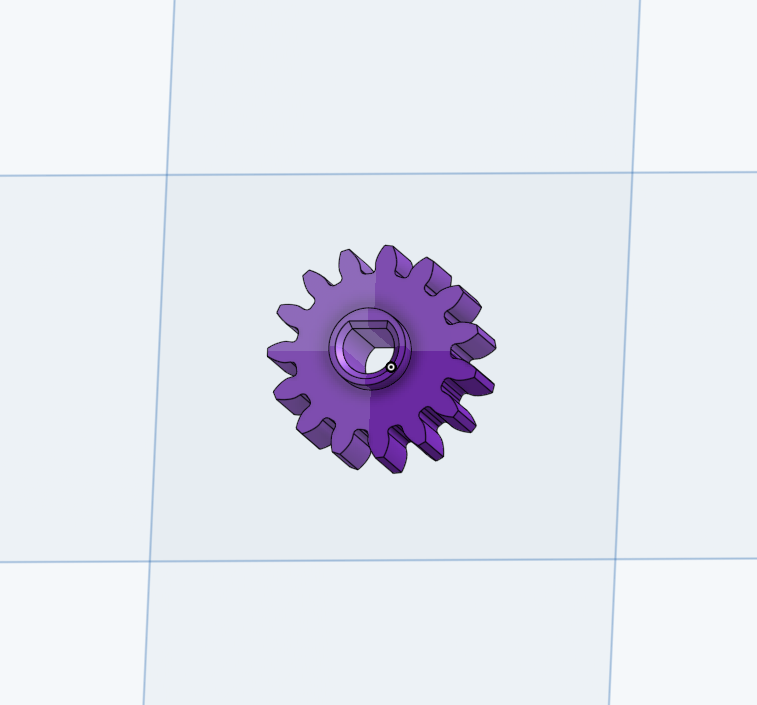<br><sub>Piñón motriz (15T) con acople en "D".</sub></td>
<td align="center" width="50%">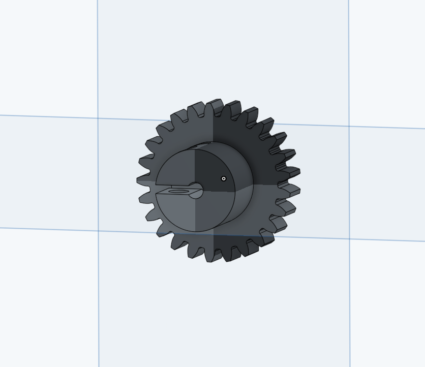<br><sub>Corona (25T) con abrazadera tipo "C".</sub></td>
</tr>
</table>

#### 10.3.2. Acople de tracción: adaptador para ruedas Lego

Las **ruedas Lego** del año pasado tienen muy buen agarre en la pista, así que las mantuvimos. Para montarlas en la nueva varilla lisa diseñamos un adaptador: en un extremo tiene el perfil en cruz de Lego y en el otro una base cilíndrica con la misma **abrazadera tipo "C"** de la corona. La rueda queda firme sobre la varilla y se puede cambiar rápido en los pits.

<table>
<tr>
<td align="center" width="50%">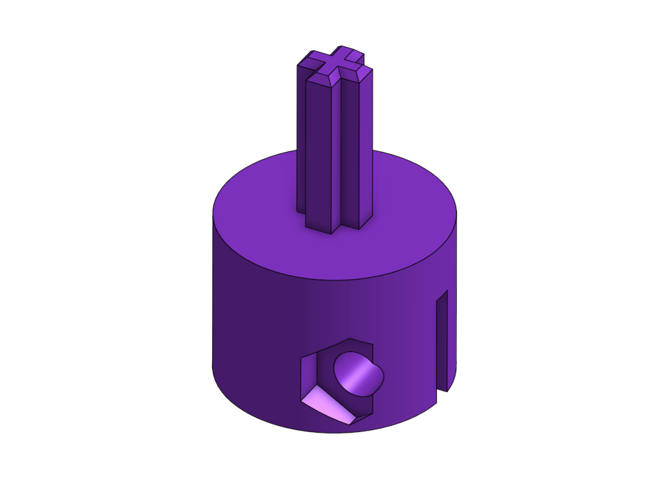<br><sub>Perfil del adaptador.</sub></td>
<td align="center" width="50%">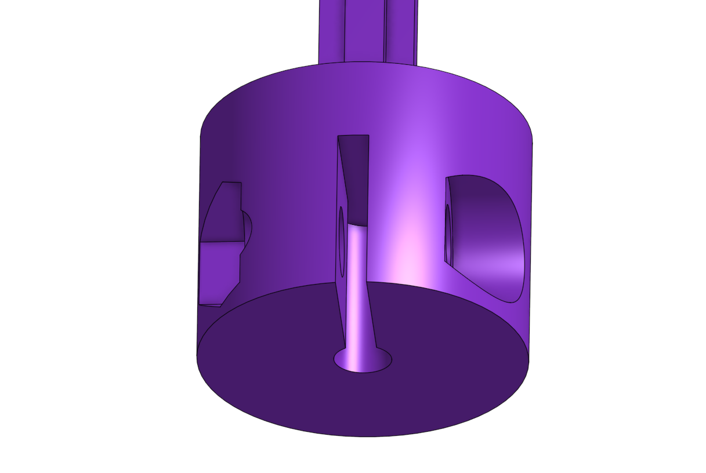<br><sub>Detalle de la abrazadera transversal.</sub></td>
</tr>
</table>

#### 10.3.3. Ensamble virtual y prevención de fallas

Con las piezas validadas, el ensamble virtual completo nos sirvió para encontrar interferencias y corregir el diseño antes de imprimir.

> [!TIP]
> **Rediseño del soporte del motor**
>
> En la simulación vimos que los tornillos que sujetan el motor quedaban tapados por la corona del eje trasero. Para sacar el motor habría que desmontar la varilla y casi toda la tracción, algo que en los pits cuesta mucho tiempo. Movimos los agujeros a las esquinas libres del soporte y ahora el motor sale quitando solo el piñón.

<table>
<tr>
<td align="center" width="50%">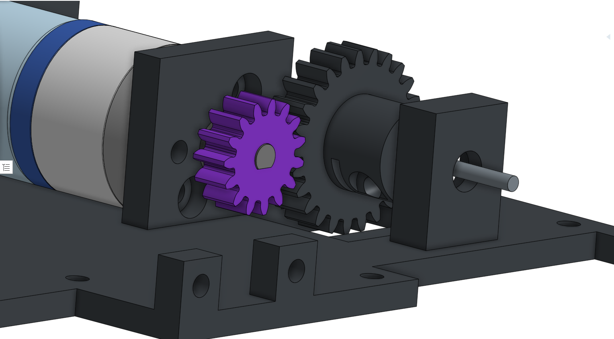<br><sub>Revisión de interferencias del tren de engranajes.</sub></td>
<td align="center" width="50%"><br><sub>Bloque motriz listo para integrar.</sub></td>
</tr>
</table>

---

### 10.4. 🛞 Sistema de dirección Ackermann

La dirección Lego que traíamos de 2025 era **paralela**: las dos ruedas giraban el mismo ángulo, tenía poco giro máximo y estaba encajada a presión en un recorte del chasis, con holgura. La reemplazamos por una **dirección Ackermann diseñada en Onshape e impresa en PETG-CF**: un servo mueve una biela plana, la biela mueve una barra de acoplamiento y la barra gira las dos manguetas, cada una sobre un pivote (*kingpin*) metálico M3.

<div align="center">

| 🛞 Giro de la rueda interior | 🔄 Radio de giro mínimo | 🎯 Error máximo frente al ideal | 📏 Holgura mínima al chasis | ⚙️ Recorrido del servo |
| :---: | :---: | :---: | :---: | :---: |
| **40°** | **176 mm** | **1,4°** | **1,00 mm** | **98°** |

</div>

<table>
<tr>
<td align="center" width="50%">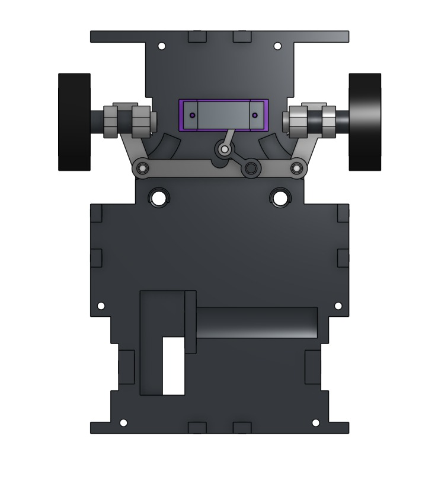<br><sub><b>Vista superior.</b> Las dos manguetas con sus pivotes, la barra de acoplamiento y el servo (en violeta) con la biela, delante del eje delantero.</sub></td>
<td align="center" width="50%">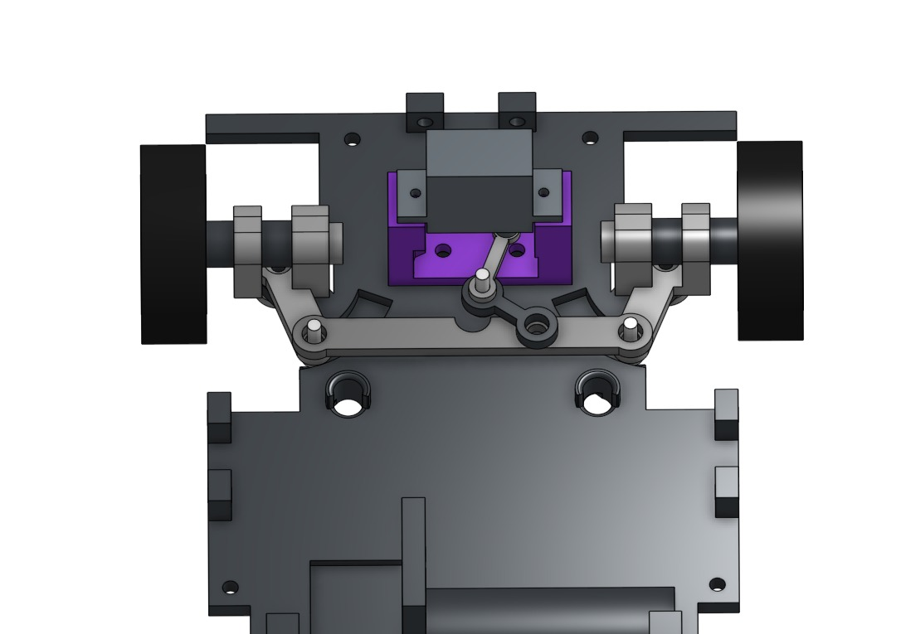<br><sub><b>Perspectiva desde arriba y al frente.</b> El servo va invertido sobre su soporte; la biela plana baja hasta el agujero central de la barra.</sub></td>
</tr>
</table>

#### 10.4.1. Datos de partida

| Dato | Valor |
| :--- | :--- |
| Distancia entre ejes (L) | 112 mm |
| Ancho del chasis | 115 mm |
| Neumático / rin Lego | #44309 (43,2 × 22 mm) / #56145 (30,4 × 20 mm) |
| Vía trasera | 140 mm de exterior a exterior (118 mm entre centros de neumático) |
| Ancho delantero (montaje real) | ≈ 143 mm de extremo a extremo de rueda (≈ 121 mm entre centros), igual que el eje trasero |
| Adaptador de rueda | 25,7 mm de largo (13,7 mm en la versión anterior) |
| Espesor de la placa / separación entre pisos | 4 mm / 60 mm |
| Altura del eje de rueda | 10,75 mm sobre la placa (igual que el eje trasero) |
| Servo | **Previsto:** EMAX ES08MA II (analógico, 23 × 11,5 × 24 mm, 12 g, 4,8–6 V, 2,0 kgf·cm a 6 V).<br>**En las pruebas:** MG90 (23 × 12,2 mm) con su brazo de serie, usando el agujero a 14 mm del eje. |
| Material | PETG-CF (manguetas, barra, biela y soporte) |

#### 10.4.2. Relación 1:1: el chasis 2026 frente al de 2025

La geometría de la dirección depende directamente de la distancia entre ejes (L): con el mismo ángulo de las ruedas, el radio de giro crece en proporción a L. Por eso el primer paso del rediseño fue acortar el chasis hasta que la distancia entre ejes quedara casi igual al ancho (relación 1:1). Medidas tomadas de los modelos 3D de los dos chasis:

| Parámetro | Chasis 2025 | Monochasis 2026 | Cambio |
| :--- | :---: | :---: | :---: |
| **Largo del chasis** | 242 mm | 179 mm | 🔻 −63 mm (−26 %) |
| **Ancho del chasis** | 116 mm | 115 mm | ≈ igual |
| **Relación largo / ancho** | ≈ 2,1 : 1 | ≈ 1,56 : 1 | Más compacto |
| **Distancia entre ejes / ancho** | Chasis alargado para el trípode | 112 / 115 ≈ **0,97 : 1** | ≈ 1:1 |

$$R = \frac{L}{\tan\delta_i} + \frac{K}{2} \quad\Rightarrow\quad \text{a igual ángulo de giro, menos } L \text{ significa menos radio}$$

- **Giro más cerrado:** con L = 112 mm la dirección llega a un radio de 176 mm. En el chasis largo de 2025, el mismo ángulo habría dado un radio mayor, porque el primer término de la fórmula crece con L.
- **Mismo espacio para la electrónica:** el ancho no cambió; lo que se recortó fue el largo que solo existía para equilibrar el trípode.
- **Sin flexión:** al acortar el chasis desapareció el efecto palanca que lo doblaba en el centro y ya no hacen falta los contrapesos de plomo (ver [13. Diario de ingeniería](#13--diario-de-ingeniería-evolución-del-chasis-v0--v2)).
- **Relación K/L más alta:** con K = 84 mm y L = 112 mm, K/L = 0,75. Es la cifra que fija cuánto más debe girar la rueda interior que la exterior (fórmula 1).

#### 10.4.3. Principio de funcionamiento y fórmulas

En una dirección Ackermann las prolongaciones de los ejes de las dos ruedas delanteras se cortan en un punto sobre la línea del eje trasero. Así cada rueda recorre una circunferencia distinta sin arrastrarse de lado. Para lograrlo, la rueda interior tiene que girar más que la exterior.

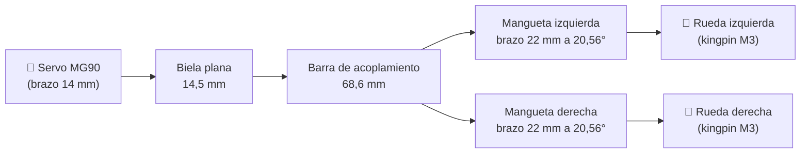
```mermaid
flowchart LR
    S["🔧 Servo MG90<br/>(brazo 14 mm)"] --> B["Biela plana<br/>14,5 mm"]
    B --> T["Barra de acoplamiento<br/>68,6 mm"]
    T --> MI["Mangueta izquierda<br/>brazo 22 mm a 20,56°"]
    T --> MD["Mangueta derecha<br/>brazo 22 mm a 20,56°"]
    MI --> RI["🛞 Rueda izquierda<br/>(kingpin M3)"]
    MD --> RD["🛞 Rueda derecha<br/>(kingpin M3)"]
```

| # | Fórmula | Uso |
| :---: | :--- | :--- |
| (1) | $\cot\delta_e - \cot\delta_i = K / L$ | Condición de Ackermann |
| (2) | $\theta = \arctan\left(\frac{K/2}{L}\right)$ | Ángulo del brazo de dirección |
| (3) | $s = K - 2a\sin\theta$ | Separación de los agujeros de la barra |
| (4) | $R = \frac{L}{\tan\delta_i} + \frac{K}{2}$ | Radio de giro (al centro del eje trasero) |
| (5) | $\frac{\delta_i - \delta_{e,\text{real}}}{\delta_i - \delta_{e,\text{ideal}}} \times 100$ | Porcentaje de Ackermann |
| (6) | $F = \tau / r_{\text{brazo}}$ | Fuerza en el brazo del servo |

Donde $\delta_i$ y $\delta_e$ son los ángulos de la rueda interior y exterior, $K$ la separación entre los ejes de los *kingpins*, $L$ la distancia entre ejes y $a$ la longitud del brazo de dirección.

#### 10.4.4. Elección de la separación entre pivotes (K)

El primer cálculo usó el ancho del chasis (115 mm) como $K$, y era un error: $K$ es la distancia entre pivotes, no entre ruedas. Comparamos cuatro opciones con L = 112 mm y un brazo de 22 mm:

| K (mm) | Criterio | θ | Separación de agujeros | Decisión |
| :---: | :--- | :---: | :---: | :--- |
| 115 | Ancho del chasis (supuesto inicial) | 27,2° | — | ❌ No es la distancia entre pivotes |
| 96 | Kingpin en la cara interior del neumático | 23,2° | 78,7 mm | ❌ Las orejas de Ø10 invadían unos 5 mm la llanta |
| 108 | Kingpin a 5 mm del plano medio de la rueda | 25,7° | 88,9 mm | ❌ La mangueta tendría que entrar en la cavidad del rin |
| **84** | **Kingpin 6 mm dentro de la cara interior (x = ±42 mm)** | **20,56°** | **68,55 mm** | ✅ **Adoptado** |

#### 10.4.5. Brazo de dirección, barra y ángulos ideales

Con K = 84 mm:

$$\theta = \arctan\left(\frac{42}{112}\right) = 20{,}56^\circ \qquad s = 84 - 2 \cdot 22 \cdot \sin(20{,}56^\circ) = 68{,}55 \text{ mm}$$

Con un brazo de 22 mm, la punta queda 7,72 mm hacia el centro y 20,60 mm hacia atrás del kingpin. La barra se construyó con 68,6 mm entre agujeros y un tercer agujero a 14 mm del centro para la biela.

Aplicando la fórmula (1) con K/L = 0,75:

| δ interior | δ exterior ideal | Radio de giro | Error de una dirección paralela |
| :---: | :---: | :---: | :---: |
| 10° | 8,85° | 677 mm | 1,15° |
| 20° | 15,96° | 350 mm | 4,04° |
| 30° | 21,95° | 236 mm | 8,05° |
| 40° | 27,24° | 176 mm | 12,76° |

La última columna es la diferencia entre el ideal y una rueda exterior que gira lo mismo que la interior (dirección paralela). Crece con el ángulo; por eso una dirección paralela solo es aceptable en giros pequeños.

#### 10.4.6. Servo y biela: lo que predijo el CAD y lo que pasó en el montaje

El servo va **invertido** (eje hacia abajo), delante de la barra y apoyado sobre la placa, con un brazo de 14 mm y una biela plana de 14,5 mm. Así el brazo del servo, la biela y la barra trabajan en planos casi contiguos. Un diseño anterior con una biela en forma de Z y 25 mm de desnivel se descartó porque hacía palanca sobre las articulaciones y generaba holgura. También exigimos que el ángulo entre el brazo y la biela nunca bajara de 40°, para evitar el punto muerto; el primer rango de servo (−19,6° a +24,8°) no lo cumplía.

| Dato | CAD | Montaje real |
| :--- | :---: | :---: |
| Rango del servo | −46,8° a +34,3° | **−50° a +48°** |
| Recorrido total | 81,1° | **98°** |
| Centro de la ventana | −6,2° | −1° |
| Brazo del servo / biela | 14 mm / 14,5 mm | 14 mm (último agujero del brazo del MG90) / 14,5 mm |

El CAD era optimista: la barra necesita 22 mm de carrera en el punto de la biela y, con un brazo de 14 mm, eso exige entre 100° y 104° de giro del servo. La asimetría del CAD venía de la unión excéntrica de la biela con la barra (a 14 mm del centro) y del desplazamiento lateral del eje del servo. Además, el servo había quedado montado al revés; al voltearlo y ampliar el rango, la dirección llegó a los ángulos esperados y el recorrido quedó casi simétrico.

> [!NOTE]
> Los grados del código dependen de la calibración de µs por grado (partimos de 10 µs/°). Hay que comprobar con un transportador que el brazo gira lo que se le ordena.

**Par del servo:** con 2,0 kgf·cm (0,196 N·m) y un brazo de 14 mm, el servo empuja con unos **14 N**. La carga estimada para girar con el carro parado, con unos 0,66 kg sobre el eje delantero, es menor de 0,3 kgf·cm: el margen es de **más de 6 veces**. El punto débil del sistema es la holgura mecánica, no la fuerza.

#### 10.4.7. Disposición vertical

Las alturas se miden desde la cara inferior de la placa. La rueda baja 6,85 mm por debajo de la placa, así que ningún elemento puede quedar a menos de unos 2 mm del suelo.

| Elemento | Altura z (mm) |
| :--- | :---: |
| Parte baja del neumático (suelo) | −6,85 |
| Pie de la mangueta | −4,5 a −0,5 (2,35 mm sobre el suelo) |
| Placa y puentes de los kingpins | 0 a 4 |
| Oreja y brazo de la mangueta | 4,5 a 7,5 |
| Barra de acoplamiento | 8 a 11 |
| Biela | 11,5 a 14,5 |
| Brazo del servo | 15 a 17 |
| Eje de la rueda | 14,75 |

#### 10.4.8. Verificación de interferencias en CAD

Modelamos una «rueda fantasma» (cilindro de Ø43,2 × 14 mm con su eje a z = 14,75 mm) y la giramos alrededor del kingpin en pasos de 5° para buscar choques con el chasis, las manguetas, la barra y la biela.

| Problema detectado | Corrección | Resultado |
| :--- | :--- | :--- |
| A 40°, la esquina trasera interior del neumático rozaba el puente y la pared del hombro | Puente inclinado y recortes en el hombro entre x = 33,3 y 37,5 mm | Holgura mínima de 1,00 mm en todo el rango |
| Un recorte nuevo dañó el brazo de dirección | Se limitó el alcance de los recortes al chasis | Pieza restaurada |
| Los casquillos de la biela no apretaban la pila de piezas | Casquillos de 4 mm (z 11–15) | Articulaciones firmes y biela libre (0,5 mm) |
| La barra tocaba la cabeza M3 del servo, y la barra y la biela tocaban los pilares a −40° | Alivio en la barra y rebaje en los pilares | Todas las holguras ≥ 1 mm |

**Criterio:** ≥ 1 mm contra el resto de piezas y 0,5 mm solo dentro de una misma articulación. Las holguras de 0,5 mm entre la rueda y la mangueta son estáticas, porque ambas giran juntas.

#### 10.4.9. Resultado: dirección real frente a la ideal

<table>
<tr>
<td align="center" width="50%">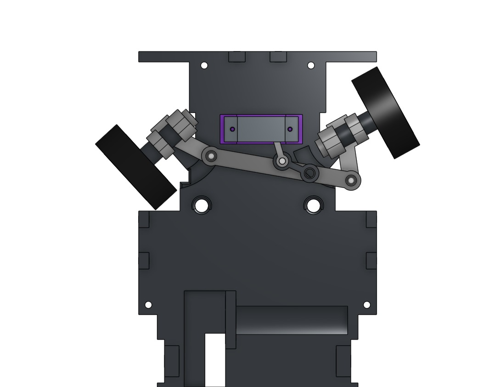<br><sub><b>Giro máximo a la izquierda.</b> La rueda izquierda (interior) gira más que la derecha.</sub></td>
<td align="center" width="50%">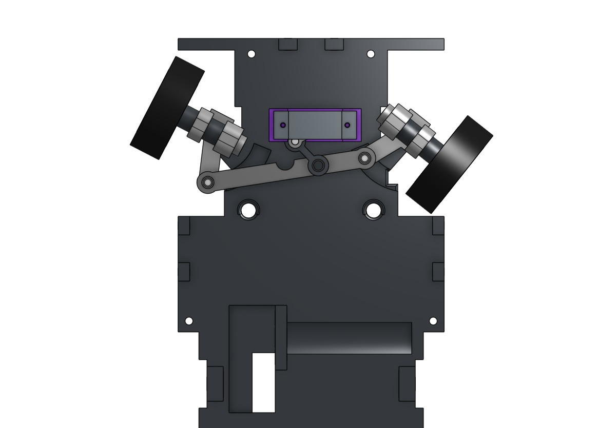<br><sub><b>Giro máximo a la derecha.</b> Ahora la interior es la derecha y es la que más gira.</sub></td>
</tr>
</table>

Pares de ángulos del modelo del mecanismo (barra rígida de 68,6 mm):

| δ interior | δ exterior ideal | δ exterior de nuestro mecanismo | Error | % Ackermann |
| :---: | :---: | :---: | :---: | :---: |
| 10° | 8,85° | 9,25° | +0,40° | 65 % |
| 20° | 15,96° | 17,06° | +1,10° | 73 % |
| 30° | 21,95° | 23,37° | +1,42° | 82 % |
| 40° | 27,24° | 27,96° | +0,72° | 94 % |

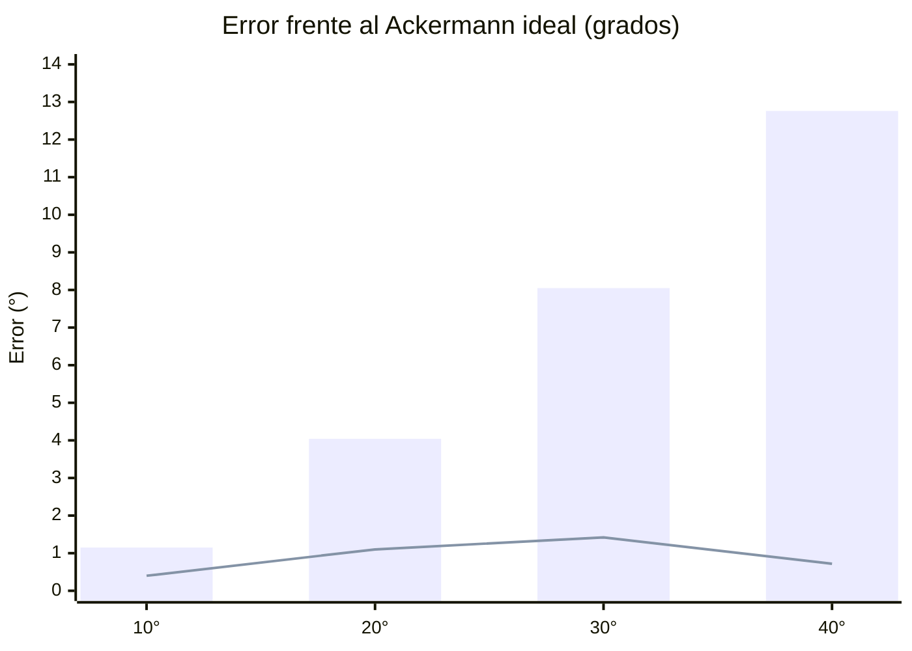
```mermaid
xychart-beta
    title "Error frente al Ackermann ideal (grados)"
    x-axis ["10°", "20°", "30°", "40°"]
    y-axis "Error (°)" 0 --> 14
    bar [1.15, 4.04, 8.05, 12.76]
    line [0.40, 1.10, 1.42, 0.72]
```

<sub>Barras: dirección paralela (como la Lego). Línea: nuestra dirección Ackermann.</sub>

El error nunca pasa de 1,4°, y el mecanismo se acerca más al ideal justo donde más importa: en el giro máximo (94 %). En ángulos pequeños el error absoluto es menor de 0,5°.

**Medición en el montaje real** (transportador sobre papel, servo en sus límites de −50° y +48°):

| Giro | Rueda interior | Rueda exterior | Exterior ideal | Error | % Ackermann |
| :--- | :---: | :---: | :---: | :---: | :---: |
| A la derecha | 40° | 30° | 27,24° | +2,8° | 78 % |
| A la izquierda | 40° | 25° | 27,24° | −2,2° | 118 % |
| **Promedio** | **40°** | **27,5°** | **27,24°** | **+0,3°** | **98 %** |

El promedio de la rueda exterior (27,5°) coincide con el ideal (27,2°) y con el modelo (28,0°). La diferencia de 5° entre lados no se explica por el mecanismo, que es simétrico: lo más probable es un desfase del cero de 2 a 3°, que es la incertidumbre de un transportador sobre papel. El recorrido total de cada rueda (65° y 70°, promedio 67,5°) coincide con los ≈ 68° del modelo.

#### 10.4.10. Ajustes tras las pruebas físicas

- **Servo volteado:** había quedado montado al revés. Al corregirlo y ampliar el rango a −50°/+48°, la dirección alcanza los ángulos esperados.
- **Holguras verticales** del pie y la oreja de la mangueta, y de los casquillos: de 0,5 mm a 0,1 mm por lado. Eliminó el juego vertical; los puntos muertos que aparecieron se resolvieron con el servo corregido y el rango ampliado.
- **Canal de unos 2 mm** en la cara superior del chasis para las cabezas de los tornillos de las puntas de los brazos, que rozaban.
- **Pivote M3 con la cabeza embutida.** No conseguimos tornillos de hombro, así que las tuercas de los tornillos normales se fijan con autoblocante o fijador de roscas.
- **Adaptador de rueda alargado** de 13,7 a 25,7 mm: el ancho entre extremos de rueda queda en ≈ 143 mm, igual que el eje trasero.
- **Eje de rueda:** varilla de soldadura de Ø2,6 mm con apoyo impreso en lugar de rodamientos 604ZZ, y unión en cruz Lego alojada en un hueco de 6 mm del adaptador.

**Efecto del ancho de 143 mm:** la geometría Ackermann no cambia, porque depende de K = 84 mm y L = 112 mm y no de la vía. El centro de la rueda queda unos 1,5 mm más afuera por lado, lo que sube un 9 % el esfuerzo de dirección (insignificante frente al margen de más de 6 veces) y aleja el neumático 1,5 mm de la mangueta y el chasis. Con la vía delantera igual a la trasera, las ruedas traseras siguen las huellas de las delanteras y el vehículo es más estable.

#### 10.4.11. Comparación con la dirección Lego

| Aspecto | Dirección Lego (anterior) | Dirección Ackermann (actual) |
| :--- | :--- | :--- |
| **Geometría** | Paralela: el mismo ángulo en las dos ruedas | Ackermann: K = 84 mm, L = 112 mm, brazos a 20,56° |
| **Ángulo máximo** | Reducido (lo típico en Lego es 15° a 20°) | 40° interior y 25°–30° exterior (medido) |
| **Radio de giro mínimo** | ≈ 308 a 418 mm con 20° a 15° ($R \approx L / \tan\delta$) | **176 mm**, un 43 % menor que con 20° |
| **Error frente al ideal** | 4,0° con 20° y 8,1° con 30° | 1,1° con 20° y 1,4° con 30° |
| **Neumáticos** | Se arrastran de lado al girar | Casi tangentes a sus círculos de giro |
| **Pivotes** | Encaje a presión en un recorte del chasis, con holgura | Pivote M3 con ajuste definido y tuerca autoblocante |
| **Rigidez** | Plástico Lego con juego | PETG-CF con holguras de 0,1 mm por lado |
| **Rango del servo** | — | 98° (−50° a +48°), dentro de la capacidad del servo |

#### 10.4.12. Decisiones de diseño

| Decisión | Alternativa descartada | Por qué |
| :--- | :--- | :--- |
| K = 84 mm | K = 96 o 108 mm | Evita que las orejas de la mangueta invadan la llanta; casi no se pierde giro |
| Brazo de 22 mm | — | Da el recorrido de barra necesario con un brazo de servo de 14 mm |
| Servo invertido delante de la barra | Servo detrás con biela en Z de 25 mm | Biela plana en un solo plano: más rígida y sin holgura por palanca; libera el centro del chasis |
| Servo apoyado sobre la placa | Servo hundido en un hueco | La rueda baja 6,85 mm y el servo mide ~28 mm: colgaría hasta el suelo |
| Brazos y barra sobre la placa (z 4,5–11) | Barra por debajo | Evita el roce con el suelo |
| Relleno de huecos hasta x = ±30 mm | Relleno completo | Apoya el soporte del servo y deja 1 mm contra la columna y la oreja al girar |
| Kingpin metálico M3 | Rosca girando contra el plástico | Evita el desgaste del plástico; el inserto de latón solo sujeta |
| Varilla de soldadura Ø2,6 mm con apoyo impreso | Rodamientos 604ZZ junto al rin | Los rines Lego no tienen espacio interior y la carga es pequeña (≈ 3 N por rueda) |
| Servo volteado y rango −50°/+48° | Rango del CAD (−46,8°/+34,3°) | El montaje real necesitó unos 98°; el análisis del mecanismo lo confirma |
| Holguras de 0,1 mm por lado | Holguras de 0,5 mm | La impresión no necesita tanta tolerancia; elimina el juego vertical |
| Adaptador de 25,7 mm y ancho ≈ 143 mm | Adaptador de 13,7 mm | Iguala la vía delantera con la trasera sin cambiar la geometría |
| PETG-CF | PETG simple | Más rigidez: lo que ordena el PID se traduce en giro sin retraso elástico |

---

### 10.5. 🦈 Segundo piso, separadores y sistema de visión Shark Fin

El segundo nivel distribuye la masa, protege la electrónica y sostiene el sistema de visión.

> [!NOTE]
> **Compromiso de diseño: centro de gravedad**
>
> En la versión anterior la batería iba arriba, en una posición poco segura. El nuevo diseño tiene un compartimento ventilado **debajo del primer piso**. Se pierde un poco de altura libre al suelo, pero el centro de gravedad baja mucho y el carro ya no se balancea ni corre riesgo de volcar en las curvas rápidas.

<p align="center">
  <br>
  <sub>Vista inferior con el compartimento de la batería.</sub>
</p>

#### 10.5.1. Separadores e insertos roscados

Entre el primer y el segundo piso van **separadores de 60 mm** diseñados por nosotros. Las impresoras 3D comunes no hacen roscas pequeñas que aguanten apretar y aflojar muchas veces, así que no roscamos el plástico: en cada extremo del separador colocamos con calor un **inserto roscado de latón M3**. Así los pilares quedan muy resistentes.

#### 10.5.2. Sujeción del teléfono (mordaza ajustable)

El teléfono va sostenido por dos torres laterales en forma de **aleta de tiburón (*Shark Fin*)**. Para que no cedan con la vibración las fijamos así:

* **Fijación a la base:** cada torre lleva **3 insertos roscados de latón** en su base. Los tornillos atraviesan el segundo piso de abajo hacia arriba y aprietan la torre contra la plataforma.
* **Detalle de diseño (DfAM):** para que los insertos entren bien con calor, los agujeros son ciegos de **4.1 mm de diámetro por 9 mm de profundidad**. Con esas medidas el inserto entra y el plástico derretido llena su moleteado sin meterse en la rosca.

> [!IMPORTANT]
> **Evolución del sistema Shark Fin: de ángulo fijo a ángulo ajustable**
>
> - **Versión 1 (soporte fijo):** las torres sostenían la mordaza con un soporte rígido. No se podía cambiar la inclinación del teléfono; cualquier ajuste de la cámara obligaba a desmontar y modificar la pieza.
> - **Versión 2 (ajustable, actual):** quitamos el soporte rígido y pusimos un tornillo que atraviesa cada torre desde afuera y aprieta la base de la mordaza fija. Aflojándolo, la base pivota y se puede recalibrar el ángulo de la cámara en la pista; apretándolo, queda bloqueada por fricción.
>
> Fue un cambio pequeño, un tornillo en lugar de un soporte rígido, pero ahora ajustamos el encuadre en segundos sin herramientas especiales ni reimprimir piezas.

La sujeción en sí es una **prensa ajustable**:

1. **Ángulo:** las dos torres sostienen una **mordaza fija** central, sujeta por los tornillos laterales (que van en sus propios insertos roscados). Aflojándolos se ajusta el ángulo de la cámara; apretándolos queda fijo.
2. **Apriete:** dentro de la mordaza fija se desliza una **mordaza móvil**. En la parte superior de la base fija modelamos una rosca **M10.5** (0.5 mm de holgura para compensar la contracción del PETG), por donde baja un **tornillo M10 impreso en 3D**. Al girarlo empuja la mordaza móvil en línea recta y sujeta el teléfono con firmeza.

<table>
<tr>
<td align="center" width="50%">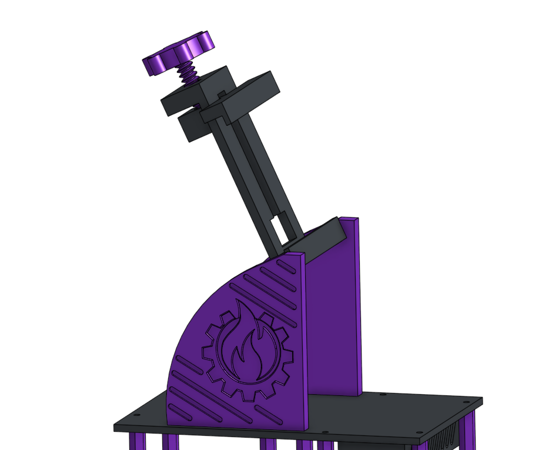<br><sub>Soporte Shark Fin montado entre las torres.</sub></td>
<td align="center" width="50%">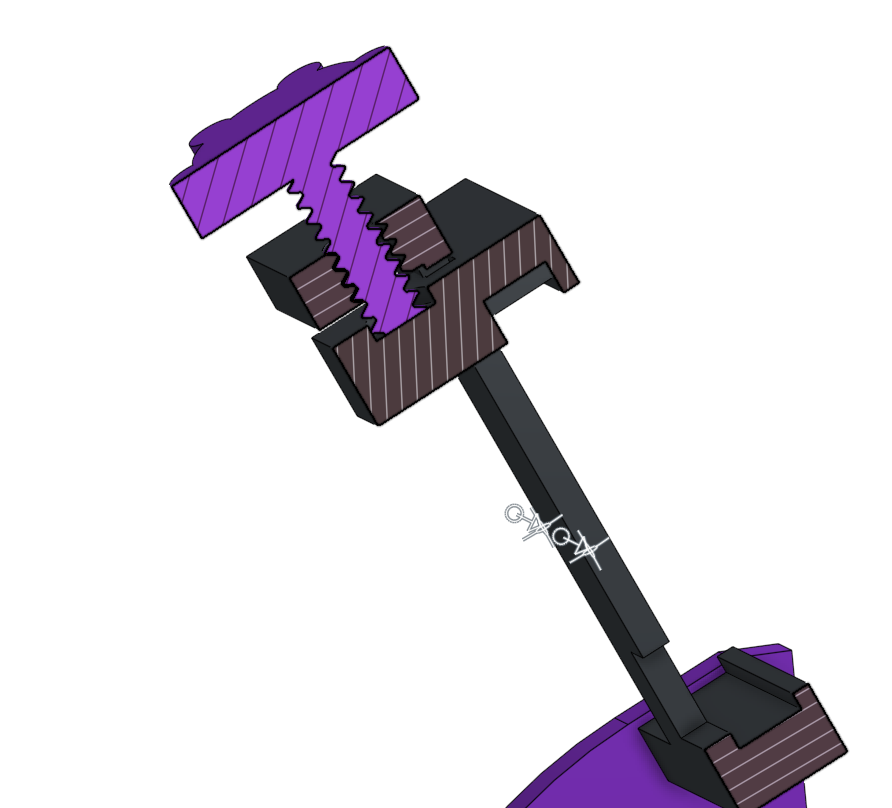<br><sub>Tornillo M10 y rosca M10.5 con holgura térmica.</sub></td>
</tr>
</table>

---

### 10.6. 🧩 Integración total: ensamble maestro CAD

Con todos los subsistemas (tracción, soporte de cámara y chasis) modelados y revisados por separado, armamos en Onshape un ensamble maestro. En esta última revisión virtual comprobamos que se puede llegar a los puertos del microcontrolador y que se cumplen las medidas que nos propusimos.

<p align="center">
  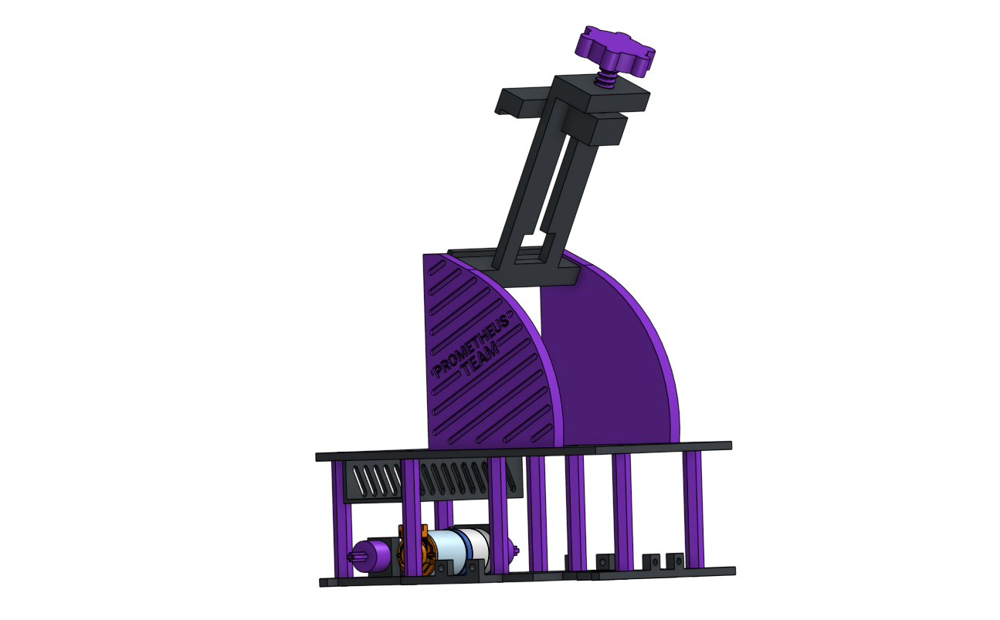<br>
  <sub>El vehículo completo en el entorno de Onshape.</sub>
</p>

---

### 10.7. 🏭 Manufactura aditiva

Imprimimos primero en una **Creality K1C** y después en una **Elegoo Centauri Carbon 2**, con filamento **PETG** y los programas Orca Slicer y Elegoo Slicer. Las piezas de la dirección (manguetas, barra, biela y soporte del servo) van en **PETG-CF**, que es más rígido. Como el chasis recibe golpes y vibraciones todo el tiempo, usamos un perfil pensado para resistencia (*DfAM, Design for Additive Manufacturing*):

| Parámetro | Valor | Justificación |
| :--- | :--- | :--- |
| **Temperatura de boquilla** | 260 °C | Mejor fluidez y mejor adhesión entre capas (*layer adhesion*). |
| **Flujo volumétrico máximo** | 11–12 mm³/s | Limita la presión en el extrusor y evita que se quede corto. |
| **Velocidad de relleno** | 150 mm/s | Evita el desgaste del engranaje del extrusor en recorridos largos. |
| **Perímetros exteriores** | 5 paredes | Forman una capa exterior que resiste la torsión. |
| **Ventilador de capa** | 0 % al inicio / 40 % máx. | Los voladizos quedan peor estéticamente, pero las capas no se separan por enfriarse demasiado rápido. |
| **Cabina** | Abierta | Evita que el calor suba por la garganta del hotend (*heat creep*). |

#### 10.7.1. Optimizaciones de impresión

* **Unión con clavijas (*dowels*):** las piezas con voladizos grandes se cortaron e imprimieron planas. Se unen con clavijas guía de 2.5 mm con 0.15 mm de holgura (*slip-fit*), reforzadas con cianoacrilato.
* **Enfriamiento de piezas pequeñas:** las imprimimos junto con las grandes. El tiempo que el cabezal pasa en las otras piezas les da a las pequeñas tiempo de enfriarse y no se deforman. Usamos además un borde (*brim*) de 5 mm para que se pegaran bien a la cama.

---

### 10.8. 📐 Dimensiones finales y resumen de logros estructurales

| Parámetro | Medida | Estado |
| :--- | :--- | :--- |
| **Largo total** | 179 mm | Reducido |
| **Ancho del chasis** | 115 mm | Mantenido |
| **Ancho total con ruedas** | ≈ 143 mm | Igual adelante y atrás |
| **Distancia entre ejes** | 112 mm | ≈ 1:1 con el ancho del chasis |
| **Radio de giro mínimo** | 176 mm | Con la dirección Ackermann |

**Evolución mecánica (2025 → 2026):**

* **✓ Maniobrabilidad:** el chasis es más corto y la dirección Ackermann baja el radio de giro mínimo a 176 mm.
* **✓ Tracción:** transmisión de 1.67:1 que prioriza el torque, y las ruedas Lego reutilizadas con un adaptador propio.
* **✓ Robustez:** pasamos de fijaciones improvisadas a un Monochasis paramétrico en PETG con separadores de 60 mm e insertos de latón.
* **✓ Visión y centro de gravedad:** la batería bajó al nivel inferior y el sistema Shark Fin sujeta el teléfono sin holguras.

---

## 11. 🧮 Análisis de masa y distribución de peso

### 11.1. 📦 Masa del vehículo: 2025 frente a 2026

Pasar del chasis heredado al **Monochasis** redujo la masa, y lo comprobamos con báscula después del ensamble final. Hay que distinguir **dos etapas dentro de la propia versión de 2025**, porque ese chasis ganó mucho peso entre su primera impresión y su configuración final de competencia:

| Etapa | Con teléfono | Sin teléfono |
| :--- | :---: | :---: |
| **v1 (2025): chasis recién impreso** (sin trípode ni contrapesos) | 943 g | 763 g |
| **v1 (2025): configuración final de competencia** (+ trípode + contrapesos de plomo) | **≈1300 g** | ≈1120 g |
| **v2 (2026): Monochasis actual** | **1092 g** | **861 g** |

| Comparación | Con teléfono | Sin teléfono |
| :--- | :---: | :---: |
| v2 (2026) frente a v1 de competencia (2025) | 🔻 −208 g (−16.0 %) | 🔻 −259 g (−23.1 %) |

> [!IMPORTANT]
> **Lo que realmente costaban el trípode y los contrapesos**
>
> La comparación correcta no es contra los 943 g de la primera impresión de v1 (que todavía **no** tenía el trípode), sino contra su configuración de competencia de **≈1.3 kg**. El trípode y, sobre todo, los contrapesos de plomo que pusimos para compensar el efecto palanca (ver [sección 13](#13--diario-de-ingeniería-evolución-del-chasis-v0--v2)) le añadieron cerca de **360 g**, casi un tercio de su masa sin teléfono. El sobrepeso de v1 no venía del chasis en sí, sino de corregir con peso un defecto geométrico (la flexión por palanca). La v2 lo resolvió de raíz con la proporción 1:1 y no necesita contrapesos.
>
> Frente al chasis de 2025 recién impreso, la v2 pesa algo más (861 g frente a 763 g sin teléfono), porque ahora lleva cuatro ToF, tres reguladores, la tira de LEDs y el soporte Shark Fin.

> [!NOTE]
> **Compromiso de diseño: peso frente a rigidez**
>
> Bajamos hasta 259 g respecto a la versión final de 2025 **sin perder rigidez**, aunque el Monochasis integra en una sola pieza soportes, canales de cableado y alojamientos que antes eran piezas separadas. La reducción viene sobre todo de eliminar los refuerzos improvisados (silicón, agujeros correctivos, contrapesos de plomo), no de adelgazar las paredes.

### 11.2. 📊 Distribución de masa estática (eje delantero / eje trasero)

Con el teléfono montado en el *Shark Fin* pesamos cada eje por separado para conocer el centro de gravedad longitudinal:

| Eje | Masa medida | Distribución |
| :--- | :---: | :---: |
| **Delantero** | 660 g | **54.5 %** |
| **Trasero** | 550 g | **45.5 %** |
| **Total (configuración de medición)** | 1210 g | 100 % |

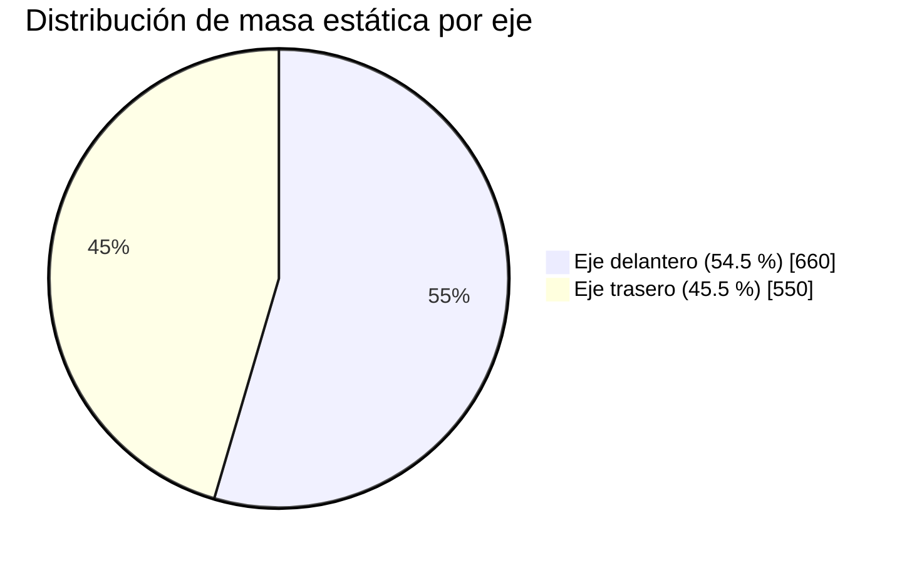
```mermaid
pie showData
    title Distribución de masa estática por eje
    "Eje delantero (54.5 %)" : 660
    "Eje trasero (45.5 %)" : 550
```

> [!IMPORTANT]
> **Interpretación**
>
> El eje delantero lleva unos 9 puntos más que un reparto 50/50. Es lo esperado: el teléfono y el *Shark Fin*, que son lo más pesado montado en altura, están sobre el segundo piso hacia la zona delantera-media. La batería LiPo se movió **debajo del primer piso** (ver [10.5](#105--segundo-piso-separadores-y-sistema-de-visión-shark-fin)) justamente para bajar el centro de gravedad, aunque no elimina por completo el sesgo hacia adelante. Este reparto ayuda a la tracción al frenar y a la respuesta de la dirección, pero deja menos peso sobre el eje motriz, algo que revisamos en el cálculo de agarre ([12.5](#125--coeficiente-de-fricción-y-agarre)).

---

## 12. 🚀 Velocidad, torque y tracción

Calculamos la velocidad lineal y el torque del tren motriz con la masa actual del vehículo en configuración de competencia (con el teléfono), teniendo en cuenta la caja reductora del motor y nuestra transmisión de engranajes 15T → 25T.

### 12.1. 💨 Velocidad lineal del vehículo

El motor 25GA-370 gira a 220 RPM en el eje de salida de su caja reductora. Convertido a radianes por segundo:

$$\omega_{\text{motor}} = \frac{220 \cdot 2\pi}{60} \approx 23.04 \text{ rad/s}$$

La transmisión piñón (15T) → corona (25T) reduce otra vez la velocidad en la rueda:

$$\omega_{\text{rueda}} = \omega_{\text{motor}} \cdot \frac{15}{25} \approx 13.82 \text{ rad/s} \;(\approx 132 \text{ RPM})$$

Con un radio de rueda $r = 0.04$ m, la velocidad lineal máxima teórica es:

$$v = \omega_{\text{rueda}} \cdot r = 13.82 \cdot 0.04 \approx 0.55 \text{ m/s}$$

### 12.2. 🔩 Torque necesario y torque disponible

Como criterio exigente tomamos como torque de referencia el necesario para sostener todo el peso del vehículo en el radio de la rueda (equivale a subir una pared vertical). Es mucho más de lo que pide mover el carro en la pista, donde solo hay que vencer la resistencia a la rodadura:

$$T_{\text{ref}} = m \cdot g \cdot r$$

Donde:

* $m$ = masa del vehículo con teléfono (1.092 kg)
* $g$ = gravedad (9.81 $\text{m/s}^2$)
* $r$ = radio de las ruedas (0.04 m)

$$T_{\text{ref}} = 1.092 \cdot 9.81 \cdot 0.04 \approx 0.429 \text{ N·m}$$

El motor entrega 0.0343 N·m antes de su caja reductora (21.3:1), y nuestra transmisión multiplica el torque por 25/15:

$$T_{\text{salida motor}} = 0.0343 \cdot 21.3 \approx 0.731 \text{ N·m} \qquad T_{\text{rueda}} = 0.731 \cdot \frac{25}{15} \approx 1.218 \text{ N·m}$$

### 12.3. 🔒 Margen de seguridad de torque

$$\text{Margen de seguridad} = \frac{T_{\text{rueda}}}{T_{\text{ref}}} \times 100 = \frac{1.218}{0.429} \times 100 \approx 284\,\%$$

> [!IMPORTANT]
> **Interpretación del margen**
>
> Incluso con un criterio tan exigente, el tren motriz entrega casi **tres veces** el torque de referencia. Ese excedente se traduce en capacidad de aceleración, tolerancia a superficies con más fricción de la esperada y margen ante el desgaste de los engranajes impresos. El peso del teléfono no compromete la agilidad del carro.

### 12.4. ⏳ Tiempo teórico de vuelta frente al tiempo real

Con la velocidad máxima calculada ($v \approx 0.55$ m/s) podemos estimar cuánto tardaría una vuelta y compararlo con lo que medimos en las pruebas:

$$\text{Tiempo teórico} = \frac{\text{Distancia de una vuelta}}{v} \approx \frac{9.5 \text{ m}}{0.55 \text{ m/s}} \approx 17.2 \text{ s}$$

| Modo | Tiempo teórico (v máx. constante) | Tiempo real medido (promedio) | Velocidad real efectiva | % de la velocidad teórica |
| :--- | :---: | :---: | :---: | :---: |
| **Vuelta libre** | ≈ 17.2 s | **25 s** | ≈ 0.38 m/s | ≈ 69 % |
| **Modo obstáculos** | ≈ 17.2 s (misma distancia base) | **1:20 min (80 s)** | ≈ 0.12 m/s | ≈ 21 % |

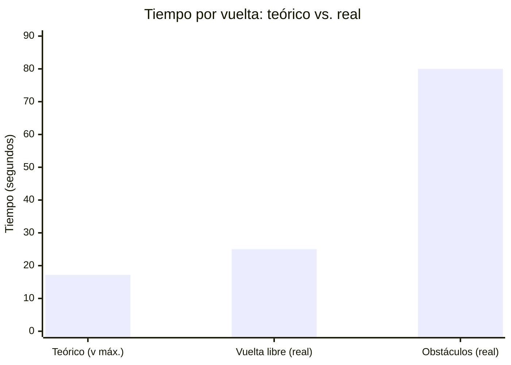
```mermaid
xychart-beta
    title "Tiempo por vuelta: teórico vs. real"
    x-axis ["Teórico (v máx.)", "Vuelta libre (real)", "Obstáculos (real)"]
    y-axis "Tiempo (segundos)" 0 --> 90
    bar [17.2, 25, 80]
```

> [!IMPORTANT]
> **Por qué la diferencia es esperable y qué nos dice**
>
> El tiempo teórico supone velocidad máxima constante durante toda la vuelta, y eso no pasa. En vuelta libre el algoritmo reduce la velocidad para corregir el ángulo con el BNO055, ajustar la distancia al muro y girar en cada esquina. En modo obstáculos, además, el carro se detiene a esperar el comando de la app y hace las maniobras de cambio de carril. Llegar al ~69 % de la velocidad teórica en vuelta libre es coherente con un algoritmo que prioriza la precisión de la trayectoria. La caída al ~21 % en obstáculos confirma que el límite no es mecánico (el motor tiene torque de sobra, ver 11.3), sino el tiempo de decisión y de maniobra del modo de evasión.

### 12.5. 🛞 Coeficiente de fricción y agarre

Para completar el análisis hay que saber cuánta fuerza pueden transmitir las ruedas Lego Technic al tapete de la pista antes de patinar:

$$F_{\text{fricción}} = \mu \cdot N$$

Donde:

- **μ (coeficiente de fricción estático rueda–tapete):** lo estimamos entre **0.6 y 0.8**, un rango típico para neumáticos de goma Lego sobre superficies texturizadas parecidas al tapete de competencia. No tenemos tribómetro, por eso usamos un rango y no un valor único.
- **N (fuerza normal sobre el eje motriz):** sale de la distribución de masa medida: **550 g × 9.81 m/s² ≈ 5.4 N** sobre el eje trasero.

| Escenario | μ | Fuerza de fricción máxima (eje trasero) | Aceleración máxima ($F/m$, con 1.092 kg) |
| :--- | :---: | :---: | :---: |
| Conservador | 0.6 | ≈ 3.24 N | ≈ 3.0 m/s² |
| Favorable | 0.8 | ≈ 4.32 N | ≈ 4.0 m/s² |

> [!TIP]
> **Qué nos dice este dato**
>
> El motor puede empujar con unos **30 N** en la rueda ($1.218 \text{ N·m} / 0.04 \text{ m}$), mucho más que los 3.2–4.3 N de agarre. Eso significa que **la aceleración la limita el agarre y no el motor**: si se aplica toda la potencia de golpe, las ruedas pueden patinar. Aun así, con 3 m/s² el carro llega a su velocidad máxima (0.55 m/s) en menos de 0.2 s, que es más que suficiente para la pista. También explica por qué conviene no quitar más peso del eje trasero.

### 12.6. 🔗 Alternativas de transmisión evaluadas: piñón-corona frente a correa dentada

Antes de quedarnos con la relación 1.67:1 de engranajes evaluamos una transmisión por correa dentada. La descartamos por estas razones:

| Criterio | 🟢 Piñón-corona (elegido) | 🔴 Correa dentada (descartada) |
| :--- | :--- | :--- |
| **Relación de transmisión** | Exacta y constante (contacto diente a diente) | Puede **patinar (*slipping*)** y cambiar la relación real con carga |
| **Repuestos en Venezuela** | Alta disponibilidad: los imprimimos nosotros | Baja: las correas de medida específica son difíciles de conseguir |
| **Con carga** | Estable: la masa del vehículo (861–1092 g) no afecta el engrane | Riesgo de que la correa se rompa con el peso del vehículo |
| **Ajuste / tensado** | No necesita: el engrane no requiere tensión | Crítico: poca tensión hace que patine y demasiada daña los ejes |
| **Mantenimiento en pits** | Fácil: cambio rápido, tolerancias conocidas | Difícil: hay que volver a tensarla cada vez que se toca |
| **Costo de iterar el diseño** | Bajo: un piñón o corona nuevo es una reimpresión | Alto: depende de conseguir una correa a medida |

> [!IMPORTANT]
> **Conclusión**
>
> Los engranajes dan un **acople positivo**, sin un elemento elástico en medio, así que la rotación del motor y la de las ruedas nunca pierden sincronía. Eso es importante para que el algoritmo de navegación, que asume una relación de transmisión conocida, se comporte siempre igual. Además, como fabricamos las piezas nosotros, controlamos las tolerancias de cada diente y podemos cambiar el diseño en horas en lugar de depender de proveedores, algo decisivo en un país donde conseguir piezas específicas (como correas a medida) es difícil.

---

## 13. 📓 Diario de ingeniería: evolución del chasis (v0 → v2)

Aquí registramos las fallas y rediseños que nos llevaron al Monochasis actual, siguiendo el orden diagnóstico → causa raíz → solución.

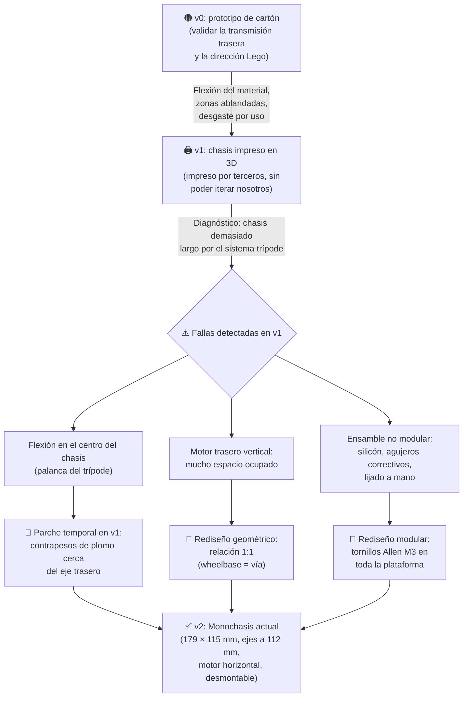
```mermaid
flowchart TD
    A["🟤 v0: prototipo de cartón<br/>(validar la transmisión trasera<br/>y la dirección Lego)"] -->|"Flexión del material,<br/>zonas ablandadas,<br/>desgaste por uso"| B["🖨️ v1: chasis impreso en 3D<br/>(impreso por terceros, sin<br/>poder iterar nosotros)"]
    B -->|"Diagnóstico: chasis demasiado<br/>largo por el sistema trípode"| C{"⚠️ Fallas detectadas en v1"}
    C --> C1["Flexión en el centro del chasis<br/>(palanca del trípode)"]
    C --> C2["Motor trasero vertical:<br/>mucho espacio ocupado"]
    C --> C3["Ensamble no modular:<br/>silicón, agujeros correctivos,<br/>lijado a mano"]
    C1 --> D["🔧 Parche temporal en v1:<br/>contrapesos de plomo cerca<br/>del eje trasero"]
    C2 --> E["📏 Rediseño geométrico:<br/>relación 1:1<br/>(wheelbase = vía)"]
    C3 --> F["🔩 Rediseño modular:<br/>tornillos Allen M3 en<br/>toda la plataforma"]
    D --> G["✅ v2: Monochasis actual<br/>(179 × 115 mm, ejes a 112 mm,<br/>motor horizontal, desmontable)"]
    E --> G
    F --> G
```

### 13.1. 🟤 Iteración v0: prototipo de cartón

| | |
| :--- | :--- |
| **Objetivo** | Comprobar que la transmisión trasera y la dirección delantera, ambas hechas con piezas Lego, encajaran físicamente antes de pasar a un diseño CAD. |
| **Método** | Varias versiones de la base de cartón, ajustando medidas hasta que ambos sistemas encajaron bien. |
| **Falla** | Después de varias pruebas el cartón se **dobló**, se ablandó en algunas zonas por la humedad y el uso y mostró fatiga general. Era lo esperado de un material provisional. |
| **Causa raíz** | El cartón nunca se eligió como material estructural; solo servía para definir medidas, no para soportar carga. |
| **Lección** | Las medidas validadas en cartón pasaron directo al CAD de la siguiente versión, sin repetir la prueba y error en un material que no aguanta carga. |

### 13.2. 🧪 Iteración v1: primer chasis impreso en 3D

| | |
| :--- | :--- |
| **Objetivo** | Pasar las medidas del cartón a un material rígido y añadir un trípode para subir el teléfono. |
| **Falla #1: flexión** | El chasis, al ser demasiado largo, se doblaba visiblemente en la zona media. |
| **Causa raíz #1** | El vástago del trípode hacía **palanca**: empujaba el chasis hacia adelante y concentraba el esfuerzo en el centro de la plataforma. |
| **Parche #1 (no fue una solución de raíz)** | Rellenamos tapas de tubería con plomo y las pusimos cerca del eje trasero como contrapeso. Esto, más el propio trípode, subió la masa de 943 g a **≈1300 g** (+357 g): estábamos corrigiendo un problema geométrico con peso en vez de atacar la causa. |
| **Falla #2: mal aprovechamiento del espacio** | La tracción trasera, aunque tenía diferencial, llevaba el motor **vertical** respecto al eje en lugar de horizontal y paralelo. |
| **Causa raíz #2** | Esa orientación ocupaba mucho más volumen del necesario y le quitaba espacio a la electrónica y al cableado. |
| **Falla #3: difícil de mantener** | El chasis necesitó varias correcciones después de impreso: agujeros extra, lijado y piezas pegadas con silicón. |
| **Causa raíz #3** | Lo imprimió un proveedor externo (no teníamos impresora propia), así que no podíamos corregir el CAD e imprimir otra vez rápido; cada error se arreglaba a mano sobre la pieza. |
| **Lección** | Un ensamble que depende de pegamento y ajustes manuales no se puede reproducir ni reparar en los pits. Por eso en v2 decidimos: (1) diseñar con las tolerancias correctas desde el CAD y (2) usar en todo tornillos Allen M3 desmontables. |

### 13.3. ✅ Iteración v2: Monochasis (versión actual, 2026)

| | |
| :--- | :--- |
| **Objetivo** | Corregir a la vez las tres fallas de v1: flexión, mal aprovechamiento del espacio y mantenimiento difícil. |
| **Solución a la flexión** | Chasis más corto (relación ≈1:1, ejes a 112 mm) para eliminar la palanca que lo doblaba. Ya no hace falta ningún contrapeso. |
| **Solución al espacio** | Motor **horizontal y paralelo al eje trasero**, en una cama hundida hecha para el 25GA-370 dentro del Monochasis. |
| **Solución al mantenimiento** | Toda la plataforma se arma con **tornillos Allen M3** sobre insertos de latón colocados con calor. No hay silicón y cualquier pieza se desmonta sin herramientas especiales ni retoques. |
| **Resultado medible** | Frente a la v1 de competencia, la masa bajó **259 g sin teléfono** (1120 g → 861 g) y **208 g con teléfono** (≈1300 g → 1092 g), aun integrando más funciones en una sola pieza. La reducción vino de quitar refuerzos correctivos, no de adelgazar paredes. |

---

## 14. 🔧 Guía de ensamble paso a paso

En la WRO se valora mucho que un proyecto se pueda **reproducir**. Por eso documentamos cómo armamos el vehículo, con consejos y técnicas de taller, para que cualquier otro equipo pueda replicarlo. Los archivos STL de todas las piezas están en la carpeta [`models/`](models/).


```mermaid
flowchart LR
    P1["1. Imprimir piezas"] --> P2["2. Motor y piñón"] --> P3["3. Eje trasero y ruedas"] --> P4["4. Dirección Ackermann"]
    P4 --> P5["5. Sensores ToF"] --> P6["6. Separadores"] --> P7["7. Torres Shark Fin"] --> P8["8. Segundo piso y electrónica"]
```

---

### 14.1. 🔹 Paso 1: impresión 3D

Primero hay que imprimir todas las piezas estructurales del repositorio. Nuestros parámetros están en la [sección 10.7](#107--manufactura-aditiva), pero puedes ajustarlos según tu impresora o el material que uses.

> [!TIP]
> **Consejo para la transmisión:** los engranajes necesitan la mayor resistencia posible. Si imprimes en PETG, sube la temperatura y aumenta bastante el número de perímetros; así los dientes no se parten con el torque del motor.

<p align="center">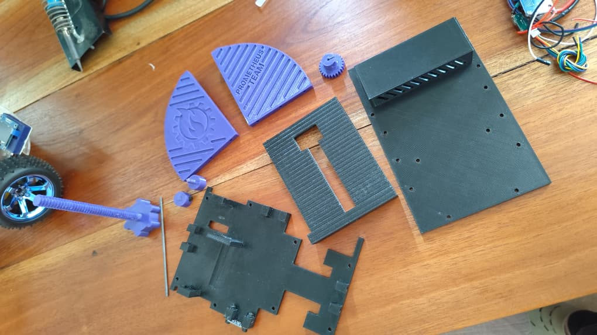</p>

---

### 14.2. 🔹 Paso 2: motor y piñón en el Monochasis

Con las piezas listas, empezamos por el primer piso.

1. Fija el motor a su cama con tornillos M3. **Importante:** deja los terminales del motor hacia arriba o hacia un lado libre; así es mucho más fácil llevar los cables al driver TB6612FNG.
2. Coloca el piñón en el eje del motor; entra a presión (*press-fit*). El piñón tiene un lado redondeado y un pequeño separador integrado para que haga tope y no roce con la caja reductora. Verifica que quede firme.

<p align="center">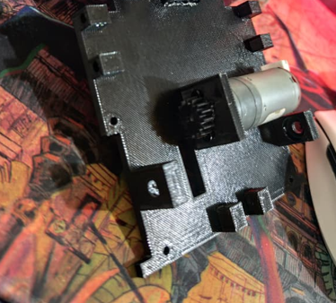</p>

---

### 14.3. 🔹 Paso 3: eje trasero, corona y adaptadores de rueda

Para el eje usamos una solución de taller fácil de conseguir: el núcleo limpio de un electrodo de soldadura.

1. Como la varilla es más delgada que el agujero de los rodamientos, auméntale el diámetro con termorretráctil.
2. Pon termorretráctil solo en **un extremo**, hasta que entre con algo de presión en el primer rodamiento del chasis.
3. Pasa la varilla por ese rodamiento, mete la corona (25T) en el centro y pon termorretráctil en el otro extremo para pasarlo por el segundo rodamiento.
4. Alinea los dientes de la corona con el piñón. Cuando engranen, pon un tornillo transversal con su tuerca en el collarín de la corona y apriétalo para cerrar la abrazadera tipo "C" sobre la varilla.
5. Por último, coloca los adaptadores de las ruedas Lego en los dos extremos de la varilla y asegúralos con tornillo y tuerca, con el mismo sistema de abrazadera que la corona.

> [!TIP]
> **Para que no patine:** antes de encoger el termorretráctil con calor, pon unas gotas de cianoacrilato entre el metal y el plástico. Así no gira sobre la varilla cuando el motor hace fuerza.

<p align="center">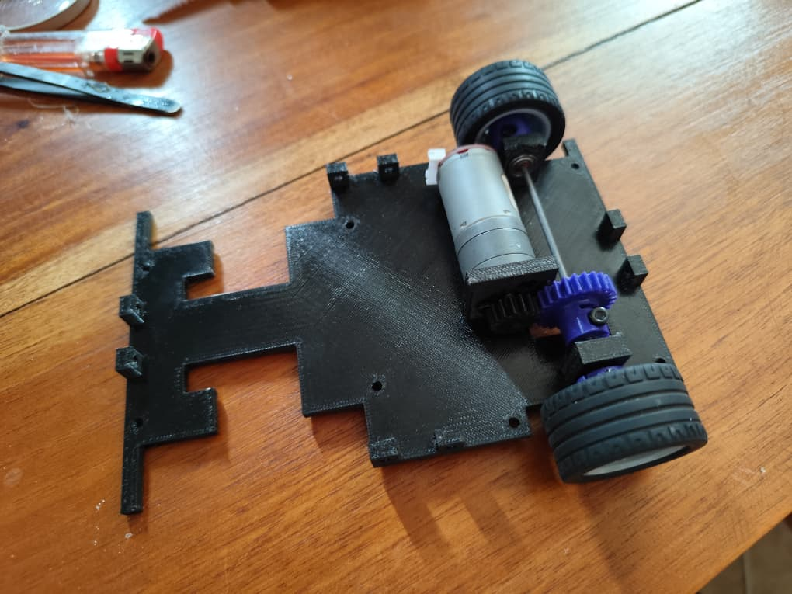</p>

---

### 14.4. 🔹 Paso 4: dirección Ackermann

Las piezas y medidas de la dirección están en la [sección 10.4](#104--sistema-de-dirección-ackermann).

1. Coloca cada mangueta en su pivote con un tornillo M3 (cabeza embutida) y fija la tuerca con autoblocante o fijador de roscas. La mangueta tiene que girar libre, sin juego vertical.
2. Une las puntas de los dos brazos de dirección con la barra de acoplamiento (agujeros a 68,6 mm).
3. Monta el servo **invertido** (eje hacia abajo) en su soporte, delante de la barra, apoyado sobre la placa.
4. Conecta el brazo del servo (último agujero, a 14 mm del eje) con el agujero central de la barra mediante la biela plana de 14,5 mm.
5. Con las ruedas rectas, centra el servo y comprueba el recorrido de −50° a +48° sin que nada roce el chasis. Ajusta la convergencia (*toe-in*) con la ranura de la barra.

> [!TIP]
> Si la dirección no llega al ángulo esperado o se traba en un punto muerto, revisa que el servo no esté montado al revés: nos pasó en el primer armado.

---

### 14.5. 🔹 Paso 5: sensores ToF

En el contorno del primer piso (adelante, atrás, izquierda y derecha) están los soportes para los sensores láser VL53L0X. Fija cada módulo a su soporte con tornillos M3 y tuercas por detrás, para que no vibre y la lectura sea estable.

<p align="center">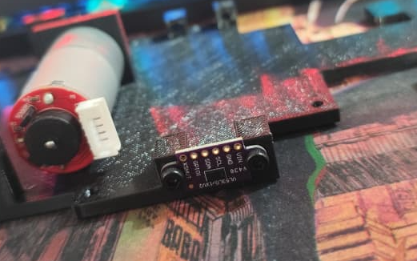</p>

---

### 14.6. 🔹 Paso 6: separadores

Coloca con calor los insertos de latón M3 en cada extremo de los separadores de 60 mm. Cuando se enfríen, ponlos en su lugar sobre el primer piso y fíjalos con tornillos M3 desde la cara inferior del chasis. Con esto el primer nivel queda terminado.

<p align="center">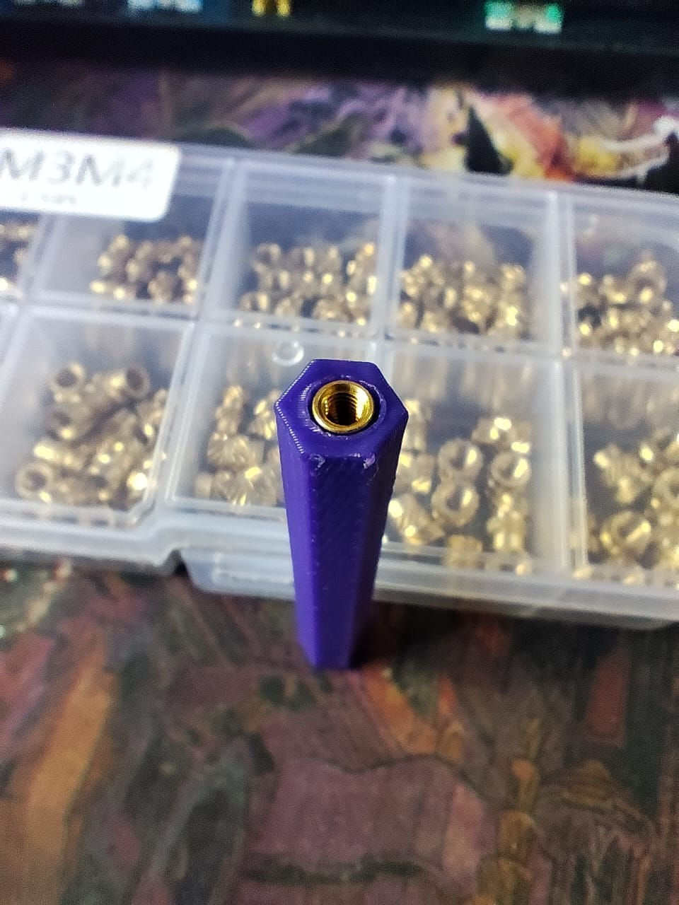</p>

---

### 14.7. 🔹 Paso 7: sistema Shark Fin (soporte del teléfono)

Antes de unir los dos niveles hay que preparar el segundo piso con las torres laterales que sostienen el teléfono.

1. Coloca con calor 3 insertos M3 en la base de cada torre (6 en total).
2. Alinea las torres con los agujeros del segundo piso.
3. Mete los tornillos **desde abajo** del segundo piso hacia arriba para que aprieten las torres contra la plataforma.

*(Por esta forma de atornillar desde abajo no fijamos el segundo piso a los separadores en el paso anterior: no habría espacio para meter la herramienta.)*

<p align="center">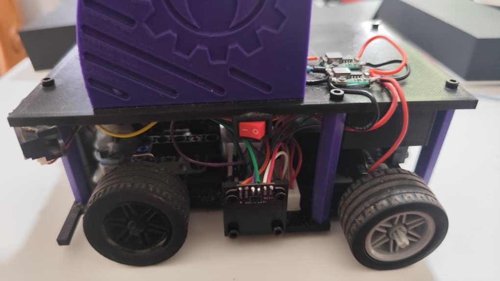</p>

---

### 14.8. 🔹 Paso 8: integración final

Con las torres bien fijas, coloca el segundo piso sobre los separadores del paso 6 y asegúralo con tornillos M3 por arriba. Luego monta la mordaza central de ángulo ajustable entre las dos torres y continúa con el cableado y la electrónica.

<p align="center">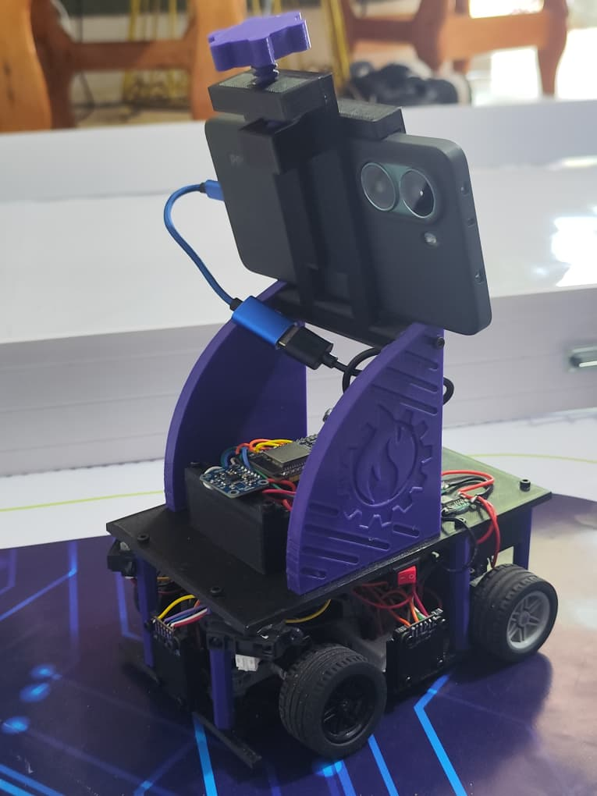</p>

---

## 15. 💻 Software y control

### 15.1. 🧭 Continuidad del software e integración del BNO055

La arquitectura del firmware y la lógica general del vehículo se mantienen respecto a 2025, porque ya habían funcionado bien en competencia. Lo que cambió es de dónde salen los datos.

El cambio más importante de esta temporada es el reemplazo del giroscopio MPU6050 (y del magnetómetro con el que lo corregíamos) por la IMU **BNO055**. Partimos de la misma lógica de orientación, pero con este sensor la deriva del giroscopio (*gyro drift*) se vuelve prácticamente despreciable. El efecto en el comportamiento del carro es muy notorio:

* **Orientación confiable:** el vehículo conoce en todo momento su ángulo real respecto al punto de partida.
* **Mejor estabilidad en el carril:** sabe con precisión cuándo está recto respecto al pasillo, así que el servo corrige lo justo y no sobrecorrige.

### 15.2. 📁 Archivos del firmware y librerías

| Archivo | Uso |
| :--- | :--- |
| [`src/v1PrometeusTeam2026.ino`](src/v1PrometeusTeam2026.ino) | Modo vuelta libre (desafío abierto), temporada 2026 |
| [`src/v2PrometrusTeam2026.ino`](src/v2PrometrusTeam2026.ino) | Modo obstáculos, temporada 2026 |
| [`src/README.md`](src/README.md) | Instrucciones para instalar las librerías y cargar el código |

**Librerías usadas en 2026:** `Wire`, `Adafruit_BNO055`, `Adafruit_Sensor`, `Adafruit_VL53L0X`, `Adafruit_TCS34725`, `Adafruit_NeoPixel`, `ESP32Servo` y `ColorConverterLib`.

### 15.3. 🔄 Lógica común de navegación

Los dos programas comparten esta base:

* **Arranque:** al encender, el ESP32 inicializa los sensores, asigna las direcciones de los ToF y espera con los LEDs en modo de espera hasta que el interruptor de D23 pasa a LOW.
* **Referencia de orientación:** al iniciar se guarda el ángulo del BNO055 como 0°. En cada esquina el ángulo objetivo avanza 90° (0°, 90°, 180°, 270°).
* **Detección de líneas:** el TCS34725 se lee cada 30 ms en una tarea propia de FreeRTOS. El color se convierte a HSV (con `ColorConverterLib`) y una línea solo cuenta si se confirma en varias lecturas seguidas. Después de contar una, las siguientes se ignoran durante 5 s para no contar la misma línea dos veces.
* **Sentido de la vuelta:** lo decide la primera línea que aparece. Si es **azul**, el carro gira a la izquierda en todas las esquinas (sentido antihorario); si es **naranja**, gira a la derecha (sentido horario).
* **Fin del recorrido:** cuatro líneas son una vuelta, así que al llegar a **12 líneas** (3 vueltas) el carro avanza un tramo corto y se detiene.
* **Giros con PID:** un PID sobre el error de ángulo (Kp = 2.5, Ki = 0.8, Kd = 0.4) lleva el carro al nuevo ángulo objetivo con una tolerancia de 5°.
* **Centrado con PID:** otro PID sobre la distancia a la pared (Kp = 2.0, Kd = 1.2) mantiene el carro en su trayectoria. Si el desvío angular supera los 15°, primero corrige el ángulo y después la distancia; así no zigzaguea.
* **Seguridad:** si un Sharp diagonal detecta la pared a menos de ~13 cm, el carro retrocede un instante y luego continúa.


**Arranque del sistema:**

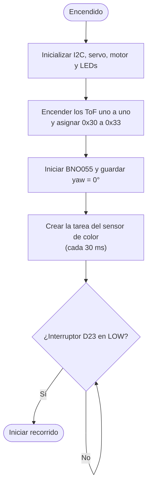
```mermaid
flowchart TD
    A(["Encendido"]) --> B["Inicializar I2C, servo, motor y LEDs"]
    B --> C["Encender los ToF uno a uno<br/>y asignar 0x30 a 0x33"]
    C --> D["Iniciar BNO055 y guardar yaw = 0°"]
    D --> E["Crear la tarea del sensor de color<br/>(cada 30 ms)"]
    E --> F{"¿Interruptor D23 en LOW?"}
    F -- No --> F
    F -- Sí --> G(["Iniciar recorrido"])
```

**Detección de líneas y conteo de vueltas:**

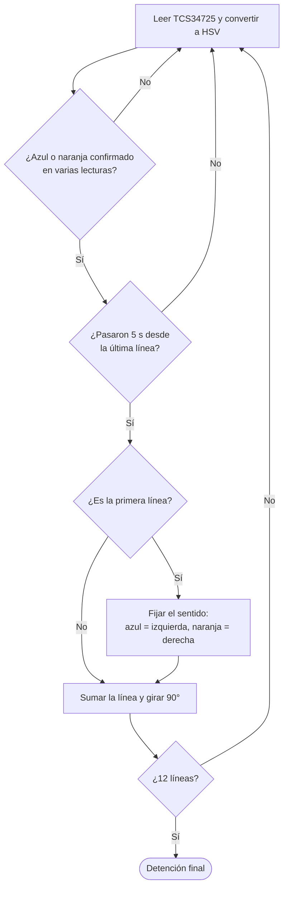
```mermaid
flowchart TD
    L1["Leer TCS34725 y convertir a HSV"] --> L2{"¿Azul o naranja confirmado<br/>en varias lecturas?"}
    L2 -- No --> L1
    L2 -- Sí --> L3{"¿Pasaron 5 s desde<br/>la última línea?"}
    L3 -- No --> L1
    L3 -- Sí --> L4{"¿Es la primera línea?"}
    L4 -- Sí --> L5["Fijar el sentido:<br/>azul = izquierda, naranja = derecha"]
    L4 -- No --> L6
    L5 --> L6["Sumar la línea y girar 90°"]
    L6 --> L7{"¿12 líneas?"}
    L7 -- No --> L1
    L7 -- Sí --> L8(["Detención final"])
```

<p align="center">
  <br>
  <sub>Lógica PID de giro y centrado.</sub>
</p>

### 15.4. 🏁 Modo vuelta libre (pista sin obstáculos)

Este algoritmo busca ir lo más rápido posible en las rectas y hacer bien los giros en las esquinas. Para mantener el carro alineado se apoya sobre todo en el ángulo de la IMU.

* **Estrategia:** el sensor ToF lateral mide la distancia a la pared guía. Si el **BNO055** indica que el carro se desvió, el sistema corrige primero el ángulo para estabilizarlo y después ajusta la distancia a la pared.
* **Esquinas:** el carro sigue su carril hasta que el sensor de color detecta una línea. En ese momento se suspende el centrado y se hace el giro controlado de 90°. Después vuelve a enderezarse y retoma el seguimiento de la pared.


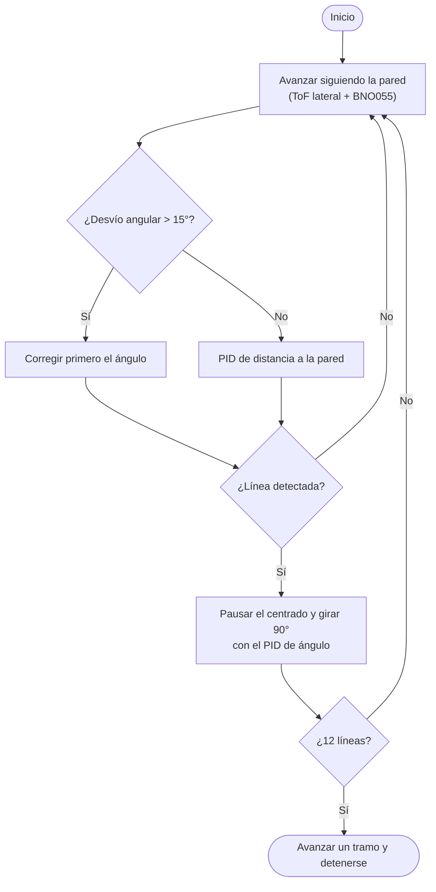
```mermaid
flowchart TD
    A(["Inicio"]) --> B["Avanzar siguiendo la pared<br/>(ToF lateral + BNO055)"]
    B --> C{"¿Desvío angular > 15°?"}
    C -- Sí --> D["Corregir primero el ángulo"]
    C -- No --> E["PID de distancia a la pared"]
    D --> F{"¿Línea detectada?"}
    E --> F
    F -- No --> B
    F -- Sí --> G["Pausar el centrado y girar 90°<br/>con el PID de ángulo"]
    G --> H{"¿12 líneas?"}
    H -- No --> B
    H -- Sí --> I(["Avanzar un tramo y detenerse"])
```

<p align="center">
  <br>
  <sub>Lógica de vueltas a la pista.</sub>
</p>

### 15.5. 🚧 Modo obstáculos: sistema de carriles

**Salida del estacionamiento.** Al activar el interruptor, el carro mide con los ToF laterales hacia qué lado tiene más espacio y ejecuta la maniobra de salida hacia ese lado.

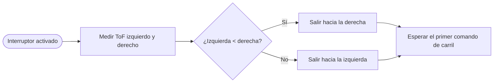
```mermaid
flowchart LR
    A(["Interruptor activado"]) --> B["Medir ToF izquierdo y derecho"]
    B --> C{"¿Izquierda < derecha?"}
    C -- Sí --> D["Salir hacia la derecha"]
    C -- No --> E["Salir hacia la izquierda"]
    D --> F["Esperar el primer comando de carril"]
    E --> F
```

**Carriles.** En lugar de esquivar cada pilar por separado, dividimos el pasillo en carriles: el **carril 1**, a la derecha, para pasar junto a los pilares rojos, y el **carril 2**, a la izquierda, para los verdes. La app reconoce hasta dos pilares a la vez y envía un comando que describe esa combinación (por ejemplo `C21`, `C15` o `C33`). Con eso el carro sabe desde antes a qué carril ir y si tendrá que cambiar de carril a mitad del tramo.

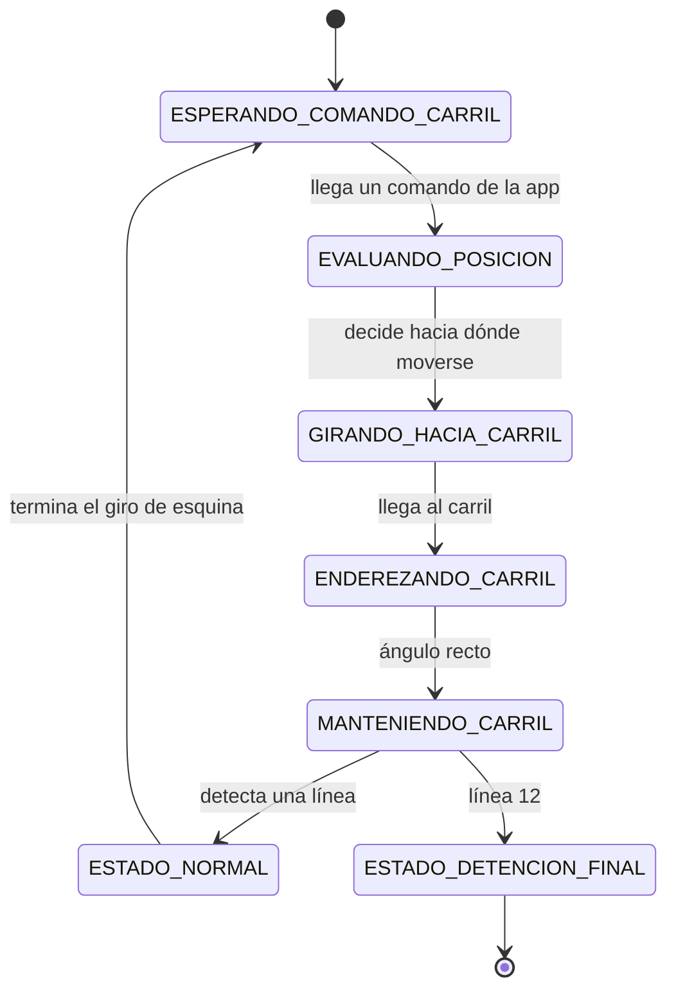
```mermaid
stateDiagram-v2
    [*] --> ESPERANDO_COMANDO_CARRIL
    ESPERANDO_COMANDO_CARRIL --> EVALUANDO_POSICION: llega un comando de la app
    EVALUANDO_POSICION --> GIRANDO_HACIA_CARRIL: decide hacia dónde moverse
    GIRANDO_HACIA_CARRIL --> ENDEREZANDO_CARRIL: llega al carril
    ENDEREZANDO_CARRIL --> MANTENIENDO_CARRIL: ángulo recto
    MANTENIENDO_CARRIL --> ESTADO_NORMAL: detecta una línea
    ESTADO_NORMAL --> ESPERANDO_COMANDO_CARRIL: termina el giro de esquina
    MANTENIENDO_CARRIL --> ESTADO_DETENCION_FINAL: línea 12
    ESTADO_DETENCION_FINAL --> [*]
```

| Estado | Qué hace |
| :--- | :--- |
| `ESPERANDO_COMANDO_CARRIL` | Detiene el motor y lee el puerto serie hasta recibir un comando válido de la app. |
| `EVALUANDO_POSICION` | Mide las distancias laterales para saber en qué parte del pasillo está y hacia dónde tiene que moverse. |
| `GIRANDO_HACIA_CARRIL` | Gira hacia el carril con un ángulo y un tiempo que dependen del comando y de la distancia a la pared. Si el Sharp de ese lado detecta la pared muy cerca, interrumpe el giro, retrocede un poco y continúa. |
| `ENDEREZANDO_CARRIL` | Hace el contragiro hasta quedar otra vez alineado con el tramo (0°, 90°, 180° o 270°). |
| `MANTENIENDO_CARRIL` | Mantiene con PID la distancia a la pared del lado del carril, dando prioridad al ángulo. Sigue así hasta la siguiente línea. |
| `ESTADO_NORMAL` | Hace el giro de esquina y retrocede usando el ángulo del BNO055 y el ToF trasero como guía, para empezar el siguiente tramo recto y a una distancia conocida de los pilares. |
| `ESTADO_DETENCION_FINAL` | Después de la línea 12 avanza un tramo corto y apaga los motores. |

En 2025, después de cada giro el carro retrocedía "a ciegas" durante un tiempo fijo y nunca sabíamos exactamente dónde iba a quedar. Ahora ese retroceso está controlado por el ángulo y por el ToF trasero, así que cada tramo empieza con el carro recto y bien posicionado.

<p align="center">
  <br>
  <sub>Lógica del sistema de carriles.</sub>
</p>

---

### 15.6. 🧠 Arquitectura de control y máquina de estados

Diagrama interactivo de estados desarrollado para la competencia WRO Future Engineers. Permite simular los flujos de control, los sensores ToF, la IMU BNO055 y la lógica de navegación autónoma. Además de los estados de la tabla anterior, muestra la corrección lateral después de cada giro (`ESTADO_CORRECCION_LATERAL`) y la maniobra optimizada que se usa a partir de la línea 5 (`MANIOBRA_OPTIMIZADA`), cuando el carro ya conoce la pista.

**Haz clic en la imagen para abrir el diagrama interactivo:**

<p align="center">
  <a href="https://erchivox.github.io/clasificador-de-animales-en-peligro-de-extinci-n-en-Venezuela/pagina/ModeloArquitecturaEstados.html">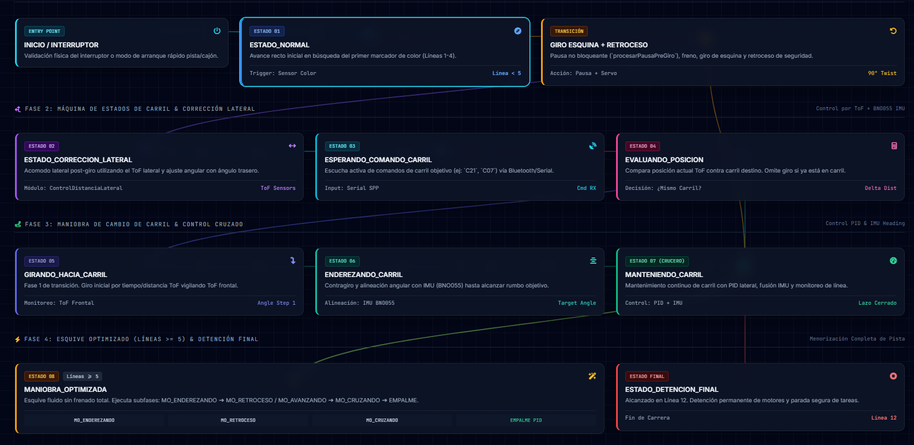</a>
</p>

---

## 16. 📱 Telemetría y visión artificial: aplicación Prometheus V5.0

Nuestra aplicación de detección, hecha en Android Studio con OpenCV, ya va por la versión 5.0 y funciona como el centro de control de nuestro sistema durante las pruebas. Conserva lo que ya funcionaba en 2025 (comunicación USB, interfaz a pantalla completa y monitor serial integrado), pero en 2026 rehicimos buena parte del procesamiento de imagen y de la telemetría para soportar condiciones de pista más exigentes.

El código de la app está en su propio repositorio: [APP-WRO-PROMETHEUS-TEAM](https://github.com/SamFlips/APP-WRO-PROMETHEUS-TEAM/tree/master) · [descarga del proyecto en .zip](https://drive.google.com/file/d/1VvdzdWbxGnchFslUwI8wQfkkwYPTyGRD/view?usp=drive_link).

**Flujo de procesamiento de cada cuadro:**

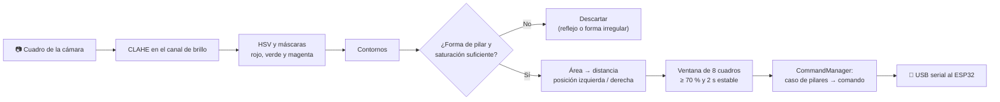
```mermaid
flowchart LR
    A["📷 Cuadro de la cámara"] --> B["CLAHE en el canal de brillo"]
    B --> C["HSV y máscaras<br/>rojo, verde y magenta"]
    C --> D["Contornos"]
    D --> E{"¿Forma de pilar y<br/>saturación suficiente?"}
    E -- No --> X["Descartar<br/>(reflejo o forma irregular)"]
    E -- Sí --> F["Área → distancia<br/>posición izquierda / derecha"]
    F --> G["Ventana de 8 cuadros<br/>≥ 70 % y 2 s estable"]
    G --> H["CommandManager:<br/>caso de pilares → comando"]
    H --> I["🔌 USB serial al ESP32"]
```

### 16.1. 📺 Interfaz V5.0 y monitor serial integrado

| 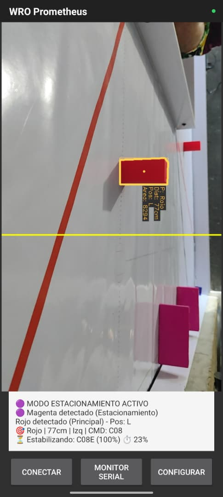 |  |
| :---: | :---: |
| *Interfaz principal con detección de dos objetos y estabilización.* | *Monitor serial integrado funcionando en tiempo real.* |

Estas son las mejoras que implementamos en el núcleo de la aplicación (`MainActivity.kt`, `ColorAnalyzer.kt` y el sistema de configuración):

### 16.2. 🎯 Calibración en pista y menú dinámico

Ya no hace falta abrir Android Studio para ajustar variables en el lugar de la competencia.

* **Calibración por muestras:** un menú permite calibrar el matiz (*Hue*) y la tolerancia tomando 8 muestras de los pilares en distintos puntos de la pista.
* **Ajuste de parámetros:** las zonas de distancia, el área de referencia y los filtros se configuran desde la interfaz, sin tocar el código.

### 16.3. ✨ Filtro antirreflejos y limpieza geométrica

Para lidiar con los cambios de iluminación y los brillos en el tapete, añadimos varias protecciones al procesamiento de imagen (`ColorAnalyzer`):

* **Filtro de saturación interna:** los reflejos pierden saturación al mezclarse con el brillo de la pista. La app calcula la saturación promedio (canal S en HSV) *dentro* de cada contorno y descarta automáticamente los que tienen niveles bajos, porque son destellos. El umbral se configura por separado para rojo y verde desde el menú.
* **Ecualización CLAHE:** se aplica ecualización adaptativa del histograma al canal de brillo para normalizar la iluminación sin perder detalle.
* **Rechazo de formas irregulares:** detectando picos y contando defectos de convexidad, la app ignora formas con ángulos muy agudos (menores a 45°) o contornos complejos que no corresponden a la silueta de un pilar o de un delimitador.

### 16.4. 🟣 Modo estacionamiento (zona magenta)

El magenta activa un comportamiento especial cuando su área supera los 8000 px, así el modo solo se activa al entrar en ese tramo y no al verlo de lejos.

* Su objetivo no es solo frenar al final del recorrido, sino **cambiar la trayectoria de evasión**.
* Al reconocer la zona de estacionamiento, el `CommandManager` ajusta la ruta para que el vehículo pase alejado de ella (forzando un lado si hace falta) y no se lleve por delante el delimitador magenta durante la vuelta.

### 16.5. ⏳ Filtro temporal de estabilización

Para eliminar comandos fantasma o falsos positivos, la telemetría pasa por un filtro temporal:

* **Ventana de votación:** la app guarda las detecciones de los últimos 8 cuadros.
* Un comando solo se envía al vehículo si aparece en al menos el **70 % de esa ventana** y se mantiene estable durante **2000 milisegundos**.

### 16.6. 👀 Detección dual y arquitectura por casos

A partir de la detección de dos objetos que añadimos a finales de 2025, ahora esa información alimenta un sistema de decisiones más completo:

* La app sigue obteniendo el área, la distancia y la posición de un objeto principal y uno secundario al mismo tiempo. La distancia se estima por el área aparente del pilar, calibrada una vez a una distancia conocida: $d = d_{\text{ref}} \sqrt{A_{\text{ref}} / A_{\text{medida}}}$.
* Toda la lógica de decisión salió del hilo principal y quedó en un `CommandManager` independiente, que analiza la información de los dos objetos según una lista de casos y envía el comando de carril que corresponde (ver [15.5](#155--modo-obstáculos-sistema-de-carriles)).
* Para manejar más datos con el ESP32 mejoramos la comunicación USB: la app descarta la basura binaria y los mensajes de arranque (*boot logs*) que manda el ESP32 al conectarse, así las lecturas son limpias desde el primer momento.

> [!TIP]
> **Comodidad en las pruebas (heredado de 2025)**
>
> La interfaz funciona a pantalla completa, despierta el teléfono al conectar el cable USB y emite un tono distinto por cada comando enviado. Así el equipo puede seguir lo que hace el carro sin quitarle la vista de encima.

<p align="center">
  <br>
  <sub>Diagrama de flujo de la aplicación.</sub>
</p>

**Video del funcionamiento de la app** (clic en la imagen):

<p align="center">
  <a href="https://youtu.be/TpLVCiggEwY"></a>
</p>

---

## 17. 🎬 Pruebas en pista y videos

Para las pruebas mandamos a imprimir en lona una pista idéntica a la de la competencia, de 3 × 3 metros, con las mismas medidas, colores y líneas de esquina. Así probamos el vehículo sobre la misma superficie y con los mismos colores que encontrará en la competencia, y los ajustes que hacemos en casa (sensor de color, cámara y control) sirven igual el día de la ronda.

Los enlaces de todos los videos también están en [`video/video.md`](video/video.md).

Haz clic en las imágenes para ver los videos:

<table>
<tr>
<td align="center" width="50%"><b>Prueba de vueltas a la pista</b><br><br><a href="https://youtube.com/shorts/Ml_8qpX_Ozo">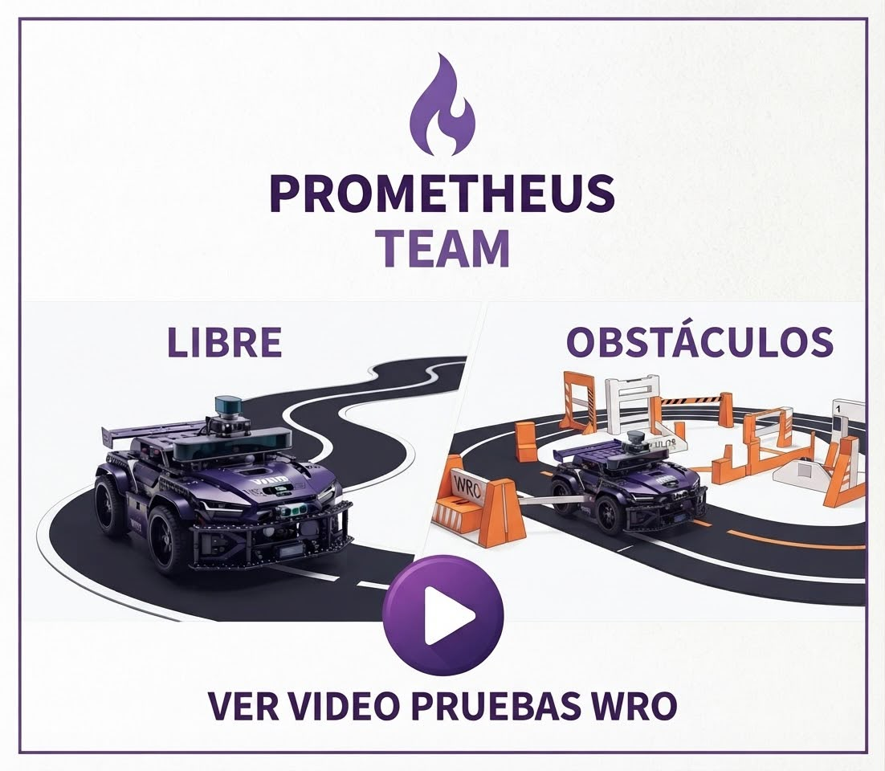</a></td>
<td align="center" width="50%"><b>Prueba de evasión de obstáculos</b><br><br><a href="https://youtu.be/qwc4M6uargw?si=8OC0NmMWCrHWz1Wq"></a></td>
</tr>
</table>

---

## 18. 🌐 Uso de GitHub, inteligencia artificial y replicación

### 18.1. 🌿 Flujo de trabajo

- **`main` es la versión estable.** Los cambios grandes se hacen en una rama aparte y entran a `main` con un *pull request*, que el equipo revisa antes de unirlo.
- **Historial completo:** cada cambio queda registrado en el [historial de commits](https://github.com/erchivox/Prometheus-Team-2026/commits/main), desde las versiones de 2025 hasta la actual.
- **Carpetas estándar de la WRO:** `t-photos`, `v-photos`, `video`, `schemes`, `src`, `models` y `other`. Cada una tiene su README.
- **Código de 2025 conservado** en `src/` como referencia, para que se vea cómo evolucionó la lógica.

### 18.2. 🤖 Uso de inteligencia artificial

De cara a la **Final Internacional WRO 2026 en Puerto Rico**, declaramos de forma transparente cómo usamos inteligencia artificial en este proyecto: qué sistema, para qué y en qué medida.

| | Declaración |
| :--- | :--- |
| **Sistema** | Claude (Anthropic), un asistente de inteligencia artificial |
| **Para qué** | Documentación del repositorio: organizar y redactar el README a partir de nuestros textos, datos, cálculos y fotos; traducir al inglés el archivo de 2025; integrar en el README el documento de la dirección Ackermann; dibujar los diagramas de flujo en Mermaid; revisar enlaces, numeración y consistencia de cifras; y preparar los *pull requests*. |
| **En qué medida** | Solo en la documentación. El diseño, la construcción y la programación del vehículo y de la app, las mediciones, los cálculos de diseño, las fotos, los videos y las decisiones de ingeniería son del equipo. Cada cambio propuesto lo revisamos y aprobamos antes de unirlo a `main`. |

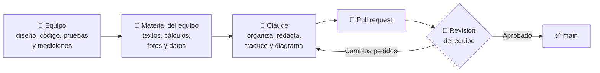
```mermaid
flowchart LR
    A["👥 Equipo<br/>diseño, código, pruebas<br/>y mediciones"] --> B["📂 Material del equipo<br/>textos, cálculos,<br/>fotos y datos"]
    B --> C["🤖 Claude<br/>organiza, redacta,<br/>traduce y diagrama"]
    C --> D["🔀 Pull request"]
    D --> E{"👥 Revisión<br/>del equipo"}
    E -- "Cambios pedidos" --> C
    E -- "Aprobado" --> F["✅ main"]
```

**Respaldo en el reglamento de Future Engineers 2026** ([reglas generales, versión del 15 de enero de 2026](https://wro-association.org/wp-content/uploads/WRO-2026-Future-Engineers-Self-Driving-Cars-General-Rules.pdf)):

| Regla | Qué dice | Cómo la cumplimos |
| :--- | :--- | :--- |
| **Reglas generales de Future Engineers 2026** | No contienen ninguna regla que prohíba o limite el uso de herramientas de inteligencia artificial. | El uso de IA en la documentación está permitido; aun así lo declaramos. |
| **3.3** | *"Coding of the vehicle and its construction (if applicable) may be done only by the team."* La programación y la construcción del vehículo solo pueden hacerlas los integrantes del equipo. | El firmware, la app, el diseño CAD y el armado son trabajo del equipo. La IA no programó ni construyó el vehículo. |
| **3.7** | No se permite un programa de control igual o demasiado parecido a soluciones vendidas en internet. | El código de [`src/`](src/) es propio y su evolución se puede seguir en el historial de commits. |
| **Anexo C.1** | Los jueces evalúan *"the clarity and depth of engineering reasoning"*: la claridad y profundidad del razonamiento de ingeniería, no la apariencia ni la extensión. | El razonamiento (cálculos, decisiones y pruebas) es nuestro; la IA nos ayudó a presentarlo con claridad. |
| **Future Innovators 2026, regla 6.5** (referencia) | En esa categoría, si un equipo usa IA, debe indicar qué sistema, para qué y en qué medida. | Future Engineers no lo exige, pero aplicamos el mismo criterio en esta declaración. |
| **4.2 y 4.4** | Las preguntas y respuestas (Q&A) oficiales pueden aclarar o modificar las reglas, y los jueces tienen la última palabra el día de la competencia. | Revisaremos las Q&A antes de la final y responderemos cualquier pregunta de los jueces sobre este uso. |

### 18.3. 🔁 Cómo replicar el proyecto


```mermaid
flowchart LR
    A["1. Clonar el repo"] --> B["2. Imprimir las piezas"] --> C["3. Armar el vehículo"] --> D["4. Cablear"]
    D --> E["5. Cargar el firmware"] --> F["6. Instalar la app"] --> G["7. Calibrar y probar"]
```

| Paso | Qué hacer | Dónde está |
| :---: | :--- | :--- |
| 1 | Clonar el repositorio: `git clone https://github.com/erchivox/Prometheus-Team-2026.git` | — |
| 2 | Imprimir las piezas en PETG (la dirección en PETG-CF) con nuestros parámetros | [`models/`](models/) · [10.7](#107--manufactura-aditiva) |
| 3 | Armar el chasis, la tracción, la dirección y el soporte del teléfono | [14. Guía de ensamble](#14--guía-de-ensamble-paso-a-paso) |
| 4 | Conectar la alimentación y los sensores | [`schemes/`](schemes/) · [7](#7--esquemas-de-alimentación-y-cableado) · [8](#8--esquemas-de-sensores-y-adquisición-de-datos) |
| 5 | Instalar las librerías y cargar `v1PrometeusTeam2026.ino` (vuelta libre) o `v2PrometrusTeam2026.ino` (obstáculos) | [`src/README.md`](src/README.md) |
| 6 | Compilar e instalar la app en el teléfono | [Repositorio de la app](https://github.com/SamFlips/APP-WRO-PROMETHEUS-TEAM/tree/master) |
| 7 | Calibrar los colores desde el menú de la app y el rango del servo | [16.2](#162--calibración-en-pista-y-menú-dinámico) · [10.4](#104--sistema-de-dirección-ackermann) |

---

## 19. 📁 Archive: 2025 Season

This section summarizes the vehicle that earned us **2nd place at the 2025 Venezuelan National Final**. Most of its hardware was replaced in 2026, but we keep this record because it explains the design decisions behind this year's vehicle. Detailed material is collapsed under each subsection.

### 19.1. 🚗 2025 Vehicle Overview

A two-level chassis of our own design, with a Lego rear drivetrain, Lego front steering driven by a servo, and a smartphone camera for obstacle detection.

<table>
<tr>
<td align="center"></td>
<td align="center"></td>
<td align="center"></td>
</tr>
<tr>
<td align="center"></td>
<td align="center"></td>
<td align="center"></td>
</tr>
</table>

| Subsystem | 2025 | 2026 |
| :--- | :--- | :--- |
| **Controller** | Arduino at first, then 2 × ESP32 (main + motor slave) | Single ESP32 |
| **Motor driver** | L298N | TB6612FNG |
| **Distance sensing** | 4 × HC-SR04 ultrasonic + 2 × Sharp IR | 4 × VL53L0X ToF + 2 × Sharp IR |
| **Orientation** | MPU6050 + magnetometer | BNO055 |
| **Color sensor** | TCS34725 on the shared bus | TCS34725 on a dedicated I2C bus |
| **Steering** | Lego, parallel geometry | Ackermann, printed in PETG-CF |
| **Chassis** | Two levels, printed by a third party | Monochassis printed in-house |
| **Phone mount** | Modified tripod glued to the chassis | Shark Fin towers with adjustable clamp |
| **Race weight (with phone)** | ≈1300 g | 1092 g |

### 19.2. 🔌 Electronics Evolution

The electrical system went through three versions in 2025 before reaching the current one (version 4, [section 7](#7--esquemas-de-alimentación-y-cableado)).

| Version | Power | Sensors and control |
| :---: | :--- | :--- |
| **V1** | LiPo 2S → XL6009 → L298N → motor. A Mini 360 powered the Arduino, which also powered the servo. | Front and side ultrasonic sensors, diagonal Sharp sensors, gyroscope and color sensor. |
| **V2** | Both Arduinos (main and slave) on one 7 V regulator, plus a separate regulator for the servo and sensors. | A slave Arduino dedicated to the H-bridge, and a start button. |
| **V3** | Two ESP32 boards at 6 V; XL6009 at 7.5 V for the L298N (about 6 V reached the motor); Mini 360 at 5 V for the servo and sensors. | Magnetometer, rear ultrasonic sensor, LED, buzzer, and voltage dividers for the HC-SR04 sensors. |

<details>
<summary><b>2025 schematics (power and sensors, V1–V3)</b></summary>
<br>

| Version | Power | Sensors |
| :---: | :---: | :---: |
| **V1** |  |  |
| **V2** |  |  |
| **V3** |  |  |

**Voltage divider for the HC-SR04.** The `Echo` pin outputs 5 V, while the ESP32 accepts 3.3 V. With R1 = 1 kΩ and R2 = 2 kΩ:

$$V_{out} = 5\text{ V} \cdot \frac{2\text{ kΩ}}{1\text{ kΩ} + 2\text{ kΩ}} \approx 3.33\text{ V}$$

<p align="center"></p>

</details>

### 19.3. 🔧 Chassis Construction

We first modeled a two-level vehicle in Tinkercad, tested the dimensions with a cardboard prototype, refined the tolerances in Fusion 360, and had the parts printed by a third party. The failures of that chassis (bending, vertical motor, manual fixes) are analyzed in the [engineering log](#13--diario-de-ingeniería-evolución-del-chasis-v0--v2).

<details>
<summary><b>2025 build process</b></summary>
<br>

| | |
| :---: | :--- |
|  | **Cardboard prototype** used to validate dimensions before printing. |
|  | **3D model** with two levels, hexagonal standoffs and space for the battery and switch. |
|  | **Printed parts**, made by an external supplier. |
|  | **Third prototype**: sensors relocated and new wiring for two ESP32 boards and the magnetometer. |
|  | **Phone mount**: a cut-down tripod raised the camera so it could see two pillars at once. Its lever effect later caused the chassis to bend. |

</details>

### 19.4. 📱 Vision App Evolution (V1–V3)

| Version | What it added | Limitation |
| :---: | :--- | :--- |
| **V1** | Red and green detection; sent `R` or `G` to an Arduino over USB. | The main challenge was getting USB communication and OpenCV working on Android. |
| **V2** | Rectangle filtering, distance estimation from object area, and position using a three-zone split of the screen. | Camera perspective made objects appear farther to one side than they were. |
| **V3** | Detection of two objects at once, a case-based `CommandManager`, a left/right screen split and a built-in serial monitor. | Required raising the phone so the camera could see two pillars in a row. |

<details>
<summary><b>App screenshots (V1–V3)</b></summary>
<br>

| V1 | V2 | V3 |
| :---: | :---: | :---: |
|  |  |  |

</details>

### 19.5. 🧩 Key Problems and Solutions

| Problem | 2025 fix | 2026 solution |
| :--- | :--- | :--- |
| **H-bridge interference:** the car failed to finish turns or missed lines; shielding the wires did not help. | A second microcontroller dedicated to the motor, controlled by the main board. | TB6612FNG and a single ESP32. |
| **Gyroscope drift.** | MPU6050 fused with a magnetometer, which was disturbed by nearby metal and motors. | BNO055 with on-board sensor fusion. |
| **Overshooting 90° turns.** | Turn angle manually tuned down to 70°. | PID turns based on the BNO055 heading. |
| **Missed or double-counted lines.** | 2.4 ms integration time on the TCS34725 and an average of the last 3 readings. | Kept, plus HSV confirmation and reading in a dedicated task. |
| **Imprecise avoidance:** blind reversing after each turn. | Lane system with angle-guided reversing. | Same lane system, using the BNO055 and the rear ToF sensor. |

### 19.6. 🎬 Videos and Source Code

<table>
<tr>
<td align="center" width="33%"><b>Test summary</b><br><br><a href="https://youtu.be/E-xsGcDSaJY?si=9i87w-iJ8TijE_ca"></a></td>
<td align="center" width="33%"><b>Open challenge laps</b><br><br><a href="https://youtube.com/shorts/wI_OLS1nWhc?si=868zlHss_CnnXe10"></a></td>
<td align="center" width="33%"><b>Obstacle challenge</b><br><br><a href="https://www.youtube.com/watch?v=WQM6CjVKSwE"></a></td>
</tr>
</table>

**2025 source code** (in [`src/`](src/)):

| File | Description |
| :--- | :--- |
| `Wro_Prometheus_Arduino_Maestro_v28.ino` / `Wro_Prometheus_Arduino_Esclavo.ino` | Arduino version (main and motor slave) |
| `Wro_Prometeus_V1.ino` / `Wro_Prometeus_V2_.ino` | ESP32 version with MPU6050 (open and obstacle challenges) |
| `Wro_Prometeus_ESCLAVO_PULLUP_esp32.ino` | ESP32 motor slave |
